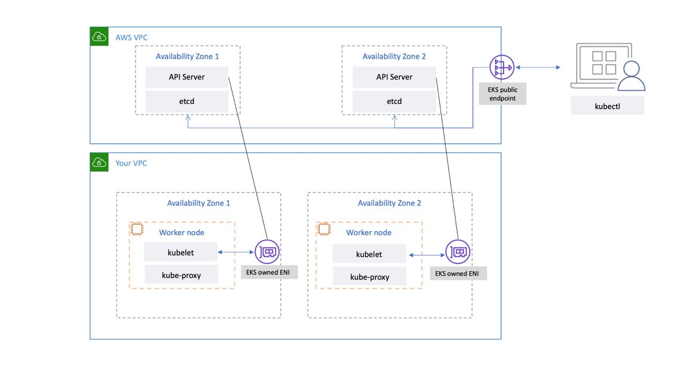

# Introduction

Kubernetes는 강력한 컨테이너 오케스트레이션 플랫폼이지만, 클러스터를 직접 구축하고 운영하는 것은 상당한 운영 부담을 동반합니다.

???+ info "직접 설치 시 운영자가 처리해야 하는 작업"
    - `kube-apiserver`, `etcd`, `kube-scheduler`, `kube-controller-manager` 등 컨트롤 플레인 구성 요소를 직접 설치하고 고가용성(HA) 구성을 잡아야 합니다.
    - etcd 데이터를 주기적으로 백업하고, 장애 시 복구 절차를 마련해야 합니다.
    - Kubernetes 버전이 출시될 때마다 업그레이드 절차를 직접 수행해야 합니다.
    - CNI 플러그인, 인증서 관리, RBAC 정책 등을 처음부터 설계해야 합니다.

이러한 운영 부담을 AWS가 대신 관리해주는 서비스가 바로 Amazon EKS(Elastic Kubernetes Service)입니다. EKS는 Kubernetes 컨트롤 플레인을 AWS가 관리해 주지만, 워크로드가 실제로 실행되는 데이터 플레인(Data Plane)은 여러 방식으로 구성할 수 있습니다.

# Architecture

EKS 클러스터를 생성하면 내부적으로 **두 개의 VPC**가 관여합니다.

 *[EKS 제어 플레인 - Amazon EKS](https://docs.aws.amazon.com/ko_kr/eks/latest/best-practices/control-plane.html)*

- AWS 관리 VPC(EKS account)에는 컨트롤 플레인이 위치합니다. API Server 인스턴스 최소 2개와 etcd 인스턴스 3개가 리전 내 3개 가용 영역에 분산 배치됩니다. 이 VPC는 AWS 소유이며 운영자는 직접 접근할 수 없습니다. 클러스터 간, AWS 계정 간 인프라가 완전히 격리됩니다.
- 고객 VPC(Customer account)에는 워커 노드(데이터 플레인)가 위치합니다. 운영자가 소유하고 관리하는 영역입니다.

두 VPC는 AWS가 고객 VPC 안에 생성하는 관리형 ENI(Elastic Network Interface)를 통해 연결됩니다. `kubectl`로 명령을 실행하면 요청은 EKS API 엔드포인트(`*.gr7.*.eks.amazonaws.com`)를 통해 AWS 관리 VPC의 API Server에 도달하고, API Server는 이 ENI를 통해 고객 VPC의 워커 노드와 통신합니다.

!!! note
    EKS에서는 컨트롤 플레인 전체가 AWS 관리 VPC 안에 있어 `kubectl get pod -n kube-system`으로 API Server나 etcd Pod가 조회되지 않습니다.
