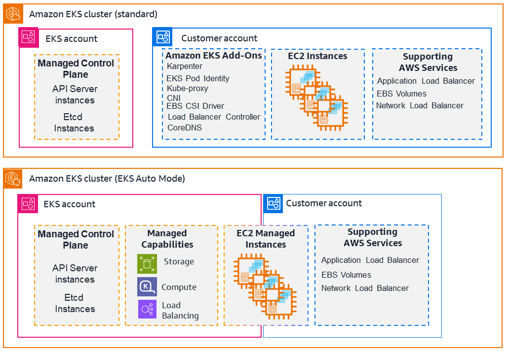
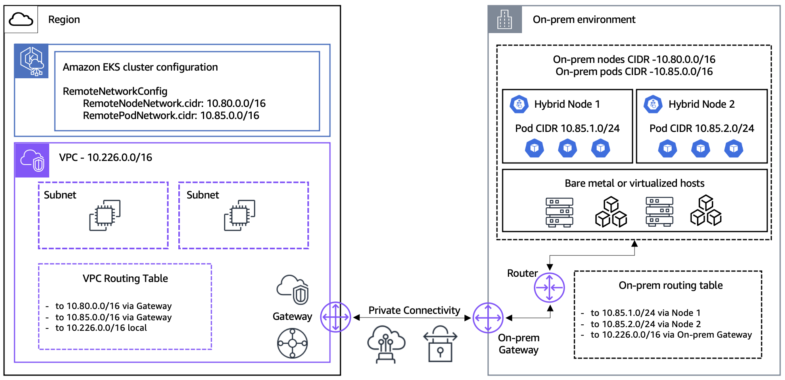

# Data Plane Compute Options

Kubernetes에서 데이터 플레인은 워커 노드의 집합입니다. 각 노드에는 kubelet, 컨테이너 런타임(containerd), kube-proxy가 실행되며, 컨트롤 플레인의 지시를 받아 실제 워크로드를 처리합니다.

EKS에서 달라지는 것은 **Pod을 어떤 컴퓨팅 환경 위에서 실행하느냐**입니다. [공식 문서](https://docs.aws.amazon.com/eks/latest/userguide/eks-compute.html)에 따르면 하나의 EKS 클러스터는 다음 다섯 가지 옵션을 동시에 혼합하여 사용할 수 있습니다.

- Amazon EKS managed node groups
- EKS Auto Mode managed nodes
- self-managed nodes
- AWS Fargate
- Amazon EKS Hybrid Nodes

각 옵션은 **운영 책임, 실행 위치, 제어권**이 서로 다르기 때문에 단계적으로 이해하는 것이 좋습니다.

## Operation Models

데이터 플레인 옵션을 선택하기 전에, 클러스터 수준에서 먼저 결정해야 할 것이 있습니다. 데이터 플레인 운영을 AWS에 위임할 것인지, 자체적으로 관리할 것인지입니다.

*[Amazon EKS란 무엇입니까? - Amazon EKS](https://docs.aws.amazon.com/ko_kr/eks/latest/userguide/what-is-eks.html)*

**EKS Standard**에서는 AWS 계정에 컨트롤 플레인만 존재합니다. Karpenter, VPC CNI, EBS CSI Driver, Load Balancer Controller 등이 고객 계정 안에서 Add-On으로 실행되므로, 설치·버전 관리·업그레이드를 운영자가 직접 수행해야 합니다.

**EKS Auto Mode**에서는 이 Add-On들이 AWS 계정 쪽의 Managed Capabilities(Storage, Compute, Load Balancing)로 이동하여 AWS가 직접 관리합니다. EC2 인스턴스는 여전히 고객 계정에 위치하지만, 그 인스턴스의 운영은 AWS가 처리합니다. 위 다섯 가지 옵션 중 EKS Auto Mode managed nodes가 여기에 해당합니다.

### Node Execution Environments

EKS Standard 환경에서는 다음으로 **노드를 어디에서 실행할 것인지**를 결정합니다.

AWS 클라우드에서 실행되는 옵션이 세 가지입니다.

- Managed Node Groups
- Self-managed Nodes
- AWS Fargate

**고객의 온프레미스 또는 엣지 환경**에서 실행되는 옵션은 하나입니다.

- Amazon EKS Hybrid Nodes

*[Amazon EKS Hybrid Nodes 출시: EKS 클러스터 온프레미스 인프라 사용 가능 \| AWS 기술 블로그](https://aws.amazon.com/ko/blogs/korea/use-your-on-premises-infrastructure-in-amazon-eks-clusters-with-amazon-eks-hybrid-nodes/)*

EKS Hybrid Nodes는 컨트롤 플레인은 AWS가 관리하는 EKS 클러스터에 두되, 워커 노드는 고객 데이터센터의 물리 서버나 VM을 `nodeadm` 도구로 등록해서 사용합니다. AWS와의 네트워크 연결(VPN 또는 Direct Connect)이 전제 조건입니다. 레이턴시, 데이터 레지던시 등의 이유로 일부 워크로드를 반드시 온프레미스에서 실행해야 하지만, 클라우드의 EKS 클러스터와 동일한 도구로 통합 관리하고 싶을 때 적합합니다.

### Compute Types

AWS 클라우드에서 실행되는 세 가지 옵션은 **노드 운영 책임에 따라 구분**할 수 있습니다.

**AWS Fargate**는 EC2 인스턴스 개념이 없는 서버리스 컨테이너 실행 환경입니다. Pod을 선언하면 AWS가 해당 Pod을 위한 격리된 실행 환경을 자동으로 프로비저닝합니다. Kubernetes API 상에서는 노드가 존재하지만, 운영자는 노드 프로비저닝이나 관리 작업을 전혀 수행하지 않아도 됩니다. 다만 DaemonSet 사용 불가, GPU 미지원, 노드 수준 커스터마이징 불가 등의 제약이 있어 범용 컴퓨팅보다는 특정 워크로드에 더 적합합니다.

???+ info "왜 Fargate는 DaemonSet을 지원하지 않을까?"
    DaemonSet은 클러스터의 모든 노드에 Pod을 하나씩 실행하는 리소스입니다. 이것이 의미를 갖기 위해서는 **여러 Pod이 공유하는 노드**가 존재해야 합니다. 모니터링 에이전트나 로그 수집기를 DaemonSet으로 띄우는 이유도, 하나의 노드 위에서 실행 중인 여러 Pod을 에이전트 하나가 공유 커널과 네트워크 인터페이스를 통해 감시할 수 있기 때문입니다.

    Fargate에서는 이 전제가 성립하지 않습니다. Fargate의 각 Pod은 자체 커널, CPU, 메모리, 네트워크 인터페이스를 독립적으로 가진 전용 VM 위에서 실행됩니다. 즉 여러 Pod이 하나의 노드를 공유하는 구조 자체가 없습니다.

    따라서 [공식 문서](https://docs.aws.amazon.com/ko_kr/eks/latest/userguide/fargate.html)에도 DaemonSet 대신 에이전트를 각 Pod 안에 사이드카 컨테이너로 배포할 것을 권장합니다.

나머지 두 가지(Managed Node Groups, Self-managed Nodes)는 EC2 인스턴스가 노드로 실행되는 방식입니다. 차이는 그 EC2 인스턴스의 프로비저닝·패치·업그레이드를 누가 어느 범위까지 처리하느냐입니다. 공식 문서는 Managed Node Groups를 기반으로, Self-managed nodes에 대해서는 다음과 같이 설명합니다.

!!! quote
    "Self-managed nodes are another option which support all of the criteria listed, but they require a lot more manual maintenance."

즉, Self-managed nodes는 Managed Node Groups가 할 수 있는 것을 전부 지원하면서 그 이상의 제어권도 갖지만, 노드 운영 전반을 운영자가 직접 책임져야 합니다.

### Compare compute options

공식 문서의 비교 표를 주요 항목 중심으로 정리하면 다음과 같습니다.

| 항목 | EKS managed node groups | EKS Auto Mode | EKS Hybrid Nodes |
| --- | --- | --- | --- |
| **노드 실행 위치** | AWS EC2 | AWS EC2 | 고객 온프레미스·엣지 |
| **노드 프로비저닝·스케일링** | 운영자 | AWS 자동 | 운영자 |
| **OS 보안 패치** | 운영자 | AWS 자동 | 운영자 |
| **노드 OS 이미지(AMI) 업데이트** | 콘솔 알림 후 운영자 트리거 | AWS 자동 (최대 21일 수명) | 운영자 |
| **Kubernetes 버전 업그레이드** | 콘솔 알림 후 운영자 트리거 | AWS 자동 | 운영자 |
| **노드 SSH 접속** | 가능 | 불가 | 가능 |
| **커스텀 노드 OS 이미지 사용** | 가능 | 불가 | 가능 |
| **커스텀 CNI 사용** | 가능 | 불가 | 가능 |
| **노드 시작 시 kubelet 플래그 등 부트스트랩 인수 전달** | 가능 | 불가 | 가능 |
| **Windows 컨테이너** | 가능 | 불가 | 불가 |
| **GPU 지원** | Amazon Linux 한정 | 가능 | 가능 |
| **EBS 스토리지** | 가능 | 가능 (기본 내장) | 불가 |
| **퍼블릭 서브넷에서 Pod 실행** | 가능 | 가능 | 불가 |
| **요금** | EC2 비용 | EC2 비용 + Auto Mode 추가 요금 | 연결된 노드 vCPU 시간당 요금 |

관리형 노드 그룹은 EC2 인스턴스를 Auto Scaling Group으로 묶어 일부 작업을 AWS가 처리합니다. AMI 업데이트와 Kubernetes 버전 업그레이드는 콘솔 알림을 확인한 후 운영자가 직접 실행해야 합니다.

EKS는 기본적으로 AWS가 Kubernetes에 맞게 구성한 EKS 최적화 AMI를 노드 OS 이미지로 사용합니다. 관리형 노드 그룹은 EC2 Launch Template을 통해 이 기본 이미지 대신 직접 만든 AMI를 지정할 수 있어, 특수한 커널 모듈이나 내부 보안 정책을 노드에 적용해야 하는 경우에 유용합니다.

마찬가지로 EKS는 기본적으로 VPC CNI를 사용하여 Pod에 VPC IP를 직접 할당합니다. 관리형 노드 그룹은 Launch Template의 User Data(부트스트랩 스크립트)를 통해 노드 시작 시점에 Calico, Cilium 등 다른 CNI 플러그인을 설치하여 교체할 수 있습니다. EKS Auto Mode는 VPC CNI를 AWS가 직접 관리하는 기본 구성 요소로 통합하기 때문에 교체가 불가합니다.

**EKS Auto Mode**는 EC2 인스턴스의 프로비저닝, 패치, 업그레이드를 AWS가 완전히 처리합니다. 노드는 AWS가 선택한 AMI로 실행되며, SSH/SSM 접속이 차단됩니다. 노드 수명은 최대 21일로 제한되어 자동으로 교체됩니다. Karpenter 기반 오토스케일링, EBS CSI 스토리지, ALB/NLB 로드밸런서 프로비저닝, VPC CNI 네트워킹, Pod Identity가 별도 Add-on 없이 기본 제공됩니다. 노드 운영 부담을 제거하는 대신 직접 제어권을 포기하는 트레이드오프입니다.

**EKS Hybrid Nodes**는 노드가 고객 온프레미스에 위치한다는 점에서 근본적으로 다릅니다. 노드 운영 책임은 관리형 노드 그룹과 동일하게 운영자가 집니다. SSH, 커스텀 AMI, 커스텀 CNI 등 제어권도 관리형 노드 그룹과 같은 수준입니다. 다만 AWS 클라우드 리소스인 EBS를 사용할 수 없고, 퍼블릭 서브넷에서 Pod을 실행할 수 없습니다.
