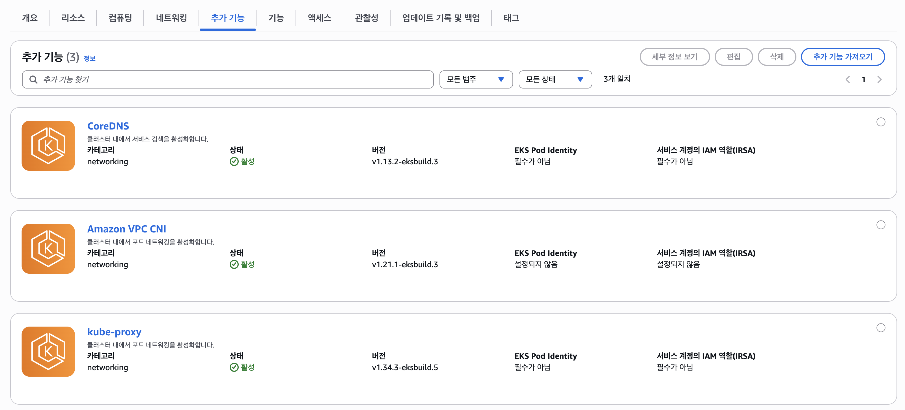

# Add-ons and Capabilities

## Add-ons

**Add-ons**는 Amazon EKS 클러스터의 핵심 기능을 확장하고 관리를 간소화하기 위해 AWS가 제공하는 **검증된 소프트웨어 구성 요소**입니다. VPC CNI, kube-proxy, CoreDNS처럼 클러스터가 동작하기 위해 필요한 구성 요소들이 여기에 해당합니다.

Kubernetes에서는 이런 구성 요소들을 Helm이나 `kubectl apply`로 직접 설치하고, 버전 업데이트도 운영자가 직접 처리해야 합니다. EKS는 이를 **EKS 관리형 Add-on**으로 제공합니다. AWS가 검증한 버전으로 설치되며, 보안 패치와 버그 픽스가 포함된 업데이트를 AWS Console, CLI, API를 통해 관리할 수 있습니다.

```bash
# 클러스터에 설치된 Addon 목록 확인
aws eks list-addons --cluster-name <cluster_name> | jq

# 특정 Addon 상세 정보
aws eks describe-addon --cluster-name <cluster_name> --addon-name vpc-cni | jq
```

클러스터 생성 시 다음 세 가지 Add-on이 자동으로 설치됩니다.

- **VPC CNI** — Pod에 VPC IP를 직접 할당하는 네트워크 플러그인
- **kube-proxy** — 각 노드에서 Service의 네트워크 규칙을 관리
- **CoreDNS** — 클러스터 내부 DNS 서비스



이 외에도 EBS CSI Driver, Pod Identity Agent, Node Monitoring Agent 등을 필요에 따라 추가할 수 있습니다. Add-on 목록과 각 노드 타입별 호환 여부는 [AWS add-ons](https://docs.aws.amazon.com/eks/latest/userguide/workloads-add-ons-available-eks.html) 페이지에서 확인할 수 있습니다.

!!! info "EKS Auto Mode"
    VPC CNI, EBS CSI Driver, Load Balancer Controller 등이 Add-on이 아닌 Managed Capabilities로 통합됩니다. 별도로 설치하거나 버전을 관리할 필요가 없습니다.

## Capabilities

EKS Capabilities는 Add-on과 다릅니다. Add-on이 클러스터 운영을 위한 기반 구성 요소라면, Capabilities는 **클러스터 위에서 애플리케이션과 인프라를 어떻게 관리할 것인가**에 관한 기능입니다.

Add-on은 워커 노드 위에서 클러스터 리소스를 소비하며 실행되지만, Capabilities는 **고객의 워커 노드가 아닌 EKS(AWS) 쪽에서 실행**됩니다. 클러스터에는 Kubernetes CRD(Custom Resource Definition)만 설치되고, 실제 컨트롤러는 AWS가 관리하는 인프라에서 동작합니다. 보안 패치·업데이트·운영을 AWS가 처리하므로 운영자는 클러스터 플랫폼 운영이 아닌 애플리케이션 개발에 집중할 수 있습니다.

현재 세 가지 Capability가 제공됩니다.

[ACK(AWS Controllers for Kubernetes)](https://docs.aws.amazon.com/ko_kr/eks/latest/userguide/ack.html)
:   Kubernetes API로 AWS 리소스를 관리합니다. S3 버킷, RDS 데이터베이스, IAM 역할 등을 Kubernetes YAML로 선언하면 ACK가 AWS API를 호출하여 리소스를 생성하고 상태를 지속적으로 동기화합니다. S3, RDS, DynamoDB, Lambda 등 50개 이상의 AWS 서비스를 지원합니다.

[Argo CD](https://docs.aws.amazon.com/ko_kr/eks/latest/userguide/argocd.html)
:   Git 저장소를 신뢰할 수 있는 유일한 소스(source of truth)로 삼아 GitOps 방식의 지속적 배포를 구현합니다. Git에 변경 사항이 커밋되면 클러스터를 자동으로 동기화하고, 선언된 상태와 실제 상태가 달라지는 드리프트를 감지하여 지속적으로 조정합니다. 단일 Argo CD 인스턴스로 여러 클러스터를 관리할 수 있습니다.

[kro(Kube Resource Orchestrator)](https://docs.aws.amazon.com/ko_kr/eks/latest/userguide/kro.html)
:   여러 Kubernetes·AWS 리소스를 하나의 고수준 추상화로 묶는 커스텀 API를 생성합니다. 플랫폼 팀이 표준 패턴을 정의하면 개발자는 복잡한 인프라 세부사항 없이 단순한 API 호출로 전체 스택을 프로비저닝할 수 있습니다.

세 Capability는 독립적으로 사용할 수 있지만 함께 사용할 때 더 강력합니다. 예를 들어 Argo CD로 애플리케이션 배포를 자동화하고, ACK로 해당 애플리케이션이 필요한 RDS·S3 같은 AWS 리소스를 함께 관리하며, kro로 이 조합을 재사용 가능한 패턴으로 만들 수 있습니다.
