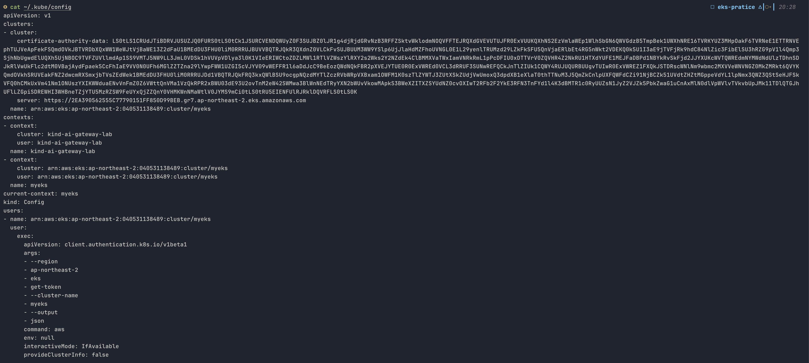
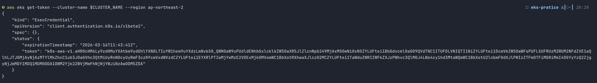
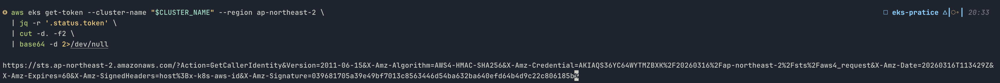
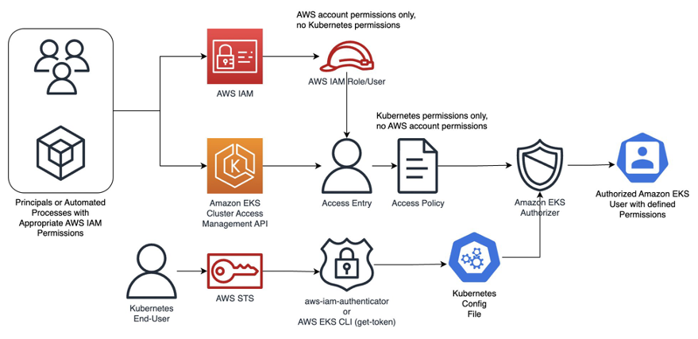
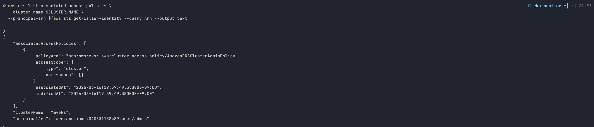

# Authentication

EKS에서 kubectl이 어떻게 동작하는지 이해하려면 인증(Authentication)과 인가(Authorization)가 어떻게 연결되는지를 먼저 파악해야 합니다.

### kubeconfig

클러스터를 배포한 후 가장 먼저 하는 작업입니다.

```bash
CLUSTER_NAME=myeks

aws eks update-kubeconfig --region ap-northeast-2 --name $CLUSTER_NAME
```

이 명령어는 `~/.kube/config`에 클러스터 접근 정보를 기록합니다. 실제로 무엇이 기록되는지 확인해 보겠습니다.



일반적인 Kubernetes의 kubeconfig에는 `users` 섹션에 클라이언트 인증서 경로나 정적 토큰이 직접 들어갑니다. EKS에서는 `exec` 블록이 그 자리를 차지합니다. kubectl이 API 서버에 요청을 보내기 직전마다 이 `exec` 블록의 명령어(`aws eks get-token`)를 실행하여 토큰을 동적으로 발급받습니다.

`aws eks get-token`이 실제로 무엇을 만드는지 확인합니다.

```bash
aws eks get-token --cluster-name $CLUSTER_NAME --region ap-northeast-2
```



`k8s-aws-v1.` 뒤의 문자열을 base64 디코딩하면 다음과 같은 구조가 드러납니다.

```bash
aws eks get-token --cluster-name "$CLUSTER_NAME" --region ap-northeast-2 \
  | jq -r '.status.token' \
  | cut -d. -f2 \
  | base64 -d 2>/dev/null
```



토큰의 실체는 AWS STS GetCallerIdentity API에 대한 **[presigned URL](https://docs.aws.amazon.com/prescriptive-guidance/latest/presigned-url-best-practices/overview.html)**입니다. 인증 정보 자체를 담고 있는 것이 아니라, 이 URL을 호출하면 AWS가 내 신원을 증명해줄 수 있다는 서명된 요청입니다. 유효 시간이 최대 15분인 이유도 presigned URL의 만료 시간 때문입니다.

`aws eks get-token`은 `aws sts get-caller-identity`로 출력되는 현재 자격증명으로 presigned URL을 서명합니다. 따라서 **어떤 IAM identity로 토큰을 발급받느냐가 kubectl의 권한을 결정**합니다.

### IAM Authenticator

이제 이 토큰이 API 서버에 도달한 이후의 과정을 살펴보겠습니다. kubectl은 토큰을 `Authorization: Bearer k8s-aws-v1.XXX` 헤더에 담아 API 서버에 전송합니다.

이 과정을 실제로 관찰하려면 verbosity를 높이면 됩니다.

```bash
kubectl get node -v=6
# "Response" verb="GET" url="https://2EA390562555C77790151FF850D99BEB.gr7.ap-northeast-2.eks.amazonaws.com/api/v1/nodes?limit=500" status="200 OK" milliseconds=600
```

API 서버는 토큰을 직접 검증하지 않고 컨트롤 플레인에서 실행 중인 AWS IAM Authenticator 웹훅 서버에 TokenReview를 위임합니다. IAM Authenticator는 토큰에서 presigned URL을 추출하여 AWS STS를 직접 호출합니다. STS가 IAM principal ARN을 반환하면 인증이 성공합니다.

IAM 자격증명이 비활성화되거나 만료되면 STS 호출 자체가 실패하므로 기존 토큰도 즉시 무효화됩니다. 토큰의 서명이 위조된 경우에도 STS가 오류를 반환하여 인증이 실패합니다.

### Access Entries

!!! note
    인증이 완료되었다고 바로 Kubernetes 리소스에 접근할 수 있는 것은 아닙니다. **IAM 인증**과 **Kubernetes 인가는 별개의 계층입니다.**


*[간소화된 Amazon EKS 액세스 관리 제어 톺아보기 \| AWS 기술 블로그](https://aws.amazon.com/ko/blogs/tech/a-deep-dive-into-simplified-amazon-eks-access-management-controls/)*

IAM principal과 Kubernetes 권한을 연결하는 현재 권장 방식은 [**Access Entries**](https://docs.aws.amazon.com/ko_kr/eks/latest/userguide/access-entries.html)입니다. EKS Cluster Access Management API를 통해 Access Entry를 생성하고, Access Policy를 연결하면 EKS Authorizer를 통과하여 권한이 부여됩니다.

- **Access Entry**는 IAM principal(User 또는 Role)과 EKS 클러스터를 연결하는 등록 항목입니다.
- **Access Policy**는 AWS가 미리 정의해 둔 Kubernetes 권한 템플릿입니다. IAM 정책과 달리 사용자가 직접 만들거나 수정할 수 없습니다. Access Entry에 연결하여 실제 권한을 부여합니다.

!!! danger "aws-auth ConfigMap"
    이전에는 `kube-system` 네임스페이스의 `aws-auth` ConfigMap에 IAM ARN과 Kubernetes 그룹을 직접 등록하는 방식을 사용했습니다. 클러스터 내부 리소스를 직접 수정해야 하므로 잘못 수정하면 클러스터 접근이 불가능해지는 위험이 있어 현재는 Access Entries로 마이그레이션이 권장됩니다.

사용 가능한 Access Policy는 `aws eks list-access-policies` 또는 [문서](https://docs.aws.amazon.com/eks/latest/userguide/access-policy-permissions.html)에서 확인할 수 있습니다. 주요 정책들을 정리하면 다음과 같습니다.

| Access Policy | Kubernetes 권한 범위 | 적합한 대상 |
| --- | --- | --- |
| `AmazonEKSClusterAdminPolicy` | 클러스터 전체 모든 권한 (`*`) | 클러스터 관리자 |
| `AmazonEKSAdminPolicy` | 대부분의 리소스 권한 (네임스페이스 단위) | 네임스페이스 관리자 |
| `AmazonEKSEditPolicy` | 리소스 생성·수정·삭제 가능 | 개발자 |
| `AmazonEKSViewPolicy` | 읽기 전용 | 모니터링, 감사 |

현재 클러스터에 등록된 Access Entry 목록을 확인합니다.

```bash
# 현재 클러스터에 등록된 Access Entry 목록
aws eks list-access-entries --cluster-name $CLUSTER_NAME

# 현재 자신의 IAM identity에 연결된 Kubernetes 권한
aws eks list-associated-access-policies \
  --cluster-name $CLUSTER_NAME \
  --principal-arn $(aws sts get-caller-identity --query Arn --output text)
```



- `principalArn` — IAM user `admin`이 Access Entry로 등록되어 있습니다.
- `policyArn` — `AmazonEKSClusterAdminPolicy`가 연결되어 있으므로 클러스터 전체에 대한 모든 Kubernetes 권한을 갖습니다.
- `accessScope.type: cluster` — 특정 네임스페이스가 아니라 클러스터 전체에 적용됩니다.

따라서 앞서 `kubectl get node -v=6`에서 `200 OK`가 반환된 것은 이 권한 구조가 통과된 결과입니다. IAM user `admin`이 `AmazonEKSClusterAdminPolicy`를 통해 노드 목록 조회를 포함한 모든 Kubernetes 작업이 허용되어 있기 때문입니다.
