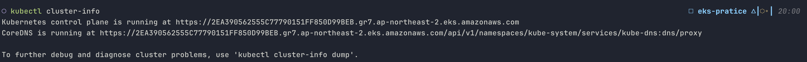
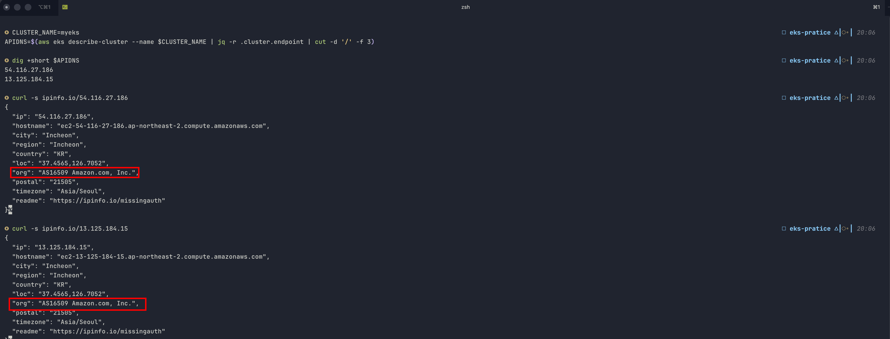
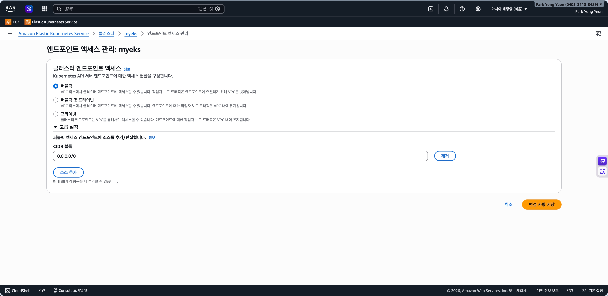
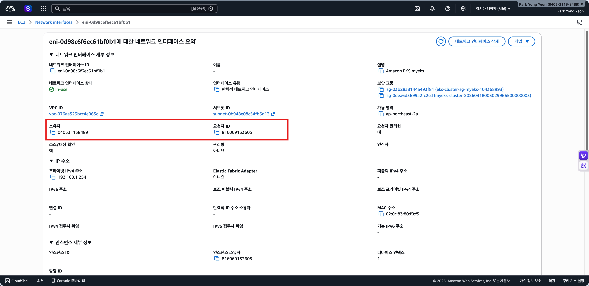
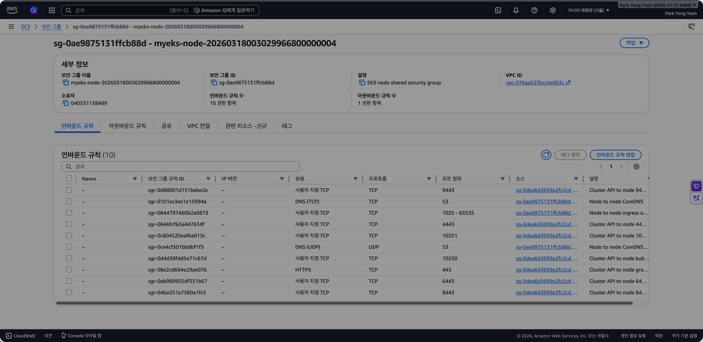
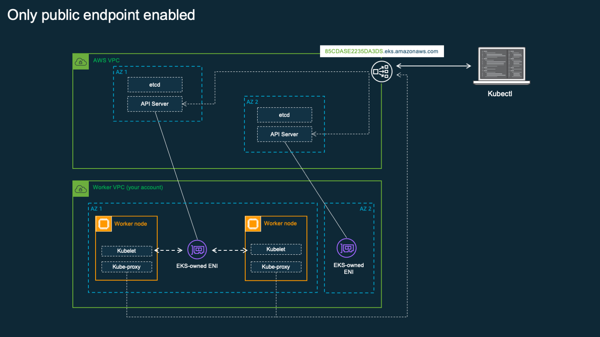
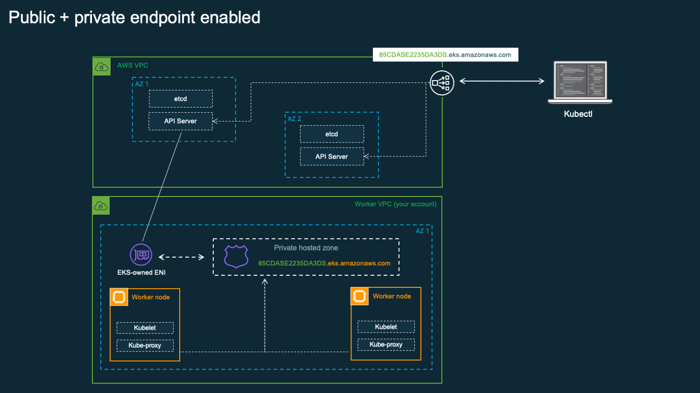

# Endpoint Access

앞서 EKS 클러스터에 두 개의 VPC가 관여한다고 설명했습니다. 이 두 VPC 사이의 실제 통신이 어떻게 이루어지는지를 확인해보도록 하겠습니다.

공식 문서에 따르면 EKS는 클러스터 생성 시, 아래 두 가지를 자동으로 생성합니다.

- **NLB 기반 API Server 엔드포인트**

  Kubernetes API Server 앞에 NLB를 배치하여 트래픽을 분산합니다. ALB가 아닌 NLB를 사용하는 이유는 Kubernetes API Server가 HTTP/HTTPS가 아닌 gRPC와 WebSocket 기반의 장기 연결을 사용하기 때문입니다. NLB는 L4(TCP) 레벨에서 동작하므로 이런 연결을 그대로 통과시킬 수 있습니다.
- **EKS managed ENI**

  서로 다른 AZ에 2개의 ENI를 고객 VPC 안에 생성합니다. **API Server가 워커 노드의 kubelet에 접근할 때**(kubectl logs, exec 등) 이 ENI를 통해 고객 VPC로 진입합니다.

### NLB

NLB는 AWS 관리 VPC에 위치하므로 고객 계정에서 직접 확인할 수 없습니다. 단, API Server 엔드포인트 도메인에 대한 DNS 조회 결과에서 간접적으로 확인할 수 있습니다.

현재 설정을 먼저 확인합니다.


*kubectl cluster-info*

API 서버 엔드포인트가 `*.gr7.ap-northeast-2.eks.amazonaws.com` 형식입니다. 이 도메인이 AWS 관리 VPC 안의 로드밸런서(NLB)를 가리킵니다. 운영자는 이 엔드포인트 뒤에 있는 API Server나 etcd에 직접 접근할 수 없습니다.

이 도메인이 실제로 AWS 소유의 IP로 해석되는지 확인할 수 있습니다.

```bash
APIDNS=$(aws eks describe-cluster --name $CLUSTER_NAME | jq -r .cluster.endpoint | cut -d '/' -f 3)
dig +short $APIDNS
curl -s ipinfo.io/<조회된 IP>
```



현재 이 클러스터는 아래와 같이 퍼블릭 엔드포인트가 활성화되어 있어 인터넷에서 DNS 조회가 가능합니다. 접근 모드에 대해서는 아래에서 자세히 다룹니다.



### EKS managed ENI

API Server가 워커 노드의 kubelet에 접근하려면 AWS 관리 VPC에서 고객 VPC로 진입할 수 있어야 합니다. EKS는 이를 위해 클러스터 생성 시 고객 VPC 서브넷에 ENI를 2개 생성합니다. API Server 프로세스는 이 ENI를 네트워크 인터페이스로 직접 사용하여 고객 VPC의 IP 주소를 획득합니다. 즉 API Server 자체가 고객 VPC 네트워크에 직접 연결된 구조입니다.

managed ENI는 `Description` 필드가 `"Amazon EKS <클러스터명>"` 형식으로 설정되어 있습니다.

```bash
aws ec2 describe-network-interfaces \
  --filters "Name=description,Values=Amazon EKS $CLUSTER_NAME" \
  --query "NetworkInterfaces[*].NetworkInterfaceId"
```

출력에 대해 확인해보면, 아래와 같이 소유자와 요청자가 다른 것을 확인할 수 있습니다.



EKS 보안 그룹은 AWS 콘솔과 API 기준으로 두 가지로 구분됩니다.

- **Cluster Security Group**: EKS가 클러스터 생성 시 자동으로 생성합니다. [공식 문서](https://docs.aws.amazon.com/eks/latest/userguide/sec-group-reqs.html)에 따르면 managed ENI와 워커 노드 양쪽에 자동으로 연결되며, `Self → All` 인바운드 규칙으로 컨트롤 플레인과 노드 간 모든 트래픽을 허용합니다.
- **Additional security group**: 클러스터 생성 시 사용자가 선택적으로 지정하는 보안 그룹입니다. 공식 문서에 따르면 EKS는 이 보안 그룹을 managed ENI에는 연결하지만 노드 그룹에는 연결하지 않습니다.

> When you create a cluster, you can (optionally) specify your own security groups. If you do, then Amazon EKS also associates the security groups that you specify to the network interfaces that it creates for your cluster. However, it doesn't associate them to any node groups that you create.

managed ENI에 보안 그룹이 어떻게 연결되어 있는지 확인합니다.

```bash
aws ec2 describe-network-interfaces \
  --filters "Name=description,Values=Amazon EKS $CLUSTER_NAME" \
  --query 'NetworkInterfaces[*].{ENI:NetworkInterfaceId,SG:Groups[*].{ID:GroupId,Name:GroupName}}'
```

```json
[
    {
        "ENI": "eni-06d60bba7d112a2cc",
        "SG": [
            {
                "ID": "sg-03b28a8144a493f81",
                "Name": "eks-cluster-sg-myeks-104368993"
            },
            {
                "ID": "sg-0dea6d3699a2fc2cd",
                "Name": "myeks-cluster-20260318003029966500000003"
            }
        ]
    },
    {
        "ENI": "eni-0d98c6f6ec61bf0b1",
        "SG": [
            {
                "ID": "sg-03b28a8144a493f81",
                "Name": "eks-cluster-sg-myeks-104368993"
            },
            {
                "ID": "sg-0dea6d3699a2fc2cd",
                "Name": "myeks-cluster-20260318003029966500000003"
            }
        ]
    }
]
```

이 실습 환경에서는 클러스터 생성 시 Additional security group으로 `myeks-cluster-*`(`sg-0dea6d3699a2fc2cd`)를 지정했습니다. 필요한 포트만 명시적으로 허용하는 방식입니다.

워커 노드에 연결된 보안 그룹을 확인합니다.

```bash
aws ec2 describe-instances \
  --filters "Name=tag:eks:cluster-name,Values=$CLUSTER_NAME" \
  --query 'Reservations[*].Instances[*].SecurityGroups[*].{ID:GroupId,Name:GroupName}'
```

```json
[
    [
        [
            {
                "ID": "sg-05b853cef9dc77ba5",
                "Name": "myeks-node-group-sg"
            },
            {
                "ID": "sg-0ae9875131ffcb88d",
                "Name": "myeks-node-20260318003029966800000004"
            }
        ]
    ],
    [
        [
            {
                "ID": "sg-05b853cef9dc77ba5",
                "Name": "myeks-node-group-sg"
            },
            {
                "ID": "sg-0ae9875131ffcb88d",
                "Name": "myeks-node-20260318003029966800000004"
            }
        ]
    ]
]
```

워커 노드에 Cluster security group(`eks-cluster-sg-*`)이 없습니다. 워커 노드 보안 그룹의 인바운드 규칙을 확인하면 실제 통신 허용 구조를 확인할 수 있습니다.



Additional security group(`sg-0dea6d3699a2fc2cd`)이 managed ENI에 연결되어 있고, 워커 노드 보안 그룹(`myeks-node-*`)은 이를 소스로 여러 포트를 허용합니다. [공식 문서](https://docs.aws.amazon.com/eks/latest/userguide/sec-group-reqs.html)에서 컨트롤 플레인과 노드 간 최소 필요 포트로 443, 10250, 53을 안내하고 있으며, 실제 환경에서는 웹훅, 스케줄러 헬스체크 등을 위해 추가 포트가 필요합니다.

정리하면 Cluster security group은 EKS가 클러스터 생성 시 자동으로 생성합니다. 인바운드 규칙은 자기 자신을 소스로 참조하여 모든 트래픽을 허용합니다. 같은 보안 그룹에 속한 리소스끼리는 모든 트래픽이 허용되므로, 컨트롤 플레인과 워커 노드 간 통신을 보장하기 위한 AWS의 기본 안전장치입니다.

managed ENI에 자동으로 연결되며, 워커 노드에는 다음 경우에만 자동 연결됩니다.

- Launch Template을 별도로 지정하지 않은 Managed Node Group
- Fargate

자체 Launch Template을 지정한 Managed Node Group이나 Self-managed nodes는 보안 그룹을 사용자가 직접 지정하므로 Cluster security group이 자동 연결되지 않습니다. 또한 Fargate 파드는 Cluster security group만 사용합니다.

Additional security group은 클러스터 생성 시 사용자가 선택적으로 지정하는 보안 그룹입니다. managed ENI에만 연결되며 워커 노드에는 연결되지 않습니다. Cluster security group처럼 자기 자신을 소스로 참조하는 방식 대신 필요한 포트만 명시적으로 제어하고 싶을 때 사용합니다. 이 경우 워커 노드 보안 그룹에서 Additional security group을 소스로 필요한 포트를 직접 허용해야 합니다.

### Access Mode

EKS 클러스터에서 발생하는 트래픽은 방향에 따라 세 가지로 구분됩니다.

1. **사용자 → API Server**
2. **워커 노드 → API Server**
3. **API Server → 워커 노드**

이 중 세 번째 방향은 어떤 모드에서든 항상 managed ENI를 통해 이루어집니다. 앞서 확인한 kubelet 서버 인증서의 SAN에 프라이빗 IP와 퍼블릭 IP가 모두 포함되어 있던 이유가 여기 있습니다.

`endpointPublicAccess`와 `endpointPrivateAccess` 두 플래그의 조합으로 나머지 두 방향의 경로를 제어합니다.

```bash
aws eks describe-cluster --name $CLUSTER_NAME \
  --query 'cluster.resourcesVpcConfig.{public:endpointPublicAccess,private:endpointPrivateAccess,cidrs:publicAccessCidrs}'
```

#### Public Only

클러스터 생성 시 기본 설정입니다. 사용자의 kubectl과 워커 노드의 kubelet 모두 인터넷을 통해 NLB로 접근합니다. VPC 내부에서 출발한 트래픽도 VPC 밖으로 나가지만 Amazon 네트워크 내에서만 이동합니다. 워커 노드의 트래픽이 인터넷을 경유하므로 운영 환경에서는 권장하지 않는 구성입니다.


*[De-mystifying cluster networking for Amazon EKS worker nodes \| Containers](https://aws.amazon.com/ko/blogs/containers/de-mystifying-cluster-networking-for-amazon-eks-worker-nodes/)*

#### Public + Private

가장 일반적인 운영 환경 구성입니다. Private access를 활성화하면 EKS가 Route 53 프라이빗 호스팅 존을 자동으로 생성하여 고객 VPC에 연결합니다. VPC 내부에서 엔드포인트 도메인을 조회하면 NLB의 퍼블릭 IP 대신 managed ENI의 프라이빗 IP가 반환됩니다. 워커 노드 트래픽은 VPC 내부로 유지되고, 외부에서의 kubectl 접근은 퍼블릭 엔드포인트를 통해 유지됩니다.


