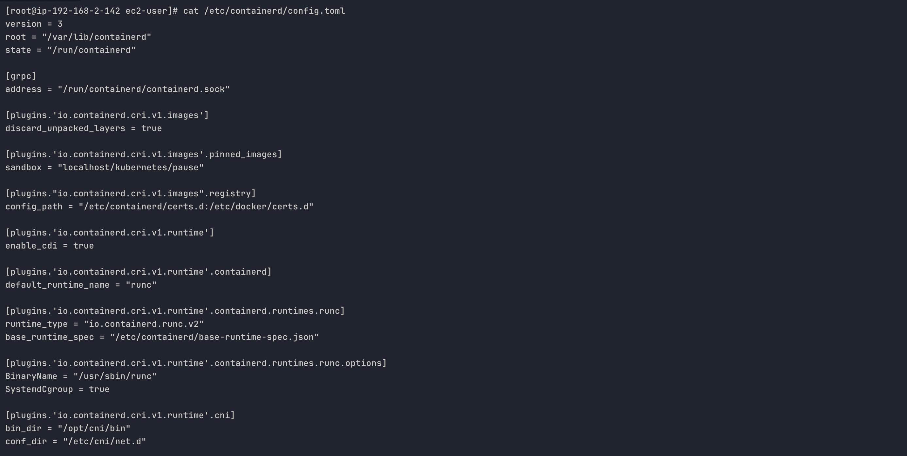
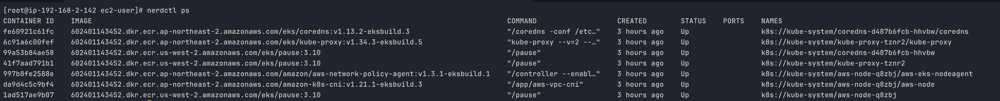
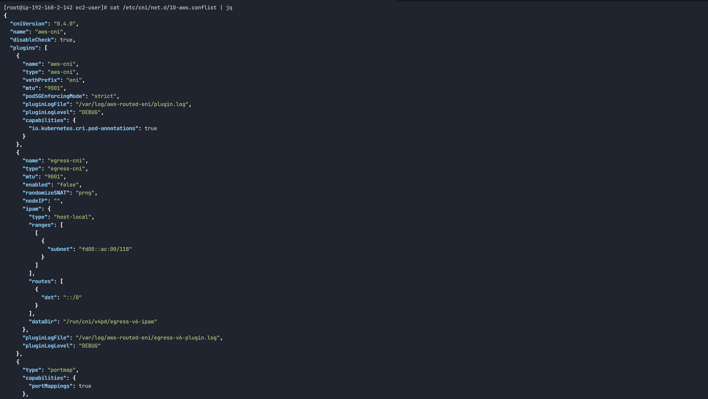
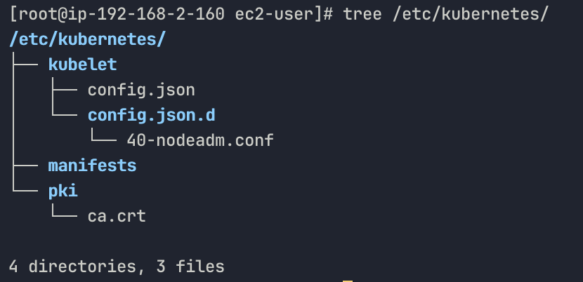
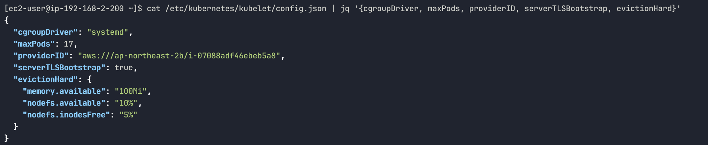
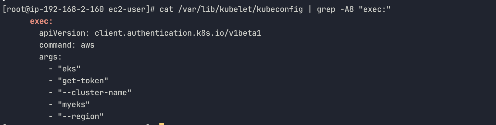
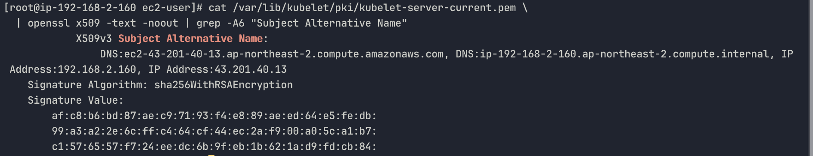
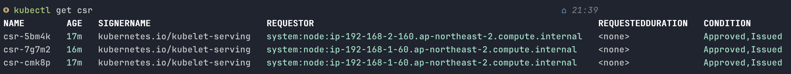

# Worker Node

앞서 `kubectl`이 API Server에 인증하는 과정을 확인했습니다. 이번에는 실제 워크로드가 실행되는 워커 노드 안으로 들어가서, EKS 노드가 어떻게 구성되어 있는지 직접 확인합니다.

관리 콘솔 또는 CLI로 노드 IP를 확인하고 SSH 접속합니다.

```bash
# 실행 중인 EC2 인스턴스 목록 확인
aws ec2 describe-instances \
  --filters Name=instance-state-name,Values=running \
  --query "Reservations[*].Instances[*].{Name:Tags[?Key=='Name']|[0].Value,PublicIP:PublicIpAddress,PrivateIP:PrivateIpAddress}" \
  --output table

# 노드 IP 변수 설정
NODE1=<퍼블릭 IP>
NODE2=<퍼블릭 IP>

# SSH 접속
ssh ec2-user@$NODE1
sudo su -
```

노드에 접속했다면, Kubernetes가 정상적으로 동작하기 위해 필요한 기본 조건들이 어떻게 설정되어 있는지 확인할 수 있습니다. 대표적으로 아래와 같습니다.

- SELinux Permissive
- Swap 비활성화
- 컨테이너 네트워킹을 위한 커널 파라미터

kubeadm으로 직접 설치해봤다면 이 항목들이 왜 필요한지 알고 있을 것입니다.

- **SELinux Permissive**

  `Enforcing` 모드에서는 컨테이너가 호스트 파일시스템에 접근하거나 네트워크 네임스페이스를 조작할 때 SELinux 정책이 차단합니다.
- **Swap 비활성화**

  kubelet은 Pod의 메모리 requests/limits를 기반으로 스케줄링과 리소스 관리를 수행합니다. Swap이 활성화되면 메모리 부족 상황에서 컨테이너가 종료되지 않고 Swap으로 밀려나면서, 이러한 보장이 깨집니다. 이 때문에 kubelet은 기본적으로 Swap이 활성화된 상태에서 실행을 거부합니다.
- **커널 파라미터**
  - `net.bridge.bridge-nf-call-iptables` — 브리지(veth)를 통과하는 트래픽이 iptables를 거치도록 합니다. 설정이 없으면 kube-proxy의 Service 라우팅 규칙이 적용되지 않습니다.
  - `net.ipv4.ip_forward` — 컨테이너에서 외부로 나가는 트래픽을 허용합니다. 이 값이 비활성화되어 있으면 Pod 간 통신이나 외부 통신이 제한됩니다.

위와 같은 설정들은 Kubernetes 동작에 필수적인 요소들입니다. 하지만 EKS에서 제공하는 최적화 AMI에는 이 값들이 이미 반영되어 있어, 사용자가 직접 설정할 필요는 없습니다.

### containerd

전제 조건이 갖춰진 노드 위에서 실제로 컨테이너를 실행하는 것은 containerd입니다. kubelet은 CRI(Container Runtime Interface)를 통해 containerd에 컨테이너 실행을 지시합니다.


*cat /etc/containerd/config.toml*

- `SystemdCgroup = true` — cgroup 관리 드라이버로 systemd를 사용합니다. kubelet 설정의 `cgroupDriver: systemd`와 반드시 일치해야 합니다. 불일치하면 노드가 `NotReady` 상태가 되거나 컨테이너 리소스 관리에 문제가 발생합니다.
- `sandbox = "localhost/kubernetes/pause"` — 파드 생성 시, 가장 먼저 만드는 pause 컨테이너의 이미지 위치입니다.
- `conf_dir = "/etc/cni/net.d"` — CNI 플러그인 설정 파일 위치입니다. Pod 네트워크 네임스페이스를 초기화할 때 containerd가 이 디렉터리에서 설정을 읽어 VPC CNI를 호출합니다.

현재 실행 중인 컨테이너 목록을 확인합니다.


*nerdctl ps*

출력을 파드 단위로 묶으면 세 개의 파드가 실행 중입니다.

```bash
# coredns 파드
fe60921c61fc  eks/coredns:v1.13.2          "/coredns"  k8s://kube-system/coredns-d487b6fcb-hhvbw/coredns
99a53b84ae58  eks/pause:3.10               "/pause"    k8s://kube-system/coredns-d487b6fcb-hhvbw

# kube-proxy 파드
6c91a6c00fef  eks/kube-proxy:v1.34.3       "kube-proxy" k8s://kube-system/kube-proxy-tznr2/kube-proxy
41f7aad791b1  eks/pause:3.10               "/pause"    k8s://kube-system/kube-proxy-tznr2

# aws-node 파드
da9d4c5c9bf4  amazon-k8s-cni:v1.21.1       "/app/aws-vpc-cni"  k8s://kube-system/aws-node-q8zbj/aws-node
997b8fe2588e  aws-network-policy-agent:...  "/controller"       k8s://kube-system/aws-node-q8zbj/aws-eks-nodeagent
1ad517ae9b07  eks/pause:3.10               "/pause"    k8s://kube-system/aws-node-q8zbj
```

모든 이미지가 `602401143452.dkr.ecr.*.amazonaws.com`에서 옵니다. `602401143452`는 AWS가 EKS 컴포넌트 이미지를 관리하는 공식 ECR 계정 ID입니다.

`pause` 컨테이너는 Pod의 network namespace와 IPC namespace를 생성하고 유지하는 역할을 하며, Pod 내부의 다른 컨테이너들은 이 namespace를 공유하여 동일한 네트워크 환경(IP, 포트 등)을 사용하게 됩니다.

EKS에서만이 아니라 모든 Kubernetes 환경에서 파드가 생성될 때 가장 먼저 실행됩니다. EKS에서 특이한 점은 이 pause 컨테이너의 이미지가 `registry.k8s.io` 대신 AWS 공식 ECR(`602401143452.dkr.ecr.us-west-2.amazonaws.com/eks/pause`)에서 오고, containerd 설정의 `sandbox = "localhost/kubernetes/pause"`로 로컬 캐시에서 가져오도록 구성되어 있다는 것입니다.

따라서 Pod가 생성될 때 가장 먼저 실행되는 컨테이너가 바로 `pause` 컨테이너이며, 이후 실제 애플리케이션 컨테이너(`coredns`, `kube-proxy`, `aws-node` 등)가 이 환경에 연결되어 동작합니다.

`aws-node`는 모든 노드에서 실행되는 DaemonSet으로, VPC CNI를 구성하는 핵심 컴포넌트입니다. [공식 문서](https://docs.aws.amazon.com/ko_kr/eks/latest/best-practices/vpc-cni.html#)에 따르면 VPC CNI는 두 가지 컴포넌트로 구성됩니다.

- **CNI Binary** (`/opt/cni/bin/aws-cni`) — 노드 파일시스템에 위치하는 바이너리입니다. kubelet이 파드를 추가하거나 삭제할 때 직접 호출합니다. pause 컨테이너의 네트워크 네임스페이스에 veth pair를 연결하고 IP를 할당하는 실제 작업을 수행합니다.
- **ipamd** (`aws-node` 컨테이너) — 노드에서 상시 실행되는 데몬입니다. ENI를 관리하고 IP Warm Pool을 유지합니다. CNI Binary가 파드에 IP를 요청하면 ipamd가 Warm Pool에서 꺼내 줍니다.

한편, 실제 `aws-node` Pod를 확인해보면 컨테이너가 두 개입니다. 이는 VPC CNI 구성 요소 외에, EKS에서 추가로 제공하는 기능이 함께 포함되어 있기 때문입니다.

```bash
kubectl get pod -n kube-system -l k8s-app=aws-node -o jsonpath='{.items[0].spec.containers[*].name}'

# -> aws-node
# -> aws-eks-node-agent
```

- `aws-node`(`amazon-k8s-cni`): ipamd(IP Address Management Daemon)입니다. 노드의 ENI를 관리하고 파드에 할당할 IP 주소의 Warm Pool을 유지합니다. 파드 요청이 들어오기 전에 미리 Secondary ENI를 생성하고 IP를 확보해두어 파드 생성 시 즉시 IP를 할당할 수 있습니다.
- `aws-eks-nodeagent`(`aws-network-policy-agent`): VPC CNI의 일부는 아니며, Kubernetes Network Policy를 eBPF로 구현하는 에이전트입니다. 파드 간 트래픽을 네트워크 정책에 따라 허용하거나 차단하는 역할을 합니다.

따라서 containerd 설정의 `conf_dir = "/etc/cni/net.d"`가 이 흐름의 출발점입니다. pause 컨테이너로 network namespace가 확보되면 containerd는 이 디렉터리의 `10-aws.conflist`를 읽어 plugins 배열에 정의된 플러그인을 순서대로 실행합니다.


*cat /etc/cni/net.d/10-aws.conflist \| jq*

1. **aws-cni** — ipamd에 IP를 요청하고, veth pair를 생성하여 pause 컨테이너의 network namespace와 노드를 연결합니다.
2. **egress-cni** — IPv4 전용 노드에서 파드가 IPv6 트래픽을 외부로 보낼 때 처리합니다. `"enabled": "false"`로 현재 비활성화되어 있습니다.
3. **portmap** — 파드 스펙에 `hostPort`가 선언된 경우, 노드 포트와 파드 포트를 iptables NAT 규칙으로 매핑합니다.

### kubelet

일반적인 Kubernetes에서는 컨트롤 플레인 구성 요소(kube-apiserver, etcd, kube-controller-manager, kube-scheduler)를 Static Pod로 관리합니다. Static Pod는 API Server를 거치지 않고 kubelet이 `manifests/` 디렉터리를 직접 감시하여 실행하는 파드입니다. API Server 자체가 Static Pod이기 때문에 API Server가 없는 상황에서도 kubelet이 직접 기동할 수 있어야 하므로 이 방식을 사용합니다.

하지만 EKS에서는 컨트롤 플레인이 AWS 관리 VPC에서 실행됩니다. 워커 노드 입장에서 API Server는 관리형 ENI를 통해 연결되는 외부 엔드포인트입니다. 따라서 워커 노드의 `manifests/` 디렉터리는 아래와 같이 비어 있습니다.


*tree /etc/kubernetes*

kubelet 핵심 설정을 확인합니다.


*cat /etc/kubernetes/kubelet/config.json \| jq '{cgroupDriver, maxPods, providerID, serverTLSBootstrap, evictionHard}'*

- **cgroupDriver: systemd**

  앞서 containerd 설정에서 확인한 `SystemdCgroup = true`와 일치합니다. 두 설정이 같은 드라이버를 사용해야 kubelet과 containerd가 cgroup을 일관되게 관리할 수 있습니다.
- **maxPods: 17**

  VPC CNI가 파드에 VPC 네이티브 IP를 직접 할당하는 구조상 ENI 수에 의해 결정됩니다. 자세한 내용은 네트워킹 섹션에서 다룹니다.
- **providerID**

  Cloud Controller Manager(CCM)가 Kubernetes 노드 오브젝트와 EC2 인스턴스를 연결하기 위해 사용하는 식별자입니다. CCM은 이 값을 기반으로 EC2 API를 호출하여 인스턴스 정보(AZ, 인스턴스 유형 등)를 노드 레이블에 반영하거나, EC2에서 종료된 인스턴스를 클러스터에서 제거합니다. 일반적인 Kubernetes에서는 kubelet 실행 시 `--provider-id` 플래그로 수동 지정해야 했지만, EKS에서는 `nodeadm`이 EC2 인스턴스 메타데이터에서 자동으로 읽어 설정합니다.

kubelet이 API Server에 인증하는 방식을 확인합니다.


*cat /var/lib/kubelet/kubeconfig \| grep -A8 "exec:"*

kubectl의 kubeconfig와 동일한 구조입니다. kubelet도 `aws eks get-token`으로 IAM 토큰을 발급받아 API Server에 인증합니다. 노드에 할당된 EC2 IAM 역할이 이 토큰 발급의 자격증명입니다.

반대 방향인 API Server와 kubelet 통신에는 TLS 서버 인증서가 사용됩니다. `serverTLSBootstrap: true`에 의해 자동 발급된 인증서를 확인합니다.


*cat /var/lib/kubelet/pki/kubelet-server-current.pem \| openssl x509 -text -noout \| grep -A6 "Subject Alternative Name"*

일반적인 Kubernetes에서는 이 인증서의 SAN에 노드 IP 하나만 들어갑니다. EKS에서는 프라이빗 IP와 퍼블릭 IP가 모두 포함됩니다. 엔드포인트 설정이 퍼블릭이든 프라이빗이든 API Server가 관리형 ENI를 통해 kubelet에 접근할 때, TLS 검증이 정상 동작하도록 하기 위해서입니다.

이 인증서를 발급하기 위해 kubelet이 제출한 CSR은 로컬에서 확인할 수 있습니다.


