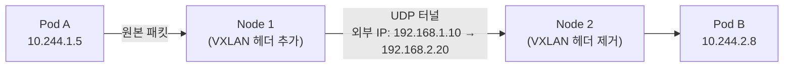
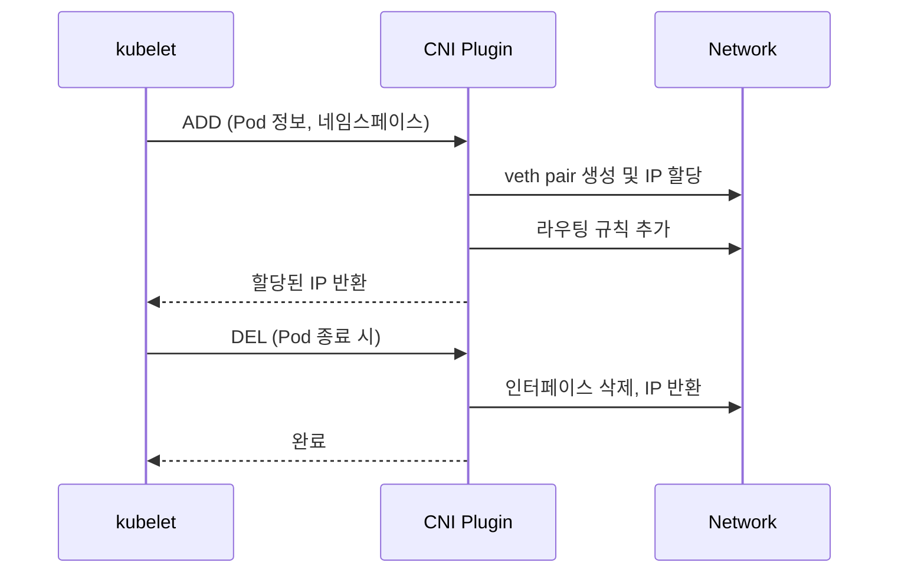
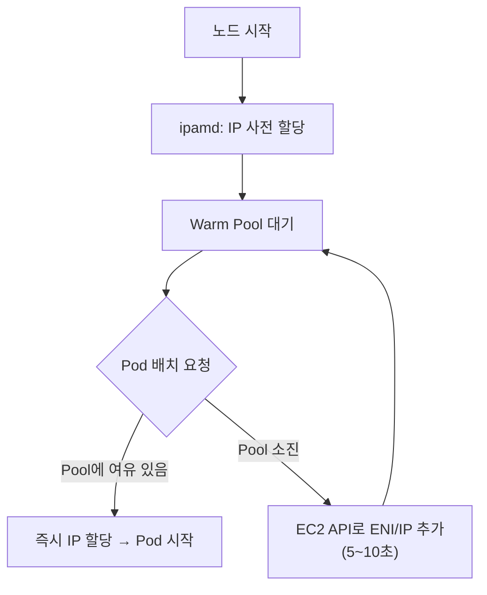

# Background

VPC CNI가 어떻게 동작하는지 이해하려면 먼저 일반적인 K8s 네트워킹이 어떤 문제를 가지고 있는지, AWS가 그걸 어떻게 해결했는지 알아야 합니다.

---

## Overlay Networks

K8s에서 Pod는 각자 IP를 하나씩 갖습니다. 이 IP는 클러스터 내부에서 임의로 정한 주소 대역(Pod CIDR)에서 할당됩니다. 예를 들어 `10.244.0.0/16`라 가정합니다. 문제는 이 주소가 **클러스터 외부 네트워크에서는 존재하지 않는다**는 점입니다.

노드들은 실제 네트워크 주소를 갖고 있습니다(예: `192.168.1.10`, `192.168.2.20`). 하지만 `10.244.1.5`라는 Pod IP는 어느 스위치에도, 어느 라우터에도 등록된 적 없는 가상의 주소입니다. 그래서 Node 1의 Pod가 Node 2의 Pod에게 패킷을 보내면, 중간 네트워크는 이 패킷을 어디로 보내야 할지 모릅니다.

이를 해결하는 방법이 **오버레이 네트워크**입니다. Pod-to-Pod 패킷을 노드 간 패킷으로 한 번 더 감싸는(encapsulation) 방식입니다.

### VXLAN

VXLAN은 L2 이더넷 프레임을 UDP 패킷으로 감싸서 전송합니다. 출발지/목적지를 Pod IP 대신 노드 IP로 표기한 바깥 헤더를 붙여, 일반 네트워크가 이해할 수 있는 형태로 만드는 것입니다.

??? info "L2와 L3의 경계 — VXLAN이 왜 이런 방식인가"
    네트워크 각 계층은 데이터 단위를 부르는 이름이 다릅니다.

    | 계층 | 프로토콜 | 데이터 단위 |
    |------|----------|------------|
    | L4   | TCP      | 세그먼트 (Segment) |
    | L3   | IP       | 패킷 (Packet) |
    | L2   | Ethernet | **프레임 (Frame)** |
    | L1   | 물리     | 비트 (Bit) |

    이더넷 프레임은 `[ MAC Header | Payload ]` 구조입니다. L2 캡슐화 과정에서 MAC Header가 앞에 붙고, Payload 안에는 이미 L3/L4에서 캡슐화된 `[ IP Header | TCP Header | Data ]`가 담겨 있습니다.

    L2는 **같은 물리 네트워크 세그먼트 안에서만** 동작합니다. 같은 스위치에 연결된 장비들은 MAC 주소로 직접 통신하지만, 다른 물리 네트워크에 있는 장비끼리는 L3(IP 라우팅)을 거쳐야 합니다.

    VXLAN 기반 CNI는 서로 다른 물리 네트워크에 있는 노드들 사이에 L2 오버레이를 구성합니다. 어떤 노드에 있든 Pod끼리 직접 통신할 수 있어야 하는데, 노드들은 서로 다른 물리 네트워크에 있습니다. VXLAN은 이 간극을 이더넷 프레임 전체를 UDP 페이로드로 감싸는 방식으로 메웁니다.

    **캡슐화 전 — 원본 이더넷 프레임**

    ```mermaid
    packet-beta
    0-15: "MAC Header (출발지/목적지 MAC)"
    16-35: "IP Header (Pod IP)"
    36-43: "TCP Header"
    44-75: "Data"
    ```

    **캡슐화 후 — VXLAN이 앞에 새 헤더를 추가:**

    ```mermaid
    packet-beta
    0-11: "Outer MAC"
    12-27: "Outer IP (노드 IP)"
    28-31: "UDP"
    32-35: "VXLAN HDR"
    36-47: "Inner MAC"
    48-63: "Inner IP (Pod IP)"
    64-71: "TCP"
    72-103: "Data"
    ```

    `Outer MAC ~ VXLAN HDR`까지가 VXLAN이 새로 추가한 외부 헤더이고, `Inner MAC ~ Data`는 원본 이더넷 프레임입니다. 외부 헤더는 노드 IP를 사용하므로 L3 네트워크가 정상적으로 라우팅합니다.
    목적지 노드에 도착하면 각 노드에서 캡슐화/역캡슐화를 담당하는 컴포넌트인 **VTEP(VXLAN Tunnel Endpoint)**이 외부 헤더를 제거하고 원본 이더넷 프레임을 꺼내 Pod에 전달합니다. 물리적으로 다른 네트워크에 있는 노드들이 마치 같은 L2 세그먼트에 있는 것처럼 동작하는 것, 이것이 "오버레이"입니다.
    
    외부 헤더의 각 구성요소는 역할이 명확합니다.

    - **Outer IP** — 노드 IP를 사용해 L3 네트워크가 라우팅할 수 있게 합니다.
    - **UDP** — 목적지 포트 4789로 수신 노드에게 패킷이 VXLAN 트래픽임을 알려 VTEP으로 전달합니다. TCP 대신 UDP를 사용하는 이유는 내부 프레임에 이미 TCP가 있어 신뢰성이 보장되므로, 외부 헤더까지 TCP로 감싸면 재전송/확인 응답이 이중으로 발생하기 때문입니다.
    - **VXLAN HDR** — VNI(VXLAN Network Identifier)라는 24비트 식별자를 담고 있습니다. 하나의 물리 네트워크 위에 여러 가상 L2 네트워크가 올라갈 수 있는데, VTEP이 역캡슐화 후 어느 가상 네트워크로 보낼지 VNI로 구분합니다.



목적지 노드에서는 외부 헤더를 벗겨내고 원래 Pod 패킷을 꺼내 전달합니다. 각 노드에서 이 캡슐화/역캡슐화를 담당하는 컴포넌트를 **VTEP(VXLAN Tunnel Endpoint)**라고 합니다.

이 방식의 비용은 분명 존재합니다. 모든 패킷에 추가 헤더(VXLAN 8 + UDP 8 + IP 20 + Ethernet 14)가 붙어 **약 50바이트(IPv4 기준)**의 오버헤드가 발생합니다. 이로 인해 1500 MTU 환경에서는 실질 페이로드가 줄어들며, MTU를 별도로 조정하지 않으면 단편화나 패킷 드롭이 발생할 수 있습니다. 또한 캡슐화/역캡슐화 과정에서 CPU 자원이 추가로 소모되며, 전체 처리량 역시 환경과 구성에 따라 일정 수준 감소할 수 있습니다.

더 큰 문제는 **가시성**입니다. 네트워크 입장에서는 노드 IP 사이의 UDP 트래픽만 보입니다. VPC Flow Logs에는 Pod IP가 아닌 노드 IP만 기록되고, Security Group 규칙을 Pod 단위로 적용할 수 없습니다.

### IP-in-IP

IP-in-IP는 IP 패킷을 또 다른 IP 헤더로 감싸는 더 단순한 방식입니다. 헤더 오버헤드가 VXLAN보다 작습니다. Calico가 기본으로 사용하며, BGP 라우팅과 함께 쓰면 오버레이 없이 동작하도록 구성할 수도 있습니다.

---

## Amazon VPC CNI의 접근 방식

오버레이가 Pod IP를 실제 네트워크에서 감추고 터널로 캡슐화해 전달하는 방식이라면, Amazon VPC CNI는 반대로 접근합니다. **Pod IP 자체를 VPC의 실제 IP로 만들어버립니다.**

이게 가능한 건 AWS ENI(Elastic Network Interface) 덕분입니다. EC2 인스턴스는 ENI 하나에 여러 개의 Secondary IP를 붙일 수 있는데, VPC CNI는 이 Secondary IP를 Pod에 직접 할당합니다. Pod가 `192.168.1.20`을 받으면, 그건 실제로 EC2 ENI에 붙은 VPC 주소입니다.

결과적으로:

- 오버레이 터널이 없어 헤더 오버헤드와 CPU 부담이 사라집니다.
- VPC Flow Logs에 Pod IP가 그대로 기록됩니다.
- Security Group을 Pod 단위로 적용할 수 있습니다.
- VPN이나 Direct Connect로 연결된 다른 네트워크에서도 Pod IP로 직접 접근 가능합니다.

---

## ENI (Elastic Network Interface)

ENI는 EC2 인스턴스에 연결되는 가상 네트워크 카드입니다. 인스턴스 시작 시 자동으로 생성되는 **Primary ENI** 외에, 필요에 따라 **Secondary ENI**를 추가로 연결할 수 있습니다.

각 ENI는 Primary IP 1개와 여러 개의 Secondary IP를 가질 수 있습니다. VPC CNI는 이 슬롯을 Pod IP 풀로 활용합니다. 슬롯은 설정에 따라 IP 주소 또는 prefix가 됩니다.[^slot]

[^slot]: [Amazon VPC CNI Best Practices](https://docs.aws.amazon.com/eks/latest/best-practices/vpc-cni.html)

| 속성 | Primary ENI | Secondary ENI |
|------|------------|---------------|
| 생성 시점 | 인스턴스 시작 시 자동 | 필요 시 연결 |
| 분리 가능 여부 | 불가 | 가능 |
| 주요 용도 | 기본 트래픽, SNAT 소스 IP | Pod IP 슬롯 추가 |

ENI당 붙일 수 있는 Secondary IP 수, 인스턴스당 붙일 수 있는 ENI 수는 **인스턴스 유형마다 다릅니다.**

???+ info "Representative Instance Limits"
    | Instance Type | Max ENI | IP per ENI | Usable Secondary IP |
    |-------------|---------|--------|------------------|
    | t3.small    | 3       | 4      | 9  |
    | t3.medium   | 3       | 6      | 15 |
    | m5.large    | 3       | 10     | 27 |
    | m5.4xlarge  | 8       | 30     | 232 |
    | c5.18xlarge | 15      | 50     | 735 |

이 한도가 노드당 실행 가능한 Pod 수의 상한(`maxPods`)을 결정합니다. 자세한 계산은 [Pod Capacity](./3_pod-capacity.md)에서 다룹니다.

---

## CNI (Container Network Interface)

CNI는 kubelet이 Pod 네트워크를 설정할 때 사용하는 플러그인 인터페이스 스펙입니다. Pod가 생성되면 kubelet이 `/etc/cni/net.d/` 설정을 읽고 CNI 플러그인 바이너리를 호출합니다.



CNI 바이너리는 Pod 생성/삭제마다 호출되고 즉시 종료되는 단발성 프로세스입니다. EKS에서 VPC CNI는 `aws-node` DaemonSet으로 배포되며, CNI 바이너리와 함께 **ipamd** 데몬이 패키징되어 있습니다.

---

## IPAM과 Warm Pool

VPC CNI에서 IP를 실시간으로 확보하려면 EC2 API를 호출해야 합니다. 새 ENI를 인스턴스에 연결하는 것은 단순한 메모리 조작이 아니라 EC2 컨트롤 플레인에 요청을 보내고 하이퍼바이저가 가상 NIC를 생성하기까지 기다리는 과정으로, 보통 **5~10초**가 걸립니다. Pod이 생성될 때마다 이 지연이 발생하면 오토스케일링 상황에서 수백 개의 Pod가 줄지어 대기하게 됩니다.

이를 해결하기 위해 VPC CNI의 **ipamd**는 항상 일정량의 IP를 미리 확보해 두는 **Warm Pool**을 유지합니다.



ipamd가 노드에서 백그라운드로 동작하는 데몬인 것도 같은 이유입니다. CNI 바이너리는 Pod마다 실행되고 바로 종료되므로 상태를 유지할 수 없습니다. ipamd가 EC2 API 호출, ENI 상태, IP 풀을 관리하고, CNI 바이너리가 필요할 때 ipamd에 IP를 요청하는 구조입니다.

Warm Pool 크기를 조정하는 환경 변수(`WARM_ENI_TARGET`, `WARM_IP_TARGET`, `MINIMUM_IP_TARGET`)는 [VPC CNI Architecture](./1_vpc-cni.md)에서 자세히 다룹니다.
