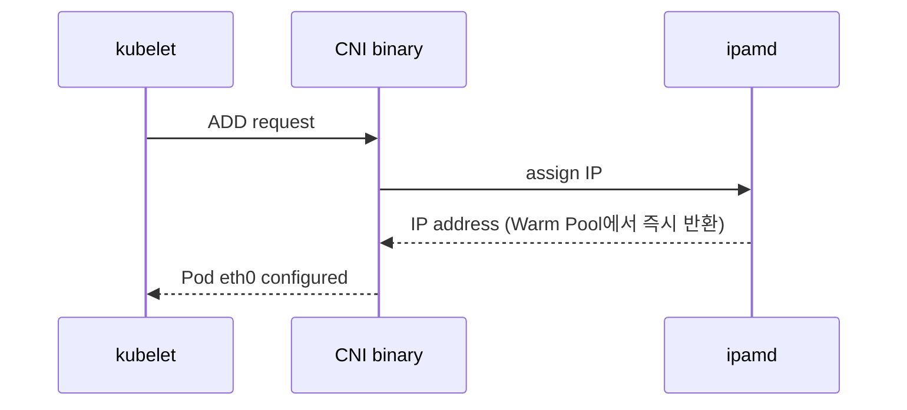

# VPC CNI Architecture

Amazon VPC CNI는 Pod IP를 VPC의 ENI Secondary IP로 직접 부여합니다. 오버레이 없이 VPC 라우팅만으로 Pod 간 통신이 가능하며, Security Group, VPC Flow Logs가 Pod 수준까지 적용됩니다.

---

## Components

Amazon VPC CNI는 두 컴포넌트로 구성됩니다.

**CNI Binary**
:   Pod-to-Pod 네트워크를 설정합니다.
    노드 루트 파일 시스템에서 실행되며, kubelet이 Pod 추가/삭제 시마다 호출합니다.
    단발성 프로세스로, 실행 후 즉시 종료됩니다.

**ipamd** (long-running node-local IPAM 데몬)
:   노드의 ENI를 관리하고, Pod 빠른 시작을 위한 **Warm Pool**을 유지합니다.
    Pod 배치 요청이 오면 ipamd에서 IP를 즉시 할당해 줍니다.
    백그라운드로 항상 실행 중인 데몬으로, EC2 API 호출 결과를 캐싱합니다.

---

## Warm Pool Allocation Flow

*[Source: Amazon VPC CNI Best Practices](https://docs.aws.amazon.com/eks/latest/best-practices/vpc-cni.html)*

1. 노드가 프로비저닝되면 CNI가 Primary ENI로 Slot(IP 또는 Prefix) 할당 → **Warm Pool**
2. Pod이 배치되면 ipamd가 Warm Pool에서 IP를 즉시 제공
3. Warm Pool이 줄어들면 CNI가 추가 ENI를 연결하여 Pool 보충
4. 각 ENI는 인스턴스 유형에 따라 지원하는 슬롯 수가 다름
5. 노드가 수용 가능한 최대 ENI에 도달하면 추가 불가

이에 따라 Pod이 생성될 때 kubelet, CNI 바이너리, ipamd 사이의 호출 순서는 다음과 같습니다.

Pod이 삭제되면 30초간 cool down cache에 보관하고 IP를 반환합니다. cool down cache에 있는 IP는 새롭게 생성되는 Pod에게 할당될 수 없습니다.

???+ info "Why isn't the Pod IP returned to Warm Pool immediately?"
    Pod이 삭제되면 VPC CNI는 해당 IP를 즉시 Warm Pool로 반환하지 않고 **30초간 cool down cache에 보관**합니다.

    Pod이 삭제되면 Kubernetes는 모든 노드의 kube-proxy에 iptables 규칙 업데이트를 전파합니다. 이 전파는 클러스터 규모에 따라 수 초에서 수십 초가 걸립니다. 전파가 완료되기 전에 같은 IP가 새 Pod에 재사용되면, 일부 노드의 iptables 규칙이 여전히 구 Pod를 가리켜 트래픽이 잘못 전달되는 race condition이 발생합니다.

    따라서 안전하게 전파 완료를 기다리기 위해 30초를 버퍼로 설정합니다.

---

## Warm Pool Environment Variables

Warm Pool의 크기와 동작은 4개의 환경 변수로 제어합니다.

- `WARM_ENI_TARGET`
:  현재 사용 중인 ENI 외에 추가로 유지할 ENI 수. 기본값은 1이었지만 현재는 0으로 설정하는 것이 권장됩니다. ENI 단위로 여유를 확보하기 때문에 Pod 급증 상황에 빠르게 대응할 수 있지만, 그만큼 사용되지 않는 IP가 ENI 단위로 낭비될 수 있습니다.

- `WARM_IP_TARGET`
:  현재 사용 중인 IP 외에 추가로 유지할 여유 IP 수. IP 단위로 세밀하게 제어할 수 있어 주소 낭비를 줄일 수 있으며, 설정 시 `WARM_ENI_TARGET`은 무시됩니다.

- `MINIMUM_IP_TARGET`
:  노드에서 항상 유지해야 하는 최소 IP 총량. 노드 시작 직후나 대량 scale-out 상황에서도 일정 수준 이상의 IP 풀이 유지되도록 보장하며, `WARM_IP_TARGET`과 함께 사용할 경우 이 값이 우선적으로 적용됩니다.

- `WARM_PREFIX_TARGET`
:  Prefix Delegation 사용 시 유지할 여유 prefix 수. 일반적으로 `/28` 단위 prefix를 기준으로 하며, `WARM_IP_TARGET` 또는 `MINIMUM_IP_TARGET`이 설정된 경우 이 값은 무시됩니다.[^warm-prefix]

[^warm-prefix]: [ENI and IP Target 문서](https://github.com/aws/amazon-vpc-cni-k8s/blob/master/docs/eni-and-ip-target.md) 참고.

| 항목 | WARM_ENI_TARGET | WARM_IP_TARGET | MINIMUM_IP_TARGET |
|------|:---:|:---:|:---:|
| 제어 단위 | ENI | IP | IP |
| 용도 | ENI 단위로 여유 확보 | IP 단위로 세밀한 여유 확보 | IP 풀의 최소 보장 |
| 권장 | :x: | :white_check_mark: | :white_check_mark: |
| Scale-out 반응성 | 빠름 | 빠름 | 초기 확보 시 유리 |
| 리소스 효율 | 낮음 | 높음 | 중간 |

!!! tip "Recommended"
    `WARM_ENI_TARGET=0`, `WARM_IP_TARGET=5`, `MINIMUM_IP_TARGET=10`
    노드당 최소 10개의 IP를 항상 유지하고, 가용 IP가 5개 이하로 감소하면 추가 IP를 확보합니다.  
    이를 통해 Pod 생성 지연을 줄이면서도 IP 자원의 낭비를 최소화할 수 있습니다.
