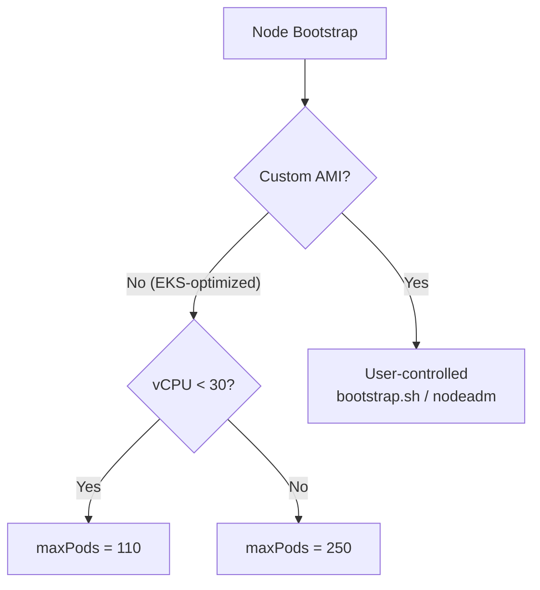

# Pod Capacity

EKS 노드에 배치할 수 있는 Pod 수는 ENI 구성과 kubelet 설정에 의해 결정됩니다.
이 페이지에서는 maxPods 계산 공식, 결정 우선순위등을 확인합니다.

---

## maxPods Formula

Secondary IP 모드에서 노드에 배치 가능한 최대 Pod 수는 다음 공식으로 계산됩니다.

``` title="Formula"
maxPods = (MaxENI × (IPv4/ENI − 1)) + 2
```

`MaxENI`
:   인스턴스 유형별 최대 ENI 수

`IPv4/ENI − 1`
:   ENI당 Secondary IP 슬롯 수. ENI의 Primary IP는 노드 자체용으로 예약되어 Pod에 할당할 수 없으므로 1개를 제외합니다.

`+ 2`
:   `aws-node`와 `kube-proxy`는 `hostNetwork: true`로 동작하여 노드의 네트워크를 그대로 사용합니다. 자체 네트워크 네임스페이스 없이 동작하므로 ENI Secondary IP를 소비하지 않으면서 kubelet의 Pod 카운트에는 포함됩니다.

!!! example "t3.medium calculation"
    - MaxENI = 3
    - IPv4addr/ENI = 6

    `(3 × (6 − 1)) + 2 = 17`

    ```bash
    # 인스턴스 유형별 ENI 정보 조회
    INSTANCE_TYPE=t3.medium
    
    aws ec2 describe-instance-types \
      --filters Name=instance-type,Values=$INSTANCE_TYPE \
      --query "InstanceTypes[].{Type:InstanceType, MaxENI:NetworkInfo.MaximumNetworkInterfaces, IPv4addr:NetworkInfo.Ipv4AddressesPerInterface}" \
      --output table
    ```

!!! info "Pre-calculated values for all instance types"
    [:octicons-mark-github-16: misc/eni-max-pods.txt](https://github.com/aws/amazon-vpc-cni-k8s/blob/master/misc/eni-max-pods.txt)에는 이 공식을 모든 인스턴스 타입에 적용한 사전 계산값이 수록되어 있습니다. 인스턴스 선정 단계에서 직접 계산 없이 확인할 수 있습니다.

---

## maxPods Decision Path

maxPods가 설정되는 경로는 Launch Template에 Custom AMI를 지정하는지에 따라 갈립니다. EKS-optimized AMI를 사용하면 EKS가 직접 주입하고, Custom AMI를 지정하면 bootstrap 전체를 직접 작성합니다.



### EKS-optimized AMI

Launch Template에 AMI ID를 지정하지 않으면 EKS가 userdata를 자동 구성하며 `--max-pods`를 주입합니다. Prefix Delegation 활성화 여부와 무관하게 vCPU 수에 따라 상한이 결정됩니다.[^mng-cap]

- vCPU < 30 → 110
- vCPU ≥ 30 → 250

[^mng-cap]: [Increase the available IP addresses for your Amazon EKS node](https://docs.aws.amazon.com/eks/latest/userguide/cni-increase-ip-addresses-procedure.html)

!!! warning "Silently ignored"
    EKS-optimized AMI를 사용하는 경우 kubelet-extra-args, nodeadm의 maxPodsExpression 등 어떤 설정을 추가해도 EKS 주입값에 덮어씌워지며 경고나 오류가 없습니다. maxPods를 직접 제어하려면 Custom AMI를 사용해야 합니다.

### Custom AMI

Launch Template에 Custom AMI ID를 지정하면 EKS는 userdata를 주입하지 않습니다. maxPods를 포함한 bootstrap 전체를 직접 작성합니다.

=== "AL2 (bootstrap.sh)"

    bootstrap.sh는 기본적으로 ENI 공식으로 maxPods를 자동 계산합니다. 직접 지정하려면 `--use-max-pods false`로 자동 계산을 끄고 `--kubelet-extra-args`로 값을 전달합니다.

    ```bash
    /etc/eks/bootstrap.sh my-cluster \
      --use-max-pods false \
      --kubelet-extra-args '--max-pods=110'
    ```

    `--use-max-pods false` 없이 `--kubelet-extra-args '--max-pods=N'`만 전달하면 bootstrap.sh가 먼저 ENI 공식값을 kubelet 인자에 추가하므로 플래그가 중복되어 예상과 다르게 동작할 수 있습니다.

=== "AL2023 (nodeadm)"

    `NodeConfig`에서 정적 값 또는 인스턴스 메타데이터 기반 수식으로 설정합니다. 수식에서 사용 가능한 변수:

    `default_enis`
    :   인스턴스에 연결 가능한 최대 ENI 수

    `ips_per_eni`
    :   ENI당 최대 IPv4 주소 수

    `max_pods`
    :   ENI 공식 기본값: `(default_enis × (ips_per_eni − 1)) + 2`

    ```yaml
    # Prefix Delegation 적용 시
    apiVersion: node.eks.aws/v1alpha1
    kind: NodeConfig
    spec:
      kubelet:
        maxPodsExpression: "((default_enis - 1) * (ips_per_eni - 1) * 16) + 2"
    ```
