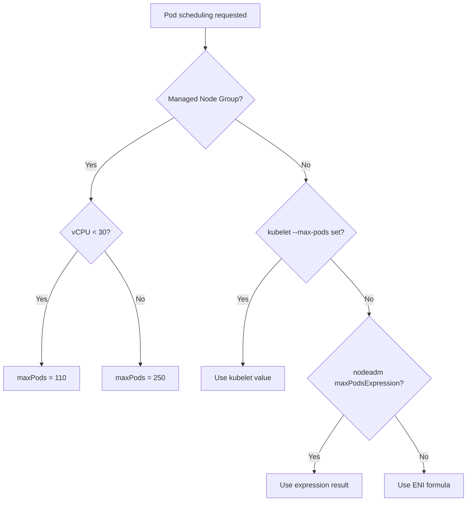

# Pod Capacity

EKS 노드에 배치할 수 있는 Pod 수는 ENI 구성과 kubelet 설정에 의해 결정됩니다.
이 페이지에서는 maxPods 계산 공식, 결정 우선순위, 그리고 실제 한계를 확인하는 실습을 다룹니다.

!!! info "사전 지식"
    IP 할당 모드(Secondary IP / Prefix Delegation)는 [IP Allocation Modes](./2_ip-modes.md)를 참고하세요.

---

## Secondary IP Priority

### maxPods 공식

Secondary IP 모드에서 노드에 배치 가능한 최대 Pod 수는 다음 공식으로 계산됩니다.

``` title="maxPods 공식"
maxPods = (MaxENI × (IPv4/ENI − 1)) + 2
```

`MaxENI`
:   인스턴스 유형별 최대 ENI 수

`IPv4/ENI − 1`
:   ENI당 Secondary IP 슬롯 수. Primary IP 1개는 노드 자체 예약이라 제외

`+ 2`
:   `aws-node`와 `kube-proxy`는 `hostNetwork: true`로 ENI IP 미소비 — Pod 수에는 산입

각 ENI에서 `-1`을 하는 이유는 ENI의 Primary IP가 노드 자체용으로 예약되어 Pod에 할당할 수 없기 때문입니다. `+2`는 `aws-node`와 `kube-proxy`가 `hostNetwork: true`로 동작하기 때문입니다. 이 두 Pod는 자체 네트워크 네임스페이스 없이 노드의 네트워크 스택을 그대로 쓰므로, ENI Secondary IP를 소비하지 않고도 Pod로 카운트됩니다.

```bash
# hostNetwork Pod 확인
kubectl get pod -n kube-system aws-node-xxxxx -o jsonpath='{.spec.hostNetwork}'
# true
```

!!! example "t3.medium 계산 예시"
    t3.medium: MaxENI = 3, IPv4addr/ENI = 6

    `(3 × (6 − 1)) + 2 = 17`

    ```bash
    # 인스턴스 유형별 ENI 정보 조회
    aws ec2 describe-instance-types \
      --filters Name=instance-type,Values=t3.medium \
      --query "InstanceTypes[].{Type:InstanceType, MaxENI:NetworkInfo.MaximumNetworkInterfaces, IPv4addr:NetworkInfo.Ipv4AddressesPerInterface}" \
      --output table
    # t3.medium: MaxENI=3, IPv4addr=6 → (3×5)+2 = 17
    ```

---

## maxPods Decision Priority

maxPods는 아래 우선순위에 따라 결정됩니다. 높은 순서부터 적용됩니다.



**1. Managed Node Group 적용**
:   EKS가 userdata에 maxPods를 자동 주입합니다.

    - vCPU < 30 → 상한 **110**
    - vCPU ≥ 30 → 상한 **250**

    110은 Kubernetes 커뮤니티가 노드당 공식 지원 규모로 검증해온 값입니다(클러스터당 5,000 노드 × 노드당 110 Pod). vCPU가 적은 노드는 kubelet의 상태 감시·보고 루프를 처리하는 여유가 작아 이 상한으로 과부하를 방지합니다. 대형 인스턴스(vCPU ≥ 30)의 250은 AWS 내부 테스트 기반입니다.

**2. kubelet maxPods 직접 설정**
:   커스텀 AMI + Launch Template으로 kubelet 플래그를 직접 지정하여 override합니다.

    ```bash
    # bootstrap.sh 예시
    --use-max-pods false --kubelet-extra-args '--max-pods=110'
    ```

**3. nodeadm maxPodsExpression**
:   `NodeConfig`에서 수식으로 maxPods를 계산합니다. Managed Node Group에서는 무시됩니다.

**4. Primary ENI 기반 계산**
:   위 값이 모두 없을 때 ENI 공식을 사용합니다.

!!! warning "maxPodsExpression은 Managed Node Group에서 무시됩니다"
    Managed Node Group을 사용하면 EKS 컨트롤 플레인이 노드 userdata에 `--max-pods=N`을 **직접 주입**합니다.
    이 값은 kubelet 시작 인자로 전달되므로, nodeadm의 `maxPodsExpression`이 계산한 값보다 우선합니다.
    결과적으로 `maxPodsExpression` 설정은 조용히(silently) 무시됩니다 — 경고나 오류가 전혀 없어서 footgun이 될 수 있습니다.

    **원하는 maxPods 값을 적용하려면:**

    1. Launch Template에 커스텀 AMI를 지정합니다.
    2. `bootstrap.sh`에 `--use-max-pods false --kubelet-extra-args '--max-pods=N'`을 전달합니다.
    3. `--use-max-pods false` 없이 `--kubelet-extra-args`만 전달하면 EKS 주입값이 여전히 우선합니다.

    ```bash
    # 올바른 userdata 예시 (EKS optimized AMI bootstrap.sh)
    /etc/eks/bootstrap.sh my-cluster \
      --use-max-pods false \
      --kubelet-extra-args '--max-pods=110'
    ```

---

## 노드 maxPods 확인

```bash
# 노드의 Allocatable Pod 수 확인
kubectl describe node | grep Allocatable: -A6
# pods: 17   (t3.medium 기본값)
```

---

## Lab: Secondary IP Mode — Pod Limit

### Secondary IP 모드에서 Pod 한계 도달

=== "스케일 아웃 테스트"

    ```bash
    # Deployment 스케일 증가 테스트
    kubectl scale deployment nginx-deployment --replicas=50
    # → 3노드 × 15개 = 45개 가능, 그 이상은 Pending
    ```

=== "Pending 원인 확인"

    ```bash
    # Pending Pod 이벤트 확인
    kubectl describe pod <Pending Pod> | grep Events: -A5
    # Warning  FailedScheduling: Too many pods
    ```

=== "IP 소진 확인"

    ```bash
    # IpamD로 IP 소진 확인
    for i in $N1 $N2 $N3; do
      ssh ec2-user@$i curl -s http://localhost:61679/v1/enis | jq
    done | grep -E 'node|TotalIPs|AssignedIPs'
    # TotalIPs: 15, AssignedIPs: 15  (3노드 모두 IP 고갈)
    ```

---

## Lab: Prefix Delegation — More Pods

### Prefix Delegation으로 Pod 수 늘리기

=== "Prefix 할당 확인"

    ```bash
    # Prefix 할당 확인
    aws ec2 describe-instances \
      --filters "Name=tag-key,Values=eks:cluster-name" "Name=tag-value,Values=myeks" \
      --query 'Reservations[*].Instances[].{InstanceId:InstanceId, Prefixes:NetworkInterfaces[].Ipv4Prefixes[]}' | jq
    # "Ipv4Prefix": "192.168.10.16/28"  ← /28 = 16개 IP
    ```

=== "IpamD 상태 확인"

    ```bash
    # Prefix 모드에서 IpamD 상태 (Pod 없어도 IP 더 많이 확보)
    # TotalIPs: 32~33 (t3.medium), AssignedIPs는 maxPods에 따라 제한
    for i in $N1 $N2 $N3; do
      ssh ec2-user@$i curl -s http://localhost:61679/v1/enis | jq
    done | grep -E 'node|TotalIPs|AssignedIPs'
    ```

!!! warning "Prefix Delegation이 maxPods를 자동으로 올리지 않는 이유"
    Prefix Delegation은 ENI 슬롯당 IP 개수를 16배 늘려주지만, **maxPods는 kubelet이 독립적으로 관리**합니다.
    kubelet의 `--max-pods` 값은 CNI 플러그인이 아닌 노드 부트스트랩 시점에 주입되며,
    EKS Managed Node Group은 **하위 호환성(backward compatibility)**을 위해
    Prefix Delegation 활성화 여부와 무관하게 Secondary IP 모드 기준 maxPods를 그대로 유지합니다.

    이 두 값(IP 가용량과 maxPods)을 의도적으로 분리한 이유는 다음과 같습니다.

    - IP가 늘었다고 무조건 Pod를 많이 띄우면 노드 CPU/메모리가 과부하될 수 있습니다.
    - 운영자가 의도적으로 maxPods를 올린 다음에만 고밀도 배치가 이뤄지도록 설계한 것입니다.

    **Prefix Delegation으로 고밀도 배치를 원하면 maxPods도 함께 올려야 합니다.**

    AL2023부터는 `nodeadm`의 `NodeConfig`에서 `maxPodsExpression`으로 설정합니다.
    AL2에서 사용하던 `max-pods-calculator.sh`는 AL2 지원 종료에 맞춰 삭제되었습니다. :octicons-issue-closed-16: awslabs/amazon-eks-ami#2651

!!! info "Prefix Delegation의 핵심 제약"
    Prefix Delegation으로 IP는 충분해도 maxPods 상한이 낮으면 Pod를 더 배치할 수 없습니다.
    c5.large + Prefix Delegation + maxPods=110 조합에서 실제로 노드 1대에 110개 Pod 배치 가능합니다.

    TotalIPs: 112, AssignedIPs: 108 (ipamd 실측값)

    Prefix Delegation 설정 방법은 [IP Allocation Modes](./2_ip-modes.md)를 참고하세요.
