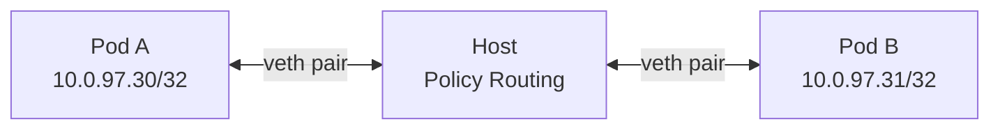
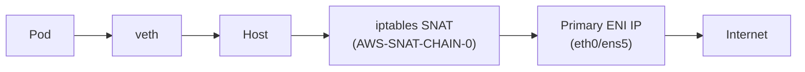

# Pod Networking & Traffic Flow

AWS VPC CNI는 오버레이 없이 veth pair와 Policy Routing을 조합해 Pod 네트워크를 구성합니다.
이 페이지에서는 Pod 내부 네트워크 구성, Pod-to-Pod 통신 흐름, 외부 인터넷으로의 SNAT 처리를 다룹니다.

---

## Pod Internal Network

Pod 내부에서 네트워크 인터페이스를 확인하면 다음과 같습니다.

```bash
# Pod 내부 네트워크 확인
ip addr show eth0
# eth0@ifN: inet 10.0.97.30/32   ← ENI secondary IP (/32)

ip route show
# default via 169.254.1.1 dev eth0
# 169.254.1.1 dev eth0

arp -n
# 169.254.1.1  PERM  <veth MAC>   ← 호스트 veth에 대한 정적 ARP 항목
```

`169.254.1.1`은 실제로 존재하지 않는 주소입니다. 일반적으로는 게이트웨이 IP의 MAC을 ARP로 알아내야 패킷을 보낼 수 있는데, VPC CNI는 이 과정을 건너뜁니다. Pod 네트워크 네임스페이스 안에 `169.254.1.1 → 호스트 veth MAC`을 정적 ARP 항목으로 미리 심어두기 때문에, Pod는 ARP 브로드캐스트 없이 곧바로 호스트 veth로 패킷을 전달합니다.

`169.254.0.0/16`은 RFC 3927 link-local 블록으로 라우팅 테이블 전파 대상이 아닙니다. VPC CIDR, Pod CIDR, 노드 IP와 겹칠 일이 없어 어떤 환경에서도 충돌 없이 쓸 수 있습니다.

```
Pod eth0 (10.0.97.30/32)
  └─ default route → 169.254.1.1  [정적 ARP: MAC = 호스트 veth MAC]
       └─ veth pair → 호스트 네트워크 네임스페이스
            └─ Policy Routing → 올바른 ENI로 전달
```

---

## Pod-to-Pod Communication (Policy Routing)

AWS VPC CNI는 오버레이 없이 Policy Routing 기반으로 Pod 트래픽을 처리합니다.



### Routing Rules

=== "to-Pod 경로"

    ```bash
    # main 라우팅 테이블에 Pod IP → veth 경로 추가
    ip route show
    # 10.0.97.30 dev aws8db0408c9a8 scope link   ← Pod IP → veth
    ```

=== "from-Pod 경로 (Secondary ENI)"

    ```bash
    # Secondary ENI 소속 IP는 ENI별 별도 테이블 사용
    ip route show table 2
    # default via 192.168.3.1 dev ens6
    ```

=== "Policy Routing Rules"

    ```bash
    # Policy routing rules 확인
    ip rule list
    # 512:  from all to 192.168.3.171 lookup main   ← to-Pod
    # 1536: from 192.168.3.171 lookup 2             ← from-Pod (Secondary ENI)
    ```

노드에 ENI가 여러 개 붙으면 각 ENI는 서로 다른 서브넷 게이트웨이를 가집니다(eth0: `192.168.1.1`, eth1: `192.168.3.1`). 단일 라우팅 테이블을 쓰면 eth1 소속 Pod의 응답 패킷이 default route를 타고 eth0으로 나가버립니다. 들어온 인터페이스(eth1)와 나가는 인터페이스(eth0)가 달라지는 비대칭 라우팅이 발생하고, AWS VPC는 ENI별 Source/Destination Check를 수행하므로 이 패킷을 드롭합니다.

VPC CNI는 ENI마다 독립된 라우팅 테이블을 만들고, `ip rule`로 "이 IP에서 출발한 패킷은 이 ENI 테이블을 써라"는 Policy Rule을 추가해 패킷의 입출구 ENI가 항상 일치하도록 보장합니다.

???+ info "CNI Plugin이 veth pair를 구성하는 과정"
    Pod가 스케줄링될 때 CNI 플러그인이 아래 순서로 veth pair를 설정합니다.

    ```bash
    # 1. veth pair 생성
    ip link add veth-1 type veth peer name veth-1c
    ip link set veth-1c netns ns1        # pod 네임스페이스로 이동

    # 2. Pod 네임스페이스 내 설정
    ip netns exec ns1 ip addr add 20.0.49.215/32 dev veth-1c
    ip netns exec ns1 ip route add 169.254.1.1 dev veth-1c
    ip netns exec ns1 ip route add default via 169.254.1.1 dev veth-1c
    ip netns exec ns1 arp -i veth-1c -s 169.254.1.1 <veth-1 MAC>  # static ARP

    # 3. Host side: route + rule
    ip route add 20.0.49.215/32 dev veth-1
    ip rule add from all to 20.0.49.215/32 table main prio 512
    # Secondary ENI 소속 IP는 추가로:
    ip rule add from 20.0.49.215/32 table 2 prio 1536
    ```

---

## Pod → External Communication (SNAT)

Pod에서 VPC 외부(인터넷)로 나가는 트래픽은 iptables SNAT을 통해 노드의 Primary ENI IP로 변환됩니다.



### SNAT 규칙 확인

```bash
sudo iptables -t nat -S | grep 'A AWS-SNAT-CHAIN'
# -A AWS-SNAT-CHAIN-0 ! -d 192.168.0.0/16 -j RETURN
# -A AWS-SNAT-CHAIN-0 ! -o vlan+ -m addrtype ! --dst-type LOCAL \
#   -j SNAT --to-source 192.168.1.251 --random-fully
```

SNAT 소스 IP를 Secondary ENI가 아닌 Primary ENI IP로 고정하는 데는 이유가 있습니다. EIP(Elastic IP)는 Primary ENI에만 안정적으로 붙일 수 있고, VPC 라우팅 테이블도 기본적으로 Primary ENI를 통해 IGW 경로가 구성됩니다. Secondary ENI IP를 소스로 쓰면 해당 ENI가 속한 서브넷에 NAT 경로가 없을 경우 패킷이 드롭됩니다.

!!! tip "External SNAT 비활성화 — 언제, 왜 사용하는가"
    `AWS_VPC_K8S_CNI_EXTERNALSNAT=true`를 설정하면 VPC CNI의 iptables SNAT 규칙이 비활성화되고,
    Pod의 실제 IP가 소스 주소로 그대로 나갑니다.

    이 설정이 필요한 두 가지 주요 시나리오:

    **시나리오 1 — Private Subnet + NAT Gateway**
    Pod가 Private Subnet에 있고 NAT Gateway를 통해 인터넷에 나가는 구조라면,
    노드에 Public IP가 없으므로 CNI의 SNAT(Primary ENI IP로 변환)이 의미가 없습니다.
    `EXTERNALSNAT=true`로 CNI SNAT을 끄고 서브넷 라우팅 테이블의 NAT Gateway가 처리하게 해야 합니다.

    **시나리오 2 — On-Premises / Transit Gateway 직접 통신**
    VPC Peering, Transit Gateway, AWS Direct Connect로 연결된 온프레미스 시스템이
    Pod IP로 직접 연결을 시작해야 할 때(예: 온프레미스 DB가 EKS Pod에 callback하는 구조),
    CNI SNAT이 활성화되어 있으면 외부에서는 Pod IP가 아닌 노드 IP만 보입니다.
    연결 시도는 노드 IP로 가지만 노드는 해당 연결을 기대하지 않으므로 통신이 실패합니다.
    `EXTERNALSNAT=true`로 Pod 소스 IP를 보존하면, 온프레미스 측이 Pod IP로 직접 라우팅할 수 있습니다.

    ```bash
    kubectl set env daemonset aws-node -n kube-system AWS_VPC_K8S_CNI_EXTERNALSNAT=true
    ```

    !!! warning "주의사항"
        IPv6 전용 클러스터에서는 SNAT 자체가 적용되지 않으므로 이 설정이 무의미합니다.
        Windows 노드에는 이 환경변수가 적용되지 않습니다 (Windows 전용 파라미터를 사용해야 합니다).

iptables는 아웃바운드 SNAT 외에 Service 트래픽 분산에도 사용됩니다. ClusterIP가 가상 IP로 동작하는 원리와 kube-proxy 모드는 [Service & kube-proxy](./5_service-dns.md)에서 다룹니다.
