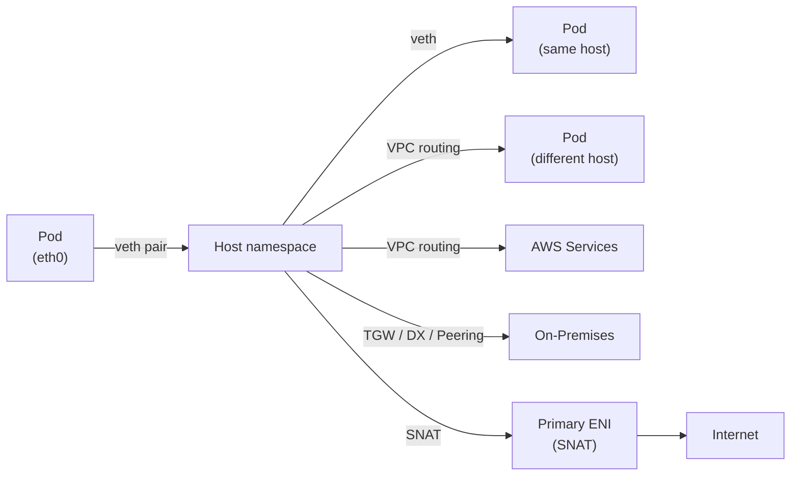

# Pod Networking

Kubernetes는 Pod 네트워킹에 대해 다음 세 가지 기본 요구사항을 정의합니다.

1. 모든 컨테이너는 NAT 없이 다른 모든 컨테이너와 통신할 수 있어야 합니다.
2. 모든 노드는 NAT 없이 모든 컨테이너와 통신할 수 있어야 합니다 (반대 방향도 마찬가지).
3. 컨테이너가 자신의 IP 주소로 인식하는 값은 외부에서 해당 컨테이너를 바라볼 때의 IP 주소와 동일해야 합니다.

이를 위해 VPC CNI는 각 EC2 노드에 여러 ENI를 연결하고, ENI의 Secondary IP를 Pod에 직접 할당합니다. Pod IP가 VPC IP이므로 오버레이 없이 VPC 라우팅을 그대로 활용합니다.

이 구조 위에서 Pod 트래픽은 목적지에 따라 다섯 가지 경로로 나뉩니다.

**Pod to Pod on a single host**
:   Host network namespace의 라우팅 테이블에 따라 대상 Pod IP로 라우팅되며, 해당 Pod에 연결된 veth 인터페이스를 통해 전달됩니다.

**Pod to Pod on different hosts**
:   노드의 라우팅 테이블에 따라 eth0을 통해 VPC로 전달되며, 대상 노드의 ENI로 라우팅됩니다.

**Pod to other AWS services**
:   Pod IP는 VPC CIDR에서 할당된 IP이므로, 별도의 NAT 없이 VPC 라우팅을 통해 AWS 리소스에 직접 도달합니다.

**Pod to on-premises data center**
:   AWS Transit Gateway, AWS Direct Connect 또는 VPC Peering을 통해 연결됩니다. SNAT이 활성화된 경우 Pod IP는 노드의 ENI IP로 변환되므로, 온프레미스에서는 Pod IP로 직접 라우팅할 수 없습니다.

**Pod to internet**
:   Pod IP는 VPC 외부(인터넷)에서 라우팅되지 않으므로, 노드의 Primary ENI를 통해 iptables SNAT이 적용되어 노드 IP로 변환된 후 인터넷으로 전달됩니다.



아래 섹션에서 VPC CNI가 각 경로를 어떻게 처리하는지를 살펴봅니다.

---

## Pod Network Namespace

각 Pod은 독립된 network namespace를 가지며, 같은 Pod 안의 컨테이너들은 하나의 namespace를 공유합니다. Pod에서 나가는 모든 트래픽은 veth pair를 통해 Host network namespace로 진입합니다.


*[Source: Best Practices for Networking](https://docs.aws.amazon.com/eks/latest/best-practices/networking.html)*

Pod에 할당되는 IP는 `/32` prefix로, 서브넷 마스크가 없어 Pod은 목적지에 상관없이 모든 패킷을 gateway로 전달합니다. VPC CNI는 Pod 스케줄링 시 default route의 gateway로 `169.254.1.1`(RFC 3927 link-local)을 설정합니다.

Pod이 이 gateway로 패킷을 보내려면 Ethernet 프레임에 next-hop MAC 주소가 필요합니다. 그러나 `169.254.1.1`은 실제 존재하지 않는 주소이므로, ARP 브로드캐스트로 조회해도 응답이 없습니다.

VPC CNI는 `169.254.1.1 → 호스트 veth MAC` 정적 ARP 항목을 Pod network namespace에 미리 등록해, ARP 브로드캐스트를 건너뛰고 veth로 직접 전달합니다.

```bash hl_lines="3 7 10"
ip addr show
# 3: eth0@if231: ...
#    inet 10.0.97.30/32 scope global eth0

ip route show
# default via 169.254.1.1 dev eth0
# 169.254.1.1 dev eth0

arp -a
# ? (169.254.1.1) at 2a:09:74:cd:c4:62 [ether] PERM on eth0
```

???+ example "CNI setup sequence — veth, routes, ARP, policy rules"
    Pod이 스케줄링될 때, CNI 플러그인이 위의 설정을 아래 순서로 실행합니다.

    ```bash
    # 1. veth pair 생성
    ip link add veth-1 type veth peer name veth-1c
    ip link set veth-1c netns ns1
    ip link set veth-1 up
    ip netns exec ns1 ip link set veth-1c up

    # 2. Pod namespace 내 설정 (IP, route, 정적 ARP)
    ip netns exec ns1 ip addr add 20.0.49.215/32 dev veth-1c
    ip netns exec ns1 ip route add 169.254.1.1 dev veth-1c
    ip netns exec ns1 ip route add default via 169.254.1.1 dev veth-1c
    ip netns exec ns1 arp -i veth-1c -s 169.254.1.1 <veth-1 MAC>

    # 3. Host side: route + policy rule
    ip route add 20.0.49.215/32 dev veth-1
    ip rule add from all to 20.0.49.215/32 table main prio 512
    # Secondary ENI 소속 IP는 추가로:
    ip rule add from 20.0.49.215/32 table 2 prio 1536
    ```

---

## Pod-to-Pod Communication

Host network namespace에 도달한 패킷은 호스트의 라우팅 테이블에 따라 전달됩니다.

노드에는 **Primary ENI**(eth0)와 Pod IP를 추가로 수용하기 위한 **Secondary ENI**(eth1, eth2…)가 있습니다. Secondary ENI는 Primary ENI와 다른 서브넷에 속할 수 있어 gateway IP가 다릅니다. 라우팅 테이블이 하나뿐이라면 응답 패킷이 잘못된 ENI로 나가는 비대칭 라우팅 문제가 생깁니다.

예를 들어 Pod IP `10.0.97.30`이 eth1에 속할 때, 이 Pod으로 들어오는 패킷은 eth1을 통해 도달합니다. 그러나 라우팅 테이블의 default route는 eth0을 가리키므로 응답 패킷이 eth1 대신 eth0으로 나갑니다. AWS VPC는 각 ENI에 Source/Destination Check를 적용하고 있어, eth0이 자신의 IP가 아닌 소스 주소(Pod IP)를 가진 패킷을 차단합니다.

VPC CNI는 **Policy Routing**(`ip rule`)으로 ENI마다 독립된 라우팅 테이블을 생성해, 특정 ENI로 들어온 Pod 트래픽이 동일한 ENI를 통해 나가도록 보장합니다.


*[Source: aws/amazon-vpc-cni-k8s cni-proposal.md](https://github.com/aws/amazon-vpc-cni-k8s/blob/master/docs/cni-proposal.md)*

다른 노드에 있는 Pod으로 향하는 패킷은 노드 eth0을 나가 VPC 네트워크를 통해 대상 노드 ENI로 전달됩니다.


*[Source: aws/amazon-vpc-cni-k8s cni-proposal.md](https://github.com/aws/amazon-vpc-cni-k8s/blob/master/docs/cni-proposal.md)*

---

## Pod-to-External Communication

Pod IP는 VPC 내에서만 유효하며, 인터넷에서는 라우팅되지 않습니다. VPC 라우팅 테이블의 default route(`0.0.0.0/0 → IGW`)와 EIP가 Primary ENI(eth0)에 연결되어 있어, VPC 외부로 나가는 트래픽은 Primary ENI를 통해 나갑니다.

VPC CNI는 iptables SNAT 규칙을 추가해 VPC 외부로 나가는 트래픽의 소스 IP를 Pod IP에서 Primary ENI IP로 변환합니다.

```text hl_lines="1 4"
-A POSTROUTING ! -d <VPC-CIDR> \        ← VPC 내부 트래픽은 제외
  -m comment --comment "kubernetes: SNAT for outbound traffic from cluster" \
  -m addrtype ! --dst-type LOCAL \      
  -j SNAT --to-source <Primary ENI IP>  ← Source IP를 Pod IP에서 Primary ENI IP로 변환
```


*[Source: aws/amazon-vpc-cni-k8s cni-proposal.md](https://github.com/aws/amazon-vpc-cni-k8s/blob/master/docs/cni-proposal.md)*

!!! tip "Disabling External SNAT"
    `AWS_VPC_K8S_CNI_EXTERNALSNAT=true`를 설정하면 VPC CNI의 iptables SNAT 규칙이 비활성화되고, Pod의 실제 IP가 소스 주소로 나갑니다.

    === "Private Subnet + NAT Gateway"
        Pod이 Private Subnet에 있고 NAT Gateway를 통해 인터넷에 나가는 구조라면, 노드에 Public IP가 없으므로 CNI의 SNAT은 불필요합니다. `EXTERNALSNAT=true`로 CNI SNAT을 끄고 서브넷 라우팅 테이블의 NAT Gateway가 처리하게 해야 합니다.

    === "On-Premises / Transit Gateway 직접 통신"
        VPC Peering, Transit Gateway, AWS Direct Connect로 연결된 온프레미스 시스템이 Pod IP로 직접 연결을 시작해야 할 때, SNAT이 활성화되어 있으면 외부에서는 노드 IP만 보입니다. `EXTERNALSNAT=true`로 Pod 소스 IP를 보존하면 온프레미스 측이 Pod IP로 직접 라우팅할 수 있습니다.

    ```bash
    kubectl set env daemonset aws-node -n kube-system AWS_VPC_K8S_CNI_EXTERNALSNAT=true
    ```

!!! warning "Caveats"
    - IPv6 전용 클러스터에서는 SNAT 자체가 적용되지 않으므로 이 설정이 무의미합니다.
    - Windows 노드에는 이 환경변수가 적용되지 않습니다 (Windows 전용 파라미터를 사용해야 합니다).
