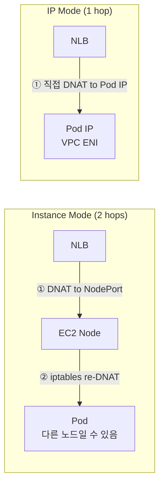

# AWS Load Balancer Controller

AWS Load Balancer Controller(LBC)는 Kubernetes Service와 Ingress 리소스를 AWS NLB/ALB와
연동하는 컨트롤러입니다. AWS VPC CNI 환경에서 Pod IP를 직접 타겟으로 등록하는 IP 모드를
활용하면 불필요한 홉을 제거할 수 있습니다.


*[Source: Route internet traffic with AWS Load Balancer Controller](https://docs.aws.amazon.com/eks/latest/userguide/aws-load-balancer-controller.html)*

---

## NLB Mode Comparison

| 항목 | 인스턴스 유형 (기본) | IP 유형 |
|------|:---:|:---:|
| 요구사항 | Cloud Controller Manager | AWS LBC 필수 |
| 트래픽 경로 | NLB → NodePort → iptables → Pod | NLB → Pod IP 직접 |
| Client IP 보존 | `externalTrafficPolicy: Local` 설정 시 | Proxy Protocol v2 활성화 시 |
| VPC CNI 통합 | 미사용 | 최적 통합 |

Instance Mode에서 NLB는 EC2 인스턴스(노드)를 Target Group에 등록합니다. NLB는 Pod의 존재를 알지 못하므로 트래픽은 반드시 노드 레벨의 NodePort를 거쳐야 하고, iptables kube-proxy 규칙이 다시 무작위 Pod로 DNAT합니다.

이 2-hop 경로에는 두 가지 부작용이 있습니다. 첫째, NLB는 모든 노드에 트래픽을 균등 분배하지만, iptables는 해당 노드의 Pod 수와 무관하게 클러스터 내 전체 Pod를 대상으로 다시 무작위 선택하므로 Pod당 수신량이 불균등해집니다. 둘째, 선택된 Pod가 다른 노드에 있으면 노드 간 트래픽이 한 번 더 발생해 레이턴시가 증가합니다.

IP Mode에서는 기본 Cloud Controller Manager(CCM) 대신 AWS LBC가 필요합니다. CCM은 AWS VPC 내부 구조를 알지 못해 Target Group에 EC2 인스턴스(노드)만 등록할 수 있습니다. AWS LBC는 VPC CNI와의 통합을 전제로 설계되어 ENI에 할당된 Pod IP — 즉 VPC IP — 를 Target Group에 직접 등록합니다.



---

## Installing AWS LBC via IRSA

LBC는 AWS API(ELB, EC2, WAF 등)를 직접 호출하므로 적절한 IAM 권한이 필요합니다. 이 권한을 노드 IAM Role에 부여하면 같은 노드의 모든 Pod가 해당 권한을 상속받는 문제가 생깁니다. IRSA(IAM Roles for Service Accounts)는 OIDC Federation을 통해 특정 Kubernetes ServiceAccount에만 IAM Role을 바인딩합니다.

???+ info "How IRSA works"
    ```mermaid
    sequenceDiagram
        participant Pod as LBC Pod
        participant K8s as Kubernetes
        participant STS as AWS STS
        participant ELB as ELB/EC2 API

        K8s->>Pod: OIDC 서명 JWT 주입 (시작 시 projected volume 마운트)
        Note over Pod: AWS SDK가 AWS_WEB_IDENTITY_TOKEN_FILE 환경변수로 JWT 파일 읽기
        Pod->>STS: AssumeRoleWithWebIdentity (JWT 전달)
        STS-->>Pod: 단기 자격증명 발급 (15분~12시간)
        Pod->>ELB: API 호출 (단기 자격증명 사용)
    ```

    LBC IAM Policy는 로드밸런서 관리에 필요한 권한만 포함하므로, 다른 Pod는 이 Role을 사용하지 않아 blast radius가 최소화됩니다. 멀티 테넌트 클러스터에서 서로 다른 팀의 컨트롤러가 각각 다른 IAM Role을 가질 수도 있습니다.

```bash
# 1. IAM Policy 생성
curl -o aws_lb_controller_policy.json \
  https://raw.githubusercontent.com/kubernetes-sigs/aws-load-balancer-controller/refs/heads/main/docs/install/iam_policy.json
aws iam create-policy \
  --policy-name AWSLoadBalancerControllerIAMPolicy \
  --policy-document file://aws_lb_controller_policy.json

# 2. IRSA 생성
eksctl create iamserviceaccount \
  --cluster=$CLUSTER_NAME \
  --namespace=kube-system \
  --name=aws-load-balancer-controller \
  --attach-policy-arn=arn:aws:iam::$ACCOUNT_ID:policy/AWSLoadBalancerControllerIAMPolicy \
  --override-existing-serviceaccounts --approve

# 3. Helm 설치
helm install aws-load-balancer-controller eks/aws-load-balancer-controller \
  -n kube-system \
  --set clusterName=$CLUSTER_NAME \
  --set serviceAccount.name=aws-load-balancer-controller \
  --set serviceAccount.create=false
```

!!! warning "VPC ID Lookup Failure"
    LBC Pod가 `failed to get VPC ID from instance metadata` 오류로 CrashLoopBackOff되면
    두 가지 해결 방법이 있습니다.

    **방법 1 (권장)**: Helm 설치 시 명시적 지정

    ```bash
    --set region=ap-northeast-2 --set vpcId=vpc-xxxxxxxx
    ```

    **방법 2**: EC2 인스턴스 메타데이터 옵션에서 HTTP Hop Limit을 1 → 2로 변경

    이 오류는 IMDSv2의 TTL 제한 때문에 발생합니다. IMDSv2는 PUT 응답의 Hop Limit을 기본 **1**로 설정하는데, LBC Pod가 컨테이너 안에서 IMDS에 접근하면 패킷이 노드 OS → veth를 통과하며 TTL이 소비되어 응답이 컨테이너까지 도달하지 못합니다. Launch Template에서 `HttpPutResponseHopLimit: 2`로 설정하면 해결되지만, VPC ID / Region을 명시 지정하는 방법 1이 더 간단합니다.

---

## NLB IP Mode

```yaml
# echo-service-nlb.yaml (핵심 annotations)
apiVersion: v1
kind: Service
metadata:
  name: svc-nlb-ip-type
  annotations:
    service.beta.kubernetes.io/aws-load-balancer-type: external        # AWS LBC가 처리하도록 지정
    service.beta.kubernetes.io/aws-load-balancer-nlb-target-type: ip
    service.beta.kubernetes.io/aws-load-balancer-scheme: internet-facing
    service.beta.kubernetes.io/aws-load-balancer-cross-zone-load-balancing-enabled: "true"
    service.beta.kubernetes.io/aws-load-balancer-target-group-attributes: deregistration_delay.timeout_seconds=60
spec:
  allocateLoadBalancerNodePorts: false   # K8s 1.24+: 불필요한 NodePort 차단
  type: LoadBalancer
```

IP Mode에서는 NLB → Pod IP 직접 경로를 사용하므로 NodePort가 전혀 필요하지 않습니다. `allocateLoadBalancerNodePorts: false`를 설정하지 않으면 Kubernetes가 30000–32767 범위의 NodePort를 자동으로 할당합니다. 사용되지 않는 포트가 열려 공격 표면이 넓어지고, 서비스가 수백 개라면 NodePort 범위(2768개)가 소진될 수 있습니다.

!!! warning "Lowering `deregistration_delay.timeout_seconds=60`: Trade-offs"
    NLB의 Target Deregistration Delay 기본값은 **300초(5분)**입니다.
    이 시간 동안 NLB는 드레이닝 중인 타겟으로도 기존 연결을 계속 전달합니다.

    **왜 60초로 줄이는가**: Pod가 종료될 때 Kubernetes는 Deregistration을 트리거하고, 동시에 `terminationGracePeriodSeconds` 카운트다운을 시작합니다. Grace Period(기본 30초)보다 Deregistration Delay가 훨씬 길면:

    ```
    t=0s  Pod 종료 시작 (SIGTERM 전송)
    t=30s Pod 강제 종료 (SIGKILL) — grace period 만료
    t=300s NLB Deregistration 완료 — 이 270초 동안 연결은 이미 죽은 Pod로 전달됨
    ```

    **60초로 줄이면**: grace period 이후 남은 연결 전달 창을 30초로 줄여 오류 응답 가능성을 낮춥니다.

    **주의**: Rolling Update 속도가 빠른 환경에서 60초도 너무 길 수 있고, 반대로 Long-lived connection(WebSocket, gRPC streaming)이 있다면 300초를 유지해야 기존 연결이 안전하게 완료됩니다.

---

## ALB (Ingress)

AWS VPC CNI 환경에서 ALB는 Pod IP를 직접 Target Group에 등록합니다.

```yaml
# 2048 게임 Ingress 예시
apiVersion: networking.k8s.io/v1
kind: Ingress
metadata:
  annotations:
    alb.ingress.kubernetes.io/scheme: internet-facing
    alb.ingress.kubernetes.io/target-type: ip
spec:
  ingressClassName: alb
```

```bash
# ALB가 Pod IP를 직접 타겟으로 등록했는지 확인
kubectl get targetgroupbindings -n game-2048
```

???+ info "TargetGroupBinding CRD — Zero-downtime EKS Cluster Upgrade"
    표준 Kubernetes Ingress/Service 리소스는 ALB의 라이프사이클과 결합되어 있습니다. Ingress를 삭제하면 ALB가 삭제되고, 새 Ingress를 만들면 새 ALB가 생성됩니다. 이 방식으로는 Blue/Green 클러스터 업그레이드 시 두 클러스터를 같은 ALB에 동시에 연결하는 것이 불가능합니다.

    `TargetGroupBinding`은 이 결합을 분리합니다. ALB와 Target Group은 Terraform(외부)이 관리해 클러스터 수명과 독립적으로 유지되고, `TargetGroupBinding`은 특정 Target Group ARN과 Kubernetes Service를 연결합니다. 클러스터가 삭제되어도 ALB는 유지됩니다.

    ```mermaid
    graph LR
        ALB[ALB] -->|"weight 100%"| TG1[v1 Target Group]
        ALB -->|"weight 0%"| TG2[v2 Target Group]
        TG1 -->|TargetGroupBinding| C1[EKS v1 cluster]
        TG2 -->|TargetGroupBinding| C2[EKS v2 cluster]
    ```

    ALB를 Kubernetes와 독립적으로 Terraform으로 구성하고 TargetGroupBinding으로 두 클러스터를 연결하면 ALB Listener의 Target Group Weight를 조정하여 무중단 클러스터 업그레이드가 가능합니다.

    | 단계 | v1 TG | v2 TG |
    |------|:---:|:---:|
    | 평상시 | 50% | 50% |
    | v1 업그레이드 전 | 0% | 100% |
    | v2 업그레이드 전 | 100% | 0% |

---

## ExternalDNS

LBC가 ALB/NLB를 생성하면 AWS는 `xxxx.elb.amazonaws.com` 형태의 hostname을 부여합니다. ExternalDNS는 이 hostname을 감지해 Route 53에 A 레코드를 자동으로 생성/삭제합니다. Service나 Ingress에 도메인만 지정하면 DNS 레코드 관리가 자동화됩니다.

A 레코드를 생성할 때 ExternalDNS는 TXT 레코드도 함께 만듭니다. TXT 레코드는 "이 레코드의 소유자가 누구인가"를 기록하며, ExternalDNS는 재시작 시 TXT 레코드의 `owner` 필드를 확인해 자신이 소유한 레코드만 업데이트/삭제합니다.

```
"heritage=external-dns,external-dns/owner=myeks-cluster,external-dns/resource=service/default/tetris"
```

!!! warning "Multi-cluster Conflict Without `txtOwnerId`"
    `txtOwnerId` 기본값은 `default`입니다. 여러 클러스터가 같은 기본값을 사용하면:

    - 클러스터 A가 `api.example.com` A 레코드를 만들고 TXT에 `owner=default` 기록
    - 클러스터 B의 ExternalDNS가 재시작되면 `owner=default` TXT를 자신의 것으로 인식
    - 클러스터 B에 `api.example.com` 서비스가 없으면 해당 레코드를 **삭제**

    클러스터마다 고유한 `txtOwnerId`(예: 클러스터 이름)를 반드시 지정하세요.

### IAM Permissions

ExternalDNS는 Route 53 레코드를 생성/수정/삭제하므로 IAM 권한이 필요합니다. LBC 설치에서 사용한 것과 동일한 IRSA 패턴으로 `external-dns` ServiceAccount에만 권한을 부여합니다.

```bash
# IAM Policy 생성 후 IRSA로 external-dns ServiceAccount에 연결
aws iam create-policy \
  --policy-name ExternalDNSPolicy \
  --policy-document '{
    "Version": "2012-10-17",
    "Statement": [
      {
        "Effect": "Allow",
        "Action": ["route53:ChangeResourceRecordSets"],
        "Resource": ["arn:aws:route53:::hostedzone/*"]
      },
      {
        "Effect": "Allow",
        "Action": ["route53:ListHostedZones", "route53:ListResourceRecordSets", "route53:ListTagsForResource"],
        "Resource": ["*"]
      }
    ]
  }'

eksctl create iamserviceaccount \
  --name external-dns \
  --namespace default \
  --cluster $CLUSTER_NAME \
  --attach-policy-arn arn:aws:iam::$ACCOUNT_ID:policy/ExternalDNSPolicy \
  --approve
```

### Configuration

```yaml
# external-dns-values.yaml
provider: aws
serviceAccount:
  create: false
  name: external-dns
domainFilters:
  - example.com        # 특정 도메인만 관리 (보안 권장)
policy: upsert-only    # 레코드 추가/업데이트만, 삭제 안 함
sources:
  - service
  - ingress
txtOwnerId: "myeks-cluster"
```

!!! warning "Risk of `policy: sync`"
    `policy: sync`로 설정하면 Kubernetes 리소스 삭제 시 Route 53 레코드도 함께 삭제합니다. `helm rollback` 같은 작업으로 ExternalDNS가 재시작될 때 이전 values의 `sources`가 비어 있으면 관리 중인 레코드를 일괄 삭제합니다. 신규 클러스터에서는 `upsert-only`로 시작하고, 운영 자동화가 검증된 이후 `sync`로 전환하는 것을 권장합니다.

!!! tip "Restricting Scope with `domainFilters`"
    `domainFilters`를 지정하지 않으면 계정의 모든 Hosted Zone을 관리할 수 있습니다. 멀티 팀 환경에서 팀별로 도메인을 분리하고 각 ExternalDNS 인스턴스가 담당 도메인만 관리하도록 구성하면 안전합니다.
