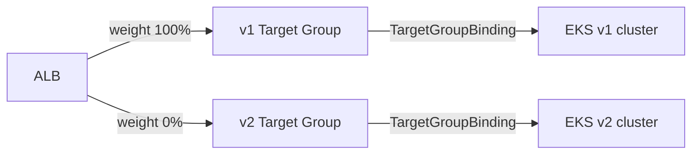

# AWS Load Balancer Controller

Kubernetes의 `type: LoadBalancer` Service는 실제 로드밸런서 생성을 Cloud Controller Manager(CCM)에 위임합니다. AWS CCM은 Classic Load Balancer(CLB)를 생성하는데, CLB는 HTTP/2와 gRPC를 지원하지 않고 Pod IP를 타겟으로 직접 등록할 수 없습니다.

AWS Load Balancer Controller(LBC)는 NLB와 ALB를 관리하는 Kubernetes 컨트롤러입니다. Service와 Ingress 리소스를 감시해 대응하는 로드밸런서를 프로비저닝하고, VPC CNI와 통합해 Pod IP를 타겟으로 직접 등록합니다. v2.7부터 Gateway API도 지원하며, GatewayClass, Gateway, Route 세 계층으로 역할을 분리해 ALB/NLB를 관리합니다.


*[Source: Route internet traffic with AWS Load Balancer Controller](https://docs.aws.amazon.com/eks/latest/userguide/aws-load-balancer-controller.html)*

---

## Target type

로드밸런서는 타겟 그룹에 등록된 대상으로 트래픽을 분배합니다. EKS에서는 타겟 그룹에 무엇을 등록하느냐에 따라 트래픽 경로가 달라집니다.

| 항목 | Instance | IP |
|---|---|---|
| 요구사항 | AWS LBC | AWS LBC + VPC CNI |
| 타겟 | EC2 노드 IP + NodePort | Pod IP |
| 트래픽 경로 | LB → NodePort → iptables → Pod | LB → Pod |
| 헬스체크 대상 | 노드 | Pod |

=== "Instance"

    NLB/ALB가 EC2 인스턴스를 타겟으로 등록합니다. 로드밸런서는 Pod의 존재를 알지 못해 트래픽은 NodePort를 거쳐 iptables가 Pod로 DNAT합니다.

    ```mermaid
    graph LR
        LB[LB] --> |"① NodePort"| Node[EC2 Node]
        Node --> |"② iptables DNAT"| Pod[Pod]
    ```

    LB는 노드 단위로 균등 분배하지만 iptables는 전체 Pod 중 무작위 선택하므로 Pod당 수신량이 달라집니다. 선택된 Pod가 다른 AZ에 있으면 Cross-AZ 트래픽과 데이터 전송 비용이 추가됩니다. 헬스체크가 노드 단위로 수행되어 노드가 살아있으면 Pod가 비정상이어도 healthy로 판단합니다.

=== "IP"

    VPC CNI가 Pod에 VPC IP를 직접 부여하므로, LBC가 Pod IP를 타겟으로 등록해 로드밸런서가 Pod까지 바로 트래픽을 전달합니다.

    ```mermaid
    graph LR
        LB[LB] --> |"① Direct"| Pod[Pod IP\nVPC ENI]
    ```

    - LB가 Pod를 직접 인식해 Pod 단위로 균등 분배합니다.
    - NodePort와 iptables DNAT 없이 단일 홉으로 전달합니다.
    - 헬스체크가 Pod에 직접 도달해 Pod 상태를 즉시 반영합니다.

    !!! warning "Third-party CNI Limitation"
        Calico 등 서드파티 CNI를 사용하는 환경에서는 Pod IP가 VPC 주소 공간 밖에 있어 직접 등록할 수 없으므로 Instance target type만 사용할 수 있습니다.

---

## Installing AWS LBC via IRSA

LBC는 AWS API(ELB, EC2, WAF 등)를 직접 호출하므로 IAM 권한이 필요합니다. 이 권한을 노드 IAM Role에 부여하면 같은 노드의 모든 Pod가 해당 권한을 상속받는 문제가 생깁니다. IRSA(IAM Roles for Service Accounts)는 OIDC Federation을 통해 특정 Kubernetes ServiceAccount에만 IAM Role을 바인딩합니다.

???+ info "How IRSA works"
    ```mermaid
    sequenceDiagram
        participant Pod as LBC Pod
        participant K8s as Kubernetes
        participant STS as AWS STS
        participant ELB as ELB/EC2 API

        K8s->>Pod: OIDC 서명 JWT 주입 (시작 시 projected volume 마운트)
        Note over Pod: AWS SDK가 AWS_WEB_IDENTITY_TOKEN_FILE 환경변수로 JWT 파일 읽기
        Pod->>STS: AssumeRoleWithWebIdentity (JWT 전달)
        STS-->>Pod: 단기 자격증명 발급 (15분~12시간)
        Pod->>ELB: API 호출 (단기 자격증명 사용)
    ```

    LBC IAM Policy는 로드밸런서 관리에 필요한 권한만 포함하므로, 같은 노드의 다른 Pod은 이 Role의 권한을 사용할 수 없습니다.

```bash hl_lines="22 23"
# 1. IAM Policy 생성
curl -o aws_lb_controller_policy.json \
  https://raw.githubusercontent.com/kubernetes-sigs/aws-load-balancer-controller/refs/heads/main/docs/install/iam_policy.json
aws iam create-policy \
  --policy-name AWSLoadBalancerControllerIAMPolicy \
  --policy-document file://aws_lb_controller_policy.json

# 2. IRSA 생성
eksctl create iamserviceaccount \
  --cluster=$CLUSTER_NAME \
  --namespace=kube-system \
  --name=aws-load-balancer-controller \
  --attach-policy-arn=arn:aws:iam::$ACCOUNT_ID:policy/AWSLoadBalancerControllerIAMPolicy \
  --override-existing-serviceaccounts --approve

# 3. Helm 설치
helm install aws-load-balancer-controller eks/aws-load-balancer-controller \
  -n kube-system \
  --set clusterName=$CLUSTER_NAME \
  --set serviceAccount.create=false \
  --set serviceAccount.name=aws-load-balancer-controller \
  --set region=ap-northeast-2 \
  --set vpcId=$VPC_ID
```

`region`과 `vpcId`를 명시하지 않으면 LBC가 시작 시 EC2 IMDS에서 자동으로 조회합니다. IMDSv2는 PUT 응답의 Hop Limit을 기본 **1**로 설정하는데, 컨테이너에서 IMDS에 접근하면 패킷이 노드 OS → veth를 통과하며 TTL이 소비되어 응답이 컨테이너까지 도달하지 못합니다. 결과적으로 `failed to get VPC ID from instance metadata` 오류와 함께 CrashLoopBackOff가 발생합니다. Launch Template에서 `HttpPutResponseHopLimit`을 2로 올리는 방법도 있지만, 위처럼 명시 지정하는 것이 더 간단합니다.

---

## NLB

NLB는 TCP/UDP 워크로드에 적합한 L4 로드밸런서입니다. IP가 고정되어 있어 DNS를 사용하지 못하는 클라이언트 환경에서도 사용할 수 있고, IP target type을 사용하면 클라이언트 Source IP가 Pod까지 그대로 전달됩니다.

```yaml
# echo-service-nlb.yaml (핵심 annotations)
apiVersion: v1
kind: Service
metadata:
  name: svc-nlb-ip-type
  annotations:
    service.beta.kubernetes.io/aws-load-balancer-type: external        # AWS LBC가 처리하도록 지정
    service.beta.kubernetes.io/aws-load-balancer-nlb-target-type: ip
    service.beta.kubernetes.io/aws-load-balancer-scheme: internet-facing
    service.beta.kubernetes.io/aws-load-balancer-cross-zone-load-balancing-enabled: "true"
    service.beta.kubernetes.io/aws-load-balancer-target-group-attributes: deregistration_delay.timeout_seconds=60
spec:
  allocateLoadBalancerNodePorts: false   # K8s 1.24+: 불필요한 NodePort 차단
  type: LoadBalancer
```

IP target type에서는 NLB → Pod IP 직접 경로를 사용하므로 NodePort가 필요하지 않습니다. `allocateLoadBalancerNodePorts: false`를 설정하지 않으면 Kubernetes가 30000–32767 범위의 NodePort를 자동으로 할당해 사용되지 않는 포트가 열리고 공격 표면이 넓어집니다.

### Pod Lifecycle

IP target type을 사용하는 NLB에서는 Pod의 등록과 해제 타이밍이 가용성에 직접 영향을 미칩니다.

**Pod 시작**: Pod가 `Running` 상태가 되어도 NLB 타겟 등록과 헬스체크 통과까지 수 초에서 수십 초가 걸립니다. Rolling Update 중 이 구간에 이전 Pod이 종료되면 아직 healthy 상태가 아닌 새 Pod로 트래픽이 유입되어 502 에러가 발생합니다. [Pod Readiness Gate](#pod-readiness-gate)는 LBC가 타겟이 healthy 상태임을 확인한 뒤에야 Pod를 `Ready`로 전환해 이 문제를 해소합니다.

**Pod 종료**: NLB의 Target Deregistration Delay 기본값은 **300초**입니다. Pod이 종료될 때 Kubernetes는 Deregistration을 트리거하는 동시에 `terminationGracePeriodSeconds` 카운트다운(기본 30초)을 시작합니다. Pod는 30초 후 SIGKILL로 강제 종료되는데, NLB는 그로부터 270초가 더 지나야 드레이닝이 완료됩니다.

```
t=0s   Pod 종료 시작 (SIGTERM 전송, NLB Deregistration 시작)
t=30s  Pod 강제 종료 (SIGKILL) — grace period 만료
t=300s NLB Deregistration 완료 — 이 270초 동안 연결이 이미 죽은 Pod로 전달됨
```

annotation의 `deregistration_delay.timeout_seconds=60`으로 줄이면 grace period 이후 남은 연결 전달 창을 30초로 줄일 수 있습니다. Long-lived connection(WebSocket, gRPC streaming)이 있다면 300초를 유지해야 기존 연결이 안전하게 완료됩니다.

---

## Pod Readiness Gate

Namespace에 `eks.amazonaws.com/pod-readiness-gate-inject: enabled` 레이블을 설정하면 LBC admission webhook이 새로 생성되는 Pod에 `target.elbv2.k8s.aws/pod-readiness-gate-0` 조건을 주입합니다. LBC가 해당 타겟이 로드밸런서에서 healthy 상태임을 확인해야만 이 조건을 `True`로 업데이트하고, Pod가 `Ready`로 전환됩니다. NLB와 ALB 모두 IP target type에서 동작합니다.

```bash
kubectl label namespace <namespace> eks.amazonaws.com/pod-readiness-gate-inject=enabled

# 조건 확인 — True가 될 때까지 Pod는 Ready가 아님
kubectl get pod <pod-name> -o jsonpath='{range .status.conditions[*]}{.type}: {.status}{"\n"}{end}'
# target.elbv2.k8s.aws/pod-readiness-gate-0: False  ← 타겟 등록 대기 중
```

---

## ALB

HTTP/HTTPS 워크로드는 ALB를 사용합니다. ALB는 경로 기반 라우팅, SSL 종료, WAF 연동을 지원합니다. [VPC CNI](./1_vpc-cni.md) 환경에서는 Pod IP를 직접 타겟으로 등록하는 IP target type을 사용합니다.

```yaml
apiVersion: networking.k8s.io/v1
kind: Ingress
metadata:
  annotations:
    alb.ingress.kubernetes.io/scheme: internet-facing
    alb.ingress.kubernetes.io/target-type: ip
spec:
  ingressClassName: alb
```

```bash
# ALB가 Pod IP를 직접 타겟으로 등록했는지 확인
kubectl get targetgroupbindings -n <namsespace>
```

표준 Kubernetes Ingress 리소스는 ALB의 라이프사이클과 결합되어 있습니다. Ingress를 삭제하면 ALB도 삭제됩니다. EKS 클러스터 Blue/Green 업그레이드 시, 두 클러스터가 같은 ALB를 공유해야 한다면 이 결합이 문제가 됩니다.

`TargetGroupBinding`은 이 결합을 분리합니다. ALB와 Target Group을 Kubernetes 외부(Terraform 등)에서 관리하고, `TargetGroupBinding`으로 특정 Target Group ARN과 Kubernetes Service를 연결합니다. 클러스터가 삭제되어도 ALB는 유지됩니다.



ALB Listener의 Target Group Weight를 조정해 트래픽을 점진적으로 이전하면 무중단 클러스터 업그레이드가 가능합니다.

| 단계 | v1 TG | v2 TG |
|------|:---:|:---:|
| 평상시 | 100% | 0% |
| v2 검증 중 | 50% | 50% |
| 업그레이드 완료 | 0% | 100% |

NLB를 사용하는 경우 LBC v2.10+의 `multiClusterTargetGroup: true` 옵션으로 여러 클러스터의 Pod를 하나의 NLB 타겟 그룹에 동시에 등록할 수 있습니다. ALB의 weighted listener처럼 비율을 조정하는 것은 아니고, 두 클러스터의 Pod가 동일한 타겟 그룹에 함께 등록되어 NLB가 모든 Pod에 균등 분배합니다. 각 클러스터는 ConfigMap으로 자신의 타겟만 독립적으로 관리하므로, 한 클러스터를 삭제해도 다른 클러스터의 타겟은 영향을 받지 않습니다.[^multi-cluster]

[^multi-cluster]: [Building Resilient Multi-cluster Applications with Amazon EKS](https://aws.amazon.com/blogs/networking-and-content-delivery/building-resilient-multi-cluster-applications-with-amazon-eks/)

```yaml
apiVersion: elbv2.k8s.aws/v1beta1
kind: TargetGroupBinding
metadata:
  name: my-tgb
spec:
  serviceRef:
    name: my-service
    port: 80
  targetGroupARN: arn:aws:elasticloadbalancing:ap-northeast-2:123456789012:targetgroup/my-tg/abc123
  multiClusterTargetGroup: true
```

---

## ExternalDNS

LBC가 ALB/NLB를 생성하면 AWS는 `xxxx.elb.amazonaws.com` 형태의 hostname을 부여합니다. ExternalDNS는 이 hostname을 감지해 Route 53에 A 레코드를 자동으로 생성, 삭제합니다. Service나 Ingress에 도메인만 지정하면 DNS 레코드 관리가 자동화됩니다.

A 레코드를 생성할 때, ExternalDNS는 TXT 레코드도 함께 만듭니다. TXT 레코드는 레코드의 소유자가 누구인지를 기록하며, ExternalDNS는 재시작 시 TXT 레코드의 `owner` 필드를 확인해 자신이 소유한 레코드만 업데이트, 삭제합니다.

```text
"heritage=external-dns,external-dns/owner=myeks-cluster,external-dns/resource=service/default/tetris"
```

!!! warning
    `txtOwnerId` 기본값은 `default`입니다. 여러 클러스터가 같은 기본값을 사용하면:

    - 클러스터 A가 `api.example.com` A 레코드를 만들고 TXT에 `owner=default` 기록
    - 클러스터 B의 ExternalDNS가 재시작되면 `owner=default` TXT를 자신의 것으로 인식
    - 클러스터 B에 `api.example.com` 서비스가 없으면 해당 레코드를 **삭제**

    따라서 클러스터마다 고유한 `txtOwnerId`(예: 클러스터 이름)를 반드시 지정해야 합니다.

### IAM Permissions

ExternalDNS는 Route 53 레코드를 생성, 수정, 삭제하므로 IAM 권한이 필요합니다. LBC 설치에서 사용한 것과 동일한 IRSA 패턴으로 `external-dns` ServiceAccount에만 권한을 부여합니다.

```bash
# IAM Policy 생성 후 IRSA로 external-dns ServiceAccount에 연결
aws iam create-policy \
  --policy-name ExternalDNSPolicy \
  --policy-document '{
    "Version": "2012-10-17",
    "Statement": [
      {
        "Effect": "Allow",
        "Action": ["route53:ChangeResourceRecordSets"],
        "Resource": ["arn:aws:route53:::hostedzone/*"]
      },
      {
        "Effect": "Allow",
        "Action": ["route53:ListHostedZones", "route53:ListResourceRecordSets", "route53:ListTagsForResource"],
        "Resource": ["*"]
      }
    ]
  }'

eksctl create iamserviceaccount \
  --name external-dns \
  --namespace default \
  --cluster $CLUSTER_NAME \
  --attach-policy-arn arn:aws:iam::$ACCOUNT_ID:policy/ExternalDNSPolicy \
  --approve
```

### Configuration

```yaml
# external-dns-values.yaml
provider: aws
serviceAccount:
  create: false
  name: external-dns
domainFilters:
  - example.com        # 특정 도메인만 관리 (보안 권장)
policy: upsert-only    # 레코드 추가/업데이트만, 삭제 안 함
sources:
  - service
  - ingress
txtOwnerId: "myeks-cluster"
```

!!! warning
    `policy: sync`로 설정하면 Kubernetes 리소스 삭제 시 Route 53 레코드도 함께 삭제합니다. `helm rollback` 같은 작업으로 ExternalDNS가 재시작될 때 이전 values의 `sources`가 비어 있으면 관리 중인 레코드를 일괄 삭제합니다. 신규 클러스터에서는 `upsert-only`로 시작하고, 운영 자동화가 검증된 이후 `sync`로 전환하는 것을 권장합니다.

!!! tip
    `domainFilters`를 지정하지 않으면 계정의 모든 Hosted Zone을 관리할 수 있습니다. 멀티 팀 환경에서 팀별로 도메인을 분리하고 각 ExternalDNS 인스턴스가 담당 도메인만 관리하도록 구성하면 안전합니다.

---

## Gateway API

Ingress는 경로 기반 라우팅과 SSL 종료 같은 고급 기능을 구현체별 어노테이션으로 표현합니다. 어노테이션 키 이름이 구현체마다 달라 이식성이 없고, 인프라 팀과 애플리케이션 개발자가 같은 Ingress 리소스를 공유해 권한 분리가 어렵습니다. 크로스 네임스페이스 라우팅과 가중치 기반 트래픽 분배도 어노테이션 워크어라운드로만 가능합니다.

Gateway API는 이 한계를 해소하는 Kubernetes 표준 사양입니다. LBC v2.7부터 GA 지원이 추가되어 세 계층의 리소스로 ALB/NLB를 관리하며, 각 계층은 역할에 따라 담당자가 분리됩니다.

`GatewayClass`
:   플랫폼 팀이 관리. 어떤 컨트롤러가 Gateway를 프로비저닝할지 지정.

`Gateway`
:   클러스터 운영자가 관리. ALB 또는 NLB 인스턴스와 수신 포트를 선언.

`HTTPRoute / TCPRoute`
:   애플리케이션 개발자가 관리. 경로 규칙과 백엔드 Service를 정의.

=== "GatewayClass"

    ```yaml
    apiVersion: gateway.networking.k8s.io/v1
    kind: GatewayClass
    metadata:
      name: eks-alb
    spec:
      controllerName: eks.amazonaws.com/alb
    ```

=== "Gateway"

    ```yaml
    apiVersion: gateway.networking.k8s.io/v1
    kind: Gateway
    metadata:
      name: my-gateway
      namespace: infra
      annotations:
        alb.ingress.kubernetes.io/scheme: internet-facing
        alb.ingress.kubernetes.io/target-type: ip
    spec:
      gatewayClassName: eks-alb
      listeners:
        - name: http
          port: 80
          protocol: HTTP
    ```

=== "HTTPRoute"

    ```yaml
    apiVersion: gateway.networking.k8s.io/v1
    kind: HTTPRoute
    metadata:
      name: my-route
      namespace: app
    spec:
      parentRefs:
        - name: my-gateway
          namespace: infra
      rules:
        - matches:
            - path:
                type: PathPrefix
                value: /api
          backendRefs:
            - name: my-service
              port: 80
    ```

L7 Route(HTTPRoute, GRPCRoute)는 ALB로, L4 Route(TCPRoute, UDPRoute)는 NLB로 프로비저닝됩니다. HTTPRoute가 네임스페이스를 넘어 Gateway를 참조할 수 있어 크로스 네임스페이스 라우팅이 어노테이션 없이 가능합니다.[^gateway-api]

[^gateway-api]: [Kubernetes Gateway API with AWS Load Balancer Controller](https://aws.amazon.com/blogs/containers/kubernetes-gateway-api-with-aws-load-balancer-controller/)
