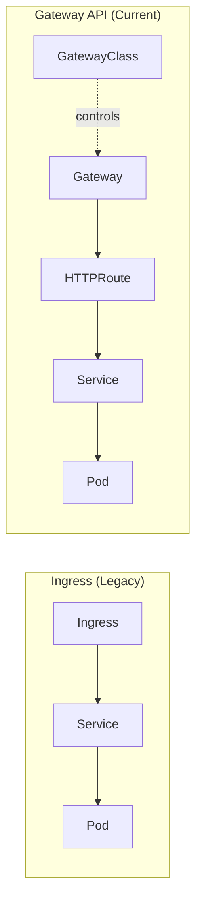
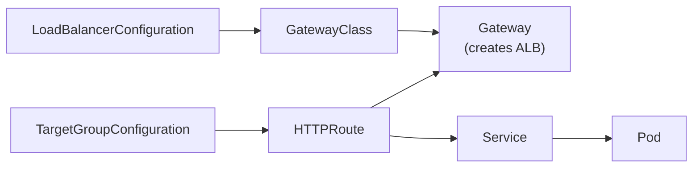

# Gateway API & ExternalDNS

---

## Gateway API

Gateway API는 Ingress의 후계자입니다. GatewayClass → Gateway → HTTPRoute/TCPRoute 계층 구조로
트래픽 라우팅을 선언합니다. AWS LBC v3.1.0부터 GA 지원합니다.

### Ingress vs Gateway API

Kubernetes Ingress는 2015년에 설계되어 몇 가지 구조적 한계가 누적되었습니다. 하나의 Ingress 오브젝트에 여러 팀의 규칙이 혼재해 팀 A의 변경이 팀 B의 트래픽에 영향을 줄 수 있고, 인프라 팀(로드밸런서 타입, TLS 설정)과 애플리케이션 팀(경로 라우팅)의 관심사가 한 리소스에 뒤섞입니다. 벤더 확장 기능은 모두 annotation으로 표현되어 AWS, GCP, Nginx, Istio 등 구현체마다 독자적인 annotation이 쌓이면 이식성이 없고 가독성이 떨어집니다.

Gateway API는 역할별로 리소스를 분리해 이 문제를 해결합니다.

| 리소스 | 담당자 | 역할 |
|--------|--------|------|
| `GatewayClass` | 인프라 관리자 | 컨트롤러 구현체 및 기본 설정 선언 |
| `Gateway` | 플랫폼 팀 | 로드밸런서 생성, 리스너 포트 정의 |
| `HTTPRoute` | 애플리케이션 팀 | 도메인, 경로, 백엔드 서비스 연결 |

Ingress의 `ingressClassName`은 단순히 "어떤 컨트롤러가 이 Ingress를 처리할지" 지정하는 문자열로, 컨트롤러 레벨의 설정을 함께 묶을 방법이 없습니다. `GatewayClass`는 컨트롤러와 그 설정을 묶은 클러스터 범위 리소스입니다.

```yaml
# 인프라 팀이 관리: ALB internet-facing 클래스 정의
apiVersion: gateway.networking.k8s.io/v1
kind: GatewayClass
metadata:
  name: aws-alb-internet
spec:
  controllerName: gateway.k8s.aws/alb
  parametersRef:
    group: gateway.k8s.aws
    kind: LoadBalancerConfiguration
    name: internet-facing-config   # scheme, tags, security groups 등
```

```yaml
# 애플리케이션 팀이 사용: GatewayClass만 지정하면 ALB가 자동 생성
apiVersion: gateway.networking.k8s.io/v1
kind: Gateway
metadata:
  name: my-gateway
spec:
  gatewayClassName: aws-alb-internet   # 인프라 팀의 설정 상속
  listeners:
    - name: http
      port: 80
      protocol: HTTP
```

애플리케이션 팀은 VPC, 서브넷, 보안 그룹 같은 인프라 세부 사항을 알 필요 없이 `GatewayClass`만 지정하면 됩니다.



### 리소스 구조



### 설치 및 활성화

```bash
# 1. Gateway API CRD 설치
kubectl apply -f https://github.com/kubernetes-sigs/gateway-api/releases/download/v1.3.0/standard-install.yaml
kubectl apply -f https://github.com/kubernetes-sigs/gateway-api/releases/download/v1.3.0/experimental-install.yaml

# 2. LBC feature gate 활성화
kubectl edit deploy -n kube-system aws-load-balancer-controller
# args에 추가:
# --feature-gates=NLBGatewayAPI=true,ALBGatewayAPI=true

# 3. LBC Gateway API CRD 설치
kubectl apply -f https://raw.githubusercontent.com/kubernetes-sigs/aws-load-balancer-controller/refs/heads/main/config/crd/gateway/gateway-crds.yaml
```

### ALB + HTTPRoute 실습

```bash
# LoadBalancerConfiguration (internet-facing 설정)
kubectl apply -f lbc-config.yaml

# GatewayClass (ALB 컨트롤러 연결)
kubectl apply -f gatewayclass-alb.yaml

# Gateway (HTTP:80 → ALB 생성)
kubectl apply -f gateway-alb-http.yaml

# TargetGroupConfiguration (IP 모드 Target Group)
kubectl apply -f tg-config.yaml

# HTTPRoute (도메인 + 백엔드 서비스 연결)
kubectl apply -f httproute.yaml
```

```bash
# GatewayClass 상태 확인
kubectl get gatewayclasses -o wide
# aws-alb   gateway.k8s.aws/alb   True

# Gateway 상태 및 ALB 주소 확인
kubectl get gateways
# alb-http  aws-alb  k8s-default-albhttp-xxx.elb.amazonaws.com  True
```

???+ info "ExternalDNS + Gateway API 연동"
    `external-dns-values.yaml`의 `sources`에 아래 항목 추가 후 `helm upgrade` 적용:

    ```yaml
    sources:
      - service
      - ingress
      - gateway-httproute
      - gateway-grpcroute
      - gateway-tlsroute
      - gateway-tcproute
      - gateway-udproute
    ```

---

## ExternalDNS

Kubernetes Service/Ingress/Gateway API 리소스 생성 시 도메인을 지정하면
AWS Route 53에 A 레코드와 TXT 레코드를 자동으로 생성/삭제합니다.

ExternalDNS는 A 레코드(또는 CNAME)를 생성할 때 동시에 TXT 레코드도 생성합니다. TXT 레코드는 "이 DNS 레코드는 ExternalDNS가 관리하며, 소유자는 누구다"라는 메타데이터 역할을 합니다. ExternalDNS는 다음 실행 시 TXT 레코드의 `owner` 필드를 확인해 자신이 소유한 레코드만 업데이트/삭제하고, 다른 소유자의 레코드나 수동으로 생성된 레코드는 건드리지 않습니다.

```
"heritage=external-dns,external-dns/owner=myeks-cluster,external-dns/resource=service/default/tetris"
```

멀티 클러스터 환경에서 `txtOwnerId`가 서로 다르면 두 클러스터의 ExternalDNS가 충돌 없이 각자의 레코드를 독립적으로 관리합니다.

```
Route 53 hosted zone: example.com
├── tetris.example.com  A  → ELB-A  (owner: cluster-prod)
└── tetris.example.com  A  → ELB-B  (owner: cluster-staging)
```

!!! warning "`txtOwnerId` 미설정 시 멀티 클러스터 충돌"
    `txtOwnerId`의 기본값은 `default`입니다. 여러 클러스터에서 동일한 기본값을 사용하면:

    - 클러스터 A가 `api.example.com` A 레코드를 만들고 TXT에 `owner=default` 기록
    - 클러스터 B의 ExternalDNS가 재시작되면 `owner=default` TXT를 자신의 것으로 인식
    - 클러스터 B에 `api.example.com` 서비스가 없으면 해당 레코드를 **삭제**

    결과: 프로덕션 DNS 레코드가 다른 클러스터에 의해 예고 없이 삭제됩니다.
    클러스터마다 고유한 `txtOwnerId`(예: 클러스터 이름)를 반드시 지정하세요.

### Helm 설치

ExternalDNS는 Route 53에서 레코드를 생성/수정/삭제하므로 IAM 권한이 필요합니다. 이 권한을 노드 IAM Role에 부여하면 같은 노드의 모든 Pod가 Route 53을 수정할 수 있게 되어 IRSA를 사용합니다. `external-dns` ServiceAccount를 사용하는 Pod만 해당 권한을 가지며, `domainFilters`로 특정 도메인 범위로 권한을 더 좁힐 수 있습니다.

```bash
# IRSA 구성 후 설치
helm install external-dns external-dns/external-dns \
  -n kube-system -f external-dns-values.yaml
```

### external-dns-values.yaml 핵심 설정

```yaml
provider: aws
serviceAccount:
  create: false
  name: external-dns
domainFilters:
  - example.com          # 특정 도메인만 관리 (보안 권장)
policy: sync             # 리소스 삭제 시 Route53 레코드도 삭제
sources:
  - service
  - ingress
txtOwnerId: "myeks-cluster"   # 멀티 클러스터 충돌 방지
```

### 도메인 연결 및 확인

```bash
# Service에 도메인 연결
kubectl annotate service tetris \
  "external-dns.alpha.kubernetes.io/hostname=tetris.$MyDomain"

# Route53 A 레코드 확인
aws route53 list-resource-record-sets \
  --hosted-zone-id "${MyDnzHostedZoneId}" \
  --query "ResourceRecordSets[?Type == 'A']" | jq
```

!!! warning "policy: sync 주의"
    `policy: sync`는 Kubernetes 리소스 삭제 시 Route 53 레코드도 함께 삭제합니다.

    프로덕션에서 `helm rollback` 같은 작업으로 ExternalDNS가 재시작되면, 이전 values의 `sources` 목록이 비어 있을 경우 관리 대상 레코드를 모두 삭제해야 할 것으로 판단해 Route 53 레코드를 일괄 삭제하는 인시던트가 발생할 수 있습니다. `policy: upsert-only`는 레코드를 추가/업데이트만 하고 절대 삭제하지 않아 이런 실수를 방지합니다. 레코드 정리가 필요하면 수동으로 수행해야 하지만 대규모 DNS 장애를 막는 안전장치가 됩니다.

    신규 클러스터에서는 `upsert-only`로 시작하고, 운영 자동화가 충분히 검증된 이후 `sync`로 전환하는 것을 권장합니다.

!!! tip "domainFilters로 보안 범위 제한"
    `domainFilters`를 지정하지 않으면 ExternalDNS는 계정의 **모든 Hosted Zone**을 관리할 수 있습니다.
    `domainFilters: [example.com]`을 설정하면 해당 도메인 범위 밖의 레코드는 건드리지 않습니다.
    멀티 팀 환경에서 팀별로 도메인을 분리하고 각 ExternalDNS 인스턴스가 담당 도메인만 관리하도록 구성하면 안전합니다.
