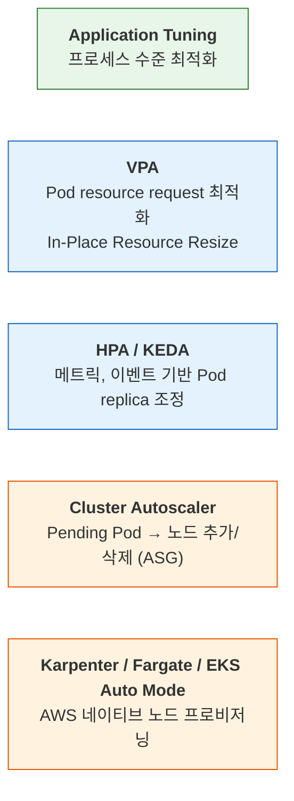
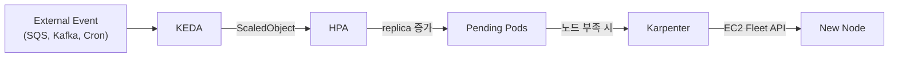

> Cloudnet@EKS Week3

# Scaling Overview

오토스케일링 없이 운영하면 관리자가 직접 리소스 사용량을 추적하고, 트래픽 급증 전에 노드를 미리 확보해야 합니다. 유휴 용량에 비용을 낭비하거나, 수요 급증 시 용량 부족으로 장애가 발생하는 양극단 사이에서 줄타기를 하게 됩니다. Kubernetes와 EKS는 서로 다른 계층에서 이런 판단을 자동화하는 스케일링 메커니즘을 제공합니다.

---

## Scaling Layers

애플리케이션 튜닝부터 인프라 수준까지, 스케일링은 여러 계층에 걸쳐 동작합니다. 각 계층은 독립적으로 적용할 수 있으며, 상위로 갈수록 애플리케이션에 가깝고 하위로 갈수록 인프라에 가깝습니다.

1. **Application Tuning** — 프로세스 수준 최적화 (스레드 풀, 커넥션 풀, JVM 힙 등)
2. **VPA(Vertical Pod Autoscaler)** — Pod의 resource request를 실사용량에 맞게 최적화합니다. Kubernetes 1.33부터 In-Place Pod Resource Resize를 통해 Pod 재시작 없이 리소스를 조정할 수 있습니다.
3. **HPA(Horizontal Pod Autoscaler)** — CPU, 메모리, 사용자 정의 메트릭을 기반으로 Pod replica 수를 조정합니다. 트래픽을 여러 Pod에 분산하기 위해 Service나 Ingress를 통한 로드밸런싱이 필요합니다. KEDA(Kubernetes Event-Driven Autoscaling)는 SQS 큐 길이 같은 외부 이벤트를 트리거로 활용합니다.
4. **CA/CAS(Cluster Autoscaler)** — Pending 상태 Pod가 발생하면 노드를 동적으로 추가하고, 유휴 노드를 제거합니다. AWS에서는 ASG(Auto Scaling Group)를 통해 EC2 인스턴스를 관리합니다.
5. **Karpenter, Fargate, EKS Auto Mode** — AWS가 제공하는 노드 수준 스케일링입니다. Karpenter는 Unschedulable Pod를 감지해 최적 인스턴스를 즉시 프로비저닝하고, Fargate는 서버리스로 Pod를 실행하며, EKS Auto Mode는 노드 관리를 완전히 위임합니다.

---

## Scaling Strategy Decision Framework

스케일링 속도를 최적화하기 전에 먼저 질문해야 합니다: "이 워크로드가 정말 초고속 반응형 스케일링이 필요한가?" 대부분의 워크로드는 예측 가능한 패턴을 따르며, 복잡한 반응형 파이프라인보다 단순한 접근이 비용과 운영 복잡도 모두에서 유리합니다.

| Approach | Core Strategy | E2E Scaling Time | Monthly Extra Cost (28 clusters) | Complexity | Fit |
|---|---|---|---|---|---|
| 1. Reactive high-speed | Karpenter + KEDA + Warm Pool | 5-45s | $40K-190K | Very high | Mission-critical few |
| 2. Predictive scaling | CronHPA + Predictive Scaling | Pre-expanded (0s) | $2K-5K | Low | Pattern-based majority |
| 3. Architecture resilience | SQS/Kafka + Circuit Breaker | Tolerates delay | $1K-3K | Medium | Async-capable |
| 4. Right-sized baseline | Base replica +20-30% | Unnecessary | $5K-15K | Very low | Stable traffic |

!!! tip "Cost-effective scaling for most workloads"
    대부분의 워크로드에서는 접근법 2-4가 더 비용 효율적입니다. 반응형 고속 스케일링(접근법 1)은 레이턴시 SLA가 엄격한 소수 워크로드에만 적용하고, 나머지는 예측 기반 스케일링이나 아키텍처 수준 내결함성으로 충분합니다.

---

## Horizontal vs Vertical Scaling

Horizontal Scaling
:   더 많은 워크로드(Pod)를 추가해 부하를 분산합니다. Stateless 워크로드에 적합하며, 이론적으로 무한 확장이 가능합니다. 트래픽을 고르게 분산하기 위해 로드밸런서가 필요합니다.

Vertical Scaling
:   기존 워크로드의 CPU, Memory 등 리소스를 늘려 처리 능력을 향상합니다. 하드웨어 한계(인스턴스 타입 최대 사양)가 존재하며, 리소스 변경 시 Pod 재시작이 필요할 수 있습니다. Stateful 워크로드나 단일 프로세스 성능이 중요한 경우에 적합합니다.

---

## AWS Auto Scaling Policies

AWS Auto Scaling은 반응형(Reactive)과 선제적(Proactive) 전략을 모두 지원합니다. EKS 노드 그룹이 ASG 기반으로 동작하므로, 이 정책들은 Cluster Autoscaler와 함께 노드 스케일링에 직접 영향을 줍니다.

Simple/Step Scaling (Manual Reactive)
:   CloudWatch 경보 임계값에 따라 고객이 정의한 단계별로 인스턴스를 추가하거나 제거합니다. 예를 들어 CPU 사용률 70% 초과 시 2대 추가, 90% 초과 시 5대 추가와 같이 구성합니다.

Target Tracking (Automated Reactive)
:   목표 메트릭 값(예: 평균 CPU 사용률 50%)을 지정하면, Auto Scaling이 해당 값을 유지하도록 인스턴스 수를 자동 조정합니다. 가장 설정이 간단한 반응형 정책입니다.

Scheduled Scaling (Manual Proactive)
:   고객이 정의한 일정에 따라 용량을 미리 조정합니다. 출퇴근 시간대나 이벤트 시작 전처럼 트래픽 패턴이 예측 가능할 때 유용합니다.

Predictive Scaling (Automated Proactive)
:   과거 14일간의 메트릭 트렌드를 분석해 향후 48시간의 트래픽을 예측하고, 수요 증가 전에 선제적으로 인스턴스를 확장합니다. 주기적 패턴이 있는 워크로드에 효과적입니다.

---

## EKS Auto Scaling Summary

EKS에서 사용하는 주요 오토스케일링 도구를 트리거, 동작, 대상 기준으로 비교합니다.

| | Trigger | Action | Target |
|---|---|---|---|
| **HPA** | Pod 메트릭 초과 | 신규 Pod Provisioning | Pod Scale Out |
| **VPA** | Pod 자원 부족 | Pod 교체(자동/수동) | Pod Scale Up |
| **CAS** | Pending Pod 존재 | 신규 노드 Provisioning | Node Scale Out |
| **Karpenter** | Unschedulable Pod 감지 | EC2 Fleet으로 노드 생성 | Node Scale Up/Out |

HPA와 VPA는 Pod 수준에서 동작하고, CAS와 Karpenter는 노드 수준에서 동작합니다. Pod 스케일링이 먼저 발생하고, 기존 노드에 스케줄링할 수 없을 때 노드 스케일링이 뒤따르는 구조입니다. [Week 1에서 다룬 데이터 플레인 컴퓨팅 옵션](../week1/2_data-plane.md)에 따라 사용 가능한 노드 스케일링 방식이 달라집니다.

---

## Metrics API

Kubernetes 오토스케일링은 메트릭 데이터를 기반으로 판단합니다. HPA가 스케일링 결정을 내리려면 API Server를 통해 메트릭을 조회해야 하며, 메트릭 종류에 따라 세 가지 API를 사용합니다.

Resource Metrics API (`metrics.k8s.io`)
:   Node와 Pod의 CPU, 메모리 사용량을 제공합니다. metrics-server가 kubelet의 cAdvisor에서 수집한 데이터를 이 API로 노출합니다. `kubectl top` 명령이 이 API를 사용합니다. EKS에서는 metrics-server를 EKS Add-on으로 설치할 수 있습니다.

Custom Metrics API (`custom.metrics.k8s.io`)
:   클러스터 내부에서 수집한 사용자 정의 메트릭을 제공합니다. Prometheus Adapter나 KEDA가 이 API를 구현하며, 애플리케이션별 메트릭(요청 처리량, 큐 크기 등)으로 HPA를 구동할 수 있습니다.

External Metrics API (`external.metrics.k8s.io`)
:   클러스터 외부에서 수집한 메트릭을 제공합니다. AWS CloudWatch 메트릭, SQS 큐 길이, DynamoDB 읽기 용량 등 AWS 서비스 메트릭을 기반으로 스케일링할 때 사용합니다. KEDA가 다양한 외부 소스에 대한 스케일러를 제공합니다.

---

## KEDA - Kubernetes Event-Driven Autoscaling

KEDA(Kubernetes Event-Driven Autoscaling)는 외부 이벤트 소스를 기반으로 Pod를 오토스케일링하는 경량 컴포넌트입니다. 기본 HPA가 지원하지 않는 다양한 이벤트 소스(SQS, Kafka, Cron, Prometheus 등)를 트리거로 활용할 수 있으며, 내부적으로 HPA를 생성해 동작합니다.

*[Source: AWS Solutions — Event-Driven Application Autoscaling with KEDA on Amazon EKS](https://aws.amazon.com/solutions/guidance/event-driven-application-autoscaling-with-keda-on-amazon-eks/)*

ScaledObject
:   KEDA의 핵심 CRD(Custom Resource Definition)로, 스케일링 대상 Deployment와 트리거를 정의합니다. 트리거에는 cron 스케줄, SQS 큐 길이, Prometheus 쿼리 결과 등을 지정할 수 있습니다. KEDA는 ScaledObject를 기반으로 HPA를 자동 생성하고 관리합니다.

Karpenter 통합
:   KEDA가 Pod 수를 늘리면 기존 노드에 스케줄링할 자원이 부족해질 수 있습니다. 이때 Karpenter가 Unschedulable Pod를 감지해 최적 인스턴스를 즉시 프로비저닝하므로, KEDA와 Karpenter를 함께 사용하면 이벤트 기반 Pod 스케일링과 노드 스케일링이 자연스럽게 연결됩니다.

스케일링 전략의 전체 구조에 대한 심화 내용은 AWS Prescriptive Guidance의 [Workload Scaling](https://docs.aws.amazon.com/prescriptive-guidance/latest/scaling-amazon-eks-infrastructure/workload-scaling.html)과 [Compute Scaling](https://docs.aws.amazon.com/prescriptive-guidance/latest/scaling-amazon-eks-infrastructure/compute-scaling.html)을 참고하세요.
