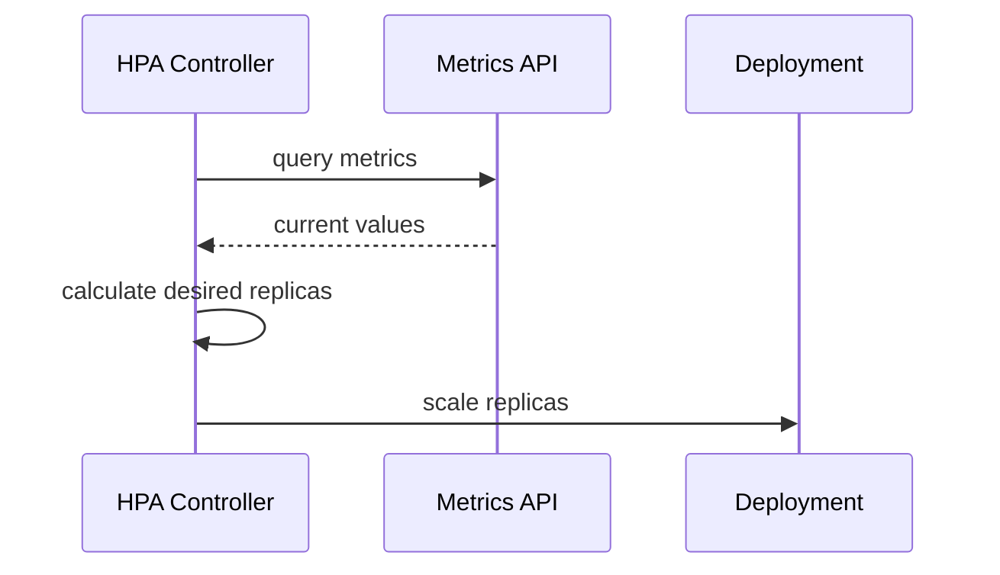

> Cloudnet@EKS Week3

# HPA & VPA

Pod 워크로드의 리소스 수요는 트래픽 패턴에 따라 달라집니다. Kubernetes는 이 변화에 대응하는 두 가지 오토스케일링 전략을 제공합니다. HPA(Horizontal Pod Autoscaler)는 replica 수를 늘려 부하를 분산하고, VPA(Vertical Pod Autoscaler)는 개별 Pod의 `resources.requests`를 실제 사용량에 맞게 조정합니다.

---

## HPA - Horizontal Pod Autoscaler

### How HPA Works

HPA는 Pod replica 수를 자동으로 조정하는 수평 스케일링 메커니즘입니다. `autoscaling/v2` API에서 `scaleTargetRef`로 대상 Deployment를 지정하고, `metrics` 배열에 스케일링 기준 메트릭을 정의합니다.

HPA Controller는 다음 알고리즘으로 필요한 replica 수를 계산합니다.

```
desiredReplicas = ceil[ currentReplicas × (currentMetricValue / desiredMetricValue) ]
```

`averageUtilization`을 기준으로 사용하면 각 Pod의 `resources.requests` 대비 실제 사용률을 측정합니다. 예를 들어 requests가 200m이고 현재 사용량이 150m이면 utilization은 75%입니다.



### Metric Types

HPA는 네 가지 메트릭 유형을 지원하며, 각각 다른 데이터 소스를 사용합니다.

=== "Resource"

    CPU, Memory 등 기본 리소스 메트릭입니다. metrics-server가 클러스터에 설치되어 있어야 합니다.

    ```yaml
    metrics:
    - type: Resource
      resource:
        name: cpu
        target:
          type: Utilization
          averageUtilization: 50
    ```

=== "Pods"

    `custom.metrics.k8s.io` API를 통해 제공되는 Pod 단위 커스텀 메트릭입니다. Prometheus Adapter 같은 어댑터가 필요합니다.

    ```yaml
    metrics:
    - type: Pods
      pods:
        metric:
          name: packets-per-second
        target:
          type: AverageValue
          averageValue: 1k
    ```

=== "Object"

    Ingress 같은 특정 Kubernetes 오브젝트에 연결된 메트릭입니다. 단일 오브젝트에서 하나의 메트릭 값을 가져옵니다.

    ```yaml
    metrics:
    - type: Object
      object:
        describedObject:
          apiVersion: networking.k8s.io/v1
          kind: Ingress
          name: main-route
        metric:
          name: requests-per-second
        target:
          type: Value
          value: 2k
    ```

=== "External"

    클러스터 외부 시스템의 메트릭입니다. SQS 큐의 `queue_messages_ready` 같은 AWS 서비스 메트릭을 기준으로 스케일링할 때 사용합니다.

    ```yaml
    metrics:
    - type: External
      external:
        metric:
          name: queue_messages_ready
          selector:
            matchLabels:
              queue: worker-tasks
        target:
          type: AverageValue
          averageValue: 30
    ```

### Scaling Behavior

HPA의 스케일링 속도는 stabilization window로 제어됩니다.

- **Scale up**: 기본 stabilization window가 0초이므로, 메트릭이 임계치를 넘으면 즉시 replica를 증가시킵니다.
- **Scale down**: 기본 stabilization window가 300초(5분)입니다.[^hpa-default] 일시적 부하 감소로 인한 불필요한 축소를 방지하기 위해, 5분간 가장 높은 추천값을 유지합니다.

[^hpa-default]: [HPA algorithm details](https://kubernetes.io/docs/tasks/run-application/horizontal-pod-autoscale/#algorithm-details) 참고.

- **여러 메트릭**: `metrics` 배열에 여러 메트릭을 지정하면, 각 메트릭별로 계산된 replica 수 중 가장 높은 값을 최종 replica 수로 채택합니다.

### Hands-on Summary

`php-apache` 기반 부하 테스트로 HPA 동작을 확인합니다. hpa-example 이미지는 요청마다 PHP에서 100만 번 덧셈 연산을 수행하여 인위적으로 CPU 과부하를 발생시킵니다.

```yaml
resources:
  requests:
    cpu: 200m
  limits:
    cpu: 500m
```

HPA는 `averageUtilization: 50%`, `minReplicas: 1`, `maxReplicas: 10`으로 설정합니다. 별도 curl Pod에서 `sleep 0.01` 간격으로 반복 호출하면, replica가 1 → 2 → 3 → 6 → 8로 단계적으로 증가합니다. 4나 5를 건너뛰는 이유는 HPA가 위 알고리즘 공식에 따라 `ceil(currentReplicas x currentMetric/targetMetric)`을 계산하기 때문에, 부하가 급격하면 한 번에 여러 단계를 건너뛸 수 있기 때문입니다. 부하를 중지하면 stabilization window(5분) 이후 점진적으로 감소합니다.

### Prometheus Metrics

Prometheus로 HPA 상태를 모니터링할 때 핵심 메트릭입니다.

**kube_horizontalpodautoscaler_status_desired_replicas**
:   HPA가 목표하는 replica 수

**kube_horizontalpodautoscaler_status_current_replicas**
:   현재 실행 중인 replica 수

**kube_horizontalpodautoscaler_spec_max_replicas**
:   최대 replica 수 설정값

Grafana 대시보드 [22128](https://grafana.com/grafana/dashboards/22128), [22251](https://grafana.com/grafana/dashboards/22251)에서 시각화할 수 있습니다.

### Pitfalls

!!! warning "HPA Operational Caveats"

    1. **평균의 함정**: 전체 평균 CPU가 임계치 이하라도 특정 Pod 하나가 CPU 100%에 도달하면 liveness probe가 실패하고 재시작됩니다. 해당 Pod의 트래픽이 나머지 Pod로 재분배되어 연쇄적으로 과부하가 퍼질 수 있습니다.

    2. **증설 시간**: HPA는 메트릭 수집 주기(기본 15초)마다 판단하고, 새 Pod가 Ready 상태가 될 때까지 추가 시간이 걸립니다. 급격한 트래픽 스파이크에는 HPA 단독으로 대응이 어려우므로, Over-Provisioning이나 KEDA를 함께 활용해야 합니다.

    3. **초기화 CPU 스파이크**: Pod 시작 시점에 CPU와 Memory가 급등하면 HPA가 불필요한 스케일 아웃을 트리거할 수 있습니다. Kube Startup CPU Boost는 InPlacePodVerticalScaling 기능을 활용하여 시작 시 일시적으로 높은 리소스를 부여한 뒤 자동으로 원래 값으로 되돌립니다.

---

## VPA - Vertical Pod Autoscaler

HPA가 Pod 수를 늘려 부하를 분산한다면, VPA는 개별 Pod의 리소스 할당량 자체를 최적화합니다. request가 과다하면 노드 낭비가, 과소하면 OOM Kill이나 CPU throttling이 발생하므로 적정값을 찾는 것이 중요합니다.

### How VPA Works

VPA는 Pod의 `resources.requests`를 실제 사용량 기반으로 최적값에 자동 수정합니다. 추천값은 기준값(최소 필요값)에 마진(버퍼)을 더하여 산출됩니다.

VPA가 추천값을 적용할 때는 기존 Pod를 종료하고 새 Pod를 생성합니다. Kubernetes가 현재 실행 중인 Pod의 `resources.requests`를 직접 변경하는 것을 지원하지 않기 때문에, Pod 재시작이 필수적입니다.

### VPA Components

VPA는 세 개의 컴포넌트가 협력하여 동작합니다.

**Recommender**
:   리소스 사용량 히스토리를 모니터링하고 추천값을 계산합니다. metrics-server 또는 Prometheus에서 데이터를 수집합니다.

**Updater**
:   추천값과 현재 Pod의 `resources.requests`를 비교하여 차이가 크면 해당 Pod를 eviction합니다.

**Admission Controller**
:   MutatingWebhook으로 등록되어, 새 Pod 생성 시 VPA 추천값을 `resources.requests`에 자동 적용합니다.

### updatePolicy

**`Auto`** (default)
:   VPA가 자동으로 Pod의 리소스를 변경합니다. Updater가 기존 Pod를 eviction하고, Admission Controller가 새 Pod에 추천값을 적용합니다.

**`Off`**
:   추천값만 제공하고 자동 변경은 수행하지 않습니다. 운영 환경에서 추천값을 먼저 확인한 뒤 수동으로 적용할 때 유용합니다.

### VPA + HPA Coexistence

> VPA와 HPA를 동일 메트릭(CPU 등)으로 동시에 사용하면 충돌합니다. VPA가 request를 높이면 HPA가 이를 사용률 감소로 해석하여 replica를 줄이고, 다시 사용률이 올라가는 진동이 발생합니다.

공존 전략은 메트릭을 분리하는 것입니다.

- **VPA는 memory**, **HPA는 CPU 또는 custom metric**으로 각각 다른 메트릭을 담당하도록 분리합니다.
- VPA `updateMode: Off`로 설정하여 추천값만 참고하고, 실제 스케일링은 HPA가 전담하게 합니다.

### KRR - Kubernetes Resource Recommender

KRR(Kubernetes Resource Recommender)은 Prometheus 데이터를 기반으로 리소스 추천값을 제공하는 CLI 도구입니다(robusta-dev/krr). VPA와 달리 클러스터 내 에이전트 설치가 불필요하고, 워크로드별 VPA 오브젝트를 생성할 필요도 없습니다.

```bash
krr simple --history_duration 720 --cpu_percentile 90 --memory_buffer_percentage 10
```

실행 즉시 전체 워크로드에 대한 추천 결과를 테이블 형태로 출력합니다.

### JVM Heap Size Mismatch

!!! warning "JVM applications with VPA"

    VPA가 `resources.limits.memory`를 증가시켜도, JVM의 `-Xmx`가 고정값으로 설정되어 있으면 추가 메모리를 활용하지 못합니다. JVM은 자체 힙 관리를 하므로, 컨테이너 메모리 제한과 JVM 힙 크기가 독립적으로 동작하기 때문입니다.

    `-XX:MaxRAMPercentage`를 사용하면 컨테이너 메모리 limits의 비율로 힙 크기를 동적 계산합니다. `resourceFieldRef`로 `limits.memory`를 환경변수로 주입하는 방식과 함께 사용할 수 있습니다.

    ```yaml
    env:
    - name: JAVA_OPTS
      value: "-XX:MaxRAMPercentage=75.0"
    ```

### Prometheus Metrics

**kube_customresource_vpa_containerrecommendations_target**
:   VPA가 산출한 컨테이너별 추천값(cpu, memory)

Grafana 대시보드 [14588](https://grafana.com/grafana/dashboards/14588)에서 VPA 추천값과 실제 사용량을 비교할 수 있습니다.
