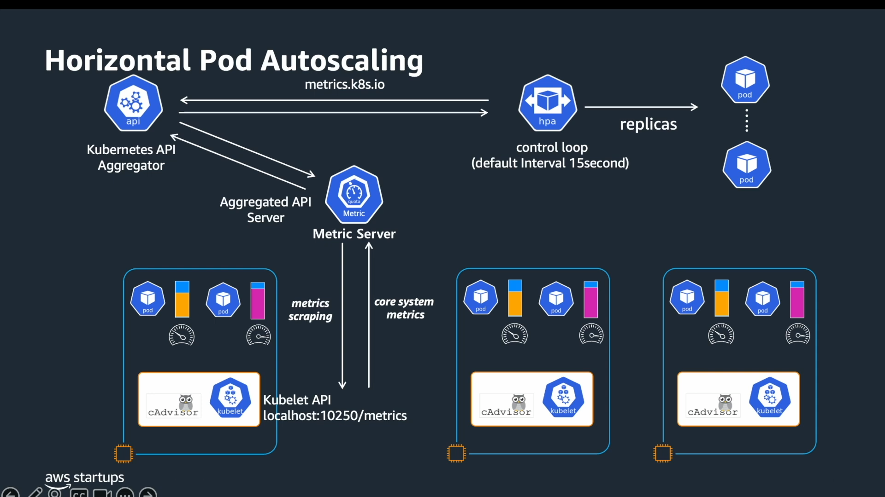
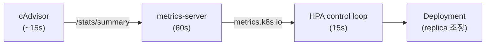
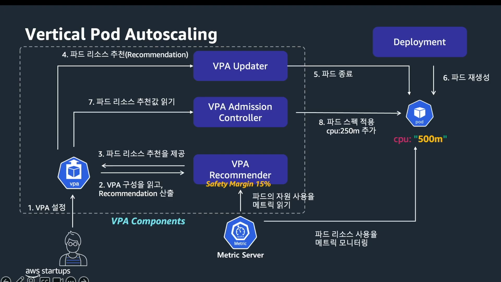

# Pod Autoscaling

Pod 워크로드의 리소스 수요는 트래픽 패턴에 따라 달라집니다. Kubernetes는 이 변화에 대응하는 세 가지 Pod 오토스케일링 전략을 제공합니다. HPA(Horizontal Pod Autoscaler)는 replica 수를 늘려 부하를 분산하고, VPA(Vertical Pod Autoscaler)는 개별 Pod의 `resources.requests`를 실제 사용량에 맞게 조정합니다. KEDA(Kubernetes Event-Driven Autoscaling)는 SQS, Kafka 같은 외부 이벤트를 트리거로 HPA를 확장합니다.

---

## Horizontal Pod Autoscaler

### How HPA Works

HPA는 Pod replica 수를 자동으로 조정하는 수평 스케일링 메커니즘입니다. `autoscaling/v2` API에서 `scaleTargetRef`로 대상 Deployment를 지정하고, `metrics` 배열에 스케일링 기준 메트릭을 정의합니다.

HPA는 `kube-controller-manager` 내부의 control loop로 동작하며, 다음 알고리즘으로 필요한 replica 수를 계산합니다.

$$
\text{desiredReplicas} = \operatorname{ceil}\!\left( \text{currentReplicas} \times \frac{\text{currentMetricValue}}{\text{desiredMetricValue}} \right)
$$

공식의 ceiling은 소수점 결과를 항상 올림 처리합니다. 예를 들어 계산 결과가 2.3이면 2가 아니라 3으로 올립니다. 내림하면 필요한 용량보다 적게 유지하게 되므로, 오버프로비저닝 방향으로 반올림하는 것이 설계 원칙입니다.

`currentMetricValue / desiredMetricValue` 비율이 ±10% 이내(0.9 ~ 1.1)면 스케일링하지 않습니다. 메트릭의 미세한 변동마다 replica 수가 바뀌는 oscillation을 막기 위한 허용 범위입니다.

`averageUtilization`을 기준으로 사용하면 각 Pod의 `resources.requests` 대비 실제 사용률을 측정합니다. 예를 들어 requests가 200m이고 현재 사용량이 150m이면 utilization은 75%입니다.

!!! warning
    `resources.requests`가 설정되지 않으면 HPA는 utilization을 계산할 수 없어 스케일링이 동작하지 않습니다. `kubectl describe hpa`에서 `cpu: <unknown>/50%`로 표시됩니다.

    반대로 실제 사용량보다 낮게 설정하면 utilization이 비정상적으로 높게 계산됩니다. 예를 들어 requests가 `10m`이고 실제 사용량이 `100m`이면 `100m / 10m = 1000%`가 되어 배포 직후 maxReplicas까지 확장합니다.

### Architecture

 *[Source: 
Amazon EKS 알아보기 - EKS AutoScaling](https://www.youtube.com/watch?v=jLuVZX6WQsw)*

**cAdvisor**는 Container Advisor의 약자로, Google이 개발한 컨테이너 리소스 모니터링 도구입니다. Kubernetes 1.7부터 별도 프로세스 없이 kubelet 내부에 내장되어 있습니다. kubelet이 이미 컨테이너 생명주기를 관리하고 있기 때문에, cAdvisor를 kubelet에 통합하면 별도 네트워크 홉 없이 Linux cgroup에서 직접 CPU, Memory, Network, Filesystem 사용량을 읽을 수 있습니다. 수집한 데이터는 kubelet의 `/stats/summary` 엔드포인트(포트 10250)로 노출됩니다.

**metrics-server**는 이 엔드포인트를 클러스터 전체 노드에서 주기적으로 스크랩해 집계합니다. 중요한 점은 metrics-server가 데이터를 저장하지 않는다는 것입니다. **현재 시점의 CPU, Memory 사용량만 메모리에 유지하며,** HPA와 VPA에 실시간 수치를 제공하는 것이 유일한 목적입니다. 시계열 데이터가 필요하다면 Prometheus나 CloudWatch를 별도로 구성해야 합니다.

metrics-server는 **API Aggregation Layer**를 통해 `v1beta1.metrics.k8s.io` APIService로 자신을 등록합니다. HPA가 `GET /apis/metrics.k8s.io/v1beta1/namespaces/{ns}/pods` 를 호출하면, API 서버가 이 요청을 metrics-server로 프록시합니다. 이 구조 덕분에 API 서버를 단일 진입점으로 유지하면서 메트릭 제공자를 유연하게 교체할 수 있습니다.

HPA는 `kube-controller-manager` 내부의 control loop로 이 파이프라인을 주기적으로 폴링합니다. 폴링 간격을 줄인다고 스케일링이 반복되는 현상(oscillation)이 억제되지는 않습니다. oscillation 억제는 stabilization window가 담당하고, 폴링 간격은 판단 빈도만 결정합니다. 간격이 지나치게 짧으면 API 서버 폴링 부하만 늘어납니다.



!!! warning "Pipeline Latency"
    각 단계의 지연이 누적되어 급격한 트래픽 스파이크 발생 후 HPA가 scale-out을 결정하기까지 최대 수 분이 걸릴 수 있습니다. metrics-server의 스크랩 간격이 가장 큰 병목입니다.


HPA 주요 파라미터입니다.

| Parameter | Components | Default | Description |
|---|---|---|---|
| `--housekeeping-interval` | kubelet | `10s` | cAdvisor 수집 주기. 낮출수록 kubelet 부하 증가 |
| `--metric-resolution` | metrics-server | `60s` | cAdvisor 수집 주기 기준으로 15초 미만 설정은 권장하지 않음 |
| `--horizontal-pod-autoscaler-sync-period` | kube-controller-manager | `15s` | HPA control loop 폴링 간격 |

### Metric Types

HPA는 메트릭 데이터를 직접 수집하지 않습니다. Kubernetes API Aggregation Layer를 통해 등록된 메트릭 API에 쿼리를 보내고, 응답을 받아 replica 수를 계산합니다. 메트릭 유형이 네 가지로 나뉘는 이유는 각 유형이 다른 API 엔드포인트에 매핑되기 때문입니다.

| Metric Type | API Group | Implementation |
|---|---|---|
| Resource | `metrics.k8s.io` | metrics-server |
| Pods / Object | `custom.metrics.k8s.io` | Prometheus Adapter 등 |
| External | `external.metrics.k8s.io` | KEDA, 외부 어댑터 |

초기 HPA는 CPU와 Memory만 지원했습니다. 그러나 실제 워크로드에서는 RPS나 비즈니스 지표등이 스케일링 기준으로 필요한 경우가 많았습니다. Kubernetes는 HPA 코드 변경 없이 새로운 메트릭 소스를 붙일 수 있도록 API를 확장했고, 어댑터를 통해 어떤 외부 데이터도 HPA가 읽을 수 있는 형태로 변환할 수 있게 했습니다.

=== "Resource"

    CPU, Memory 같은 Pod의 기본 리소스 메트릭입니다. `metrics.k8s.io` API를 통해 제공되며, metrics-server가 클러스터에 설치되어 있어야 합니다. `averageUtilization`을 지정하면 각 Pod의 `resources.requests` 대비 사용률 기준으로 replica를 계산합니다.

    ```yaml
    metrics:
    - type: Resource
      resource:
        name: cpu
        target:
          type: Utilization
          averageUtilization: 50
    ```

=== "Pods"

    Pod 단위로 측정되는 커스텀 메트릭입니다. `custom.metrics.k8s.io` API를 사용하며, Prometheus Adapter 같은 어댑터가 이 API에 메트릭을 등록해야 합니다. 초당 패킷 수, 처리 중인 요청 수처럼 애플리케이션이 직접 노출하는 지표를 기준으로 스케일링할 때 사용합니다.

    ```yaml
    metrics:
    - type: Pods
      pods:
        metric:
          name: packets-per-second
        target:
          type: AverageValue
          averageValue: 1k
    ```

=== "Object"

    Ingress, Service 같은 특정 Kubernetes 오브젝트에 연결된 메트릭입니다. `custom.metrics.k8s.io` API를 사용하며, Pod 개수와 무관하게 오브젝트 단위의 단일 값을 가져옵니다. Ingress의 초당 요청 수처럼 트래픽 진입점에서 측정되는 지표에 적합합니다.

    ```yaml
    metrics:
    - type: Object
      object:
        describedObject:
          apiVersion: networking.k8s.io/v1
          kind: Ingress
          name: main-route
        metric:
          name: requests-per-second
        target:
          type: Value
          value: 2k
    ```

=== "External"

    클러스터 외부 시스템의 메트릭입니다. `external.metrics.k8s.io` API를 사용하며, KEDA 또는 외부 어댑터가 이 API에 데이터를 등록합니다. Kubernetes 외부에 있는 이벤트를 스케일링 기준으로 삼을 때 사용합니다. KEDA가 이 방식을 활용해 외부 이벤트를 HPA가 읽을 수 있는 메트릭으로 변환합니다.

    ```yaml
    metrics:
    - type: External
      external:
        metric:
          name: queue_messages_ready
          selector:
            matchLabels:
              queue: worker-tasks
        target:
          type: AverageValue
          averageValue: 30
    ```

### Scaling Behavior

HPA의 스케일링 속도는 stabilization window로 제어됩니다. scale-up과 scale-down의 기본값이 의도적으로 비대칭입니다. 필요할 때 scale-up을 하지 않으면 사용자 요청이 실패하지만, 불필요한 scale-up은 비용 낭비에 그칩니다. 반대로 scale-down을 너무 빠르게 하면 트래픽이 다시 올라올 때 oscillation이 발생하고, Pod이 다시 Ready 상태가 될 때까지 나머지 Pod들이 과부하를 받습니다.

| Parameter | Default | Description |
|---|---|---|
| `scaleUp.stabilizationWindowSeconds` | `0s` | window 내 desiredReplicas 계산값 중 최솟값 채택. 0이면 lookback 없이 현재 계산값 즉시 적용 |
| `scaleDown.stabilizationWindowSeconds` | `300s` | window 내 desiredReplicas 계산값 중 최댓값 채택. 300s면 최근 5분 중 가장 높은 replica 수를 유지 |

### Considerations

#### Uneven Load Distribution

Session Affinity나 Kafka hot partition처럼 특정 Pod에 트래픽이 집중되는 구조에서 HPA는 스케일링을 트리거하지 않습니다. 10개 Pod 중 Pod A만 CPU 100%이고 나머지 9개가 20%이면 전체 평균은 28%로, 임계치 50%를 넘지 않기 때문입니다. Pod A가 liveness probe 실패로 재시작되면 트래픽이 나머지 Pod로 재분배되지만, 이후 다른 Pod에 같은 편중이 발생하며 패턴이 반복됩니다.

!!! tip "Use max() Instead of avg() in Prometheus Adapter"
    Prometheus Adapter는 Prometheus 쿼리 결과를 `custom.metrics.k8s.io` API로 노출합니다. HPA는 이 API에 동일하게 요청하며, 뒤에 Prometheus가 있다는 사실을 알 필요가 없습니다. 집계 방식은 Adapter의 `metricsQuery`에서 결정되며, `avg()` 대신 `max()`를 쓰면 HPA가 받는 값이 가장 부하가 높은 Pod의 값이 됩니다.

    3개 Pod의 메트릭 값이 850, 120, 90일 때 `max()` 결과는 850이므로 목표값 500을 초과해 scale-out이 발동합니다.

    ```yaml title="Prometheus Adapter"
    rules:
    - seriesQuery: 'http_requests_total{namespace!="",pod!=""}'
      resources:
        overrides:
          namespace: {resource: "namespace"}
          pod: {resource: "pod"}
      name:
        as: "http_requests_max"
      metricsQuery: 'max(rate(http_requests_total{<<.LabelMatchers>>}[2m]))'
    ```

    Adapter가 `max()` 집계로 노출한 `http_requests_max` 메트릭을 HPA가 참조합니다.

    ```yaml title="HPA"
    metrics:
    - type: Pods
      pods:
        metric:
          name: http_requests_max
        target:
          type: AverageValue
          averageValue: 500
    ```

#### Startup Resource Spike

JVM warm-up, Hibernate schema validation, 커넥션 풀 초기화처럼 애플리케이션 시작 과정에서 CPU를 많이 쓰는 작업이 있으면 시작 직후 CPU 사용량이 순간적으로 올라갑니다. HPA 입장에서는 실제 트래픽 증가와 구분이 안 되므로 scale-out을 결정하고, 새로 생성된 Pod도 시작 과정에서 같은 CPU 스파이크를 발생시켜 추가 scale-out을 유발합니다. 이 과정이 maxReplicas에 도달할 때까지 반복됩니다.

!!! tip
    startupProbe으로 초기화 완료 전까지 readiness를 실패 상태로 유지할 수 있습니다. HPA는 Not Ready Pod를 메트릭 집계에서 제외하므로, 초기화 중 CPU 상승이 스케일링 판단에 영향을 주지 않습니다.

    ```yaml
    startupProbe:
      httpGet:
        path: /healthz
        port: 8080
      failureThreshold: 30
      periodSeconds: 10
    ```

    Kube Startup CPU Boost는 시작 시 일시적으로 높은 CPU limit을 부여한 뒤 완료 후 원래 값으로 되돌립니다. CPU 사용량이 requests 대비 낮은 비율을 유지해 HPA 트리거를 피합니다.

    ```yaml
    apiVersion: autoscaling.x-k8s.io/v1alpha1
    kind: StartupCPUBoost
    metadata:
      name: boost-001
    selector:
      matchExpressions:
      - key: app.kubernetes.io/name
        operator: In
        values: ["my-app"]
    spec:
      resourcePolicy:
        containerPolicies:
        - containerName: my-app
          percentageIncrease:
            value: 50
      durationPolicy:
        podCondition:
          type: Ready
          status: "True"
    ```


---

## Vertical Pod Autoscaler

HPA가 Pod 수를 늘려 부하를 분산한다면, VPA는 개별 Pod의 리소스 할당량 자체를 최적화합니다. request가 과다하면 노드 낭비가, 과소하면 OOM Kill이나 CPU throttling이 발생하므로 적정값을 찾는 것이 중요합니다.

### How VPA Works

VPA는 Pod의 `resources.requests`를 실제 사용량 기반으로 최적값으로 자동 조정합니다. 추천값을 적용할 때는 기본적으로 기존 Pod를 종료하고 새 Pod를 생성합니다. [Kubernetes 1.35부터 `InPlacePodVerticalScaling` 기능이 GA](https://kubernetes.io/blog/2025/12/19/kubernetes-v1-35-in-place-pod-resize-ga/)되면서, Pod를 재시작하지 않고 리소스를 동적으로 조정하는 방식도 지원하기 시작했습니다.

추천값은 **exponentially-weighted histogram** 기반으로 산출됩니다. 최근 데이터에 더 높은 가중치를 부여하므로, 트래픽 패턴이 변하면 오래된 데이터의 영향이 자연스럽게 감소합니다. 히스토그램에서 percentile 기반의 **기준값**(target)을 결정한 뒤, 관측 기간의 길이에 반비례하는 **confidence margin**(마진)을 더합니다. 데이터가 적은 초기에는 마진이 크고, 관측 기간이 길어질수록 마진이 줄어들어 추천값이 실제 사용량에 수렴합니다.

VPA는 Kubernetes 내장 기능이 아니라 별도 add-on으로 설치해야 합니다. CRD, MutatingWebhook, 세 개의 컨트롤러를 모두 설치해야 작동하는 복잡한 구성이기 때문에, 모든 클러스터에 기본 탑재하기에는 운영 부담이 큽니다.

### Components

VPA는 세 개의 컴포넌트가 협력하여 동작합니다. 기능을 하나의 프로세스에 합치지 않고 분리한 이유는 각 컴포넌트가 클러스터에 미치는 영향 범위가 다르기 때문입니다. Recommender는 읽기 전용이고, Updater는 Pod를 evict하며, Admission Controller는 Pod 생성 경로에 동기적으로 개입합니다.

**Recommender**
:   metrics-server 또는 Prometheus에서 CPU, Memory 사용량을 수집하고 추천값을 계산합니다. 읽기 전용이므로 클러스터 상태를 변경하지 않습니다.

**Updater**
:   현재 Pod의 `resources.requests`를 추천값의 `lowerBound`와 `upperBound` 범위와 비교합니다. requests가 이 범위를 벗어나면 해당 Pod를 eviction합니다. eviction은 Kubernetes의 정상적인 Pod 종료 메커니즘을 따르므로 PodDisruptionBudget을 준수합니다.

**Admission Controller**
:   MutatingWebhook으로 등록되어, 새 Pod 생성 시 VPA 추천값을 `resources.requests`에 자동 적용합니다. Updater가 evict한 Pod를 ReplicaSet이 재생성할 때 이 컴포넌트가 추천값을 주입합니다.

### Architecture

 *[Source: 
Amazon EKS 알아보기 - EKS AutoScaling](https://www.youtube.com/watch?v=jLuVZX6WQsw)*

Recommender가 추천값을 계산하면, Updater가 현재값과 차이가 클 때 Pod를 evict하고, Admission Controller가 새 Pod 생성 시점에 추천값을 자동 주입합니다.

!!! warning "Eviction and Availability"
    `Auto`/`Recreate` 모드에서 Updater는 추천값을 적용하기 위해 기존 Pod를 종료합니다. replica가 1개인 워크로드에서는 새 Pod가 Ready 상태가 될 때까지 서비스 중단이 발생합니다. 운영 환경에서는 최소 2개 이상의 replica와 PodDisruptionBudget을 함께 설정해야 합니다. Kubernetes 1.35 이상에서는 `InPlaceOrRecreate` 모드로 eviction 없이 리소스를 조정할 수 있습니다.

!!! info "Admission Controller Availability"
    VPA Admission Controller가 다운되면 새 Pod는 원본 manifest의 `resources.requests`로 생성됩니다. 추천값이 주입되지 않을 뿐 Pod 생성 자체는 정상 동작합니다.

### updatePolicy

VPA는 `VerticalPodAutoscaler`라는 Custom Resource를 통해 설정합니다. `targetRef`로 대상 Deployment를 지정하고, `updatePolicy.updateMode`로 Recommender가 계산한 추천값을 어떤 방식으로 Pod에 반영할지 결정합니다.

| Mode | Description |
|---|---|
| `Auto` | Updater가 Pod를 eviction하고 Admission Controller가 새 Pod에 추천값을 적용합니다. `Recreate`와 동일하게 동작합니다. |
| `Recreate` | `Auto`와 동일한 동작입니다. eviction을 통한 재생성 방식을 명시적으로 표현합니다. |
| `Initial` | Pod 생성 시점에만 추천값을 적용합니다. 실행 중인 Pod는 eviction하지 않습니다. |
| `Off` | 추천값만 계산하고 자동 적용하지 않습니다. 관측 전용 모드입니다. |
| `InPlaceOrRecreate` | 먼저 in-place resize를 시도하고, 실패하면 eviction으로 fallback합니다. VPA feature gate `InPlaceOrRecreate`와 클러스터 feature gate `InPlacePodVerticalScaling`이 모두 필요합니다. |

운영 환경에서는 `Off`로 시작해 추천값을 검증한 뒤 `Auto`로 전환하는 것이 안전합니다. 안정성이 중요한 워크로드에는 `Initial`을 사용하면 실행 중 eviction 없이 다음 배포 시점에 추천값이 반영됩니다.

`resourcePolicy`로 컨테이너별 추천 범위(`minAllowed`/`maxAllowed`)를 제한하거나, 특정 컨테이너를 VPA 대상에서 제외(`mode: "Off"`)할 수 있습니다.

### Considerations

#### VPA and HPA Compatibility

HPA와 VPA를 동일한 워크로드에 함께 적용하면, 두 오토스케일러가 같은 메트릭을 놓고 서로 반대 방향으로 조정하는 충돌이 발생할 수 있습니다. VPA가 CPU request를 늘리면 HPA는 사용률이 낮아진 것으로 판단해 replica를 줄이고, Pod당 부하가 올라가면 다시 VPA가 CPU request를 늘리는 순환이 반복됩니다.

!!! tip
    VPA는 CPU/Memory를, HPA는 Custom/External 메트릭(RPS, 큐 길이 등)을 담당하도록 역할을 분리하면 충돌 없이 공존할 수 있습니다.

#### JVM Heap Size Configuration

JVM 애플리케이션에서 `-Xmx`를 고정값으로 설정하면, VPA가 `resources.limits.memory`를 증가시켜도 JVM은 추가 메모리를 활용하지 못합니다. JVM은 컨테이너 메모리 제한과 독립적으로 자체 힙을 관리하기 때문입니다.

!!! tip
    `-XX:MaxRAMPercentage`를 사용하면 컨테이너 메모리 limits의 비율로 힙 크기를 동적 계산합니다. VPA가 limits를 변경해도 JVM이 자동으로 힙 크기를 조정합니다.

    ```yaml
    env:
    - name: JAVA_OPTS
      value: "-XX:MaxRAMPercentage=75.0"
    ```

#### Stateful Workloads and PDB

StatefulSet처럼 Pod identity가 중요한 워크로드나 단일 replica로 운영되는 서비스에서 VPA의 eviction은 서비스 중단으로 이어질 수 있습니다. PDB로 보호하더라도 `maxUnavailable: 0`이면 Updater가 eviction 자체를 수행할 수 없어 추천값이 영구적으로 반영되지 않는 문제가 생깁니다.

!!! tip
    `updateMode: Initial`을 사용하면 실행 중인 Pod를 eviction하지 않고 다음 배포나 재시작 시점에만 추천값을 적용할 수 있습니다. PDB `minAvailable`은 전체 replica 수보다 낮게 설정하여 Updater와 node autoscaler가 정상적으로 eviction할 수 있도록 합니다.

---

## KEDA - Kubernetes Event-Driven Autoscaling

HPA는 CPU, Memory만으로 스케일링을 판단합니다. SQS 큐 길이, Kafka consumer lag처럼 클러스터 외부 이벤트를 기준으로 스케일링하려면 KEDA(Kubernetes Event-Driven Autoscaling)가 필요합니다.

KEDA는 HPA를 대체하지 않고, 외부 이벤트 데이터를 HPA가 읽을 수 있는 메트릭으로 변환하는 역할을 합니다. HPA의 replica 계산, stabilization window 같은 기존 기능은 그대로 활용하면서, 스케일링 트리거만 외부 이벤트로 확장하는 구조입니다.

### Architecture

 *[Source: AWS Solutions](https://aws.amazon.com/solutions/guidance/event-driven-application-autoscaling-with-keda-on-amazon-eks/)*

위 다이어그램에서 KEDA 영역의 주요 컴포넌트는 다음과 같습니다.

| Component | Description |
|---|---|
| Controller (`keda-operator`) | ScaledObject를 감시하고 대상 Deployment의 replica를 제어합니다. 이벤트가 없으면 replica를 0으로 줄이고, 이벤트가 발생하면 다시 활성화합니다. HPA는 replica가 0이면 메트릭을 수집할 Pod가 없어 스케일링 판단을 할 수 없으므로, 0 → 1 전환은 KEDA가 이벤트 소스를 직접 폴링해서 처리하고 1 이상부터는 HPA에 위임합니다. |
| Scaler | SQS, Kafka, Cron 등 특정 이벤트 소스에 연결하는 커넥터입니다. [70개 이상의 Scaler](https://keda.sh/docs/2.16/scalers/)가 내장되어 있으며, ScaledObject의 `triggers`에서 사용할 유형을 지정합니다. |
| Metrics Adapter (`keda-operator-metrics-apiserver`) | Scaler가 수집한 외부 이벤트 데이터를 [HPA가 읽을 수 있는 Metrics API](#metric-types)(예: `external.metrics.k8s.io`)에 등록합니다. |
| Admission Webhooks (`keda-admission-webhooks`) | ScaledObject 생성/변경 시 설정 오류를 차단합니다. 동일한 Deployment를 타겟으로 하는 ScaledObject가 여러 개 생성되는 것을 방지합니다. |

Controller가 감시하는 `ScaledObject`는 KEDA의 Custom Resource로, 어떤 Deployment를, 어떤 이벤트 소스 기준으로 스케일링할지를 정의합니다. `scaleTargetRef`로 대상 Deployment를, `triggers`에 Scaler 유형과 설정을 지정합니다. ScaledObject를 생성하면 KEDA가 내부적으로 HPA를 자동 생성하므로, 별도로 HPA를 만들 필요가 없습니다.

### Considerations

#### Existing HPA Conflict

대상 Deployment에 이미 HPA가 존재하는 상태에서 ScaledObject를 생성하면, KEDA가 자동 생성하는 HPA와 기존 HPA가 충돌합니다. 두 HPA가 동일한 Deployment의 replica를 서로 다른 기준으로 조정하면서 oscillation이 발생합니다.

!!! tip
    KEDA를 도입할 때는 기존 HPA를 먼저 삭제하고, ScaledObject가 생성하는 HPA로 통합해야 합니다. 기존 HPA의 CPU/Memory 메트릭은 ScaledObject의 `triggers`에 함께 정의할 수 있습니다.

#### Scale to Zero

KEDA는 `minReplicaCount: 0`을 지원해 이벤트가 없으면 replica를 0으로 줄일 수 있습니다. 비용 절감에 효과적이지만, 이벤트가 다시 발생했을 때 Pod가 0에서 시작하므로 cold start 지연이 발생합니다. 초기화 시간이 긴 워크로드(JVM, ML 모델 로딩 등)에서는 `minReplicaCount: 1` 이상으로 설정하여 최소 1개 Pod를 유지하는 것이 안전합니다.

---

## KRR - Kubernetes Resource Recommender

VPA는 추천과 적용을 함께 수행하므로, 운영 환경에서 추천값만 먼저 검토하고 싶을 때는 부담이 됩니다. [KRR(Kubernetes Resource Recommender)](https://github.com/robusta-dev/krr)은 Prometheus 데이터를 읽기 전용으로 분석해 추천값만 제공하는 CLI 도구입니다. 클러스터에 아무것도 설치하지 않고 로컬에서 실행하므로, 워크로드에 영향을 주지 않고 리소스 최적화 방향을 먼저 파악할 수 있습니다.

| Feature | KRR | VPA |
|---|---|---|
| CPU/Memory 추천 | Yes | Yes |
| 클러스터 내 설치 | 불필요 (로컬 CLI) | 필수 |
| 워크로드별 설정 | 불필요 | VPA 리소스 생성 필요 |
| 즉시 결과 | Yes (Prometheus 있으면 즉시) | No (데이터 수집 시간 필요) |
| 자동 적용 | No (수동 반영) | Yes |
| 확장성 | Python으로 custom strategy 추가 가능 | 제한적 |

---

## Observability

Pod Autoscaling이 의도대로 동작하는지 확인하려면 각 오토스케일러의 상태를 메트릭으로 모니터링해야 합니다. HPA가 maxReplicas에 도달해 있는지, VPA 추천값과 실제 requests 사이에 괴리가 있는지, KEDA Scaler에 에러가 발생하고 있는지를 메트릭으로 추적하면 스케일링 문제를 사전에 감지할 수 있습니다.

=== "HPA"

    `desired`와 `current`의 차이가 지속되면 스케줄링 실패나 리소스 부족을 의심해야 합니다. `desired`가 `max`와 같으면 HPA가 한계에 도달한 상태입니다.

    | Metric | Description |
    |---|---|
    | `kube_horizontalpodautoscaler_status_desired_replicas` | HPA가 계산한 목표 replica 수 |
    | `kube_horizontalpodautoscaler_status_current_replicas` | 현재 실행 중인 replica 수 |
    | `kube_horizontalpodautoscaler_spec_max_replicas` | 설정된 최대 replica 수. desired와 같으면 상한 도달 |
    | `kube_horizontalpodautoscaler_status_condition` | ScalingActive, AbleToScale, ScalingLimited 등 HPA 상태 조건 |

    Grafana 대시보드 [22128](https://grafana.com/grafana/dashboards/22128), [22251](https://grafana.com/grafana/dashboards/22251)에서 시각화할 수 있습니다.

=== "VPA"

    추천값과 실제 requests의 괴리가 크면 VPA가 추천값을 적용하지 못하고 있거나(`updateMode: Off`), Updater가 eviction에 실패하고 있을 수 있습니다.

    | Metric | Description |
    |---|---|
    | `kube_customresource_vpa_containerrecommendations_target` | VPA가 산출한 컨테이너별 추천값(cpu, memory) |

    Grafana 대시보드 [14588](https://grafana.com/grafana/dashboards/14588)에서 VPA 추천값과 실제 사용량을 비교할 수 있습니다.

=== "KEDA"

    Scaler 에러가 증가하면 외부 이벤트 소스 연결에 문제가 있는 것이고, scale loop latency가 높으면 스케일링 판단이 지연되고 있는 것입니다. KEDA 메트릭은 operator Pod의 `:8080/metrics` 엔드포인트에서 수집할 수 있습니다.

    | Metric | Type | Description |
    |---|---|---|
    | `keda_scaler_active` | Gauge | Scaler 활성 상태. 0이면 이벤트 소스 연결 실패 |
    | `keda_scaler_metrics_value` | Gauge | Scaler가 수집한 현재 메트릭 값. HPA 스케일링 판단에 사용되는 값 |
    | `keda_scaler_detail_errors_total` | Counter | Scaler별 에러 누적 수 |
    | `keda_scaled_object_errors_total` | Counter | ScaledObject별 에러 누적 수 |
    | `keda_internal_scale_loop_latency_seconds` | Histogram | 스케일링 루프의 실제 실행 간격과 예상 간격의 편차 |

    KEDA 공식 리포지토리에서 제공하는 [Grafana 대시보드](https://github.com/kedacore/keda/blob/main/config/grafana/keda-dashboard.json)를 import해서 사용할 수 있습니다.
