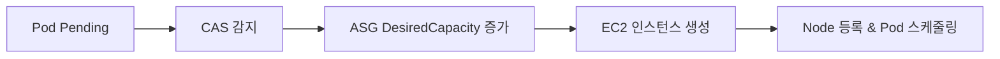
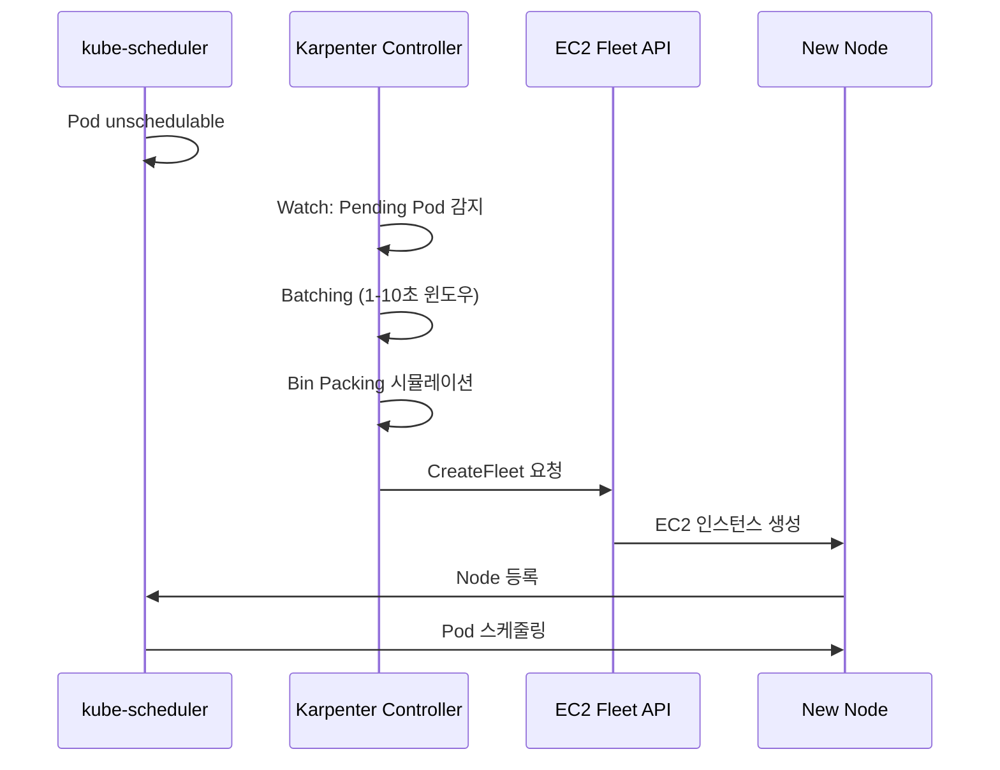

> Cloudnet@EKS Week3

# Node Autoscaling

Pod 스케일링(HPA/VPA)만으로는 노드의 물리적 용량 한계를 넘을 수 없습니다. [Pod Capacity](../week2/3_pod-capacity.md)에서 다뤘듯이 각 노드에 배치 가능한 Pod 수는 ENI와 kubelet 설정에 의해 제한되며, 모든 노드가 포화 상태에 이르면 새 Pod는 Pending 상태에 머무릅니다. 이때 새 [노드](../week1/6_worker-node.md)를 자동으로 프로비저닝하는 것이 Node Autoscaling입니다.

이 문서에서는 먼저 노드 수에 연동하여 인프라 워크로드를 비례 확장하는 CPA를 다루고, 이어서 노드 자체를 추가/삭제하는 CAS와 Karpenter를 비교합니다.

---

## CPA - Cluster Proportional Autoscaler

CPA(Cluster Proportional Autoscaler)는 노드를 직접 추가하지는 않지만, 클러스터 크기에 비례하여 인프라 워크로드의 replica 수를 자동 조정합니다. 노드가 늘어날 때 함께 확장해야 하는 서비스가 있기 때문에 Node Autoscaling과 함께 다룹니다. 대표적인 사용 사례는 CoreDNS입니다. 노드가 늘어나면 Pod 수도 증가하고, 그만큼 DNS 쿼리 부하가 커지기 때문에 CoreDNS replica를 함께 늘려야 합니다.

CPA는 두 가지 매핑 정책을 지원합니다.

**ladder (nodesToReplicas)**
: 노드 수 구간별로 replica 수를 지정합니다. 예: `[[1,1], [2,2], [3,3], [5,5]]` -- 노드 5개 이상이면 replica 5개를 유지합니다.

**coresToReplicas**
: CPU 코어 수를 기준으로 replica를 매핑합니다. 코어 밀도가 높은 인스턴스를 사용하는 클러스터에 적합합니다.

EKS CoreDNS addon에서는 `autoScaling` 설정을 통해 별도 CPA 배포 없이 직접 활성화할 수 있습니다.

---

## CAS - Cluster Autoscaler

### How CAS Works

CAS(Cluster Autoscaler)는 Kubernetes 기본 API가 아닌 선택적 구성 요소로, Kubernetes 1.8에서 GA가 되었습니다. cluster-autoscaler Pod를 Deployment로 배치하면, Pending Pod 발생 시 ASG(Auto Scaling Group)의 DesiredCapacity를 조정하여 노드를 스케일 아웃하고, 사용률이 낮은 노드를 주기적으로 스케일 인합니다.


*[Source: AWS EKS Best Practices — Cluster Autoscaler](https://docs.aws.amazon.com/eks/latest/best-practices/cas.html)*



### Auto-Discovery Setup

CAS는 ASG 태그를 기반으로 관리 대상 노드 그룹을 자동 탐색합니다. EKS Managed Node Group을 생성하면 다음 태그가 자동으로 부여되므로 별도 설정 없이 탐색이 가능합니다.

- `k8s.io/cluster-autoscaler/enabled: true`
- `k8s.io/cluster-autoscaler/<cluster-name>: owned`

### Key Parameters

**--expander**
: 여러 노드 그룹이 후보일 때 선택 전략을 결정합니다. `least-waste`는 노드 추가 후 남는 리소스가 가장 적은 그룹을 선택하여 리소스 낭비를 최소화합니다.

**--scale-down-delay-after-add**
: 노드 추가 후 스케일 다운 평가를 시작하기까지 대기하는 시간입니다. 기본값은 10분이며, 짧은 버스트 트래픽에 의한 불필요한 노드 추가/삭제 반복을 방지합니다.

**--skip-nodes-with-local-storage**
: 로컬 스토리지(emptyDir 등)를 사용하는 Pod가 있는 노드의 스케일 다운 여부를 제어합니다. `false`로 설정하면 해당 노드도 스케일 다운 대상에 포함됩니다.

### Over-Provisioning with Placeholder Pods

CAS가 클러스터를 빈틈없이 최적화하면 여분의 노드 용량이 사라져, 새 Pod가 생성될 때마다 노드 프로비저닝과 부팅 시간이 추가됩니다. 이를 해결하기 위해 우선순위가 낮은 placeholder Pod로 여유 노드 용량을 미리 확보합니다.

```yaml
apiVersion: scheduling.k8s.io/v1
kind: PriorityClass
metadata:
  name: placeholder-priority
value: -10
preemptionPolicy: Never
```

실제 워크로드가 들어오면 kube-scheduler가 placeholder Pod를 선점(preempt)하여 즉시 노드에 배치합니다. placeholder Pod의 resource request는 가장 큰 일반 Pod 크기 이상으로 설정해야, 선점 후 실제 워크로드가 해당 공간에 들어갈 수 있습니다.

### ASG Scaling Policies

CAS가 DesiredCapacity를 직접 설정하는 방식 외에, ASG 자체도 아래 정책으로 용량을 조정할 수 있습니다. CAS와 ASG 정책을 동시에 활성화하면 서로 충돌할 수 있으므로, CAS를 사용할 때는 ASG 정책을 비활성화하는 것을 권장합니다.

Simple/Step Scaling (Manual Reactive)
:   CloudWatch 경보 임계값에 따라 정의한 단계별로 인스턴스를 추가하거나 제거합니다. 예: CPU 70% 초과 시 2대 추가, 90% 초과 시 5대 추가.

Target Tracking (Automated Reactive)
:   목표 메트릭 값(예: 평균 CPU 사용률 50%)을 지정하면 Auto Scaling이 해당 값을 유지하도록 인스턴스 수를 자동 조정합니다.

Scheduled Scaling (Manual Proactive)
:   정의한 일정에 따라 용량을 미리 조정합니다. 트래픽 패턴이 예측 가능한 시간대에 유용합니다.

Predictive Scaling (Automated Proactive)
:   과거 14일간의 메트릭 트렌드를 분석해 향후 48시간의 트래픽을 예측하고, 수요 증가 전에 선제적으로 인스턴스를 확장합니다.

### CAS Limitations

!!! warning "CAS + ASG structural limitations"

    1. **이중 관리**: AWS ASG와 CAS가 동일한 EC2 인스턴스를 각자의 방식으로 관리하므로 상태 동기화 문제가 발생합니다.
    2. **인스턴스 생성 지연**: CAS에서 ASG를 거쳐 EC2 Fleet API에 도달하는 경로가 길어 프로비저닝이 느립니다.
    3. **노드 삭제 불일치**: EKS에서 노드를 삭제해도 EC2 인스턴스는 남아 있어 수동 정리가 필요합니다.
    4. **축소 대상 선택 어려움**: 특정 노드를 축소 대상으로 지정하기 어렵습니다. CAS는 자체 알고리즘으로 대상을 결정합니다.
    5. **폴링 방식**: 주기적으로 API를 호출하므로 대규모 클러스터에서 API throttling에 도달할 수 있습니다.
    6. **Requests 기반 스케줄링**: 실제 사용량이 아닌 resource request 합계로 판단합니다. Request를 과다 설정하면 불필요한 스케일 아웃이 발생하고, 과소 설정하면 필요한 시점에 스케일 아웃이 트리거되지 않습니다.

---

## Karpenter - Just-in-time Nodes

### Why Karpenter

CAS의 구조적 한계를 해결하기 위해 AWS가 개발한 오픈소스 노드 수명 주기 관리 솔루션입니다. ASG 없이 EC2 Fleet API를 직접 호출하여 수초 이내에 워크로드에 최적화된 인스턴스를 프로비저닝합니다.

- EC2 Fleet API를 직접 사용하므로 ASG와 시작 템플릿이 불필요합니다
- Kubernetes 네이티브로 동작합니다. Watch API로 Pending Pod를 감지하고, Labels와 Finalizers로 노드 수명 주기를 관리합니다
- 워크로드의 resource request, nodeSelector, topology spread 등을 분석하여 인스턴스 타입을 자동으로 매칭합니다
- Consolidation을 통해 유휴 노드를 자동으로 정리하거나 더 효율적인 인스턴스로 교체합니다

### Core CRDs

**NodePool**
: 노드 프로비저닝 요구사항을 정의합니다. `instance-category`, `capacity-type`, `instance-generation` 등의 requirements로 허용할 인스턴스 범위를 지정하고, `limits`(cpu, memory)로 NodePool이 관리하는 총 리소스 상한을 설정하며, `disruption` 정책으로 노드 교체 전략을 선언합니다.

**EC2NodeClass**
: AWS에 특화된 설정을 정의합니다. IAM Role, AMI(`amiSelectorTerms`), 서브넷(`subnetSelectorTerms`), 보안 그룹(`securityGroupSelectorTerms`)을 `karpenter.sh/discovery` 태그로 탐색하여 자동 구성합니다.

**NodeClaim**
: Karpenter가 생성한 노드의 상태를 추적하는 리소스입니다. 선택된 인스턴스 타입, AZ(Availability Zone), allocatable 리소스 등을 표시하며, 노드의 현재 상태와 Karpenter의 의사결정 결과를 확인할 수 있습니다.

### Provisioning Flow



### Batching

Karpenter는 확장 윈도우 알고리즘을 사용하여 짧은 시간에 대량으로 발생하는 Pending Pod를 효율적으로 처리합니다. 첫 번째 Pending Pod 감지 후 1초간 유휴 상태가 지속되면 배치를 실행합니다. Pending Pod가 1초 간격 이내로 계속 발생하면 윈도우를 최대 10초까지 확장하여 단일 배치로 묶어 처리합니다.

### Bin Packing

Karpenter는 스케줄링 시뮬레이션과 빈 패킹을 결합하여 최적의 인스턴스 조합을 결정합니다. 호스트 포트 충돌, 볼륨 토폴로지 제약, DaemonSet 스케줄링까지 고려하며, 더 적은 수의 보다 큰 인스턴스를 선호합니다.

비용 최적화가 사용률 최적화보다 우선합니다. 예를 들어 Spot 인스턴스를 사용하면 사용률이 낮더라도 비용이 저렴한 해당 타입을 선택할 수 있습니다.

???+ info "Why bin packing is hard"
    빈 패킹은 NP(Non-deterministic Polynomial time) 문제로, 최적해를 찾는 것은 계산량이 기하급수적으로 늘어납니다. Karpenter는 인스턴스 유형 디스커버리(AWS API) → 비용 순 정렬 → 요구사항 교집합 → 가상 인스턴스 대입 시뮬레이션의 순서로 실용적 근사해를 구합니다.

### Instance Selection Strategy

**On-Demand 할당 전략**: `lowest-price` -- 후보 인스턴스 중 가장 저렴한 인스턴스를 선택합니다.

**Spot 할당 전략**: `price-capacity-optimized` -- 가격이 저렴하면서 중단 가능성이 낮은 인스턴스를 선택합니다. 단순 최저가보다 가용성을 함께 고려하여 Spot 회수 빈도를 줄입니다.

Spot 인스턴스를 사용할 때는 단일 인스턴스 타입에 의존하지 않고 다양한 타입을 후보로 제공해야 합니다. CAS에서는 Mixed Instance Policy로, Karpenter에서는 넓은 `instance-category` requirements로 이 다양성을 확보합니다.


*[Source: AWS EKS Best Practices — Spot Mixed Instance Policy](https://docs.aws.amazon.com/eks/latest/best-practices/cas.html)*

PV(Persistent Volume)가 존재하는 서브넷에 자동으로 노드를 생성하므로, PV를 위해 단일 서브넷 전용 노드 그룹을 별도로 구성할 필요가 없습니다.

### Disruption

Karpenter는 4가지 중단(disruption) 메커니즘으로 노드 수명 주기를 관리합니다.

**Expiration**
: 기본 720시간(30일) 후 노드를 자동 만료합니다. 오래된 노드를 최신 AMI로 강제 교체하여 보안 패치 누락을 방지합니다. `expireAfter` 필드로 만료 주기를 조정할 수 있습니다.

**Drift**
: NodePool이나 EC2NodeClass의 설정 변경을 감지하면 기존 노드를 새 설정으로 교체합니다. EKS Control Plane을 업그레이드하면 해당 버전의 AMI로 자동 교체되어 Control Plane과 Data Plane 간 버전 불일치를 해소합니다.

**Consolidation**
: 비용 효율적 컴퓨팅을 위한 최적화입니다. `WhenEmptyOrUnderutilized` 정책으로 빈 노드를 삭제하거나, 활용도가 낮은 노드의 워크로드를 다른 노드로 옮기고 더 작은 인스턴스로 교체합니다.

**Interruption**
: Spot 회수, 인스턴스 상태 변경 등 비자발적 중단을 처리합니다. 중단 핸들러가 내장되어 있으며, Spot 회수 알림 수신 시 2분 이내에 Pod를 다른 노드로 재생성할 준비를 합니다.

!!! tip "Consolidation behavior"
    큰 노드 하나가 작은 노드 여러 개보다 저렴하면 자동으로 통합합니다. 반대로 워크로드 감소 시 더 작은 인스턴스로 교체하여 비용을 절감합니다. Consolidation은 Pod Disruption Budget(PDB)을 존중하므로 가용성에 영향을 주지 않습니다.

### Spot-to-Spot Consolidation

Spot 인스턴스 간 통합은 On-Demand 통합과 다른 접근이 필요합니다. Spot의 특성상 특정 인스턴스 타입에 집중하면 가용성이 낮아지고 중단 빈도가 높아지므로, 최소 15개 인스턴스 유형이 포함된 다양한 구성이 필요합니다. 이 제약을 충족하지 못하면 가용성이 낮고 중단이 잦은 인스턴스를 선택하게 될 위험이 있습니다.

### NodePool Configuration Strategies

| Strategy | Description | Use Case |
|---|---|---|
| Single | 하나의 NodePool로 다양한 워크로드 처리 | 단순한 클러스터 |
| Multiple | 팀별/워크로드별 NodePool 분리 | 멀티테넌트 환경 |
| Weighted | 우선순위 기반 NodePool 선택 | On-Demand와 Spot 비율 제어 |

### Over-Provisioning with Karpenter

Karpenter를 사용해도 EC2 인스턴스 부팅과 DaemonSet 설치에 최소 1-2분이 소요됩니다. CAS와 동일하게 [우선순위 낮은 placeholder Pod](#over-provisioning-with-placeholder-pods)로 여유 공간을 미리 확보하는 전략이 유효합니다.

KEDA와 연계하면 대규모 트래픽 증가가 예상되는 시간대에 미리 placeholder replica를 늘려, 실제 워크로드 급증 시점에 노드가 이미 준비된 상태를 만들 수 있습니다.

### Karpenter Prometheus Metrics

Karpenter는 `karpenter_*` 접두사로 Prometheus 메트릭을 노출합니다. 공식 Grafana 대시보드로 capacity-dashboard(노드/Pod 용량 현황)와 performance-dashboard(프로비저닝 지연 시간, API 호출 통계)를 제공하여 운영 가시성을 확보할 수 있습니다.[^karpenter-docs]

[^karpenter-docs]: [Karpenter Concepts](https://karpenter.sh/docs/concepts/) 및 [AWS EKS Best Practices — Karpenter](https://docs.aws.amazon.com/eks/latest/best-practices/karpenter.html) 참고.
