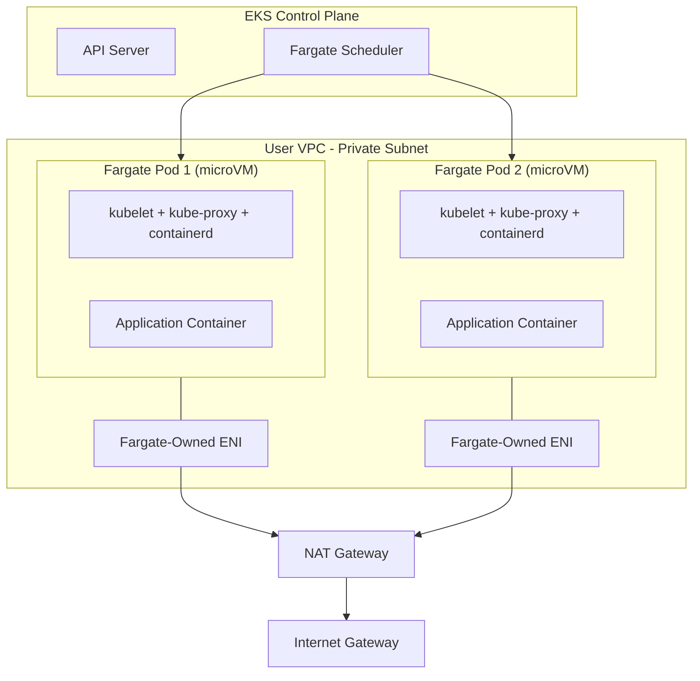

> Cloudnet@EKS Week3

# Fargate

EC2 기반 노드를 운영하면 AMI 업데이트, 보안 패치, 스케일링 설정을 운영자가 관리해야 합니다. Fargate는 이 전체를 AWS에 위임하여 Pod만 선언하면 실행 환경이 자동으로 프로비저닝되는 서버리스 모델입니다. 각 Pod는 Firecracker microVM으로 격리되어 커널, CPU, 메모리, ENI를 다른 Pod와 공유하지 않습니다.

[Week 1에서 다룬 Compute Types](../week1/2_data-plane.md)에서 Fargate의 위치를 확인할 수 있습니다.

---

## Firecracker

Fargate의 기반 기술인 Firecracker는 KVM(Kernel-based Virtual Machine) 위에서 동작하는 경량 microVM입니다.

**시작 속도**
: 125ms 이내에 microVM 시작

**메모리 오버헤드**
: microVM당 약 5MiB

**보안**
: cgroups와 seccomp BPF로 프로세스 격리, Rust로 작성하여 메모리 안전성 확보

**사용 서비스**
: AWS Lambda와 AWS Fargate에서 사용

각 Fargate Pod 내부에서는 firecracker-containerd가 microVM을 배포하고, microVM 안에서 kubelet, kube-proxy, containerd가 동작합니다. 이 구성 요소를 위해 각 Pod 메모리에 256MB가 추가 예약됩니다.[^fargate-256]

[^fargate-256]: [Fargate Pod configuration](https://docs.aws.amazon.com/eks/latest/userguide/fargate-pod-configuration.html) — "Fargate adds 256 MB to each Pod's memory reservation for the required Kubernetes components"

???+ info "firecracker-containerd 내부 구조"
    firecracker-containerd는 세 계층으로 구성됩니다. **Control plugin**이 containerd에 컴파일되어 microVM 수명 주기를 관리하고, **Runtime**이 containerd(외부)와 VMM(Firecracker)을 연결하며, microVM 내부의 **Agent**가 runC를 호출하여 표준 Linux 컨테이너를 생성합니다. 이 구조 덕분에 VM 수준 격리를 제공하면서도 기존 containerd 인터페이스와 호환됩니다.

---

## Architecture

Fargate Scheduler(Controller)가 EKS Control Plane에서 동작하며, 각 Pod에 Fargate-Owned ENI를 할당합니다. ENI는 사용자 VPC의 private 서브넷에 위치하고, 외부 통신은 NAT Gateway를 거쳐 Internet Gateway로 나갑니다. 외부에서의 인바운드 트래픽은 ALB와 NLB(IP 타겟 모드만 지원)를 통해 Fargate-Owned ENI로 전달됩니다.



---

## Fargate Profile

Fargate에서 Pod를 실행하려면 Fargate Profile을 정의해야 합니다.

### Components

**Pod Execution Role**
: Fargate 인프라의 kubelet이 AWS API(ECR 이미지 풀 등)를 호출하기 위한 IAM 역할. RBAC에도 등록됨

**Subnets**
: Pod를 배포할 private 서브넷 ID. 공용 서브넷은 지원하지 않음

**Selectors**
: Pod가 Fargate에서 실행되기 위한 매칭 조건. 네임스페이스(필수)와 레이블(선택)로 구성. 최대 5개 셀렉터. 와일드카드(`*`, `?`) 지원

### Profile Behavior

- Fargate 프로필은 변경 불가 — 새 프로필 생성 후 기존 삭제
- 여러 프로필이 매칭되면 프로필 이름 알파벳 순으로 선택

!!! warning "Profile deletion impact"
    프로필을 삭제하면 해당 프로필로 실행 중인 모든 Pod가 중지되고 Pending 상태로 전환됩니다. 먼저 대체 프로필을 생성한 뒤 기존 프로필을 삭제하세요.

---

## Pod Configuration

### CPU and Memory

Fargate는 노드당 하나의 Pod만 실행하므로 리소스 부족으로 인한 퇴출이 발생하지 않습니다. 모든 Fargate Pod는 Guaranteed QoS로 실행되며, requests와 limits가 동일해야 합니다.

Fargate는 Pod의 vCPU와 메모리 요청 합계를 다음 조합 중 가장 가까운 값으로 반올림합니다:

| vCPU | Memory |
|------|--------|
| 0.25 | 0.5 GB, 1 GB, 2 GB |
| 0.5 | 1-4 GB (1 GB 단위) |
| 1 | 2-8 GB (1 GB 단위) |
| 2 | 4-16 GB (1 GB 단위) |
| 4 | 8-30 GB (1 GB 단위) |
| 8 | 16-60 GB (4 GB 단위) |
| 16 | 32-120 GB (8 GB 단위) |

!!! warning "256MB overhead"
    Kubernetes 구성 요소(kubelet, kube-proxy, containerd)를 위해 각 Pod 메모리에 256MB가 추가됩니다. 예를 들어 1 vCPU, 8GB memory 요청 시 실제로는 1 vCPU + 8.256GB가 필요하여 **2 vCPU, 9GB**로 반올림됩니다.

`CapacityProvisioned` 어노테이션으로 실제 할당량을 확인할 수 있습니다:

```bash
kubectl get pod -o jsonpath='{.metadata.annotations.CapacityProvisioned}'
# 0.25vCPU 0.5GB
```

### Storage

- 기본 20 GiB 임시 저장소, 최대 175 GiB까지 확장 가능
- AES-256 암호화 (AWS Fargate 관리 키)
- EFS 정적 프로비저닝 지원, 동적 프로비저닝 불가
- EBS 볼륨 마운트 불가

---

## Logging

Fargate는 Fluent Bit 기반의 내장 로그 라우터를 제공합니다. 사이드카 컨테이너를 직접 실행할 필요 없이 ConfigMap 설정만으로 로그를 라우팅합니다.

### Configuration

`aws-observability` 네임스페이스에 `aws-logging` ConfigMap을 생성합니다:

```yaml
apiVersion: v1
kind: ConfigMap
metadata:
  name: aws-logging
  namespace: aws-observability
data:
  output.conf: |
    [OUTPUT]
        Name cloudwatch_logs
        Match kube.*
        region ap-northeast-2
        log_group_name /eks/fargate-logs
        log_stream_prefix fargate-
        auto_create_group true
```

- 허용 섹션: Filter, Output, Parser만 (Service와 Input은 Fargate가 관리)
- ConfigMap 동적 구성 미지원 — 변경 시 새 Pod에만 적용
- Pod execution role에 CloudWatch Logs 권한 추가 필요

!!! tip "Log router sizing"
    로그 라우터에 최대 50MB 메모리를 계획하세요. 높은 처리량이 예상되면 100MB까지 고려합니다.

---

## OS Patching

AWS가 주기적으로 Fargate 노드에 OS 패치를 적용합니다. PDB(Pod Disruption Budget)로 동시 감소 Pod 수를 제어할 수 있습니다.

- Eviction API로 Pod를 안전하게 배출
- 퇴거 실패 시 EventBridge 이벤트 발생 (`EKS Fargate Pod Scheduled Termination`)
- 예정된 종료 시간 전에 수동 재시작으로 선제 대응 가능

---

## Constraints Summary

!!! danger "Fargate constraints"

    **컴퓨팅 제약**

    - DaemonSet 미지원 — 사이드카 컨테이너로 대체
    - Privileged containers 미지원
    - GPU와 Arm 프로세서 미지원
    - Fargate Spot 미지원

    **네트워킹 제약**

    - Private 서브넷에서만 지원 (NAT Gateway 필요)
    - HostPort와 HostNetwork 미지원
    - NLB와 ALB는 IP 타겟 모드만 지원
    - topologySpreadConstraints 미지원

    **스토리지 제약**

    - EBS 볼륨 마운트 불가
    - EFS 동적 프로비저닝 불가 (정적만 가능)
    - 기본 20 GiB 임시 저장소 (최대 175 GiB)

    **보안 및 접근**

    - IMDS 사용 불가 — IRSA(IAM Roles for Service Accounts) 사용
    - SSH 접속 불가
    - 대체 CNI 플러그인 불가

    전체 제약사항은 [AWS 공식 문서](https://docs.aws.amazon.com/eks/latest/userguide/fargate.html)를 참조하세요.

---

## Hands-on Summary

Terraform Blueprints(`terraform-aws-eks-blueprints/patterns/fargate-serverless`)로 실습 환경을 배포합니다.

주요 관찰 포인트:

- Pod IP = Node IP (노드당 1개 Pod)
- `schedulerName: fargate-scheduler` — admission control에 의해 변경됨
- 호스트 탈취 시도(privileged, hostNetwork 등): fargate-scheduler가 거부
- `CapacityProvisioned` 어노테이션으로 실제 할당 리소스 확인

상세 실습 스크립트는 [Lab](5_lab.md)을 참조하세요.
