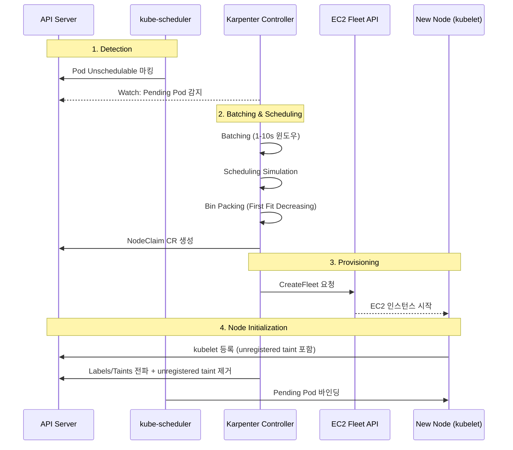

# Karpenter

Karpenter는 [CAS](3_node-autoscaling.md#cas-cluster-autoscaler)와 달리 ASG를 거치지 않고, Pod의 스케줄링 요구사항을 직접 반영하여 EC2 Fleet API로 인스턴스를 프로비저닝합니다.

---

## Why Karpenter

CAS가 ASG의 DesiredCapacity를 조정하는 간접적인 방식이라면, Karpenter는 EC2 Fleet API를 직접 호출하여 워크로드에 적합한 인스턴스를 프로비저닝합니다. 따라서 기존 Cluster Autoscaler(CAS)와 구별되는 몇 가지 설계 특징을 가집니다.


*[Source: Amazon EKS 클러스터를 비용 효율적으로 오토스케일링하기](https://aws.amazon.com/ko/blogs/tech/amazon-eks-cluster-auto-scaling-karpenter-bp/)*

- **EC2 Fleet API 직접 호출**: Karpenter는 ASG(Auto Scaling Group)나 Launch Template을 경유하지 않고 EC2 Fleet API를 직접 호출하여 인스턴스를 프로비저닝하는 방식을 택합니다. 이로 인해 ASG 기반 구성 요소 없이도 인스턴스 생성이 가능하지만, 운영 환경에 따라 기존 ASG 기반 워크플로와의 통합 여부는 별도로 검토할 필요가 있습니다.
- **Kubernetes API 연동**: Kubernetes Watch API를 통해 Pending 상태의 Pod을 감지하고, labels와 finalizers를 활용해 노드 수명 주기를 관리합니다.
- **워크로드 기반 인스턴스 선택**: Pod에 선언된 resources.requests, nodeSelector, topologySpreadConstraints, podAffinity 등을 분석하여 적합한 인스턴스 타입을 선정합니다.
- **Consolidation**: 활용률이 낮은 노드를 자동으로 정리하거나, 비용 효율이 더 높은 인스턴스로 교체하는 Consolidation 기능을 제공합니다. 단, PodDisruptionBudget 등 중단 허용 여부 설정에 따라 동작 범위가 달라지므로, 프로덕션 적용 전 충분한 검증이 권장됩니다.

CAS 환경에서 On-Demand/Spot, Intel/Graviton, 다양한 인스턴스 사이즈를 혼용하려면, 일반적으로 여러 개의 노드 그룹과 priority expander 설정이 필요합니다.

반면 Karpenter에서는 단일 NodePool의 requirements 필드에 아래와 같이 선언하는 방식으로 유사한 다양성을 구현할 수 있습니다.

```yaml
requirements:
  - key: karpenter.sh/capacity-type
    operator: In
    values: ["spot", "on-demand"]
  - key: kubernetes.io/arch
    operator: In
    values: ["amd64", "arm64"]
```

인스턴스 사이즈 역시 별도 노드 그룹 분리 없이, bin packing 알고리즘이 `resources.requests` 합계를 기반으로 적절한 사이즈를 선택하도록 설계되어 있습니다. 다만 bin packing의 실제 효율은 워크로드 특성과 요청 패턴에 따라 차이가 있을 수 있습니다.

Karpenter는 2021년 AWS가 v0.5를 발표한 이후 지속적으로 발전하여, 2024년 8월 v1.0 GA에 도달하면서 `NodePool`과 `EC2NodeClass` API가 안정 버전으로 전환되었습니다.

---

## CRDs

Karpenter는 세 가지 CRD로 노드 수명 주기를 관리합니다. NodePool이 어떤 인스턴스를 허용할지, EC2NodeClass가 AWS에서 어떻게 생성할지를 정의하고, NodeClaim이 실제 생성된 노드의 상태를 추적합니다.

=== "NodePool"

    노드 프로비저닝 요구사항을 정의하는 리소스입니다. `requirements`로 허용할 인스턴스 범위를 지정하고, `limits`로 총 리소스 상한을 설정하며, `disruption` 정책으로 노드 교체 전략을 선언합니다.
    
    !!! warning
        `limits`를 지정하지 않으면 리소스 상한이 없어 예상치 못한 비용이 발생할 수 있습니다. billing alarm과 함께 운영하는 것을 권장합니다.


    ```yaml title="Example"
    apiVersion: karpenter.sh/v1
    kind: NodePool
    metadata:
      name: default
    spec:
      template:
        metadata:
          labels:
            billing-team: my-team
        spec:
          nodeClassRef:
            group: karpenter.k8s.aws
            kind: EC2NodeClass
            name: default
          expireAfter: 720h  # (1)
          terminationGracePeriod: 48h  # (2)
          requirements:
            - key: karpenter.k8s.aws/instance-category
              operator: In
              values: ["c", "m", "r"]
            - key: karpenter.k8s.aws/instance-generation
              operator: Gt
              values: ["4"]
            - key: kubernetes.io/arch
              operator: In
              values: ["amd64", "arm64"]
            - key: karpenter.sh/capacity-type
              operator: In
              values: ["spot", "on-demand"]
      limits:
        cpu: "1000"
        memory: 1000Gi
      disruption:
        consolidationPolicy: WhenEmptyOrUnderutilized
        consolidateAfter: 1m
        budgets:
          - nodes: "10%"
          - nodes: "0"
            schedule: "0 9 * * mon-fri"
            duration: 8h
            reasons:
              - Drifted
              - Underutilized
          - nodes: "100%"
            reasons:
              - Empty
      weight: 50  # (3)
    ```

    1. 노드의 최대 수명을 설정합니다. 지정한 시간이 경과하면 해당 노드는 disruption 대상으로 전환됩니다.
    2. 만료 또는 드리프트 시작 후 이 기간 내에 drain이 완료되지 않으면 Pod을 강제 삭제합니다. `PodDisruptionBudget`이나 `do-not-disrupt` annotation이 설정되어 있더라도 이 기간이 지나면 노드가 삭제되므로 주의가 필요합니다.
    3. 여러 `NodePool`이 조건에 매칭될 때, `weight` 값이 높은 `NodePool`이 우선 선택됩니다.

=== "EC2NodeClass"

    AWS에 특화된 프로비저닝 설정을 정의합니다. AMI, 서브넷, 보안 그룹을 태그 기반으로 자동 탐색하며, 스토리지 구성과 인스턴스 메타데이터 접근 방식을 제어합니다.
    
    ```yaml title="Example"
    apiVersion: karpenter.k8s.aws/v1
    kind: EC2NodeClass
    metadata:
      name: default
    spec:
      role: "KarpenterNodeRole-${CLUSTER_NAME}"  # (1)
      amiSelectorTerms:
        - alias: al2023@v20240807  # (2)
      subnetSelectorTerms:
        - tags:
            karpenter.sh/discovery: "${CLUSTER_NAME}"  # (3)
      securityGroupSelectorTerms:
        - tags:
            karpenter.sh/discovery: "${CLUSTER_NAME}"
      blockDeviceMappings:
        - deviceName: /dev/xvda
          ebs:
            volumeSize: 100Gi
            volumeType: gp3
            encrypted: true
            deleteOnTermination: true
      metadataOptions:
        httpEndpoint: enabled
        httpProtocolIPv6: disabled
        httpPutResponseHopLimit: 1  # (4)
        httpTokens: required  # (5)
    ```

    1. Karpenter가 인스턴스 프로파일을 자동으로 관리합니다. Private cluster 환경에서는 `instanceProfile`을 직접 지정해야 할 수 있습니다.
    2. 운영 환경에서는 `@latest` 대신 특정 버전을 고정하여 검증되지 않은 AMI가 배포되는 상황을 방지하는 것을 권장합니다. 현재 `al2023`, `al2`, `bottlerocket`, `windows2019`, `windows2022` 패밀리를 지원합니다.
    3. `kubernetes.io/cluster/$CLUSTER_NAME` 태그 대신 `karpenter.sh/discovery`를 사용합니다. 전자는 AWS Load Balancer Controller와 태그 충돌이 발생할 수 있습니다.
    4. `httpPutResponseHopLimit: 1`로 설정하면 컨테이너에서의 IMDS 직접 접근이 차단됩니다. Pod이 IMDS에 의존하는 경우에는 값을 `2`로 설정해야 합니다.
    5. IMDSv2 사용을 강제합니다. v1.0부터 기본값으로 적용되어 있습니다.

=== "NodeClaim"

    Karpenter가 생성한 노드의 상태를 추적하는 읽기 전용 리소스입니다. 선택된 인스턴스 타입, AZ, allocatable 리소스, 현재 상태 조건(`Drifted`, `Expired`, `Empty` 등)을 확인할 수 있습니다.
    
    !!! info
        v1.0부터 `NodeClaim`은 불변(immutable)으로 처리되며, 변경이 필요한 경우 기존 `NodeClaim`을 삭제하고 새로운 `NodeClaim`으로 교체하는 방식으로 동작합니다.

---

## Scheduling

실제로 어떤 인스턴스가 선택되는지는 Pod의 스케줄링 요구사항에 달려 있습니다. Karpenter는 NodePool의 requirements와 Pod의 constraints를 layered constraints로 평가하여, 두 조건이 교차하는 범위에서만 인스턴스를 프로비저닝합니다.

!!! warning
    NodePool의 requirements와 Pod의 constraints 사이에 교집합이 존재하지 않으면 노드가 생성되지 않으며, Pod은 Pending 상태로 유지됩니다

**Resource Requests**
:   인스턴스 타입 선택 시에는 `resources.requests`만 참조됩니다. `resources.limits`는 인스턴스 선택에 영향을 주지 않습니다. 다만 `resources.requests`보다 높은 `resources.limits`를 설정함으로써, 인스턴스가 허용하는 범위 내에서 일정 수준의 oversubscription을 허용하는 구성도 가능합니다.

**Node Affinity**
:   Karpenter는 `preferred` affinity도 가능한 한 충족하는 방향으로 노드를 생성하려 시도합니다. 완전히 충족하기 어려운 경우에는 조건을 완화하여 프로비저닝합니다.

**Topology Spread**
:   `topologySpreadConstraints`를 통해 AZ, 호스트, capacity-type 간 Pod 분산 방식을 지정할 수 있습니다. Karpenter는 비용 효율성을 고려하면서도 선언된 topology 제약을 준수하는 방향으로 인스턴스를 선택합니다. 다만 Spot 가용성 등 외부 요인에 따라 완전한 분산이 보장되지 않을 수 있습니다.

**Storage Topology**
:   Pod → PersistentVolumeClaim → StorageClass 참조를 추적하여 `PersistentVolume`(PV)이 존재하는 AZ에 자동으로 노드를 프로비저닝합니다. 이 동작 덕분에 특정 PV를 위해 단일 서브넷 전용 노드 그룹을 별도로 구성해야 하는 상황을 피할 수 있는 경우가 많습니다.

---

## Provisioning Flow

kube-scheduler가 Pod을 노드에 배치하지 못하면 Pod은 `PodScheduled=False, reason=Unschedulable` 상태가 됩니다. Karpenter Controller는 Watch API로 이 상태를 실시간으로 감지하여 프로비저닝 루프를 시작합니다. CAS가 주기적 폴링(기본 10초)에 의존하는 것과 달리 이벤트 기반으로 동작하므로 감지 지연이 거의 없습니다.

감지 후에는 batching → scheduling simulation → bin packing → NodeClaim 생성 → EC2 Fleet API 호출 → 노드 초기화 순서로 진행됩니다.



### Batching

Karpenter는 확장 윈도우(expanding window) 알고리즘을 사용하여 짧은 시간에 대량으로 발생하는 `Pending` Pod을 효율적으로 처리합니다.
동작 방식은 다음과 같습니다.

1. 1번째 `Pending` Pod 감지 후 1초간 추가 `Pending` Pod이 발생하지 않으면 batch 처리를 실행합니다.
2. 1초 간격 이내로 `Pending Pod`이 계속 발생하면 윈도우를 최대 10초까지 연장하여 단일 batch로 묶어 처리합니다.

!!! info
    `kubectl scale --replicas=100`과 같이 Pod이 한꺼번에 생성되는 상황에서, Pod 각각에 대해 CreateFleet을 호출하는 대신 전체를 단일 bin packing 시뮬레이션으로 처리합니다. 이를 통해 보다 효율적인 인스턴스 조합을 결정할 수 있으며, API 호출 횟수도 줄일 수 있습니다. 다만 윈도우가 길어질수록 첫 노드 프로비저닝까지의 지연도 늘어나므로, 워크로드의 스케일 아웃 패턴에 따라 이 값을 조정하는 것을 고려해볼 수 있습니다.

### Bin Packing

Bin packing은 제한된 용량의 컨테이너(bin)에 여러 항목을 낭비 없이 채워 넣는 최적화 문제에서 유래한 개념입니다. 컨테이너 오케스트레이션에서는 제한된 리소스를 가진 노드에 Pod을 얼마나 효율적으로 배치할 것인가의 문제로 이어집니다.

Karpenter는 이 bin packing을 인스턴스 선택 단계에 적용합니다. Pending Pod들을 가상의 인스턴스에 배치하는 시뮬레이션을 통해 비용 효율적인 인스턴스 조합을 결정하며, 이 과정에서 호스트 포트 충돌, 볼륨 토폴로지 제약, DaemonSet 스케줄링까지 함께 고려합니다. 

전반적으로 작은 인스턴스 여러 개보다 큰 인스턴스 소수를 선택하는 방향으로 동작하며, 리소스 utilization보다 비용 최적화를 우선시합니다. Spot 인스턴스의 utilization이 낮더라도 On-Demand 대비 비용이 낮다고 판단되면 해당 타입이 선택될 수 있습니다.

일반적으로 비용 최적화가 리소스 utilization보다 높은 우선순위를 갖습니다. Spot 인스턴스의 utilization이 낮더라도 On-Demand 대비 비용이 낮으면 해당 타입을 선택합니다.

???+ info "Why bin packing is hard"
    Bin packing은 NP(Non-deterministic Polynomial time) 문제로, 최적해를 찾는 것은 계산량이 기하급수적으로 늘어납니다. Karpenter는 다음 순서로 실용적 근사해를 구합니다.

    1. **인스턴스 유형 디스커버리**: AWS API를 통해 해당 리전 및 AZ에서 사용 가능한 인스턴스 유형 목록을 조회하고, 기본적으로 모든 가용 유형을 후보로 포함합니다.
    2. **비용 순 정렬**: 후보 인스턴스 유형을 가격 기준으로 정렬합니다.
    3. **요구사항 교집합 필터링**: `NodePool`의 `requirements`와 Pod의 스케줄링 constraints(`nodeSelector`, `affinity`, `tolerations`)의 교집합에 해당하는 인스턴스만 추립니다. 예를 들어 GPU가 필요하지 않은 Pod은 GPU 인스턴스 후보에서 제외됩니다.
    4. **가상 배치 시뮬레이션**: 필터링된 인스턴스 유형에 `Pending` Pod을 가상으로 배치하여 비용 효율적인 인스턴스 조합을 탐색합니다.

### Node Initialization

스케줄링 시뮬레이션이 완료되면 Karpenter는 결과를 `NodeClaim` CR로 API Server에 생성합니다. `NodeClaim`에는 선택된 인스턴스 타입, `requirements`, `resources.requests`가 기록되며, 이후 `EC2 Fleet API`가 인스턴스를 시작하면 아래 순서로 노드 초기화가 진행됩니다.

1. **인스턴스 부팅**: EC2 인스턴스가 시작되고 `user data` 스크립트(`bootstrap.sh`)를 실행합니다.

2. **kubelet 등록**: `kubelet`이 API Server에 Node를 등록합니다. 이 시점에 노드에는 `karpenter.sh/unregistered:NoExecute` taint가 자동으로 설정되어, 초기화가 완료되기 전에 워크로드 Pod이 스케줄링되는 것을 방지합니다.

3. **노드 구성 전파**: Karpenter가 `NodeClaim`에 정의된 `labels`, `annotations`, `taints`를 노드에 전파하고 `unregistered` taint를 제거합니다.

4. **DaemonSet 배포**: `kube-proxy`, VPC CNI 등 `DaemonSet` Pod이 스케줄링됩니다. `NodePool`에 `startupTaints`가 정의되어 있으면, 해당 `DaemonSet`이 Ready 상태가 된 이후에만 taint가 제거됩니다. 이를 통해 네트워크가 준비되지 않은 상태에서 워크로드가 먼저 시작되는 상황을 방지할 수 있습니다.

5. **Pod 바인딩**: 노드가 `Ready` 상태가 되면 `kube-scheduler`가 대기 중인 워크로드 Pod을 바인딩합니다.

이 초기화 과정이 프로비저닝 전체 지연 시간의 대부분을 차지합니다. 소요 시간은 인스턴스 타입과 AMI에 따라 다를 수 있으며, 일반적으로 60~90초 수준으로 알려져 있습니다. 다만 실제 환경에서는 네트워크 상태, AMI 크기, `user data` 스크립트 복잡도 등에 따라 차이가 있을 수 있습니다.

---

## Instance Selection

Bin packing으로 인스턴스 조합이 결정되면, 실제 할당 단계에서는 `capacity-type`에 따라 다른 전략을 적용합니다. On-Demand는 최저가를 기준으로 선택하지만, Spot은 가격뿐 아니라 회수 가능성까지 함께 고려합니다.

<div class="grid cards" markdown>

-   **On-Demand**

    ---

    `lowest-price`: 후보 인스턴스 중 가장 저렴한 인스턴스를 선택합니다.

-   **Spot**

    ---

    `price-capacity-optimized`: 가용 용량이 높으면서 가격이 낮은 풀을 선택합니다. 단순 최저가(`lowest-price`) 전략과 달리 가용성을 함께 고려하기 때문에, Spot 회수 빈도를 줄이는 데 유리한 것으로 알려져 있습니다.[^spot-allocation]

</div>

[^spot-allocation]: [EC2 Fleet allocation strategies](https://docs.aws.amazon.com/AWSEC2/latest/UserGuide/ec2-fleet-allocation-strategy.html) — `price-capacity-optimized`는 중단 위험이 낮고 가격이 저렴한 풀을 선택합니다.

Spot 인스턴스를 사용할 때는 단일 인스턴스 타입에 의존하지 않고, 다양한 타입을 후보로 제공하는 것을 권장합니다. `NodePool`의 `requirements`를 과도하게 제한하면 특정 인스턴스 유형이 모두 회수되었을 때 대체 용량을 확보하지 못할 수 있습니다.

[`ec2-instance-selector`](https://github.com/aws/amazon-ec2-instance-selector) CLI를 활용하면 요구사항에 맞는 인스턴스 유형 목록을 사전에 확인하는 데 도움이 됩니다.
```bash
# vCPU 2개, 메모리 4GB, x86_64 아키텍처 조건에 맞는 인스턴스 조회
ec2-instance-selector --memory 4 --vcpus 2 --cpu-architecture x86_64 -r ap-northeast-2
```

---

## Disruption

Karpenter의 중단 메커니즘은 자발적(voluntary)과 비자발적(involuntary)으로 나뉩니다.

| Type | Kind | Disruption Budget |
|---|---|---|
| Voluntary | Consolidation, Drift | :material-check:|
| Involuntary | Expiration, Interruption | :material-close: |

**Consolidation**
:   클러스터의 컴퓨팅 비용을 줄이기 위해 노드를 삭제하거나 더 저렴한 인스턴스로 교체합니다. 아래 순서로 평가가 진행됩니다.

    1. **Empty Node Consolidation**: 빈 노드를 병렬로 삭제
    2. **Multi-node Consolidation**: 2개 이상의 노드를 삭제하고, 필요 시 단일 저가 노드로 교체
    3. **Single-node Consolidation**: 개별 노드를 삭제하거나 저가 노드로 교체

    두 가지 정책을 지원합니다.

    - `WhenEmpty`: `DaemonSet` Pod만 남은 노드를 삭제
    - `WhenEmptyOrUnderutilized` (기본값): 빈 노드 삭제에 더해, utilization이 낮은 노드를 더 작거나 저렴한 인스턴스로 교체

    `consolidateAfter`로  consolidation 평가까지의 대기 시간을 설정할 수 있습니다(기본값 `0s`). 트래픽 급증으로 Pod 스케일 아웃이 잦은 환경에서는 `1m` 이상으로 설정하여 노드 churn을 줄이는 것을 고려할 수 있습니다.

**Drift**
:   `NodePool`이나 `EC2NodeClass`의 spec 변경(`requirements`, `subnetSelectorTerms`, `securityGroupSelectorTerms`, `amiSelectorTerms`)이 감지되면 기존 노드를 `Drifted` 상태로 표시하고 새 설정으로 교체합니다.

    CRD를 직접 변경하지 않더라도, `amiSelectorTerms`가 resolve한 실제 AMI ID가 바뀌는 경우에도 drift가 발생할 수 있습니다. EKS Control Plane 업그레이드 후에는 해당 버전의 AMI로 노드를 자동 교체하여 버전 불일치를 해소하는 용도로도 활용됩니다.

**Expiration**
:   `expireAfter`에 설정된 시간이 경과하면 노드를 교체합니다(기본값 `720h`, 30일). 오래된 노드에 보안 패치가 누락되는 상황을 방지하기 위한 메커니즘입니다.

    `expireAfter`는 노드가 존재할 수 있는 최대 시간이며, 보장된 최소 수명이 아닙니다. Consolidation이나 Drift가 만료보다 먼저 노드를 교체할 수 있습니다. 노드의 절대적인 최대 존재 시간은 `expireAfter` + `terminationGracePeriod`가 됩니다.

**Interruption**
:   Spot 회수(2분 사전 알림), 예정된 유지보수, 인스턴스 종료/중지 이벤트를 처리합니다. EventBridge가 이벤트를 SQS 큐로 전달하고, Karpenter가 `--interruption-queue` 인수로 지정된 큐를 폴링하는 방식으로 동작합니다. Spot 회수 시에는 대체 노드 프로비저닝과 기존 노드 drain을 병렬로 수행합니다.

### Disruption Budgets

Disruption budget은 동시에 중단할 수 있는 노드 수를 제한하여 가용성을 보호하는 메커니즘입니다. 별도로 지정하지 않으면 기본값으로 `nodes: 10%`가 적용됩니다.

여러 budget이 동시에 매칭되는 경우 가장 제한적인 값이 적용되며, budget은 자발적 중단(Consolidation, Drift)에만 적용됩니다. Expiration과 Interruption은 budget의 영향을 받지 않습니다.
```yaml title="Example"
disruption:
  budgets:
    - nodes: "0"                    # (1)
      schedule: "0 9 * * mon-fri"
      duration: 8h
      reasons:
        - Drifted
        - Underutilized
    - nodes: "100%"                 # (2)
      reasons:
        - Empty
    - nodes: "10%"                  # (3)
      reasons:
        - Drifted
        - Underutilized
```

1. 월~금 09:00 UTC부터 8시간 동안 `Drifted`, `Underutilized` 사유의 중단을 완전히 차단합니다. 업무 시간 중 의도치 않은 노드 교체로 인한 서비스 영향을 방지하는 용도로 활용할 수 있습니다.
2. `Empty` 노드는 시간대와 무관하게 100% 삭제를 허용합니다. Pod이 없는 노드는 서비스 영향 없이 즉시 비용을 절감할 수 있기 때문입니다.
3. 업무 시간 외에는 `Drifted`, `Underutilized` 사유의 중단을 최대 10%까지 허용합니다.

### Pod-Level Disruption Controls

**`karpenter.sh/do-not-disrupt: "true"`**
:   Pod에 이 annotation을 추가하면 Karpenter의 자발적 중단(Consolidation, Drift)을 차단합니다. 장시간 실행되는 배치 작업이나 체크포인트가 없는 ML 학습 Job에 유용합니다. 다만 앞서 언급한 것처럼 `terminationGracePeriod`이 만료되거나 Expiration, Interruption이 발생하면 이 annotation과 무관하게 노드가 삭제됩니다.

**Pod Disruption Budget (PDB)**
:   Karpenter는 drain 과정에서 PDB를 준수합니다. 주의할 점은 단일 blocking PDB가 노드 전체의 자발적 중단을 막을 수 있다는 것입니다. `minAvailable`은 전체 replica 수보다 충분히 낮게 설정하는 것을 권장합니다.

!!! info "Spot-to-Spot Consolidation"
    Spot 인스턴스 간 교체는 On-Demand 교체와 다른 제약이 있습니다. 특정 인스턴스 타입에 집중하면 해당 풀의 가용 용량이 줄어들고 중단 빈도가 높아지므로, Karpenter는 단일 노드 Spot-to-Spot 교체 시 최소 15개 인스턴스 유형을 요구합니다. 이 조건을 충족하지 못하면 교체를 건너뜁니다. 다중 노드 통합(여러 노드를 하나로 합치는 경우)에는 이 제약이 적용되지 않습니다.

---

## NodePool Strategies

`NodePool`을 몇 개로 나누고 어떻게 구성할지는 클러스터의 워크로드 다양성과 팀 구조에 따라 달라집니다. 단일 `NodePool`로 시작하되, 격리나 우선순위 요구가 생기면 분리하는 방향을 권장합니다.

| Strategy | Description | Use Case |
|---|---|---|
| Single | 하나의 `NodePool`로 다양한 워크로드 처리 | 단순한 클러스터 |
| Multiple | 팀별/워크로드별 `NodePool` 분리. `requirements`를 상호 배타적으로 설정하여 일관된 스케줄링 동작을 보장. GPU `NodePool`에 `taint`를 설정하고 워크로드에 `toleration`을 추가 | 멀티테넌트, GPU/CPU 분리 |
| Weighted | `weight` 필드로 `NodePool` 우선순위 지정. 높은 `weight`가 우선 선택됨 | On-Demand/Spot 비율 제어, Reserved → Spot fallback |

### On-Demand:Spot Ratio Control

On-Demand와 Spot 인스턴스의 비율을 제어하려면 `capacity-type`별로 `NodePool`을 분리하고, 사용자 정의 레이블과 `topologySpreadConstraints`를 조합합니다.

예를 들어 On-Demand `NodePool`에 `capacity-spread: "1"`, Spot `NodePool`에 `capacity-spread: ["2","3","4","5"]`를 할당하면 1:4 비율로 Pod이 분산됩니다.
```yaml title="NodePool"
# On-Demand NodePool
apiVersion: karpenter.sh/v1
kind: NodePool
metadata:
  name: on-demand
spec:
  template:
    spec:
      requirements:
        - key: karpenter.sh/capacity-type
          operator: In
          values: ["on-demand"]
        - key: capacity-spread
          operator: In
          values: ["1"]
---
# Spot NodePool
apiVersion: karpenter.sh/v1
kind: NodePool
metadata:
  name: spot
spec:
  template:
    spec:
      requirements:
        - key: karpenter.sh/capacity-type
          operator: In
          values: ["spot"]
        - key: capacity-spread
          operator: In
          values: ["2", "3", "4", "5"]
```

Deployment에서는 `topologySpreadConstraints`로 `capacity-spread` 레이블 기준 분산을 선언합니다.
```yaml title="topologySpreadConstraints"
spec:
  topologySpreadConstraints:
    - maxSkew: 1
      topologyKey: capacity-spread
      whenUnsatisfiable: DoNotSchedule
      labelSelector:
        matchLabels:
          app: my-app
```

CAS의 priority expander로는 우선순위 지정은 가능하지만 비율을 직접 제어하기는 어렵습니다. Karpenter는 `topologySpreadConstraints`를 활용하여 On-Demand로 최소한의 안정성을 확보하면서 Spot으로 비용을 절감하는 구성이 가능합니다.

---

## Over-Provisioning

Karpenter를 사용해도 EC2 인스턴스 부팅과 DaemonSet 설치에 통상 1-2분이 소요됩니다. CAS와 동일하게 [우선순위 낮은 placeholder Pod](3_node-autoscaling.md#over-provisioning-with-placeholder-pods)로 예비 용량을 미리 확보하는 전략이 유효합니다.

KEDA와 연계하면 대규모 트래픽 증가가 예상되는 시간대에 미리 placeholder replica를 늘려, 실제 워크로드 급증 시점에 노드가 이미 준비된 상태를 만들 수 있습니다.

---

## Private Cluster

인터넷 접근이 없는 Private EKS 클러스터에서 Karpenter를 운영하려면 추가 VPC endpoint가 필요합니다. Karpenter 컨트롤러는 IRSA를 통해 자격 증명을 획득하며, AMI 정보를 SSM Parameter Store에서 조회합니다.

**VPC Endpoints**
:   - **STS**: IRSA 자격 증명 획득에 필요. 없으면 `WebIdentityErr: failed to retrieve credentials` 오류 발생
    - **SSM**: AMI ID 조회에 필요. 없으면 `Unable to hydrate the AWS launch template cache` 오류 발생
    - **EC2**: 인스턴스 프로비저닝에 필요

!!! warning
    Price List Query API는 VPC endpoint를 지원하지 않습니다. Private 클러스터 환경에서는 가격 데이터를 실시간으로 갱신할 수 없어, 시간이 지날수록 실제 가격과 차이가 발생할 수 있습니다. Karpenter는 On-Demand 가격 데이터를 바이너리에 내장하여 이를 보완하고 있으나, 해당 데이터는 Karpenter 업그레이드 시에만 갱신됩니다.

---

## EKS Auto Mode

Karpenter를 직접 설치하고 운영하는 대신, 노드 관리를 AWS에 위임하는 옵션도 있습니다. EKS Auto Mode는 Karpenter 기반의 노드 관리 기능을 AWS가 완전히 대행하는 서비스로, AMI 선택, 보안 패치, 노드 교체를 AWS가 처리합니다. 노드는 SSH/SSM 접근이 차단된 불변(immutable) 형태로 운영되며, 기본값으로 `expireAfter: 336h`(14일), `terminationGracePeriod: 24h`가 적용됩니다.

자체 설치한 Karpenter와 EKS Auto Mode를 동시에 운영하는 것도 가능하나, `NodePool`을 분리하여 워크로드가 어느 한쪽에만 할당되도록 구성해야 합니다.[^auto-mode]

[^auto-mode]: [EKS Auto Mode](https://docs.aws.amazon.com/eks/latest/userguide/automode.html) — Karpenter 기반 완전관리형 노드 관리


---

## Node Auto Repair

노드가 하드웨어 장애나 네트워크 문제로 `NotReady` 상태에 빠지면, 일반적으로 운영자가 수동으로 drain하고 교체해야 합니다. EKS Node Auto Repair는 이 과정을 자동화하는 EKS 레벨의 기능으로, EKS Auto Mode에서는 기본으로 활성화되어 있으며 Karpenter와 함께 사용할 수도 있습니다. Karpenter에서 활성화하려면 `--feature-gates NodeRepair=true` 옵션을 설정합니다.

| Node Condition | 설명 | 복구 대기 시간 |
|---|---|---|
| `Ready` | 노드가 `False` 또는 `Unknown` 상태 지속 | 30분 |
| `NetworkingReady` | 네트워크 스택 비정상 | 30분 |
| `StorageReady` | 스토리지 서브시스템 비정상 | 30분 |
| `KernelReady` | 커널 오류/패닉 | 30분 |
| `ContainerRuntimeReady` | 컨테이너 런타임 비정상 | 30분 |
| `AcceleratedHardwareReady` | GPU/Neuron 하드웨어 비정상 | 10분 |

!!! info
    `NodePool` 전체 노드의 20% 이상이 unhealthy 상태이면 auto repair가 중단됩니다. 대규모 장애 상황에서 노드 교체가 지속적으로 발생하는 것을 방지하기 위한 장치입니다.

---

## Best Practices

Karpenter는 설정 범위가 넓어 의도치 않은 비용 증가나 운영 사고로 이어질 수 있습니다.[^karpenter-bp]

=== "리소스 & 비용"

    **`LimitRange`로 기본 `resources.requests` 설정**
    :   `resources.requests`가 없는 Pod은 Karpenter의 인스턴스 선택 정확도를 떨어뜨립니다. 네임스페이스별 `LimitRange`로 기본 `requests`/`limits`를 강제하는 것을 권장합니다.[^karpenter-bp]

    **Billing alarm 설정**
    :   `spec.limits`를 설정하지 않으면 Karpenter는 필요에 따라 계속 노드를 추가합니다. `limits` 설정과 함께 CloudWatch billing alarm 또는 AWS Cost Anomaly Detection을 구성하는 것을 권장합니다.[^karpenter-bp]

        !!! infoCPU를 제외한 리소스에 대해 resources.requests와 resources.limits를 동일하게 설정하면 Consolidation 시 예측 가능성이 높아집니다. limits가 requests보다 크면 여러 Pod이 동시에 burst할 때 OOM Kill이 발생할 수 있으며, Consolidation이 이 상황을 악화시킬 수 있습니다.3
            클러스터 전체에 대한 global limit은 설정할 수 없습니다. `limits`는 각 `NodePool`에 개별적으로 적용됩니다.

    **Burstable 인스턴스 제외 검토**
    :   T-series 인스턴스는 CPU credit 소진 시 성능이 급격히 저하될 수 있습니다. 프로덕션 환경에서는 c, m, r 패밀리 5세대 이상을 사용하는 경우가 많습니다.

    **노드 사이징**
    :   `DaemonSet`과 시스템 예약 리소스는 노드 크기와 무관한 고정 비용이므로, 큰 노드일수록 워크로드에 할당 가능한 비율이 높아지는 경향이 있습니다. 다만 노드 수가 줄어들수록 failure domain이 커지므로, `topologySpreadConstraints`로 분산을 보장하는 것을 권장합니다.[^node-efficiency]

        아래 수치는 일반적인 참고 수준이며, 실제 환경의 `DaemonSet` 구성에 따라 달라질 수 있습니다.

        | Node Size | DaemonSet 오버헤드 (참고) | 특성 |
        |---|---|---|
        | xlarge | 15~25% | AZ 분산 용이, 오버헤드 높음 |
        | 4xlarge | 5~10% | 오버헤드와 분산의 균형 |
        | 12xlarge | 2~5% | 최저 오버헤드, failure domain 집중 |

        Pod 수 변동이 잦은 배치 작업에는 4xlarge급이, 장기 실행 Stateful 워크로드에는 더 큰 인스턴스가 적합한 경우가 많습니다.

=== "운영 안정성"

    **AMI 버전 고정**
    :   `@latest` 대신 검증된 AMI 버전을 명시적으로 고정하는 것을 권장합니다. `EC2NodeClass`의 alias를 변경하면 Karpenter가 drift를 감지하여 기존 노드를 점진적으로 교체합니다.[^karpenter-bp]

    **Spot Interruption Handling 활성화**
    :   Spot 인스턴스를 사용할 경우 [SQS 큐 기반 Interruption Handling](#disruption)을 활성화하는 것을 권장합니다. 활성화하지 않으면 Spot 회수 이벤트를 사전에 감지하지 못해 Pod이 갑작스럽게 종료될 수 있습니다.[^karpenter-bp]

    **CoreDNS lameduck duration 설정**
    :   노드의 빈번한 추가/제거로 CoreDNS Pod이 자주 이동할 수 있습니다. `lameduck` duration을 설정하면 종료 중인 CoreDNS Pod으로의 DNS 쿼리 실패를 줄이는 데 도움이 됩니다.

    **`requests=limits` 설정 (CPU 제외)**
    :   CPU를 제외한 리소스에 대해 `resources.requests`와 `resources.limits`를 동일하게 설정하면 Consolidation 시 예측 가능성이 높아집니다. `limits`가 `requests`보다 크면 여러 Pod이 동시에 burst할 때 OOM Kill이 발생할 수 있으며, Consolidation이 이 상황을 악화시킬 수 있습니다.[^karpenter-bp]

[^karpenter-bp]: [AWS EKS Best Practices — Karpenter](https://docs.aws.amazon.com/eks/latest/best-practices/karpenter.html)
[^node-efficiency]: [AWS EKS Best Practices — Node and Workload Efficiency](https://docs.aws.amazon.com/eks/latest/best-practices/node_and_workload_efficiency.html)

---

## Observability

Karpenter가 노드를 자동으로 생성하고 교체하는 만큼, 현재 몇 개의 노드가 어떤 이유로 프로비저닝되었고, consolidation이 정상 동작하는지 가시성을 확보하는 것이 중요합니다. Karpenter는 `karpenter_*` 접두사로 Prometheus 메트릭을 노출합니다.

=== "Provisioning"

    | Metric | Type | Description |
    |---|---|---|
    | `karpenter_nodes_created_total` | Counter | Karpenter가 생성한 총 노드 수 |
    | `karpenter_nodeclaims_created_total` | Counter | 생성된 총 NodeClaim 수 |
    | `karpenter_nodes_allocatable` | Gauge | 노드별 allocatable 리소스 |
    | `karpenter_nodes_total_pod_requests` | Gauge | 노드에 바인딩된 Pod의 총 resource requests |
    | `karpenter_pods_startup_duration_seconds` | Histogram | Pod 생성부터 Running까지 소요 시간 |

=== "Disruption"

    | Metric | Type | Description |
    |---|---|---|
    | `karpenter_voluntary_disruption_decisions_total` | Counter | 수행된 중단 결정 수 |
    | `karpenter_voluntary_disruption_eligible_nodes` | Gauge | 중단 대상 적격 노드 수 |
    | `karpenter_nodeclaims_disrupted_total` | Counter | 중단된 총 NodeClaim 수 |
    | `karpenter_nodes_drained_total` | Counter | drain된 총 노드 수 |
    | `karpenter_voluntary_disruption_consolidation_timeouts_total` | Counter | Consolidation 알고리즘 타임아웃 횟수 |

=== "NodePool"

    | Metric | Type | Description |
    |---|---|---|
    | `karpenter_nodepools_usage` | Gauge | NodePool별 프로비저닝된 리소스 사용량 |
    | `karpenter_nodepools_limit` | Gauge | NodePool에 설정된 리소스 상한 |
    | `karpenter_nodepools_allowed_disruptions` | Gauge | NodePool당 허용된 동시 중단 수 |

=== "Interruption"

    | Metric | Type | Description |
    |---|---|---|
    | `karpenter_interruption_received_messages_total` | Counter | SQS 큐에서 수신한 메시지 수 |
    | `karpenter_interruption_deleted_messages_total` | Counter | SQS 큐에서 삭제한 메시지 수 |
    | `karpenter_interruption_message_queue_duration_seconds` | Histogram | 인터럽션 메시지가 큐에 머문 시간 |
