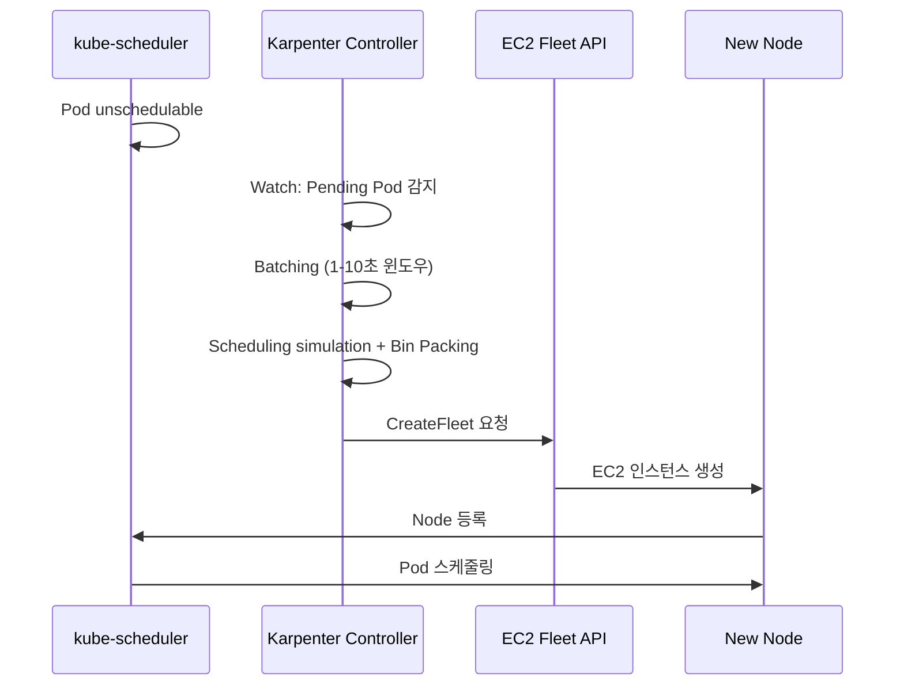

# Karpenter

[CAS](3_node-autoscaling.md#cas---cluster-autoscaler)의 ASG 의존성, 폴링 기반 아키텍처, 노드 그룹 사전 구성 요구사항은 클러스터 규모가 커질수록 운영 복잡도를 높입니다. Karpenter는 이러한 구조적 제약을 재설계하여 Kubernetes 네이티브 방식으로 노드 수명 주기를 관리합니다.

---

## Why Karpenter

2021년 AWS가 v0.5를 발표한 이후 Karpenter는 단순한 CAS 대안에서 완전한 Kubernetes 네이티브 노드 수명 주기 관리 솔루션으로 진화했습니다. 2024년 8월 v1.0 GA에 도달하면서 `NodePool`과 `EC2NodeClass` API가 안정화되었고, vendor-neutral 코어는 CNCF의 Kubernetes SIG Autoscaling에 기여되었습니다.[^karpenter-1-0]

[^karpenter-1-0]: [Announcing Karpenter 1.0](https://aws.amazon.com/blogs/containers/announcing-karpenter-1-0/) — v1.0 GA 발표 및 주요 변경사항.

CAS의 구조적 한계를 해결하기 위해 ASG 없이 EC2 Fleet API를 직접 호출하여 워크로드에 최적화된 인스턴스를 프로비저닝합니다.


*[Source: Amazon EKS 클러스터를 비용 효율적으로 오토스케일링하기](https://aws.amazon.com/ko/blogs/tech/amazon-eks-cluster-auto-scaling-karpenter-bp/)*

- **ASG 불필요**: EC2 Fleet API를 직접 사용하므로 ASG와 시작 템플릿 없이 인스턴스를 생성합니다
- **Kubernetes 네이티브**: Watch API로 Pending Pod를 감지하고, Labels와 Finalizers로 노드 수명 주기를 관리합니다
- **지능형 매칭**: 워크로드의 resource request, nodeSelector, topology spread, pod affinity를 분석하여 인스턴스 타입을 자동으로 매칭합니다
- **자동 Consolidation**: underutilized 노드를 자동으로 정리하거나 더 비용 효율적인 인스턴스로 교체합니다

CAS에서 On-Demand/Spot, Intel/Graviton, 인스턴스 사이즈를 조합하려면 최소 4~8개의 노드 그룹과 priority expander 설정이 필요합니다. Karpenter는 단일 NodePool의 requirements에 `capacity-type: [spot, on-demand]`, `arch: [amd64, arm64]`를 나열하는 것만으로 동일한 다양성을 달성합니다. 인스턴스 사이즈도 노드 그룹을 분리할 필요 없이 bin packing이 최적 사이즈를 자동 선택합니다.[^karpenter-best-practices] [^cas-blog]

[^karpenter-best-practices]: [AWS EKS Best Practices — Karpenter](https://docs.aws.amazon.com/eks/latest/best-practices/karpenter.html) 참고.
[^cas-blog]: [Amazon EKS 클러스터를 비용 효율적으로 오토스케일링하기](https://aws.amazon.com/ko/blogs/tech/amazon-eks-cluster-auto-scaling-karpenter-bp/) — CA와 Karpenter의 비용 최적화 사례 비교.

---

## Core CRDs

**NodePool**
:   노드 프로비저닝 요구사항을 정의합니다. `requirements`로 허용할 인스턴스 범위를 지정하고, `limits`로 NodePool이 관리하는 총 리소스 상한을 설정하며, `disruption` 정책으로 노드 교체 전략을 선언합니다. `limits`를 지정하지 않으면 리소스 상한이 없으므로 billing alarm 설정을 권장합니다.

```yaml title="NodePool 예시"
apiVersion: karpenter.sh/v1
kind: NodePool
metadata:
  name: default
spec:
  template:
    metadata:
      labels:
        billing-team: my-team
    spec:
      nodeClassRef:
        group: karpenter.k8s.aws
        kind: EC2NodeClass
        name: default
      expireAfter: 720h  # (1)
      terminationGracePeriod: 48h  # (2)
      requirements:
        - key: karpenter.k8s.aws/instance-category
          operator: In
          values: ["c", "m", "r"]
        - key: karpenter.k8s.aws/instance-generation
          operator: Gt
          values: ["4"]
        - key: kubernetes.io/arch
          operator: In
          values: ["amd64", "arm64"]
        - key: karpenter.sh/capacity-type
          operator: In
          values: ["spot", "on-demand"]
  limits:
    cpu: "1000"
    memory: 1000Gi
  disruption:
    consolidationPolicy: WhenEmptyOrUnderutilized
    consolidateAfter: 1m
    budgets:
      - nodes: "10%"
      - nodes: "0"
        schedule: "0 9 * * mon-fri"
        duration: 8h
        reasons:
          - Drifted
          - Underutilized
      - nodes: "100%"
        reasons:
          - Empty
  weight: 50  # (3)
```

1. 최대 노드 수명. 이 시간이 지나면 강제 만료(disruption) 시작.
2. 만료/드리프트 시작 후 이 기간 내에 drain이 완료되지 않으면 Pod를 강제 삭제. PDB나 do-not-disrupt가 차단하더라도 이 기간 후에는 노드가 삭제됩니다.
3. 여러 NodePool이 매칭될 때 높은 weight가 우선. 상호 배타적이지 않은 NodePool에서 일관된 스케줄링 동작을 보장합니다.

**EC2NodeClass**
:   AWS에 특화된 설정을 정의합니다. AMI, 서브넷, 보안 그룹을 태그 기반으로 자동 탐색하며, 노드의 스토리지와 메타데이터 접근을 제어합니다.

```yaml title="EC2NodeClass 예시"
apiVersion: karpenter.k8s.aws/v1
kind: EC2NodeClass
metadata:
  name: default
spec:
  role: "KarpenterNodeRole-${CLUSTER_NAME}"  # (1)
  amiSelectorTerms:
    - alias: al2023@v20240807  # (2)
  subnetSelectorTerms:
    - tags:
        karpenter.sh/discovery: "${CLUSTER_NAME}"  # (3)
  securityGroupSelectorTerms:
    - tags:
        karpenter.sh/discovery: "${CLUSTER_NAME}"
  blockDeviceMappings:
    - deviceName: /dev/xvda
      ebs:
        volumeSize: 100Gi
        volumeType: gp3
        encrypted: true
        deleteOnTermination: true
  metadataOptions:
    httpEndpoint: enabled
    httpProtocolIPv6: disabled
    httpPutResponseHopLimit: 1  # (4)
    httpTokens: required  # (5)
```

1. Karpenter가 인스턴스 프로파일을 자동 관리합니다. Private cluster에서는 대신 `instanceProfile`을 직접 지정해야 합니다.
2. 운영 환경에서는 `@latest` 대신 특정 버전을 고정하여 테스트되지 않은 AMI 배포를 방지합니다. `al2023`, `al2`, `bottlerocket`, `windows2019`, `windows2022` 패밀리를 지원합니다.
3. `kubernetes.io/cluster/$CLUSTER_NAME` 태그 대신 `karpenter.sh/discovery`를 사용합니다. 전자는 AWS Load Balancer Controller와 충돌할 수 있습니다.
4. hop limit 1은 컨테이너에서 IMDS 접근을 차단합니다. Pod가 IMDS에 의존하는 경우 값을 2로 올려야 합니다.
5. IMDSv2를 강제합니다. v1.0부터 기본값입니다.

**NodeClaim**
:   Karpenter가 생성한 노드의 상태를 추적하는 읽기 전용 리소스입니다. 선택된 인스턴스 타입, AZ, allocatable 리소스, 현재 상태 조건(`Drifted`, `Expired`, `Empty` 등)을 표시합니다. v1.0부터 NodeClaim은 불변(immutable)이며, 변경이 필요하면 새 NodeClaim으로 교체됩니다.

---

## Scheduling

Karpenter는 Pod의 스케줄링 요구사항을 layered constraints로 평가합니다. NodePool의 requirements와 Pod의 constraints가 교차하는 범위에서만 인스턴스를 프로비저닝하며, 교집합이 없으면 노드가 생성되지 않습니다.

**Resource Requests**
:   인스턴스 타입 선택에는 `requests`만 사용됩니다. `limits`는 인스턴스 선택에 영향을 주지 않지만, 리소스 오버서브스크립션을 허용하는 용도로 설정할 수 있습니다.

**Node Affinity**
:   preferred affinity를 먼저 required로 시도한 뒤, 충족할 수 없으면 weight가 낮은 것부터 점진적으로 완화합니다. preferred constraints는 새 노드 생성으로 충족하려 하므로 예상보다 많은 노드가 생성될 수 있습니다.

**Topology Spread**
:   `topologySpreadConstraints`로 AZ, 호스트, capacity type 간 분산을 지정합니다. Karpenter는 비용 최적화를 유지하면서 topology 제약을 준수합니다.

**Storage Topology**
:   Pod → PersistentVolumeClaim → StorageClass 참조를 추적하여 PV가 존재하는 AZ에 자동으로 노드를 생성합니다. PV를 위해 단일 서브넷 전용 노드 그룹을 별도로 구성할 필요가 없습니다.

---

## Provisioning Flow



### Batching

Karpenter는 확장 윈도우 알고리즘을 사용하여 짧은 시간에 대량으로 발생하는 Pending Pod를 효율적으로 처리합니다. 첫 번째 Pending Pod 감지 후 1초간 새 Pending Pod가 발생하지 않으면 배치를 실행합니다. Pending Pod가 1초 간격 이내로 계속 발생하면 윈도우를 최대 10초까지 확장하여 단일 배치로 묶어 처리합니다.

이 batching 윈도우 덕분에 `kubectl scale --replicas=100` 같은 대량 스케일 아웃에서 개별 Pod마다 CreateFleet을 호출하지 않고, 전체를 하나의 bin packing 시뮬레이션으로 처리하여 최적의 인스턴스 조합을 결정합니다.

### Bin Packing

Karpenter는 스케줄링 시뮬레이션과 빈 패킹을 결합하여 최적의 인스턴스 조합을 결정합니다. 호스트 포트 충돌, 볼륨 토폴로지 제약, DaemonSet 스케줄링까지 고려하며, 작은 인스턴스 여러 개보다 큰 인스턴스 소수를 선호합니다.

비용 최적화가 리소스 utilization 최적화보다 우선합니다. Spot 인스턴스의 utilization이 낮더라도 On-Demand 대비 비용이 낮으면 해당 타입을 선택합니다.

???+ info "Why bin packing is hard"
    빈 패킹은 NP(Non-deterministic Polynomial time) 문제로, 최적해를 찾는 것은 계산량이 기하급수적으로 늘어납니다. Karpenter는 다음 순서로 실용적 근사해를 구합니다.

    1. **인스턴스 유형 디스커버리**: AWS API에서 사용 가능한 인스턴스 유형 목록을 조회합니다. 기본적으로 리전과 AZ에서 사용 가능한 모든 인스턴스 유형을 후보로 포함합니다.
    2. **비용 순 정렬**: 인스턴스 유형을 가격 기준으로 정렬합니다
    3. **요구사항 교집합**: NodePool requirements와 Pod scheduling constraints(nodeSelector, affinity, tolerations)의 교집합에 해당하는 인스턴스만 필터링합니다. GPU가 필요 없는 Pod는 GPU 인스턴스에 배치되지 않습니다.
    4. **가상 인스턴스 대입 시뮬레이션**: 필터링된 인스턴스 유형에 Pending Pod를 가상으로 배치하여 가장 비용 효율적인 조합을 선택합니다

---

## Instance Selection Strategy

Karpenter는 capacity type에 따라 다른 할당 전략을 사용합니다.

**On-Demand 할당 전략**: `lowest-price`
:   후보 인스턴스 중 가장 저렴한 인스턴스를 선택합니다.

**Spot 할당 전략**: `price-capacity-optimized`
:   가용 용량이 높으면서 가격이 낮은 풀을 선택합니다. 단순 최저가(`lowest-price`)보다 가용성을 함께 고려하여 Spot 회수 빈도를 줄입니다.[^spot-allocation]

[^spot-allocation]: [EC2 Fleet allocation strategies](https://docs.aws.amazon.com/AWSEC2/latest/UserGuide/ec2-fleet-allocation-strategy.html) — `price-capacity-optimized`는 중단 위험이 낮고 가격이 저렴한 풀을 선택합니다.

Spot 인스턴스를 사용할 때는 단일 인스턴스 타입에 의존하지 않고 다양한 타입을 후보로 제공해야 합니다. Karpenter의 requirements를 과도하게 제한하면 특정 인스턴스 유형이 모두 회수될 때 대체 용량을 확보할 수 없습니다. `ec2-instance-selector` CLI로 요구사항에 맞는 인스턴스 유형 목록을 확인할 수 있습니다.

```bash
# vCPU 2개, 메모리 4GB, x86_64 아키텍처 조건에 맞는 인스턴스 조회
ec2-instance-selector --memory 4 --vcpus 2 --cpu-architecture x86_64 -r ap-northeast-2
```


*[Source: AWS EKS Best Practices — Spot Mixed Instance Policy](https://docs.aws.amazon.com/eks/latest/best-practices/cas.html)*

---

## Disruption

Karpenter의 중단 메커니즘은 자발적(voluntary)과 비자발적(involuntary)으로 나뉩니다. Consolidation과 Drift는 자발적 중단으로 disruption budget을 준수하며, Expiration과 Interruption은 비자발적 중단으로 budget과 무관하게 즉시 실행됩니다.

**Consolidation** (자발적)
:   클러스터의 컴퓨팅 비용을 줄이기 위해 노드를 삭제하거나 더 저렴한 인스턴스로 교체합니다. 다음 순서로 실행됩니다.

    1. **Empty Node Consolidation**: 빈 노드를 병렬로 삭제
    2. **Multi-node Consolidation**: 2개 이상의 노드를 삭제하고, 필요 시 단일 저가 노드로 교체
    3. **Single-node Consolidation**: 개별 노드를 삭제하거나 저가 노드로 교체

    두 가지 정책을 지원합니다.

    - `WhenEmpty`: DaemonSet Pod만 남은 노드를 삭제
    - `WhenEmptyOrUnderutilized` (기본값): 빈 노드 삭제에 더해, utilization이 낮은 노드를 더 작거나 저렴한 인스턴스로 교체

    `consolidateAfter`로 consolidation 평가까지 대기 시간을 설정합니다(기본값 `0s`). 워크로드 급증이 잦은 환경에서는 `1m` 이상으로 설정하여 노드 churn을 줄입니다.

**Drift** (자발적)
:   NodePool이나 EC2NodeClass의 spec 변경(requirements, subnetSelectorTerms, securityGroupSelectorTerms, amiSelectorTerms)을 감지하면 기존 노드를 `Drifted` 상태로 표시하고 새 설정으로 교체합니다. AMI selector가 resolved한 실제 AMI ID가 변경되면(새 AMI 발행 등) CRD 변경 없이도 drift가 발생합니다. EKS Control Plane 업그레이드 후 해당 버전의 AMI로 자동 교체되어 버전 불일치를 해소합니다.

**Expiration** (비자발적)
:   기본 720시간(30일)이 경과하면 노드를 강제 교체합니다. 오래된 노드에 보안 패치가 누락되는 것을 방지하는 메커니즘입니다. `expireAfter`는 노드가 존재할 수 있는 최대 시간이며, 보장된 최소 수명이 아닙니다. Consolidation이나 Drift가 만료보다 먼저 노드를 교체할 수 있습니다. 노드가 실제로 존재할 수 있는 절대 최대 시간은 `expireAfter` + `terminationGracePeriod`입니다.

**Interruption** (비자발적)
:   Spot 회수(2분 사전 알림), 예정된 유지보수, 인스턴스 종료/중지 이벤트를 처리합니다. EventBridge가 이벤트를 SQS 큐로 전달하고, Karpenter가 `--interruption-queue` 인수로 지정된 큐를 폴링합니다. Spot 회수 시 대체 노드 프로비저닝과 기존 노드 drain을 병렬로 수행합니다.

!!! warning "Interruption Handler 충돌"
    Karpenter의 interruption handling과 AWS Node Termination Handler를 동시에 사용하면 안 됩니다. 두 컴포넌트가 같은 이벤트를 처리하려 해 충돌이 발생합니다.

### Disruption Budgets

Disruption budget은 동시에 중단할 수 있는 노드 수를 제한하여 가용성을 보호합니다. 기본값은 미지정 시 `nodes: 10%`입니다.

```yaml title="Disruption Budget 예시 — 업무 시간 보호"
disruption:
  budgets:
    - nodes: "0"                    # (1)
      schedule: "0 9 * * mon-fri"
      duration: 8h
      reasons:
        - Drifted
        - Underutilized
    - nodes: "100%"                 # (2)
      reasons:
        - Empty
    - nodes: "10%"                  # (3)
      reasons:
        - Drifted
        - Underutilized
```

1. 월-금 09:00 UTC부터 8시간 동안 Drift/Underutilized 사유의 중단을 완전 차단합니다.
2. Empty 노드는 항상 100% 삭제 가능하여 비용을 즉시 절감합니다.
3. 그 외 시간에는 10%까지 중단을 허용합니다.

Budget은 자발적 중단(Consolidation, Drift)에만 적용됩니다. Expiration과 Interruption은 budget을 무시합니다. 여러 budget이 정의되면 가장 제한적인 값이 적용됩니다.

### Pod-Level Disruption Controls

**`karpenter.sh/do-not-disrupt: "true"`**
:   Pod에 이 annotation을 추가하면 Karpenter의 자발적 중단(Consolidation, Drift)을 차단합니다. 장시간 실행되는 배치 작업이나 체크포인트가 없는 ML 학습 Job에 유용합니다. 단, `terminationGracePeriod`가 만료되면 이 annotation이 있어도 노드가 삭제됩니다. Expiration과 Interruption도 이 annotation을 무시합니다.

**Pod Disruption Budget (PDB)**
:   Karpenter는 PDB를 존중합니다. 단일 blocking PDB가 노드 전체의 자발적 중단을 막을 수 있으므로, `minAvailable`은 전체 replica 수보다 충분히 낮게 설정해야 합니다.

!!! tip "Consolidation behavior"
    큰 노드 하나가 작은 노드 여러 개보다 저렴하면 자동으로 통합합니다. 반대로 워크로드 감소 시 더 작은 인스턴스로 교체하여 비용을 절감합니다. Consolidation 사용 시 CPU를 제외한 모든 리소스에 대해 `requests=limits`를 설정하면 예측 가능한 동작을 보장합니다. limits가 requests보다 크면 여러 Pod가 동시에 burst할 때 OOM Kill이 발생할 수 있으며, consolidation이 이 상황을 악화시킵니다.

### Spot-to-Spot Consolidation

Spot 인스턴스 간 교체는 On-Demand 교체와 다른 제약이 있습니다. 특정 인스턴스 타입에 집중하면 해당 풀의 가용 용량이 줄어들고 중단 빈도가 높아지므로, Karpenter는 단일 노드 Spot-to-Spot 교체 시 최소 15개 인스턴스 유형을 요구합니다. 이 조건을 충족하지 못하면 교체를 건너뜁니다. 다중 노드 통합(여러 노드를 하나로 합치는 경우)에는 이 제약이 적용되지 않습니다.

---

## NodePool Configuration Strategies

| Strategy | Description | Use Case |
|---|---|---|
| Single | 하나의 NodePool로 다양한 워크로드 처리 | 단순한 클러스터 |
| Multiple | 팀별/워크로드별 NodePool 분리. requirements를 상호 배타적으로 설정하여 일관된 스케줄링 동작을 보장. GPU NodePool에 taint를 설정하고 워크로드에 toleration을 추가 | 멀티테넌트, GPU/CPU 분리 |
| Weighted | `weight` 필드로 NodePool 우선순위 지정. 높은 weight가 우선 선택됨 | On-Demand/Spot 비율 제어, Reserved → Spot fallback |

Karpenter 컨트롤러 자체는 Karpenter가 관리하는 노드에서 실행하면 안 됩니다. 컨트롤러가 자기 노드를 교체하면 스케일링이 중단될 수 있으므로, EKS Fargate 또는 별도 MNG(Managed Node Group)에 배치해야 합니다.

### On-Demand:Spot Ratio Control

On-Demand와 Spot 인스턴스의 비율을 제어하려면 각 capacity type별 NodePool을 분리하고, 사용자 정의 레이블과 `topologySpreadConstraints`를 조합합니다. 예를 들어 On-Demand NodePool에 `capacity-spread: "1"`, Spot NodePool에 `capacity-spread: ["2","3","4","5"]`를 할당하면 1:4 비율로 Pod가 분산됩니다.

```yaml title="Deployment — topologySpreadConstraints로 비율 제어"
spec:
  topologySpreadConstraints:
    - maxSkew: 1
      topologyKey: capacity-spread
      whenUnsatisfiable: DoNotSchedule
      labelSelector:
        matchLabels:
          app: my-app
```

CAS의 priority expander로는 우선순위는 지정할 수 있지만 비율 제어는 어렵습니다. Karpenter는 `topologySpreadConstraints`를 활용하여 On-Demand로 최소 수준의 안정성을 보장하면서 Spot으로 비용을 절감하는 구성이 가능합니다.[^cas-blog]

---

## Over-Provisioning

Karpenter를 사용해도 EC2 인스턴스 부팅과 DaemonSet 설치에 최소 1-2분이 소요됩니다. CAS와 동일하게 [우선순위 낮은 placeholder Pod](3_node-autoscaling.md#over-provisioning-with-placeholder-pods)로 예비 용량을 미리 확보하는 전략이 유효합니다.

KEDA와 연계하면 대규모 트래픽 증가가 예상되는 시간대에 미리 placeholder replica를 늘려, 실제 워크로드 급증 시점에 노드가 이미 준비된 상태를 만들 수 있습니다.

---

## Private Cluster Considerations

인터넷 접근이 없는 Private EKS 클러스터에서 Karpenter를 운영하려면 추가 VPC endpoint가 필요합니다. Karpenter 컨트롤러는 IRSA를 통해 자격 증명을 획득하며, AMI 정보를 SSM Parameter Store에서 조회합니다.

**필수 VPC Endpoint**
:   - **STS**: IRSA 자격 증명 획득에 필요. 없으면 `WebIdentityErr: failed to retrieve credentials` 오류 발생
    - **SSM**: AMI ID 조회에 필요. 없으면 `Unable to hydrate the AWS launch template cache` 오류 발생
    - **EC2**: 인스턴스 프로비저닝에 필요

**Price List API 제한**
:   Price List Query API는 VPC endpoint를 지원하지 않습니다. Private cluster에서는 가격 데이터가 시간이 지남에 따라 오래됩니다. Karpenter는 바이너리에 On-Demand 가격 데이터를 내장하여 이를 보완하지만, Karpenter 업그레이드 시에만 갱신됩니다.

---

## EKS Auto Mode

EKS Auto Mode는 Karpenter의 노드 관리 기능을 AWS가 완전히 대행하는 서비스입니다. AMI 선택, 보안 패치, 노드 교체를 AWS가 처리하며, SSH/SSM 접근이 차단된 불변(immutable) 노드로 운영됩니다. 기본 `expireAfter`는 336시간(14일), `terminationGracePeriod`는 24시간입니다.

자체 설치한 Karpenter와 EKS Auto Mode를 동시에 운영하는 것도 가능하지만, NodePool을 분리하여 워크로드가 한쪽에만 할당되도록 구성해야 합니다.[^auto-mode]

[^auto-mode]: [EKS Auto Mode](https://docs.aws.amazon.com/eks/latest/userguide/automode.html) — Karpenter 기반 완전관리형 노드 관리.

---

## Node Auto Repair

Karpenter v1.1.0에서 alpha로 도입된 기능으로, kubelet 상태를 모니터링하여 비정상 노드를 자동 교체합니다. `NodeRepair=true` feature gate로 활성화합니다.

**감시 조건**
:   - `Ready` 조건이 `False` 또는 `Unknown` 상태로 30분 이상 지속
    - 하드웨어/네트워크/스토리지 관련 agent 조건이 비정상 상태로 10-30분 지속

**안전장치**
:   NodePool 전체 노드의 20% 이상이 unhealthy이면 auto repair가 중단되어 대규모 장애 시 연쇄 교체를 방지합니다. Auto repair는 drain/grace period를 건너뛰고 즉시 교체합니다.

---

## Best Practices

**LimitRanges로 기본 requests 설정**
:   Kubernetes는 기본 requests/limits를 설정하지 않으므로, requests 없는 Pod는 Karpenter의 인스턴스 선택 정확도를 떨어뜨립니다. 네임스페이스별 LimitRange로 기본값을 강제합니다.

**Billing alarm 설정**
:   `spec.limits`를 설정하지 않으면 Karpenter는 무한히 노드를 추가합니다. limits 설정과 함께 CloudWatch billing alarm 또는 AWS Cost Anomaly Detection을 구성합니다.

**CoreDNS lameduck duration**
:   Karpenter의 동적인 노드 생성/삭제로 CoreDNS Pod가 빈번히 이동할 수 있습니다. CoreDNS에 lameduck duration을 설정하면 종료 중인 CoreDNS Pod로의 DNS 쿼리 실패를 줄입니다.

---

## Observability

Karpenter는 `karpenter_*` 접두사로 Prometheus 메트릭을 노출합니다.

=== "Provisioning"

    | Metric | Type | Description |
    |---|---|---|
    | `karpenter_nodes_created_total` | Counter | Karpenter가 생성한 총 노드 수 |
    | `karpenter_nodeclaims_created_total` | Counter | 생성된 총 NodeClaim 수 |
    | `karpenter_nodes_allocatable` | Gauge | 노드별 allocatable 리소스 |
    | `karpenter_nodes_total_pod_requests` | Gauge | 노드에 바인딩된 Pod의 총 resource requests |
    | `karpenter_pods_startup_duration_seconds` | Histogram | Pod 생성부터 Running까지 소요 시간 |

=== "Disruption"

    | Metric | Type | Description |
    |---|---|---|
    | `karpenter_voluntary_disruption_decisions_total` | Counter | 수행된 중단 결정 수 |
    | `karpenter_voluntary_disruption_eligible_nodes` | Gauge | 중단 대상 적격 노드 수 |
    | `karpenter_nodeclaims_disrupted_total` | Counter | 중단된 총 NodeClaim 수 |
    | `karpenter_nodes_drained_total` | Counter | drain된 총 노드 수 |
    | `karpenter_voluntary_disruption_consolidation_timeouts_total` | Counter | Consolidation 알고리즘 타임아웃 횟수 |

=== "NodePool"

    | Metric | Type | Description |
    |---|---|---|
    | `karpenter_nodepools_usage` | Gauge | NodePool별 프로비저닝된 리소스 사용량 |
    | `karpenter_nodepools_limit` | Gauge | NodePool에 설정된 리소스 상한 |
    | `karpenter_nodepools_allowed_disruptions` | Gauge | NodePool당 허용된 동시 중단 수 |

=== "Interruption"

    | Metric | Type | Description |
    |---|---|---|
    | `karpenter_interruption_received_messages_total` | Counter | SQS 큐에서 수신한 메시지 수 |
    | `karpenter_interruption_deleted_messages_total` | Counter | SQS 큐에서 삭제한 메시지 수 |
    | `karpenter_interruption_message_queue_duration_seconds` | Histogram | 인터럽션 메시지가 큐에 머문 시간 |

공식 Grafana 대시보드(capacity-dashboard, performance-dashboard)를 import하여 운영 가시성을 확보할 수 있습니다.[^karpenter-docs]

[^karpenter-docs]: [Karpenter Concepts](https://karpenter.sh/docs/concepts/) 및 [AWS EKS Best Practices — Karpenter](https://docs.aws.amazon.com/eks/latest/best-practices/karpenter.html) 참고.
