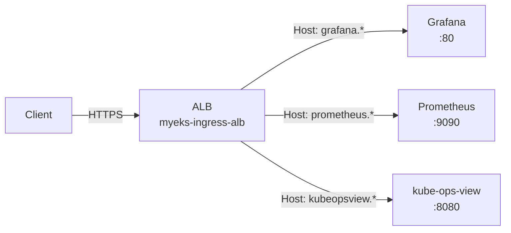

# Lab

실습 스크립트와 매니페스트는 [:octicons-mark-github-16: labs/week3/](https://github.com/pyy0715/eks-pratice/tree/main/labs/week3) 디렉터리를 참고하세요.

이 실습은 `myeks` 클러스터(Terraform)에서 진행합니다. Pod 수준 오토스케일링(HPA, VPA+KRR, KEDA)과 Node 수준 오토스케일링(CPA, CAS, Karpenter)을 순차적으로 실습합니다. Karpenter는 `terraform-aws-modules/eks/aws//modules/karpenter` 서브모듈을 통해 기존 클러스터에 추가됩니다. Prometheus/Grafana와 eks-node-viewer로 스케일링 동작을 관찰합니다.

---

## Environment Setup

### Terraform Deploy

Week 2와 달리 노드가 private subnet에 배치됩니다. 인터넷 접근을 위해 NAT Gateway가 포함되고, SSM으로 노드에 접속합니다. metrics-server와 external-dns는 EKS addon으로 설치됩니다.

```bash
cd labs/week3
terraform init && terraform apply -auto-approve
```

### Configure kubectl

```bash
eval $(terraform output -raw configure_kubectl)
kubectl config rename-context $(kubectl config current-context) myeks
kubectl get node -owide
```

### Verify Addons

```bash
aws eks list-addons --cluster-name myeks | jq

# metrics-server
kubectl get deploy -n kube-system metrics-server
kubectl top node

# external-dns (policy=sync 확인)
kubectl describe deploy -n external-dns external-dns | grep -A6 Args
```

### SSM Access

노드에 SSH 대신 SSM Session Manager로 접근합니다.

```bash
# SSM 관리 대상 인스턴스 목록 조회
aws ssm describe-instance-information \
  --query "InstanceInformationList[*].{InstanceId:InstanceId, Status:PingStatus, OS:PlatformName}" \
  --output table

# 인스턴스 접속
aws ssm start-session --target <INSTANCE_ID>
```

### Environment Variables

이후 모든 실습에서 사용할 환경변수를 설정합니다.

```bash
source labs/week3/00_env.sh
```

---

## Monitoring Stack

모든 실습의 관찰 레이어로 사용할 Prometheus, Grafana, kube-ops-view를 설치합니다.

세 서비스 모두 ClusterIP Service로 배포하되, 각각의 Ingress에 동일한 `alb.ingress.kubernetes.io/group.name: study`를 설정합니다. AWS LBC는 같은 group name을 가진 Ingress들을 하나의 ALB로 합치고, 각 Ingress의 `host` 필드를 ALB listener rule로 변환합니다. 결과적으로 ALB 1대가 Host 헤더 기반으로 `grafana.$MyDomain`, `prometheus.$MyDomain`, `kubeopsview.$MyDomain` 트래픽을 각각의 target group으로 라우팅합니다.



설치 스크립트가 완료되면 아래 URL로 접속할 수 있습니다.

| Service | URL | Credentials |
|---|---|---|
| Grafana | `https://grafana.$MyDomain` | admin / prom-operator |
| Prometheus | `https://prometheus.$MyDomain` | — |
| Kube Ops View | `https://kubeopsview.$MyDomain/#scale=1.5` | — |

=== "AWS LBC"

    Ingress에서 ALB를 프로비저닝하려면 AWS Load Balancer Controller가 필요합니다.

    ```bash
    bash labs/week3/01_lbc-install.sh
    ```

=== "Prometheus & Grafana"

    kube-prometheus-stack Helm chart 하나로 아래 컴포넌트가 함께 설치됩니다.

    | Component | Role |
    |---|---|
    | **Prometheus** (StatefulSet) | 메트릭 수집/저장. `additionalScrapeConfigs`로 EKS control plane 메트릭도 수집 |
    | **Grafana** (Deployment) | 대시보드 시각화. `grafana_dashboard="1"` label이 붙은 ConfigMap을 sidecar가 자동 감지 |
    | **kube-state-metrics** (Deployment) | K8s 오브젝트 상태(HPA desired replicas, Pod phase 등)를 Prometheus 메트릭으로 변환 |
    | **node-exporter** (DaemonSet) | 각 노드의 CPU/Memory/Disk 등 OS 수준 메트릭 수집 |
    | **Prometheus Operator** (Deployment) | `ServiceMonitor`/`PodMonitor` CRD를 감시하여 Prometheus scrape 설정을 자동 관리 |

    별도로 **kube-ops-view**도 함께 설치합니다. 클러스터의 노드/Pod 배치를 실시간으로 시각화하여, 스케일링 과정에서 Pod이 어떤 노드에 배치되는지 직관적으로 확인할 수 있습니다.

    ```bash
    bash labs/week3/02_monitoring-install.sh
    ```

=== "Verify"

    EKS control plane 메트릭이 수집되는지 확인합니다.

    ```bash
    kubectl get apiservices | grep metrics
    # v1.metrics.eks.amazonaws.com   → ksh/kcm 메트릭
    # v1beta1.metrics.k8s.io         → metrics-server
    ```

    Prometheus Target 페이지에서 `apiserver`, `ksh-metrics`, `kcm-metrics` job이 UP 상태인지 확인합니다.

    ???+ info "EKS Control Plane Metrics Scrape"
        EKS는 kube-scheduler(ksh)와 kube-controller-manager(kcm) 메트릭을 Kubernetes API 경로로 노출합니다. Prometheus가 이 경로를 scrape하려면 두 가지가 필요합니다.

        1. `additionalScrapeConfigs`에 scrape job 등록 — Prometheus가 Kubernetes API endpoints를 service discovery로 찾고, 아래 경로에서 메트릭을 수집합니다. apiserver 자체는 kube-prometheus-stack이 내장 `kubeApiServer.serviceMonitor`로 이미 수집합니다.

            | Job | Source | Metrics Path |
            |---|---|---|
            | `apiserver` | 내장 ServiceMonitor | `/metrics` (default kubernetes endpoint) |
            | `ksh-metrics` | additionalScrapeConfigs | `/apis/metrics.eks.amazonaws.com/v1/ksh/container/metrics` |
            | `kcm-metrics` | additionalScrapeConfigs | `/apis/metrics.eks.amazonaws.com/v1/kcm/container/metrics` |

        2. `ClusterRole` 권한 추가 — Prometheus ServiceAccount가 `metrics.eks.amazonaws.com` API group의 `kcm/metrics`, `ksh/metrics` 리소스에 `get` 권한이 필요합니다. Helm values의 `prometheus.additionalRulesForClusterRole`로 설정되어 있어서 `02_monitoring-install.sh` 실행 시 자동으로 포함됩니다.

        3. `cluster` 정적 라벨 추가 — kube-prometheus-stack 기본 dashboard는 `cluster="$cluster"`로 필터링합니다. scrape job(`ksh-metrics`, `kcm-metrics`)과 내장 `apiserver` ServiceMonitor 모두에 `cluster=myeks` 라벨을 추가합니다.

=== "eks-node-viewer"

    노드별 allocatable 대비 request 리소스를 실시간으로 표시합니다. 실제 사용량이 아닌 request 합계입니다.

    ```bash
    # macOS
    brew tap aws/tap
    brew install eks-node-viewer

    # 기본 사용
    eks-node-viewer

    # CPU + Memory + 노드 age
    eks-node-viewer --resources cpu,memory --extra-labels eks-node-viewer/node-age

    # AZ별 확인
    eks-node-viewer --extra-labels topology.kubernetes.io/zone
    ```

---

## Managed Node Groups (Optional)

기본 ng-1(On-Demand, amd64) 외에 ARM/Graviton과 Spot 노드 그룹을 추가할 수 있습니다. Terraform variable toggle로 제어합니다.

=== "ARM/Graviton (myeks-ng-2)"

    t4g.medium(ARM) 인스턴스에 `cpuarch=arm64:NoExecute` taint가 설정됩니다. toleration 없는 Pod은 배치되지 않습니다.

    ```bash
    terraform -chdir=labs/week3 apply -var="enable_ng2_arm=true" -auto-approve
    
    # 노드 확인
    kubectl get nodes --label-columns kubernetes.io/arch,eks.amazonaws.com/capacityType
    kubectl describe node -l tier=secondary | grep -i taint
    
    # sample pod 배포 (toleration 포함)
    kubectl apply -f labs/week3/manifests/node-groups/sample-arm64.yaml
    kubectl get pod -l app=sample-app -owide
    
    # 삭제
    kubectl delete -f labs/week3/manifests/node-groups/sample-arm64.yaml
    terraform -chdir=labs/week3 apply -var="enable_ng2_arm=false" -auto-approve
    ```

=== "Spot Instances (myeks-ng-3)"

    여러 인스턴스 타입(c5a.large, c6a.large, t3a.large, t3a.medium)으로 Spot 노드 그룹을 생성합니다. AWS가 Spot 인스턴스를 회수할 때 EKS managed node group이 새 Spot 노드를 먼저 띄우고, Ready 상태가 되면 기존 노드를 cordon → drain하여 Pod을 이동시킵니다. Node Termination Handler 같은 별도 도구가 필요 없습니다.

    ```bash
    terraform -chdir=labs/week3 apply -var="enable_ng3_spot=true" -auto-approve
    
    # Spot 노드 확인
    kubectl get nodes -L eks.amazonaws.com/capacityType
    eks-node-viewer --extra-labels eks-node-viewer/node-age
    
    # Spot 가격 조회
    aws ec2 describe-spot-price-history \
      --instance-types c5a.large c6a.large \
      --product-descriptions "Linux/UNIX" \
      --max-items 10 \
      --query "SpotPriceHistory[].{Type:InstanceType,Price:SpotPrice,AZ:AvailabilityZone}" \
      --output table
    
    # sample pod 배포
    kubectl apply -f labs/week3/manifests/node-groups/sample-spot.yaml
    kubectl get pod busybox-spot -owide
    
    # 삭제
    kubectl delete -f labs/week3/manifests/node-groups/sample-spot.yaml
    terraform -chdir=labs/week3 apply -var="enable_ng3_spot=false" -auto-approve
    ```

---

여기서부터 Pod 수준 오토스케일링을 실습합니다. HPA(수평), VPA+KRR(수직/추천), KEDA(이벤트 기반) 순서로 진행합니다.

## HPA

CPU 사용률이 목표치를 초과하면 Pod replica 수를 늘리고, 낮아지면 줄입니다. 목표 replica 수는 `desiredReplicas = ceil(currentReplicas × currentMetric / targetMetric)`으로 결정됩니다. Scale-out은 즉시 실행되지만, scale-in은 기본 5분간 안정화 기간(stabilization window)을 거친 뒤 반영됩니다.

### Deploy

```bash
kubectl apply -f labs/week3/manifests/hpa/php-apache.yaml
kubectl apply -f labs/week3/manifests/hpa/curl-pod.yaml
kubectl apply -f labs/week3/manifests/hpa/hpa-policy.yaml

# HPA 상태 확인
kubectl describe hpa php-apache
```

php-apache는 `requests.cpu=200m`이므로 `averageUtilization: 50`은 100m 이상에서 scale-out을 트리거합니다.

### Load Test

```bash
# sleep 간격을 줄이면 부하가 증가합니다
kubectl exec curl -- sh -c 'while true; do curl -s php-apache; sleep 0.5; done'
kubectl exec curl -- sh -c 'while true; do curl -s php-apache; sleep 0.1; done'
kubectl exec curl -- sh -c 'while true; do curl -s php-apache; sleep 0.01; done'
```

### Observe

부하 발생 중 별도 터미널에서 HPA와 Pod 상태를 관찰합니다.

=== "HPA Status"

    ```bash
    kubectl get hpa php-apache -w
    ```

=== "Pod Watch"

    ```bash
    kubectl get pod -l run=php-apache -w
    ```

Grafana의 **Kubernetes / Horizontal Pod Autoscaler** 대시보드에서 current/desired replicas, CPU utilization 변화를 확인합니다. Prometheus 직접 쿼리는 `kube_horizontalpodautoscaler_status_desired_replicas`를 사용합니다.

??? info
    kube-state-metrics가 노출하는 HPA 관련 메트릭을 HTTP로 직접 확인합니다.

    ```bash
    kubectl exec curl -- curl -s kube-prometheus-stack-kube-state-metrics.monitoring.svc:8080/metrics \
      | grep horizontalpodautoscaler | grep -v "^#"
    ```

부하를 중지하면 5분 후(기본 `scaleDown` stabilization) Pod이 감소합니다.

### Cleanup

```bash
kubectl delete -f labs/week3/manifests/hpa/
```

---

## VPA

HPA가 Pod 수를 조정했다면, VPA는 개별 Pod의 `resources.requests`를 최적화합니다. Off 모드로 추천값을 먼저 확인한 뒤, 동일한 워크로드를 KRR CLI로 분석하여 두 도구의 추천을 비교합니다. 마지막으로 Auto 모드로 전환하여 VPA가 실제 적용까지 수행하는 과정을 관찰합니다.

=== "Install"

    VPA의 세 컴포넌트(Recommender, Updater, Admission Controller)를 모두 활성화하여 설치합니다.

    ```bash
    helm repo add fairwinds-stable https://charts.fairwinds.com/stable
    helm repo update fairwinds-stable
    helm install vpa fairwinds-stable/vpa --namespace vpa --create-namespace
    ```

    ```bash
    # 컴포넌트 확인
    kubectl get deploy -n vpa
    ```

=== "Off Mode"

    hamster는 `yes` 명령으로 CPU 부하를 생성하는 VPA 공식 예제입니다. 의도적으로 낮은 CPU request(100m)를 설정하여 VPA가 under-provisioned 상태를 감지하는 것을 관찰합니다.

    ```bash
    kubectl apply -f labs/week3/manifests/vpa/hamster.yaml
    kubectl apply -f labs/week3/manifests/vpa/vpa-off.yaml

    # VPA Recommender가 메트릭을 분석하는 데 2~3분 소요
    kubectl get vpa hamster-vpa -w
    ```

    추천값이 생성되면 확인합니다.

    ```bash
    kubectl describe vpa hamster-vpa
    ```

    ```yaml title="Output"
    Status:
      Conditions:
        Type:                  RecommendationProvided
        Status:                True
      Recommendation:
        Container Recommendations:
          Container Name:  hamster
          Lower Bound:                         # (1)!
            Cpu:     15m
            Memory:  100Mi
          Target:                              # (2)!
            Cpu:     587m
            Memory:  100Mi
          Uncapped Target:                     # (3)!
            Cpu:     587m
            Memory:  100Mi
          Upper Bound:                         # (4)!
            Cpu:     25358987m
            Memory:  496811500000
    ```

    1.  **Lower Bound** — `requests`가 이 값 미만이면 VPA가 Pod을 evict하는 하한선. 현재 100m은 15m보다 크므로 evict 대상은 아니지만, Target(587m)과 격차가 커서 under-provisioned 상태입니다.

    2.  **Target** — VPA가 `requests`에 실제로 적용할 값. Auto 모드에서 Pod 재시작 시 이 값이 새 Pod의 `resources.requests`에 반영됩니다. hamster가 평균 ~500m CPU를 사용하므로 그 근처로 수렴합니다.

    3.  **Uncapped Target** — `resourcePolicy.containerPolicies`의 `minAllowed`/`maxAllowed` 제약이 적용되기 **전**의 Target 값. 추천이 범위를 벗어나면 `Target`은 경계값으로 cap되고 `Uncapped Target`은 원본을 유지합니다. 현재 출력은 resourcePolicy를 설정하지 않았으므로 두 값이 587m로 동일합니다.

    4.  **Upper Bound** — `requests`가 이 값 초과면 VPA가 Pod을 evict하는 상한선. 초기에는 관측 데이터가 적어 confidence interval이 넓게 산출되며, 시간이 지날수록 Target 근처로 수렴합니다.

=== "KRR"

    [KRR(Kubernetes Resource Recommender)](https://github.com/robusta-dev/krr)은 Prometheus 데이터를 분석하여 추천값을 제공하는 CLI 도구입니다. 클러스터에 아무것도 설치하지 않고 로컬에서 실행합니다. 현재 hamster는 여전히 `requests: cpu=100m` 상태이므로, KRR도 VPA와 동일한 under-provisioned 상태를 관찰합니다.

    ```bash
    # macOS / Linux (Homebrew)
    brew tap robusta-dev/homebrew-krr
    brew install krr
    ```
    
    Prometheus에 접근하여 추천값을 조회합니다.

    ```bash
    # Prometheus port-forward
    kubectl port-forward -n monitoring svc/kube-prometheus-stack-prometheus 9090:9090 &

    # 실습 환경은 데이터가 짧으므로 history와 points_required를 낮춰서 실행
    krr simple -p http://localhost:9090 \
      --history_duration 1 \
      --points_required 10 \
      --namespace default
    ```

    !!! warning
        KRR 기본값은 `--history_duration 336h`(14일), `--points_required 100`입니다. 실습 환경은 hamster가 배포된 지 몇 분밖에 안 되어 데이터 포인트가 부족하므로 기본값으로는 `NO METRICS`가 표시됩니다. 운영 환경에서는 기본값을 유지하는 것이 권장됩니다.

    KRR은 클러스터 전체 워크로드의 현재 requests/limits와 추천값을 표 형태로 출력합니다. hamster의 KRR 추천값과 VPA의 Target을 비교하세요. 두 도구 모두 Prometheus 메트릭을 분석하므로 실제 사용량 기반 추천이 비슷한 범위로 수렴합니다.

    ??? info "KRR Parameters"
        | Parameter | Default | Description |
        |---|---|---|
        | `--cpu-min` | 10m | 최소 CPU 추천값 |
        | `--mem-min` | 100Mi | 최소 Memory 추천값 |
        | `--history_duration` | 336h (14d) | 분석할 Prometheus 히스토리 기간 |
        | `--points_required` | 100 | 추천 생성에 필요한 최소 데이터 포인트 수 |
        | `--cpu_percentile` | 99 | CPU 추천에 사용할 백분위수 |
        | `--memory_buffer_percentage` | 15 | 피크 메모리 대비 추가 버퍼(%) |

=== "Auto Mode"

    Off 모드와 KRR로 추천값을 확인했으므로, Auto 모드로 전환하여 VPA가 실제로 Pod에 추천값을 적용하는 과정을 관찰합니다.

    ```bash
    # [별도 터미널] Pod 관찰
    kubectl get pod -l app=hamster -w
    ```

    ```bash
    kubectl apply -f labs/week3/manifests/vpa/vpa-auto.yaml
    ```

    Updater가 기존 Pod을 evict하고, ReplicaSet이 새 Pod을 생성할 때 Admission Controller가 Pod spec의 `resources.requests`를 추천값으로 변경합니다.

    ```bash
    # 재시작된 Pod의 resources 확인
    kubectl get pod -l app=hamster -o jsonpath='{range .items[*]}{.metadata.name}{"\t"}{.spec.containers[0].resources}{"\n"}{end}'
    ```

    CPU request가 100m에서 ~500m으로 변경된 것을 확인합니다.

### Cleanup

```bash
kubectl delete -f labs/week3/manifests/vpa/
helm uninstall vpa -n vpa
kubectl delete namespace vpa
```

---

## KEDA

HPA는 CPU/Memory 메트릭에 반응하지만, KEDA는 외부 이벤트 소스(cron, SQS, Kafka, Prometheus 등)를 기반으로 HPA를 내부적으로 생성하여 Pod을 스케일링합니다. 여기서는 cron trigger와 Prometheus scaler를 테스트합니다.

### Deploy

```bash
helm repo add kedacore https://kedacore.github.io/charts
helm repo update
helm install keda kedacore/keda --version 2.16.0 \
  --namespace keda --create-namespace \
  -f labs/week3/manifests/keda/keda-values.yaml

# CRD 및 External Metrics API 확인
kubectl get crd | grep keda
kubectl get --raw "/apis/external.metrics.k8s.io/v1beta1" | jq

# php-apache 배포
kubectl apply -f labs/week3/manifests/keda/php-apache.yaml -n keda
```

### Observe

=== "Cron Trigger"

    cron trigger가 짝수 분(0, 2, 4, ...)에 활성화되어 Pod 1개로 scale-out합니다. 홀수 분(1, 3, 5, ...)에 cron 구간이 종료되고, cooldownPeriod(30초) 경과 후 Pod 0개로 scale-in됩니다.

    ```bash
    kubectl apply -f labs/week3/manifests/keda/scaled-object-cron.yaml -n keda

    # ScaledObject 상태 실시간 — ACTIVE가 True/False로 전환
    kubectl get ScaledObject -n keda -w

    # KEDA가 생성한 HPA 스펙 확인
    kubectl get hpa -o jsonpath="{.items[0].spec}" -n keda | jq
    ```

    확인 후 cron ScaledObject를 삭제합니다.

    ```bash
    kubectl delete ScaledObject -n keda php-apache-cron-scaled
    ```

=== "Prometheus Scaler"

    Prometheus에 수집된 container CPU 사용률을 기반으로 스케일링합니다. 별도 애플리케이션 계측 없이 cAdvisor 메트릭을 활용합니다.

    ```bash
    # curl pod 배포 (부하 생성용)
    kubectl apply -f labs/week3/manifests/hpa/curl-pod.yaml

    # Prometheus ScaledObject 적용
    kubectl apply -f labs/week3/manifests/keda/scaled-object-prometheus.yaml -n keda
    ```

    ```bash
    # [별도 터미널] ScaledObject 상태 관찰
    kubectl get ScaledObject -n keda -w
    ```

    부하를 발생시켜 scale-out을 트리거합니다. php-apache의 container CPU rate가 `threshold: 0.1`을 초과하면 KEDA가 replica를 늘립니다.

    ```bash
    kubectl exec curl -- sh -c 'while true; do curl -s php-apache.keda; sleep 0.01; done'
    ```

    부하를 중지(++ctrl+c++)하면 cooldownPeriod(30초) 경과 후 0개까지 scale-to-zero됩니다.

    ```bash
    # KEDA가 생성한 HPA에서 external metric 확인
    kubectl get hpa -n keda -o yaml
    ```

Grafana의 **KEDA** 대시보드에서 scaler 활성화 이벤트와 external metric 값의 추이를 확인합니다.

### Cleanup

```bash
kubectl delete ScaledObject -n keda --all
kubectl delete -f labs/week3/manifests/hpa/curl-pod.yaml --ignore-not-found
kubectl delete deploy php-apache -n keda
helm uninstall keda -n keda
kubectl delete namespace keda
```

---

여기서부터 Node 수준 오토스케일링을 실습합니다. Pod이 늘어나 기존 노드에 수용할 수 없으면 노드 자체를 추가해야 합니다. CPA(비례), CAS(ASG 기반), Karpenter(EC2 Fleet 직접) 순서로 진행합니다.

## CPA

CPA는 Pod 부하가 아니라 **노드 수 변화**에 반응합니다. 노드가 늘어나면 시스템 서비스(CoreDNS 등)의 replica도 비례하여 증가시킵니다. `nodesToReplicas` ladder 정책으로 노드 수 구간별 replica 수를 지정합니다. 참고로 EKS CoreDNS addon에는 Terraform에서 autoscaling을 이미 활성화해두었습니다(`eks.tf` coredns 설정). CPA는 CoreDNS 외에도 범용적으로 사용할 수 있습니다.

```bash
# CoreDNS autoscaling 설정 확인
aws eks describe-addon --cluster-name myeks --addon-name coredns \
  --query 'addon.configurationValues' --output text | jq
```

### Deploy

```bash
helm repo add cluster-proportional-autoscaler \
  https://kubernetes-sigs.github.io/cluster-proportional-autoscaler

kubectl apply -f labs/week3/manifests/cpa/cpa-nginx.yaml

helm upgrade --install cluster-proportional-autoscaler \
  -f labs/week3/manifests/cpa/cpa-values.yaml \
  cluster-proportional-autoscaler/cluster-proportional-autoscaler
```

### Observe

ASG DesiredCapacity를 직접 조절하여 노드 수를 변경하고, nginx replica가 ladder 정책에 따라 변하는지 관찰합니다.

```bash
# 모니터링
kubectl get pod -l app=nginx -w

# ASG 이름 확인
export ASG_NAME=$(aws autoscaling describe-auto-scaling-groups \
  --query "AutoScalingGroups[? Tags[? (Key=='eks:cluster-name') && Value=='myeks']].AutoScalingGroupName" \
  --output text)

# 노드 5개로 증가 → nginx replica 5개
aws autoscaling update-auto-scaling-group \
  --auto-scaling-group-name ${ASG_NAME} \
  --min-size 5 --desired-capacity 5 --max-size 5

# 노드 2개로 축소 → nginx replica 2개
aws autoscaling update-auto-scaling-group \
  --auto-scaling-group-name ${ASG_NAME} \
  --min-size 2 --desired-capacity 2 --max-size 2
```

### Cleanup

```bash
helm uninstall cluster-proportional-autoscaler
kubectl delete -f labs/week3/manifests/cpa/cpa-nginx.yaml
```

---

## CAS

CPA는 노드 수에 반응하여 서비스 replica를 조정했지만, 노드 수 자체를 변경하지는 않습니다. CAS는 Pending Pod을 감지하면 ASG DesiredCapacity를 올려서 노드를 추가합니다. ASG tag 기반 auto-discovery로 관리 대상 노드 그룹을 찾습니다.

### Deploy

```bash
# ASG MaxSize를 6으로 확장 (CAS가 DesiredCapacity를 올릴 수 있도록)
export ASG_NAME=$(aws autoscaling describe-auto-scaling-groups \
  --query "AutoScalingGroups[? Tags[? (Key=='eks:cluster-name') && Value=='myeks']].AutoScalingGroupName" \
  --output text)
aws autoscaling update-auto-scaling-group \
  --auto-scaling-group-name ${ASG_NAME} \
  --min-size 2 --desired-capacity 2 --max-size 6

# CAS 배포
curl -sO https://raw.githubusercontent.com/kubernetes/autoscaler/master/cluster-autoscaler/cloudprovider/aws/examples/cluster-autoscaler-autodiscover.yaml
sed -i'' -e "s|<YOUR CLUSTER NAME>|myeks|g" cluster-autoscaler-autodiscover.yaml
kubectl apply -f cluster-autoscaler-autodiscover.yaml

# scale-in 대기 시간을 단축 (기본 10분)
kubectl -n kube-system patch deployment cluster-autoscaler --type=json -p='[
  {"op": "add", "path": "/spec/template/spec/containers/0/command/-", "value": "--scale-down-delay-after-add=2m"},
  {"op": "add", "path": "/spec/template/spec/containers/0/command/-", "value": "--scale-down-unneeded-time=1m"}
]'
```

### Observe — Scale Out

```bash
kubectl apply -f labs/week3/manifests/cas/nginx-to-scaleout.yaml
kubectl scale --replicas=15 deployment/nginx-to-scaleout
```

별도 터미널에서 관찰합니다.

=== "Pod Watch"

    ```bash
    kubectl get pods -l app=nginx -o wide --watch
    ```

=== "CAS Logs"

    ```bash
    kubectl -n kube-system logs -f deployment/cluster-autoscaler
    ```

=== "eks-node-viewer"

    ```bash
    eks-node-viewer --resources cpu,memory
    ```

CAS는 ASG DesiredCapacity를 조정하여 노드를 추가합니다. CloudTrail에서 `UpdateAutoScalingGroup` 이벤트로 CAS의 scale-out 동작을 확인할 수 있습니다. Karpenter와 달리 EC2 Fleet API를 직접 호출하지 않으므로 `CreateFleet` 이벤트는 나타나지 않습니다.

### Observe — Scale In

```bash
kubectl delete -f labs/week3/manifests/cas/nginx-to-scaleout.yaml
```

Deployment 삭제 후 `--scale-down-unneeded-time=1m`에 따라 약 1~2분 뒤 사용률이 낮은 노드가 자동으로 제거됩니다.

```bash
kubectl get node -w
```

### Over-Provisioning

우선순위가 낮은 placeholder Pod으로 예비 용량을 미리 확보합니다. 실제 워크로드가 배포되면 placeholder를 선점(preempt)하여 노드 프로비저닝 대기 없이 즉시 시작됩니다. placeholder의 `resources.requests`는 워크로드 Pod과 동일하게 설정해야 선점 후 빈 공간에 워크로드가 들어갑니다.

```bash
kubectl apply -f labs/week3/manifests/cas/over-provisioning.yaml

# placeholder pod 확인 — 기존 노드의 빈 공간에 배치됨 (500m CPU, 512Mi)
kubectl get pod -l pod=placeholder-pod -o wide
kubectl get priorityclass placeholder-priority
```

실제 워크로드를 배포하여 placeholder가 선점되는 과정을 관찰합니다.

```bash
# 실제 워크로드 배포 — 기본 우선순위(0)가 placeholder(-10)보다 높으므로 선점 발생
kubectl apply -f labs/week3/manifests/cas/nginx-to-scaleout.yaml
kubectl scale --replicas=5 deployment/nginx-to-scaleout

# 확인: placeholder가 Pending으로 밀리고, nginx가 해당 자리를 즉시 차지
kubectl get pod -o wide -w
```

nginx(500m CPU)가 배포되면 스케줄러가 동일한 크기의 placeholder(500m CPU)를 선점하여 공간을 확보합니다. 선점된 placeholder는 Pending 상태가 되고, CAS가 이를 감지하여 새 노드를 추가합니다. 새 노드가 Ready가 되면 Pending이었던 placeholder가 그곳에 재배치됩니다.

```bash
# 정리
kubectl delete -f labs/week3/manifests/cas/nginx-to-scaleout.yaml
```

### Cleanup

```bash
kubectl delete -f labs/week3/manifests/cas/over-provisioning.yaml
kubectl delete -f cluster-autoscaler-autodiscover.yaml
rm -f cluster-autoscaler-autodiscover.yaml

aws autoscaling update-auto-scaling-group \
  --auto-scaling-group-name ${ASG_NAME} \
  --min-size 2 --desired-capacity 2 --max-size 2
```

---

## Karpenter

CAS가 ASG DesiredCapacity를 조정하는 간접 방식이라면, Karpenter는 Pending Pod을 Watch API로 감지하여 EC2 Fleet API를 직접 호출합니다. 워크로드의 resource requests를 분석하여 적합한 인스턴스 타입을 bin packing 알고리즘으로 선택하고, 사용률이 낮은 노드를 자동으로 정리(Consolidation)합니다.

`myeks` 클러스터에 직접 Karpenter를 추가합니다. 운영 환경에서 CAS → Karpenter 전환 시에는 CAS replica를 0으로 줄인 후 Karpenter를 활성화하는 방식을 사용합니다.[^karpenter-cas]

[^karpenter-cas]: [Karpenter — Migrating from Cluster Autoscaler](https://karpenter.sh/docs/getting-started/migrating-from-cas/)

### AWS 리소스 확인

Karpenter 운영에 필요한 AWS 리소스는 실습 초반 `terraform apply` 단계에서 이미 `labs/week3/karpenter.tf` 모듈을 통해 생성되어 있습니다.

| Service | Resource Name | Role |
|---|---|---|
| IAM | `KarpenterController-myeks` | Karpenter 컨트롤러 Pod에 EC2 Fleet, SQS, EKS API 호출 권한을 부여합니다. 컨트롤러가 Pending Pod을 감지한 뒤 `CreateFleet`, `RunInstances`로 새 EC2 인스턴스를 만들려면 이 권한이 필요합니다. |
| IAM | `KarpenterNodeRole-myeks` | Karpenter가 프로비저닝한 EC2 노드에 부여되는 역할입니다. kubelet이 EKS API에 join하고 VPC CNI가 ENI를 attach하며 컨테이너 런타임이 ECR에서 이미지를 pull하려면 이 역할이 필요합니다. Terraform은 역할만 생성하고, 이를 감싸는 Instance Profile은 Karpenter 컨트롤러가 런타임에 자체 네이밍으로 만듭니다. |
| EKS | Pod Identity Association (`kube-system/karpenter` ↔ `KarpenterController-myeks`) | 컨트롤러 Pod의 ServiceAccount와 Controller Role을 연결합니다. 이 덕분에 Helm values에 IRSA role ARN을 수동으로 넣지 않아도 Pod이 자동으로 Controller Role을 assume합니다. |
| EKS | Access Entry (`KarpenterNodeRole-myeks`) | Node Role이 부여된 EC2 인스턴스를 `system:node` 그룹으로 EKS API에 등록합니다. 이게 없으면 Karpenter가 노드를 만들어도 클러스터에 join하지 못합니다. |
| EKS Addon | `eks-pod-identity-agent` | 각 노드에서 Pod Identity 토큰을 발급하는 데몬입니다. Pod Identity association이 실제로 작동하려면 이 agent가 노드에서 실행 중이어야 합니다. |
| SQS | `Karpenter-myeks` 큐 | EC2 상태 변경 이벤트를 받는 버퍼입니다. 컨트롤러가 주기적으로 폴링하여 Spot interruption 경고(2분 전)가 오면 Pod을 graceful하게 drain한 뒤 노드를 교체합니다. |
| EventBridge | 규칙 4개 → `Karpenter-myeks` SQS로 라우팅 | 다음 4가지 이벤트를 SQS로 전달합니다: `AWS Health Event`, `EC2 Spot Instance Interruption Warning`, `EC2 Instance Rebalance Recommendation`, `EC2 Instance State-change Notification`. EC2는 이벤트를 SQS로 직접 보내지 않으므로 EventBridge가 중계합니다. |
| VPC | `karpenter.sh/discovery=myeks` 태그 (private subnet 3개, node SG) | EC2NodeClass의 `subnetSelectorTerms`와 `securityGroupSelectorTerms`가 자동 선택할 대상을 표시합니다. 이 태그가 없으면 NodePool 매니페스트에서 subnet/SG ID를 직접 하드코딩해야 합니다. |

???+ info "Controller Role과 Node Role의 차이"
    Karpenter는 **JIT 노드 프로비저닝**을 수행하지만, 그 과정에 관여하는 IAM Role은 두 개입니다.

    - **Controller Role** (`KarpenterController-myeks`)은 Karpenter **컨트롤러 Pod**이 assume합니다. 이 Pod이 `ec2:CreateFleet`, `ec2:RunInstances`를 호출해서 새 EC2 인스턴스를 만드는 주체입니다. Pod Identity association을 통해 `kube-system/karpenter` SA에 자동으로 연결됩니다.
    - **Node Role** (`KarpenterNodeRole-myeks`)은 Karpenter가 **프로비저닝한 EC2 노드 자체**가 사용합니다. 이 역할 덕분에 새 노드의 kubelet이 EKS에 join하고 VPC CNI가 ENI를 붙이며 ECR에서 이미지를 pull할 수 있습니다.

    **Instance Profile은 Karpenter가 직접 만듭니다.** Terraform 모듈(`create_instance_profile: false`가 기본값)은 Node Role만 생성합니다. 컨트롤러는 `EC2NodeClass.spec.role`에 적힌 역할 이름을 읽은 뒤 `iam:CreateInstanceProfile`, `iam:AddRoleToInstanceProfile` 권한으로 managed Instance Profile을 만들어 Role을 감싸고, 그 Instance Profile을 `CreateFleet` 요청에 실어 EC2에 전달합니다. EC2는 전달받은 Instance Profile을 새 인스턴스에 부착합니다.

    이 때문에 EC2 콘솔에서 Karpenter 노드의 Instance Profile 이름을 보면 `KarpenterNodeRole-myeks`가 아니라 Karpenter가 생성한 고유 이름(클러스터 이름 + 해시 형태)으로 표시됩니다. 실제로 어떤 IAM Role이 부여되어 있는지 확인하려면 `aws iam get-instance-profile`로 Instance Profile 내부의 Role 이름을 조회합니다.

```bash
# Terraform 출력에서 Karpenter 리소스 이름 확인
terraform -chdir=labs/week3 output karpenter_controller_iam_role_name
terraform -chdir=labs/week3 output karpenter_node_iam_role_name
terraform -chdir=labs/week3 output karpenter_queue_name

# Pod Identity association 확인
aws eks list-pod-identity-associations --cluster-name myeks \
  --query "associations[?namespace=='kube-system' && serviceAccount=='karpenter']"

# Pod Identity agent가 노드마다 실행 중인지 확인
kubectl get pod -n kube-system -l app.kubernetes.io/name=eks-pod-identity-agent
```

### Install Karpenter Controller

```bash
source labs/week3/00_env.sh

export KARPENTER_NAMESPACE="kube-system"
export KARPENTER_VERSION="1.10.0"
export K8S_VERSION="1.34"
export ALIAS_VERSION="$(aws ssm get-parameter \
  --name "/aws/service/eks/optimized-ami/${K8S_VERSION}/amazon-linux-2023/x86_64/standard/recommended/image_id" \
  --query Parameter.Value | xargs aws ec2 describe-images --query 'Images[0].Name' --image-ids \
  | sed -r 's/^.*(v[[:digit:]]+).*$/\1/')"

# Terraform 출력에서 SQS 큐 이름 가져오기 (기본값: Karpenter-${CLUSTER_NAME})
export KARPENTER_QUEUE=$(terraform -chdir=labs/week3 output -raw karpenter_queue_name)

# Public ECR 인증 캐시 제거 (간헐적 auth 이슈 회피)
helm registry logout public.ecr.aws 2>/dev/null || true

helm upgrade --install karpenter oci://public.ecr.aws/karpenter/karpenter \
  --version "${KARPENTER_VERSION}" \
  --namespace "${KARPENTER_NAMESPACE}" \
  --set "settings.clusterName=${CLUSTER_NAME}" \
  --set "settings.interruptionQueue=${KARPENTER_QUEUE}" \
  --set settings.featureGates.spotToSpotConsolidation=true \
  --set serviceMonitor.enabled=true \
  --set serviceMonitor.additionalLabels.release=kube-prometheus-stack \
  --wait

kubectl get crd | grep karpenter
kubectl get pod -n kube-system -l app.kubernetes.io/name=karpenter
```

Pod Identity가 정상 적용되었는지 확인합니다.

```bash
# Pod spec에 Pod Identity 환경변수가 있는지 (distroless라 kubectl exec env 불가)
kubectl get pod -n kube-system -l app.kubernetes.io/name=karpenter \
  -o jsonpath='{range .items[0].spec.containers[0].env[*]}{.name}={.value}{"\n"}{end}' \
  | grep AWS_CONTAINER

# 컨트롤러 로그 — 에러가 없으면 AWS API 호출 성공
kubectl logs -n kube-system -l app.kubernetes.io/name=karpenter -c controller \
  --tail=200 | jq 'select(.level == "ERROR")'
```

???+ info "What to look for"
    `AWS_CONTAINER_CREDENTIALS_FULL_URI`와 `AWS_CONTAINER_AUTHORIZATION_TOKEN_FILE`이 출력되면 webhook이 Pod spec을 mutate했고, 에러 로그가 비어 있으면 Agent가 정상적으로 credentials를 공급하고 있습니다.

    문제가 있을 때는 다음을 점검합니다.

    - `aws eks list-pod-identity-associations --cluster-name myeks` — Association 등록 여부
    - `kubectl get ds -n kube-system eks-pod-identity-agent` — Agent DaemonSet이 Running인지

### Provisioning & Disruption

세 가지 NodePool 구성에서 프로비저닝과 Consolidation 동작을 관찰합니다. 각 탭에서 NodePool 적용 → inflate scale → 관찰 → 정리 순서로 진행합니다.

`inflate.yaml`은 [Karpenter 공식 예제](https://karpenter.sh/docs/getting-started/getting-started-with-karpenter/#5-scale-up-deployment)의 테스트 워크로드로, `pause` 컨테이너에 `cpu: 1`, `memory: 1.5Gi`만 요청하는 더미 Deployment입니다. `replicas: 0`으로 시작하므로 `kubectl scale`로 늘려야 Pod이 생성됩니다. Install 섹션과 다른 터미널에서 시작한다면 `CLUSTER_NAME`과 `ALIAS_VERSION`을 다시 export해야 합니다.

별도 터미널 모니터링:

```bash
eks-node-viewer --resources cpu,memory --node-selector "karpenter.sh/registered=true" \
  --extra-labels eks-node-viewer/node-age

kubectl logs -f -n kube-system -l app.kubernetes.io/name=karpenter -c controller | jq '.'
```

=== "1. On-Demand Basic"

    On-Demand NodePool을 적용하고 inflate을 5 replicas로 확장합니다. 기존 managed node group(`t3.medium` 2대)의 여유 CPU로는 수용할 수 없으므로 Pending Pod이 발생하고, Karpenter가 NodePool 요구사항(`c/m/r` 카테고리, generation > 2)에 맞는 인스턴스 타입을 선택하여 노드를 새로 프로비저닝하는 과정을 관찰합니다.

    ```bash
    envsubst < labs/week3/manifests/karpenter/nodepool-basic.yaml | kubectl apply -f -
    kubectl apply -f labs/week3/manifests/karpenter/inflate.yaml
    kubectl scale deployment inflate --replicas 5

    kubectl get nodeclaims
    ```

    Karpenter가 만든 Instance Profile이 `KarpenterNodeRole-myeks`를 감싸고 있는지 확인합니다. NodeClaim이 Ready가 되어야 Node 객체가 생기고 `karpenter.sh/registered` 라벨이 붙으므로, 먼저 대기합니다.

    ```bash
    kubectl wait nodeclaims --all --for=condition=Ready --timeout=5m

    NODE=$(kubectl get node -l karpenter.sh/registered=true -o jsonpath='{.items[0].metadata.name}')
    INSTANCE_ID=$(kubectl get node "$NODE" -o jsonpath='{.spec.providerID}' | sed 's|.*/||')
    PROFILE_NAME=$(aws ec2 describe-instances --instance-ids "$INSTANCE_ID" \
      --query "Reservations[0].Instances[0].IamInstanceProfile.Arn" --output text | sed 's|.*/||')
    aws iam get-instance-profile --instance-profile-name "$PROFILE_NAME" \
      --query "InstanceProfile.Roles[].RoleName" --output text
    ```

    inflate를 삭제하면 `consolidateAfter: 1m` 경과 후 Consolidation이 동작하여 Karpenter 노드가 제거됩니다. controller 로그에서 `disrupting via delete` → `tainted node` → `deleted node` 순서를 볼 수 있습니다.

    ```bash
    kubectl delete deployment inflate

    # Consolidation 관련 이벤트만 필터링
    kubectl logs -n kube-system -l app.kubernetes.io/name=karpenter -c controller \
      --tail=500 | jq 'select((.msg // "") | test("disrupting|tainted|deleted node"))'

    kubectl delete nodepool,ec2nodeclass default
    ```

=== "2. On-Demand Consolidation"

    instance-size와 hypervisor를 제한한 NodePool에서 scale up/down 시 Karpenter의 Consolidation 동작을 관찰합니다. [공식 문서](https://karpenter.sh/docs/concepts/disruption/#consolidation)에 따르면 Consolidation은 두 가지 메커니즘으로 실행됩니다.

    - **Deletion** — 노드의 모든 Pod이 다른 노드의 여유 용량에 들어갈 수 있으면, 그 노드를 삭제합니다. 새 노드를 만들지 않습니다.
    - **Replace** — 노드의 Pod들이 다른 노드의 여유 용량과 더 저렴한 단일 replacement 노드의 조합으로 돌아갈 수 있으면, 노드를 교체합니다.

    이 실습 환경은 managed node group(`t3.medium` 2대)에 여유 CPU가 있으므로 inflate를 축소했을 때 주로 **Deletion**이 관찰됩니다. 남은 Pod이 t3.medium으로 옮겨갈 수 있어서 Karpenter가 새 노드 생성 없이 자신이 만든 노드만 삭제하는 것입니다. Replace를 강제로 보려면 managed node group 노드를 cordon해서 스케줄을 막아야 합니다.

    ```bash
    envsubst < labs/week3/manifests/karpenter/nodepool-disruption.yaml | kubectl apply -f -
    kubectl apply -f labs/week3/manifests/karpenter/inflate.yaml

    # 확장: 0 → 5 → 12
    kubectl scale deployment/inflate --replicas 5
    kubectl scale deployment/inflate --replicas 12
    kubectl get nodeclaims

    # 축소: 12 → 5 → 1
    kubectl scale deployment/inflate --replicas 5
    kubectl scale deployment/inflate --replicas 1
    kubectl get nodeclaims
    ```

    ```bash
    kubectl delete deployment inflate
    kubectl delete nodepool,ec2nodeclass default
    ```

=== "3. Spot-to-Spot"

    Spot 노드를 더 저렴한 Spot 타입으로 교체하는 **Spot-to-Spot Replace**를 관찰합니다. Karpenter는 Consolidation 주기마다 각 Spot 노드를 평가하여, 현재 Pod들을 수용할 수 있으면서 더 저렴한 Spot 타입이 NodePool 후보에 충분히 존재하면 노드를 교체합니다.

    이 기능에는 두 가지 조건이 있습니다.

    - **Feature flag** — Spot Consolidation의 기본 모드는 Deletion뿐입니다. Replace를 허용하려면 Karpenter Helm 설치 시 `settings.featureGates.spotToSpotConsolidation=true`로 활성화해야 합니다 (Install 섹션에 반영되어 있습니다).
    - **최소 15개 인스턴스 타입 flexibility** — 단일 노드 Spot-to-Spot 교체 시, 현재 노드보다 저렴하면서 워크로드를 수용할 수 있는 Spot 타입이 NodePool 후보에 최소 15개 이상 남아있어야 합니다. Karpenter는 그 중 price-capacity-optimized 전략으로 하나를 선택합니다. 후보가 적으면 가장 저렴한 타입만 계속 선택되어 interruption 확률이 높아지는 race-to-the-bottom 문제가 발생하기 때문입니다.

    Karpenter는 Consolidation 시 Replace와 Deletion 중 비용이 더 낮은 쪽을 선택합니다. 이 실습 환경은 managed node group(`t3.medium` 2대)에 여유 CPU가 있어 축소 시 Karpenter가 "Pod들을 t3.medium으로 옮기고 Spot 노드 삭제"라는 Deletion을 선호합니다. Spot-to-Spot Replace를 확실히 관찰하려면 managed node group 노드를 cordon해서 그 선택지를 미리 막아야 합니다.

    ```bash
    envsubst < labs/week3/manifests/karpenter/nodepool-spot.yaml | kubectl apply -f -
    kubectl apply -f labs/week3/manifests/karpenter/inflate.yaml

    # managed node group cordon — Deletion 경로 차단
    kubectl get nodes -l eks.amazonaws.com/nodegroup=myeks-ng-1 -o name \
      | xargs -I{} kubectl cordon {}

    # 확장: 0 → 12 — 큰 Spot 1대 프로비저닝 (예: c6g.4xlarge, 16 vCPU)
    kubectl scale deployment/inflate --replicas 12
    kubectl get nodeclaims

    # 축소: 12 → 3 — 작은 Spot으로 Replace (예: c7g.xlarge, 4 vCPU)
    kubectl scale deployment/inflate --replicas 3
    kubectl get nodeclaims
    ```

    ```bash
    # cordon 해제 후 정리
    kubectl get nodes -l eks.amazonaws.com/nodegroup=myeks-ng-1 -o name \
      | xargs -I{} kubectl uncordon {}
    kubectl delete deployment inflate
    kubectl delete nodepool,ec2nodeclass default
    ```

### Cleanup

!!! warning
    Karpenter가 프로비저닝한 EC2 노드는 Terraform 관리 대상이 아닙니다. Karpenter 컨트롤러가 제거되기 전에 NodePool/EC2NodeClass를 먼저 삭제해야 Karpenter가 자신이 만든 노드를 정상적으로 terminate합니다. 순서를 뒤집으면 Karpenter-managed EC2 인스턴스가 orphan 리소스로 남습니다.

```bash
# 1. NodePool과 EC2NodeClass 먼저 삭제 — Karpenter가 노드 terminate
kubectl delete nodepool,ec2nodeclass --all
kubectl delete deployment inflate --ignore-not-found

# Karpenter가 노드를 모두 삭제했는지 확인 (비어 있어야 함)
kubectl get nodeclaims

# 2. Karpenter controller 제거
helm uninstall karpenter -n kube-system

# 3. Karpenter가 생성한 Launch Template 잔존분 정리
aws ec2 describe-launch-templates \
  --filters "Name=tag:karpenter.k8s.aws/cluster,Values=${CLUSTER_NAME}" \
  --query "LaunchTemplates[].LaunchTemplateName" --output text | \
  tr '\t' '\n' | xargs -I{} aws ec2 delete-launch-template --launch-template-name {}
```

Terraform에서 관리하는 Karpenter 리소스(IAM Role, SQS, EventBridge)는 클러스터 전체 해제 시 [Cleanup (Cluster)](#cleanup-cluster)의 `terraform destroy`로 함께 삭제됩니다.

!!! tip "Karpenter Workshop"
    심화 실습은 [Karpenter Workshop](https://catalog.workshops.aws/karpenter/en-US)을 참고하세요. Basic NodePool, Multi NodePools, Cost Optimization, Scheduling Constraints, Disruption Control, CAS → Karpenter 마이그레이션 등을 다룹니다.

---

## Cleanup (Cluster)

`myeks` 클러스터 및 관련 AWS 리소스를 정리합니다.

!!! warning "삭제 순서 주의"
    Terraform이 관리하지 않는 리소스들을 먼저 정리해야 `terraform destroy`가 깔끔하게 동작합니다:

    - **ALB** — AWS Load Balancer Controller가 생성하므로, LBC가 제거되기 전에 Ingress를 먼저 삭제해야 LBC가 ALB를 정리할 수 있습니다. 순서를 뒤집으면 ALB가 orphan으로 남아 `terraform destroy`가 subnet 삭제 단계에서 `DependencyViolation`으로 실패합니다.
    - **Karpenter-managed 노드** — Karpenter 컨트롤러가 제거되기 전에 NodePool을 먼저 삭제해야 노드가 정상 terminate됩니다.

```bash
source labs/week3/00_env.sh

# 1. Karpenter NodePool/EC2NodeClass 삭제 → Karpenter-managed 노드 terminate
kubectl delete nodepool,ec2nodeclass --all --ignore-not-found
helm uninstall karpenter -n kube-system --ignore-not-found

# 2. Ingress 삭제 → LBC가 ALB 정리
kubectl delete ingress --all -A

# ALB 삭제 검증
aws elbv2 describe-load-balancers \
  --query "LoadBalancers[?LoadBalancerName=='myeks-ingress-alb']" --output json

# 3. Helm 제거 (개별 Cleanup이 없는 컴포넌트만)
helm uninstall -n monitoring kube-prometheus-stack --ignore-not-found
helm uninstall -n kube-system kube-ops-view --ignore-not-found
helm uninstall -n kube-system aws-load-balancer-controller --ignore-not-found

# 4. K8s 리소스 정리
kubectl delete deploy,svc,hpa,pod --all

# 5. Karpenter가 남긴 Launch Template 정리
aws ec2 describe-launch-templates \
  --filters "Name=tag:karpenter.k8s.aws/cluster,Values=${CLUSTER_NAME}" \
  --query "LaunchTemplates[].LaunchTemplateName" --output text | \
  tr '\t' '\n' | xargs -I{} aws ec2 delete-launch-template --launch-template-name {} 2>/dev/null || true

# 6. Terraform destroy (EKS 클러스터, VPC, Karpenter IAM/SQS 등)
cd labs/week3
terraform destroy -auto-approve
```
