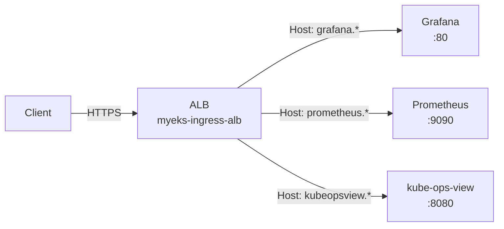
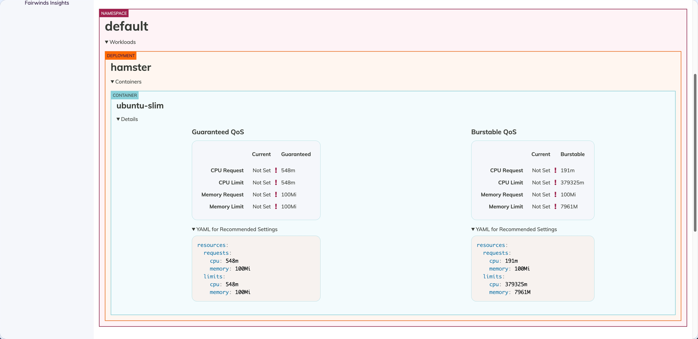

# Lab

실습 스크립트와 매니페스트는 [:octicons-mark-github-16: labs/week3/](https://github.com/pyy0715/eks-pratice/tree/main/labs/week3) 디렉터리를 참고하세요.

이 실습은 두 개의 클러스터 환경에서 진행됩니다. `myeks` 클러스터(Terraform)에서 Pod/Node 수준 오토스케일링(HPA, KEDA, CPA, CAS)을 실습하고, 별도 전용 클러스터(eksctl)에서 Karpenter의 프로비저닝과 Consolidation을 직접 관찰합니다. 양쪽 모두 Prometheus/Grafana와 eks-node-viewer로 메트릭을 확인합니다.

---

## Environment Setup

### Terraform Deploy

Week 2와 달리 노드가 private subnet에 배치됩니다. 인터넷 접근을 위해 NAT Gateway가 포함되고, SSM으로 노드에 접속합니다. metrics-server와 external-dns는 EKS addon으로 설치됩니다.

```bash
cd labs/week3
terraform init && terraform apply -auto-approve
```

### Configure kubectl

```bash
eval $(terraform output -raw configure_kubectl)
kubectl config rename-context $(kubectl config current-context) myeks
kubectl get node -owide
```

### Verify Addons

```bash
aws eks list-addons --cluster-name myeks | jq

# metrics-server
kubectl get deploy -n kube-system metrics-server
kubectl top node

# external-dns (policy=sync 확인)
kubectl describe deploy -n external-dns external-dns | grep -A6 Args
```

### SSM Access

노드에 SSH 대신 SSM Session Manager로 접근합니다.

```bash
# SSM 관리 대상 인스턴스 목록 조회
aws ssm describe-instance-information \
  --query "InstanceInformationList[*].{InstanceId:InstanceId, Status:PingStatus, OS:PlatformName}" \
  --output table

# 인스턴스 접속
aws ssm start-session --target <INSTANCE_ID>
```

### Environment Variables

이후 모든 실습에서 사용할 환경변수를 설정합니다.

```bash
source labs/week3/00_env.sh
```

---

## Monitoring Stack

모든 실습의 관찰 레이어로 사용할 Prometheus, Grafana, kube-ops-view를 설치합니다.

세 서비스 모두 ClusterIP Service로 배포하되, 각각의 Ingress에 동일한 `alb.ingress.kubernetes.io/group.name: study`를 설정합니다. AWS LBC는 같은 group name을 가진 Ingress들을 하나의 ALB로 합치고, 각 Ingress의 `host` 필드를 ALB listener rule로 변환합니다. 결과적으로 ALB 1대가 Host 헤더 기반으로 `grafana.$MyDomain`, `prometheus.$MyDomain`, `kubeopsview.$MyDomain` 트래픽을 각각의 target group으로 라우팅합니다.



=== "AWS LBC"

    Ingress에서 ALB를 프로비저닝하려면 AWS Load Balancer Controller가 필요합니다.

    ```bash
    bash labs/week3/01_lbc-install.sh
    ```

=== "Prometheus & Grafana"

    kube-prometheus-stack Helm chart 하나로 아래 컴포넌트가 함께 설치됩니다.

    | Component | Role |
    |---|---|
    | **Prometheus** (StatefulSet) | 메트릭 수집/저장. `additionalScrapeConfigs`로 EKS control plane 메트릭도 수집 |
    | **Grafana** (Deployment) | 대시보드 시각화. `grafana_dashboard="1"` label이 붙은 ConfigMap을 sidecar가 자동 감지 |
    | **kube-state-metrics** (Deployment) | K8s 오브젝트 상태(HPA desired replicas, Pod phase 등)를 Prometheus 메트릭으로 변환 |
    | **node-exporter** (DaemonSet) | 각 노드의 CPU/Memory/Disk 등 OS 수준 메트릭 수집 |
    | **Prometheus Operator** (Deployment) | `ServiceMonitor`/`PodMonitor` CRD를 감시하여 Prometheus scrape 설정을 자동 관리 |

    별도로 **kube-ops-view**도 함께 설치합니다. 클러스터의 노드/Pod 배치를 실시간으로 시각화하여, 스케일링 과정에서 Pod가 어떤 노드에 배치되는지 직관적으로 확인할 수 있습니다.

    ```bash
    bash labs/week3/02_monitoring-install.sh
    ```

    스크립트 완료 후 접속 URL:

    | Service | URL | Credentials |
    |---|---|---|
    | Grafana | `https://grafana.$MyDomain` | admin / prom-operator |
    | Prometheus | `https://prometheus.$MyDomain` | — |
    | Kube Ops View | `https://kubeopsview.$MyDomain/#scale=1.5` | — |

=== "Verify"

    EKS control plane 메트릭이 수집되는지 확인합니다.

    ```bash
    kubectl get apiservices | grep metrics
    # v1.metrics.eks.amazonaws.com   → ksh/kcm 메트릭
    # v1beta1.metrics.k8s.io         → metrics-server
    ```

    Prometheus Target 페이지에서 `apiserver-metrics`, `ksh-metrics`, `kcm-metrics` job이 UP 상태인지 확인합니다.

    ???+ info "EKS Control Plane Metrics Scrape"
        EKS는 kube-scheduler(ksh)와 kube-controller-manager(kcm) 메트릭을 Kubernetes API 경로로 노출합니다. Prometheus가 이 경로를 scrape하려면 두 가지가 필요합니다.

        1. `additionalScrapeConfigs`에 scrape job 등록 — Prometheus가 Kubernetes API endpoints를 service discovery로 찾고, 아래 경로에서 메트릭을 수집합니다.

            | Job | Metrics Path |
            |---|---|
            | `apiserver-metrics` | `/` (default kubernetes endpoint) |
            | `ksh-metrics` | `/apis/metrics.eks.amazonaws.com/v1/ksh/container/metrics` |
            | `kcm-metrics` | `/apis/metrics.eks.amazonaws.com/v1/kcm/container/metrics` |

        2. `ClusterRole` 권한 추가 — Prometheus ServiceAccount가 `metrics.eks.amazonaws.com` API group의 `kcm/metrics`, `ksh/metrics` 리소스에 `get` 권한이 필요합니다. Helm values의 `prometheus.additionalRulesForClusterRole`로 설정되어 있어서 `02_monitoring-install.sh` 실행 시 자동으로 포함됩니다.

=== "eks-node-viewer"

    노드별 allocatable 대비 request 리소스를 실시간으로 표시합니다. 실제 사용량이 아닌 request 합계입니다.

    ```bash
    # macOS
    brew tap aws/tap
    brew install eks-node-viewer

    # 기본 사용
    eks-node-viewer

    # CPU + Memory + 노드 age
    eks-node-viewer --resources cpu,memory --extra-labels eks-node-viewer/node-age

    # AZ별 확인
    eks-node-viewer --extra-labels topology.kubernetes.io/zone
    ```

---

## Managed Node Groups (Optional)

기본 ng-1(On-Demand, amd64) 외에 ARM/Graviton과 Spot 노드 그룹을 추가할 수 있습니다. Terraform variable toggle로 제어합니다.

=== "ARM/Graviton (myeks-ng-2)"

    t4g.medium(ARM) 인스턴스에 `cpuarch=arm64:NoExecute` taint가 설정됩니다. toleration 없는 Pod는 배치되지 않습니다.

    ```bash
    terraform -chdir=labs/week3 apply -var="enable_ng2_arm=true" -auto-approve
    
    # 노드 확인
    kubectl get nodes --label-columns kubernetes.io/arch,eks.amazonaws.com/capacityType
    kubectl describe node -l tier=secondary | grep -i taint
    
    # sample pod 배포 (toleration 포함)
    kubectl apply -f labs/week3/manifests/node-groups/sample-arm64.yaml
    kubectl get pod -l app=sample-app -owide
    
    # 삭제
    kubectl delete -f labs/week3/manifests/node-groups/sample-arm64.yaml
    terraform -chdir=labs/week3 apply -var="enable_ng2_arm=false" -auto-approve
    ```

=== "Spot Instances (myeks-ng-3)"

    여러 인스턴스 타입(c5a.large, c6a.large, t3a.large, t3a.medium)으로 Spot 노드 그룹을 생성합니다. AWS가 Spot 인스턴스를 회수할 때 EKS managed node group이 새 Spot 노드를 먼저 띄우고, Ready 상태가 되면 기존 노드를 cordon → drain하여 Pod를 이동시킵니다. Node Termination Handler 같은 별도 도구가 필요 없습니다.

    ```bash
    terraform -chdir=labs/week3 apply -var="enable_ng3_spot=true" -auto-approve
    
    # Spot 노드 확인
    kubectl get nodes -L eks.amazonaws.com/capacityType
    eks-node-viewer --extra-labels eks-node-viewer/node-age
    
    # Spot 가격 조회
    aws ec2 describe-spot-price-history \
      --instance-types c5a.large c6a.large \
      --product-descriptions "Linux/UNIX" \
      --max-items 10 \
      --query "SpotPriceHistory[].{Type:InstanceType,Price:SpotPrice,AZ:AvailabilityZone}" \
      --output table
    
    # sample pod 배포
    kubectl apply -f labs/week3/manifests/node-groups/sample-spot.yaml
    kubectl get pod busybox-spot -owide
    
    # 삭제
    kubectl delete -f labs/week3/manifests/node-groups/sample-spot.yaml
    terraform -chdir=labs/week3 apply -var="enable_ng3_spot=false" -auto-approve
    ```

---

여기서부터 Pod 수준 오토스케일링을 실습합니다. HPA(수평), VPA(수직), KEDA(이벤트 기반) 순서로 진행합니다.

## HPA

CPU 사용률이 목표치를 초과하면 Pod replica 수를 늘리고, 낮아지면 줄입니다. 목표 replica 수는 `desiredReplicas = ceil(currentReplicas × currentMetric / targetMetric)`으로 결정됩니다. Scale-out은 즉시 실행되지만, scale-in은 기본 5분간 안정화 기간(stabilization window)을 거친 뒤 반영됩니다.

### Deploy

```bash
kubectl apply -f labs/week3/manifests/hpa/php-apache.yaml
kubectl apply -f labs/week3/manifests/hpa/curl-pod.yaml
kubectl apply -f labs/week3/manifests/hpa/hpa-policy.yaml

# HPA 상태 확인
kubectl describe hpa php-apache
```

php-apache는 `requests.cpu=200m`이므로 `averageUtilization: 50`은 100m 이상에서 scale-out을 트리거합니다.

### Load Test

```bash
# sleep 간격을 줄이면 부하가 증가합니다
kubectl exec curl -- sh -c 'while true; do curl -s php-apache; sleep 0.5; done'
kubectl exec curl -- sh -c 'while true; do curl -s php-apache; sleep 0.1; done'
kubectl exec curl -- sh -c 'while true; do curl -s php-apache; sleep 0.01; done'
```

### Observe

부하 발생 중 별도 터미널에서 관찰합니다.

=== "HPA Status"

    ```bash
    kubectl get hpa php-apache -w
    ```

=== "Pod Watch"

    ```bash
    kubectl get pod -l run=php-apache -w
    ```

=== "Grafana"

    Grafana의 **Kubernetes HPA** 대시보드(`02_monitoring-install.sh`에서 등록)에서 current/desired replicas, CPU utilization 변화를 확인합니다. 대시보드 상단에서 Namespace를 `default`, Name을 `php-apache`로 선택하세요.

    Prometheus에서 직접 쿼리하려면 `kube_horizontalpodautoscaler_status_desired_replicas`를 사용합니다.

=== "Metrics API"

    ```bash
    kubectl exec curl -- curl -s kube-prometheus-stack-kube-state-metrics.monitoring.svc:8080/metrics \
      | grep horizontalpodautoscaler | grep -v "^#"
    ```

부하를 중지하면 5분 후(기본 `scaleDown` stabilization) Pod가 감소합니다.

### Cleanup

```bash
kubectl delete -f labs/week3/manifests/hpa/
```

---

## VPA & Goldilocks

HPA가 Pod 수를 조정했다면, VPA는 개별 Pod의 `resources.requests`를 최적화합니다. 실제 사용 패턴을 분석하여 적정값을 추천합니다. Goldilocks는 네임스페이스 단위로 VPA 객체를 자동 생성하고, 추천값을 대시보드에서 시각적으로 확인할 수 있게 합니다. 여기서는 VPA를 `Off` 모드(추천만, Pod 재시작 없음)로 설치합니다.

### Install

```bash
helm repo add fairwinds-stable https://charts.fairwinds.com/stable
helm repo update fairwinds-stable

# VPA — Recommender만 설치 (Updater/Admission Controller 비활성화)
helm install vpa fairwinds-stable/vpa --namespace vpa --create-namespace \
  --set updater.enabled=false \
  --set admissionController.enabled=false

# Goldilocks
helm install goldilocks fairwinds-stable/goldilocks --namespace goldilocks --create-namespace
```

### Observe

VPA 공식 예제(hamster)를 배포하고 Goldilocks를 활성화합니다. VPA Recommender가 메트릭을 분석하는 데 2~3분이 소요됩니다.

```bash
# 샘플 워크로드 배포
kubectl create deployment hamster --image=registry.k8s.io/ubuntu-slim:0.14 \
  -- /bin/sh -c "while true; do timeout 0.5s yes >/dev/null; sleep 0.5s; done"

# Goldilocks 활성화
kubectl label ns default goldilocks.fairwinds.com/enabled=true

# VPA 객체 자동 생성 확인 (2~3분 대기)
kubectl get vpa -n default
```

```bash
# [별도 터미널] Goldilocks 대시보드 접속
kubectl port-forward -n goldilocks svc/goldilocks-dashboard 8080:80
# http://localhost:8080
```

대시보드에서 hamster Deployment의 Guaranteed QoS / Burstable QoS별 추천값이 표시됩니다. Current가 "Not Set"이면 `resources.requests`를 지정하지 않은 것이므로, 추천된 YAML을 참고하여 적정값을 설정합니다.



### Cleanup

```bash
kubectl delete deployment hamster
kubectl label ns default goldilocks.fairwinds.com/enabled-
helm uninstall goldilocks -n goldilocks
helm uninstall vpa -n vpa
kubectl delete namespace goldilocks vpa
```

---

## KEDA

HPA는 CPU/Memory 메트릭에 반응하지만, KEDA는 외부 이벤트 소스(cron, SQS, Kafka 등)를 기반으로 HPA를 내부적으로 생성하여 Pod를 스케일링합니다. 여기서는 cron trigger로 2분 주기 스케일링을 테스트합니다.

### Deploy

```bash
helm repo add kedacore https://kedacore.github.io/charts
helm repo update
helm install keda kedacore/keda --version 2.16.0 \
  --namespace keda --create-namespace \
  -f labs/week3/manifests/keda/keda-values.yaml

# CRD 및 External Metrics API 확인
kubectl get crd | grep keda
kubectl get --raw "/apis/external.metrics.k8s.io/v1beta1" | jq

# php-apache + ScaledObject 배포
kubectl apply -f labs/week3/manifests/keda/php-apache.yaml -n keda
kubectl apply -f labs/week3/manifests/keda/scaled-object-cron.yaml -n keda
```

### Observe

cron trigger가 짝수 분(0, 2, 4, ...)에 활성화되어 Pod 1개로 scale-out합니다. 홀수 분(1, 3, 5, ...)에 cron 구간이 종료되고, cooldownPeriod(30초) 경과 후 Pod 0개로 scale-in됩니다. ScaledObject의 `ACTIVE` 컬럼이 `True`(scale-out) → `False`(scale-in)로 전환되는 것을 확인하세요.

```bash
# ScaledObject 상태 실시간
kubectl get ScaledObject -n keda -w

# KEDA가 생성한 HPA 스펙 확인
kubectl get hpa -o jsonpath="{.items[0].spec}" -n keda | jq
```

Grafana의 **KEDA** 대시보드(`02_monitoring-install.sh`에서 등록)에서 scaler 메트릭과 스케일링 이벤트를 확인합니다.

### Cleanup

```bash
kubectl delete ScaledObject -n keda php-apache-cron-scaled
kubectl delete deploy php-apache -n keda
helm uninstall keda -n keda
kubectl delete namespace keda
```

---

여기서부터 Node 수준 오토스케일링을 실습합니다. Pod가 늘어나 기존 노드에 수용할 수 없으면 노드 자체를 추가해야 합니다. CPA(비례), CAS(ASG 기반), Karpenter(EC2 Fleet 직접) 순서로 진행합니다.

## CPA

CPA는 Pod 부하가 아니라 **노드 수 변화**에 반응합니다. 노드가 늘어나면 시스템 서비스(CoreDNS 등)의 replica도 비례하여 증가시킵니다. `nodesToReplicas` ladder 정책으로 노드 수 구간별 replica 수를 지정합니다. 참고로 EKS CoreDNS addon에는 Terraform에서 autoscaling을 이미 활성화해두었습니다(`eks.tf` coredns 설정). CPA는 CoreDNS 외에도 범용적으로 사용할 수 있습니다.

```bash
# CoreDNS autoscaling 설정 확인
aws eks describe-addon --cluster-name myeks --addon-name coredns \
  --query 'addon.configurationValues' --output text | jq
```

### Deploy

```bash
helm repo add cluster-proportional-autoscaler \
  https://kubernetes-sigs.github.io/cluster-proportional-autoscaler

kubectl apply -f labs/week3/manifests/cpa/cpa-nginx.yaml

helm upgrade --install cluster-proportional-autoscaler \
  -f labs/week3/manifests/cpa/cpa-values.yaml \
  cluster-proportional-autoscaler/cluster-proportional-autoscaler
```

### Observe

ASG DesiredCapacity를 직접 조절하여 노드 수를 변경하고, nginx replica가 ladder 정책에 따라 변하는지 관찰합니다.

```bash
# 모니터링
kubectl get pod -l app=nginx -w

# ASG 이름 확인
export ASG_NAME=$(aws autoscaling describe-auto-scaling-groups \
  --query "AutoScalingGroups[? Tags[? (Key=='eks:cluster-name') && Value=='myeks']].AutoScalingGroupName" \
  --output text)

# 노드 5개로 증가 → nginx replica 5개
aws autoscaling update-auto-scaling-group \
  --auto-scaling-group-name ${ASG_NAME} \
  --min-size 5 --desired-capacity 5 --max-size 5

# 노드 2개로 축소 → nginx replica 2개
aws autoscaling update-auto-scaling-group \
  --auto-scaling-group-name ${ASG_NAME} \
  --min-size 2 --desired-capacity 2 --max-size 2
```

### Cleanup

```bash
helm uninstall cluster-proportional-autoscaler
kubectl delete -f labs/week3/manifests/cpa/cpa-nginx.yaml
```

---

## CAS

CPA는 노드 수에 반응하여 서비스 replica를 조정했지만, 노드 수 자체를 변경하지는 않습니다. CAS는 Pending Pod를 감지하면 ASG DesiredCapacity를 올려서 노드를 추가합니다. ASG tag 기반 auto-discovery로 관리 대상 노드 그룹을 찾습니다.

### Deploy

```bash
# ASG MaxSize를 6으로 확장 (CAS가 DesiredCapacity를 올릴 수 있도록)
export ASG_NAME=$(aws autoscaling describe-auto-scaling-groups \
  --query "AutoScalingGroups[? Tags[? (Key=='eks:cluster-name') && Value=='myeks']].AutoScalingGroupName" \
  --output text)
aws autoscaling update-auto-scaling-group \
  --auto-scaling-group-name ${ASG_NAME} \
  --min-size 2 --desired-capacity 2 --max-size 6

# CAS 배포
curl -sO https://raw.githubusercontent.com/kubernetes/autoscaler/master/cluster-autoscaler/cloudprovider/aws/examples/cluster-autoscaler-autodiscover.yaml
sed -i'' -e "s|<YOUR CLUSTER NAME>|myeks|g" cluster-autoscaler-autodiscover.yaml
kubectl apply -f cluster-autoscaler-autodiscover.yaml

# scale-in 대기 시간을 단축 (기본 10분)
kubectl -n kube-system patch deployment cluster-autoscaler --type=json -p='[
  {"op": "add", "path": "/spec/template/spec/containers/0/command/-", "value": "--scale-down-delay-after-add=2m"},
  {"op": "add", "path": "/spec/template/spec/containers/0/command/-", "value": "--scale-down-unneeded-time=1m"}
]'
```

### Observe — Scale Out

```bash
kubectl apply -f labs/week3/manifests/cas/nginx-to-scaleout.yaml
kubectl scale --replicas=15 deployment/nginx-to-scaleout
```

별도 터미널에서 관찰합니다.

=== "Pod Watch"

    ```bash
    kubectl get pods -l app=nginx -o wide --watch
    ```

=== "CAS Logs"

    ```bash
    kubectl -n kube-system logs -f deployment/cluster-autoscaler
    ```

=== "eks-node-viewer"

    ```bash
    eks-node-viewer --resources cpu,memory
    ```

CAS는 ASG DesiredCapacity를 조정하여 노드를 추가합니다. CloudTrail에서 `UpdateAutoScalingGroup` 이벤트로 CAS의 scale-out 동작을 확인할 수 있습니다. Karpenter와 달리 EC2 Fleet API를 직접 호출하지 않으므로 `CreateFleet` 이벤트는 나타나지 않습니다.

### Observe — Scale In

```bash
kubectl delete -f labs/week3/manifests/cas/nginx-to-scaleout.yaml
```

Deployment 삭제 후 `--scale-down-unneeded-time=1m`에 따라 약 1~2분 뒤 사용률이 낮은 노드가 자동으로 제거됩니다.

```bash
kubectl get node -w
```

### Over-Provisioning

우선순위가 낮은 placeholder Pod로 예비 용량을 미리 확보합니다. 실제 워크로드가 배포되면 placeholder를 선점(preempt)하여 노드 프로비저닝 대기 없이 즉시 시작됩니다. placeholder의 `resources.requests`는 워크로드 Pod와 동일하게 설정해야 선점 후 빈 공간에 워크로드가 들어갑니다.

```bash
kubectl apply -f labs/week3/manifests/cas/over-provisioning.yaml

# placeholder pod 확인 — 기존 노드의 빈 공간에 배치됨 (500m CPU, 512Mi)
kubectl get pod -l pod=placeholder-pod -o wide
kubectl get priorityclass placeholder-priority
```

실제 워크로드를 배포하여 placeholder가 선점되는 과정을 관찰합니다.

```bash
# 실제 워크로드 배포 — 기본 우선순위(0)가 placeholder(-10)보다 높으므로 선점 발생
kubectl apply -f labs/week3/manifests/cas/nginx-to-scaleout.yaml
kubectl scale --replicas=5 deployment/nginx-to-scaleout

# 확인: placeholder가 Pending으로 밀리고, nginx가 해당 자리를 즉시 차지
kubectl get pod -o wide -w
```

nginx(500m CPU)가 배포되면 스케줄러가 동일한 크기의 placeholder(500m CPU)를 선점하여 공간을 확보합니다. 선점된 placeholder는 Pending 상태가 되고, CAS가 이를 감지하여 새 노드를 추가합니다. 새 노드가 Ready가 되면 Pending이었던 placeholder가 그곳에 재배치됩니다.

```bash
# 정리
kubectl delete -f labs/week3/manifests/cas/nginx-to-scaleout.yaml
```

### Cleanup

```bash
kubectl delete -f labs/week3/manifests/cas/over-provisioning.yaml
kubectl delete -f cluster-autoscaler-autodiscover.yaml
rm -f cluster-autoscaler-autodiscover.yaml

aws autoscaling update-auto-scaling-group \
  --auto-scaling-group-name ${ASG_NAME} \
  --min-size 2 --desired-capacity 2 --max-size 2
```

---

## Karpenter (Separate Cluster)

CAS가 ASG DesiredCapacity를 조정하는 간접 방식이라면, Karpenter는 Pending Pod를 Watch API로 감지하여 EC2 Fleet API를 직접 호출합니다. 워크로드의 resource requests를 분석하여 적합한 인스턴스 타입을 bin packing 알고리즘으로 선택하고, 사용률이 낮은 노드를 자동으로 정리(Consolidation)합니다.

!!! warning
    이 섹션은 `myeks` 클러스터가 아닌 **별도 전용 클러스터**(eksctl)에서 진행합니다. 모니터링 도구(kube-ops-view, Prometheus, Grafana)도 이 클러스터에 별도로 설치합니다.

별도 클러스터를 사용하는 이유:

- **사전 구성의 복잡도** — Karpenter는 Pod Identity, SQS 큐(Spot Interruption), EventBridge 규칙 등 `myeks` Terraform 클러스터에 없는 구성이 필요합니다. 공식 Getting Started 가이드가 CloudFormation + eksctl로 이 구성을 한 번에 처리하므로, 가장 검증된 경로를 따릅니다.

기존 클러스터에 Karpenter를 설치하는 것도 가능하지만, IAM과 태그 설정을 직접 맞춰야 합니다. 운영 환경에서 CAS에서 Karpenter로 전환할 때는 CAS replica를 0으로 줄인 후 Karpenter를 활성화합니다.[^karpenter-cas]

[^karpenter-cas]: [Karpenter — Migrating from Cluster Autoscaler](https://karpenter.sh/docs/getting-started/migrating-from-cas/)

### Setup

```bash
mkdir -p ~/karpenter && cd ~/karpenter

export KARPENTER_NAMESPACE="kube-system"
export KARPENTER_VERSION="1.10.0"
export K8S_VERSION="1.34"
export AWS_PARTITION="aws"
export CLUSTER_NAME="${USER}-karpenter-demo"
export AWS_DEFAULT_REGION="ap-northeast-2"
export AWS_ACCOUNT_ID="$(aws sts get-caller-identity --query Account --output text)"
export TEMPOUT="$(mktemp)"
export ALIAS_VERSION="$(aws ssm get-parameter \
  --name "/aws/service/eks/optimized-ami/${K8S_VERSION}/amazon-linux-2023/x86_64/standard/recommended/image_id" \
  --query Parameter.Value | xargs aws ec2 describe-images --query 'Images[0].Name' --image-ids \
  | sed -r 's/^.*(v[[:digit:]]+).*$/\1/')"

echo "${CLUSTER_NAME}" "${KARPENTER_VERSION}" "${ALIAS_VERSION}"
```

CloudFormation으로 Karpenter IAM Policy/Role, SQS 큐, EventBridge 규칙을 생성합니다.

```bash
curl -fsSL https://raw.githubusercontent.com/aws/karpenter-provider-aws/v"${KARPENTER_VERSION}"/website/content/en/preview/getting-started/getting-started-with-karpenter/cloudformation.yaml > "${TEMPOUT}" \
&& aws cloudformation deploy \
  --stack-name "Karpenter-${CLUSTER_NAME}" \
  --template-file "${TEMPOUT}" \
  --capabilities CAPABILITY_NAMED_IAM \
  --parameter-overrides "ClusterName=${CLUSTER_NAME}"
```

eksctl로 전용 클러스터를 생성합니다.

```bash
eksctl create cluster -f - <<EOF
---
apiVersion: eksctl.io/v1alpha5
kind: ClusterConfig
metadata:
  name: ${CLUSTER_NAME}
  region: ${AWS_DEFAULT_REGION}
  version: "${K8S_VERSION}"
  tags:
    karpenter.sh/discovery: ${CLUSTER_NAME}
iam:
  withOIDC: true
  podIdentityAssociations:
  - namespace: "${KARPENTER_NAMESPACE}"
    serviceAccountName: karpenter
    roleName: ${CLUSTER_NAME}-karpenter
    permissionPolicyARNs:
    - arn:${AWS_PARTITION}:iam::${AWS_ACCOUNT_ID}:policy/KarpenterControllerNodeLifecyclePolicy-${CLUSTER_NAME}
    - arn:${AWS_PARTITION}:iam::${AWS_ACCOUNT_ID}:policy/KarpenterControllerIAMIntegrationPolicy-${CLUSTER_NAME}
    - arn:${AWS_PARTITION}:iam::${AWS_ACCOUNT_ID}:policy/KarpenterControllerEKSIntegrationPolicy-${CLUSTER_NAME}
    - arn:${AWS_PARTITION}:iam::${AWS_ACCOUNT_ID}:policy/KarpenterControllerInterruptionPolicy-${CLUSTER_NAME}
    - arn:${AWS_PARTITION}:iam::${AWS_ACCOUNT_ID}:policy/KarpenterControllerResourceDiscoveryPolicy-${CLUSTER_NAME}
iamIdentityMappings:
- arn: "arn:${AWS_PARTITION}:iam::${AWS_ACCOUNT_ID}:role/KarpenterNodeRole-${CLUSTER_NAME}"
  username: system:node:{{EC2PrivateDNSName}}
  groups:
  - system:bootstrappers
  - system:nodes
managedNodeGroups:
- instanceType: m5.large
  amiFamily: AmazonLinux2023
  name: ${CLUSTER_NAME}-ng
  desiredCapacity: 2
  minSize: 1
  maxSize: 10
addons:
- name: eks-pod-identity-agent
EOF

aws iam create-service-linked-role --aws-service-name spot.amazonaws.com || true
```

kube-ops-view를 설치합니다. ALB controller가 없으므로 LoadBalancer type으로 배포합니다.

```bash
helm repo add geek-cookbook https://geek-cookbook.github.io/charts/
helm install kube-ops-view geek-cookbook/kube-ops-view --version 1.2.2 \
  --set service.main.type=LoadBalancer --set env.TZ="Asia/Seoul" --namespace kube-system

echo -e "http://$(kubectl get svc -n kube-system kube-ops-view \
  -o jsonpath='{.status.loadBalancer.ingress[0].hostname}'):8080/#scale=1.5"
```

### Install

```bash
helm registry logout public.ecr.aws

export CLUSTER_ENDPOINT="$(aws eks describe-cluster --name "${CLUSTER_NAME}" \
  --query "cluster.endpoint" --output text)"
export KARPENTER_IAM_ROLE_ARN="arn:${AWS_PARTITION}:iam::${AWS_ACCOUNT_ID}:role/${CLUSTER_NAME}-karpenter"

helm upgrade --install karpenter oci://public.ecr.aws/karpenter/karpenter \
  --version "${KARPENTER_VERSION}" \
  --namespace "${KARPENTER_NAMESPACE}" --create-namespace \
  --set "settings.clusterName=${CLUSTER_NAME}" \
  --set "settings.interruptionQueue=${CLUSTER_NAME}" \
  --set controller.resources.requests.cpu=1 \
  --set controller.resources.requests.memory=1Gi \
  --set controller.resources.limits.cpu=1 \
  --set controller.resources.limits.memory=1Gi \
  --wait

kubectl get crd | grep karpenter
```

Prometheus와 Grafana를 설치합니다. Karpenter 전용 대시보드(Capacity, Performance)가 자동으로 등록됩니다.

```bash
helm repo add grafana-charts https://grafana.github.io/helm-charts
helm repo add prometheus-community https://prometheus-community.github.io/helm-charts
helm repo update
kubectl create namespace monitoring

curl -fsSL https://raw.githubusercontent.com/aws/karpenter-provider-aws/v"${KARPENTER_VERSION}"/website/content/en/preview/getting-started/getting-started-with-karpenter/prometheus-values.yaml \
  | envsubst | tee /tmp/prometheus-values.yaml
helm install --namespace monitoring prometheus prometheus-community/prometheus \
  --values /tmp/prometheus-values.yaml

curl -fsSL https://raw.githubusercontent.com/aws/karpenter-provider-aws/v"${KARPENTER_VERSION}"/website/content/en/preview/getting-started/getting-started-with-karpenter/grafana-values.yaml \
  | tee /tmp/grafana-values.yaml
helm install --namespace monitoring grafana grafana-charts/grafana \
  --values /tmp/grafana-values.yaml

# Grafana 접속
kubectl get secret --namespace monitoring grafana -o jsonpath="{.data.admin-password}" | base64 --decode ; echo
kubectl port-forward --namespace monitoring svc/grafana 3000:80 &
kubectl port-forward --namespace monitoring svc/prometheus-server 9090:80 &
```

### Provisioning & Disruption

세 가지 NodePool 구성에서 프로비저닝과 Consolidation 동작을 관찰합니다. 각 탭에서 NodePool 적용 → inflate scale → 관찰 → 정리 순서로 진행합니다.

모든 테스트에서 공통으로 사용할 모니터링 명령어(별도 터미널):

```bash
eks-node-viewer --resources cpu,memory --node-selector "karpenter.sh/registered=true" \
  --extra-labels eks-node-viewer/node-age

kubectl logs -f -n "${KARPENTER_NAMESPACE}" -l app.kubernetes.io/name=karpenter -c controller | jq '.'
```

=== "1. On-Demand Basic"

    기본 On-Demand NodePool로 프로비저닝과 Consolidation을 확인합니다.

    ```bash
    envsubst < labs/week3/manifests/karpenter/nodepool-basic.yaml | kubectl apply -f -
    kubectl apply -f labs/week3/manifests/karpenter/inflate.yaml

    # Scale up → Karpenter가 노드를 자동 프로비저닝
    kubectl scale deployment inflate --replicas 5

    # controller 로그에서 "launched nodeclaim" 확인
    kubectl logs -n "${KARPENTER_NAMESPACE}" -l app.kubernetes.io/name=karpenter -c controller \
      | grep 'launched nodeclaim' | jq '.'
    kubectl get nodeclaims
    ```

    inflate를 삭제하면 Consolidation이 자동으로 동작합니다. controller 로그에서 `underutilized` → `tainted node` → `deleted node` 순서를 관찰합니다.

    ```bash
    kubectl delete deployment inflate
    kubectl get nodeclaims
    kubectl delete nodepool,ec2nodeclass default
    ```

=== "2. On-Demand Consolidation"

    instance-size와 hypervisor를 제한한 NodePool에서 scale up/down 시 Consolidation을 관찰합니다. 큰 인스턴스에서 작은 인스턴스로 교체(replace)되는 과정이 핵심입니다.

    ```bash
    envsubst < labs/week3/manifests/karpenter/nodepool-disruption.yaml | kubectl apply -f -
    kubectl apply -f labs/week3/manifests/karpenter/inflate.yaml

    # 5 → 12 replicas: 노드 추가
    kubectl scale deployment/inflate --replicas 5
    kubectl scale deployment/inflate --replicas 12
    kubectl get nodeclaims

    # 12 → 5 replicas: underutilized 노드 삭제
    kubectl scale deployment/inflate --replicas 5

    # 5 → 1 replica: 큰 인스턴스를 작은 인스턴스로 교체
    # 로그: "disrupting via replace, terminating 1 nodes ... and replacing with ..."
    kubectl scale deployment/inflate --replicas 1
    kubectl get nodeclaims
    ```

    ```bash
    kubectl delete deployment inflate
    kubectl delete nodepool,ec2nodeclass default
    ```

=== "3. Spot-to-Spot"

    Spot 인스턴스 간 Consolidation을 테스트합니다. Spot-to-Spot Consolidation이 동작하려면 최소 15개 이상의 인스턴스 타입이 후보에 포함되어야 합니다.

    ```bash
    envsubst < labs/week3/manifests/karpenter/nodepool-spot.yaml | kubectl apply -f -
    kubectl apply -f labs/week3/manifests/karpenter/inflate.yaml

    kubectl scale deployment/inflate --replicas 5
    kubectl get nodeclaims

    kubectl scale deployment/inflate --replicas 12
    kubectl scale deployment/inflate --replicas 5
    kubectl scale deployment/inflate --replicas 1
    kubectl get nodeclaims
    ```

    ```bash
    kubectl delete deployment inflate
    kubectl delete nodepool,ec2nodeclass default
    ```

### Cleanup

```bash
helm uninstall karpenter --namespace "${KARPENTER_NAMESPACE}"
kubectl delete svc -n kube-system kube-ops-view
helm uninstall -n monitoring prometheus grafana

aws ec2 describe-launch-templates \
  --filters "Name=tag:karpenter.k8s.aws/cluster,Values=${CLUSTER_NAME}" |
  jq -r ".LaunchTemplates[].LaunchTemplateName" |
  xargs -I{} aws ec2 delete-launch-template --launch-template-name {}

eksctl delete cluster --name "${CLUSTER_NAME}"
aws cloudformation delete-stack --stack-name "Karpenter-${CLUSTER_NAME}"
```

!!! tip "Karpenter Workshop"
    심화 실습은 [Karpenter Workshop](https://catalog.workshops.aws/karpenter/en-US)을 참고하세요. Basic NodePool, Multi NodePools, Cost Optimization, Scheduling Constraints, Disruption Control, CAS → Karpenter 마이그레이션 등을 다룹니다.

---

## Cleanup (Main Cluster)

Karpenter 클러스터와 별도로, `myeks` 클러스터를 정리합니다.

```bash
source labs/week3/00_env.sh

# Helm 제거
helm uninstall goldilocks -n goldilocks
helm uninstall vpa -n vpa
helm uninstall -n monitoring kube-prometheus-stack
helm uninstall -n kube-system kube-ops-view
helm uninstall -n kube-system aws-load-balancer-controller
kubectl delete namespace goldilocks vpa --ignore-not-found

# K8s 리소스 정리
kubectl delete deploy,svc,hpa,pod --all
kubectl delete ingress -n kube-system kubeopsview

# Terraform 삭제
cd labs/week3
terraform destroy -auto-approve
```
