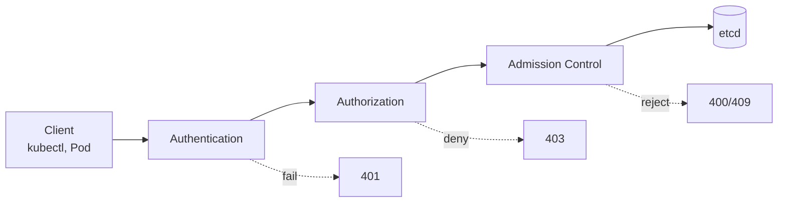

# Overview

Kubernetes에는 사용자 데이터베이스가 없습니다. K8s API 서버에 도착하는 모든 요청은 Authentication, Authorization, Admission Control의 세 단계를 통과해야 etcd에 커밋됩니다. EKS는 각 단계를 표준 K8s 메커니즘 위에서 구현하며, 여기서는 그 구조와 호출 시나리오 분류를 정리합니다.

각 단계의 일반 동작 원리와 K8s가 외부 컴포넌트에 위임하는 방식은 [Background — Kubernetes Extension via Webhook](0_background.md#kubernetes-extension-via-webhook)에서 다뤘습니다. 여기서는 EKS가 각 단계에 추가하는 컴포넌트만 다룹니다.

---

## Four Call Scenarios

EKS에서 발생하는 호출은 Caller(Operator/Pod)와 대상 API(K8s/AWS)의 조합으로 네 가지 시나리오로 나뉩니다. 이번 주차의 글들은 이 분류를 따라 구성됩니다.

| Caller | Target API | Auth Mechanism | Covered In |
|---|---|---|---|
| Operator | EKS / K8s API | IAM principal + EKS Webhook | [Operator Authentication](2_operator-auth.md) |
| Pod | K8s API | ServiceAccount + Projected Token | [Kubernetes RBAC](3_rbac.md) |
| Pod | AWS API | IRSA or EKS Pod Identity | [Pod Workload Identity](4_pod-workload-identity.md) |
| Operator | AWS API | General IAM credentials | EKS-specific이 아니므로 이번 주차에서는 다루지 않습니다 |

Week 1의 [Authentication](../week1/4_authentication.md)에서는 첫 번째 시나리오(Operator → EKS API)의 호출 단계를 한 번 훑었습니다. 이번 주차의 [Operator Authentication](2_operator-auth.md)에서는 같은 흐름을 다섯 단계로 나누어 각 단계에서 토큰이 어떻게 만들어지고 검증되는지를 다룹니다.

---

## Why EKS Uses Webhook Authentication

K8s는 여러 인증 전략을 지원합니다. 대표적인 전략과 EKS 채택 여부는 다음과 같습니다.

| Strategy | Description | EKS Usage |
|---|---|---|
| X.509 client certificate | 클라이언트 인증서로 사용자 식별 | 사용 안 함 |
| Static Token File | 정적 토큰 파일을 API 서버에 등록 | 사용 안 함 |
| Bootstrap Token | kubeadm 노드 부트스트랩 전용 토큰 | 사용 안 함 |
| Service Account Token | Pod에 마운트되는 K8s 발급 JWT | Pod → K8s API |
| OpenID Connect | 외부 OIDC Provider와 연동 | 외부 IdP 통합 시 사용 |
| Webhook Token | 외부 Webhook이 토큰을 검증 | Operator 인증의 기본 |

EKS가 Webhook 토큰 인증을 채택한 이유는 사용자 관리를 IAM에 일임하기 위해서입니다. AWS IAM principal을 단일 신원 원천으로 재사용하면 EKS 클러스터마다 별도의 사용자 데이터베이스를 유지할 필요가 없고, IAM의 감사 로그와 다중 인증(MFA)도 그대로 사용할 수 있습니다. EKS는 인가에서도 같은 Webhook 위임 모델을 사용합니다. kube-apiserver는 `--authorization-mode=Node,RBAC,Webhook`으로 구동되며 Node → RBAC → Webhook(EKS Authorizer) 순서로 평가합니다. 어느 단계에서든 allow가 반환되면 즉시 종료되고, 모든 단계가 결정을 내리지 못하면 deny가 반환됩니다. 자세한 동작은 [Operator Authentication](2_operator-auth.md)을 참고합니다.

---

## system:masters Bypasses the Chain

방금 설명한 평가 체인에는 한 가지 예외가 있습니다. K8s 내장 그룹인 `system:masters`에 속한 사용자는 RBAC와 Webhook 평가를 모두 건너뛰고 무조건 allow 됩니다. 즉 `system:masters`는 인가 단계를 거치지 않으며, 인증만 통과하면 클러스터 내 어떤 작업이든 수행할 수 있습니다. 권한을 회수하려면 사용자의 IAM 자격 증명 자체를 무효화하는 방법밖에 없습니다.

EKS 환경에서 이 예외가 위험한 이유는 클러스터를 생성한 IAM principal이 자동으로 `system:masters`에 매핑되기 때문입니다. 이 매핑은 EKS Access Entry 목록에 표시되지 않으므로, `aws eks list-access-entries` 결과만으로는 해당 사용자가 cluster-admin 권한을 가졌다는 사실을 확인할 수 없습니다. 운영 환경에서 클러스터를 생성한 사용자가 그대로 운영 권한을 가지고 있다면 권한 분리가 의도와 달리 이뤄진 셈입니다.

!!! warning "Avoid system:masters in production"
    Cluster 부트스트랩이 끝나면 `system:masters` 그룹에 의존하는 사용자나 자동화 스크립트를 제거합니다. 운영 권한이 필요할 때는 `AmazonEKSClusterAdminPolicy`를 Access Entry에 연결해 동등한 권한을 부여합니다. 이 방식은 IAM API로 권한 회수가 가능하므로 감사와 권한 회수 모두에 유리합니다.
