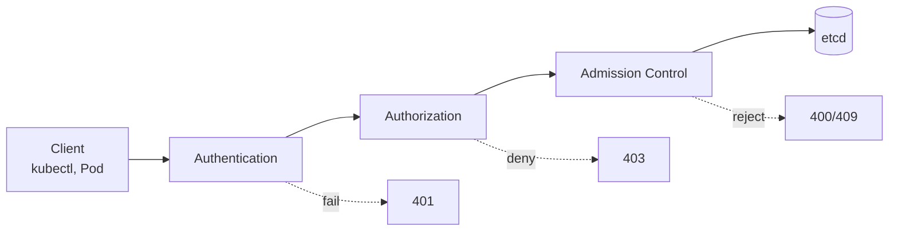
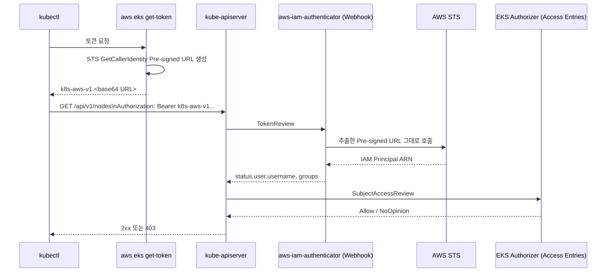

# Operator Authentication and Authorization

Kubernetes API 서버에 도착하는 모든 요청은 Authentication, Authorization, Admission Control의 세 단계를 통과해야 etcd에 커밋됩니다.



각 단계의 동작 원리와 Webhook 위임 모델은 [Background — Kubernetes Extension via Webhook](0_background.md#kubernetes-extension-via-webhook)에서 다뤘습니다. EKS에서 발생하는 호출은 Caller(Operator/Pod)와 대상 API(K8s/AWS)의 조합으로 네 가지 시나리오로 나뉩니다.

| Caller | Target API | Auth Mechanism | Covered In |
|---|---|---|---|
| Operator (kubectl) | Kubernetes API (kube-apiserver) | IAM principal + EKS Webhook | 현재 문서 |
| Pod | Kubernetes API | ServiceAccount + Projected Token | [Kubernetes RBAC](3_rbac.md) |
| Pod | AWS API | IRSA or EKS Pod Identity | [Pod Workload Identity](4_pod-workload-identity.md) |
| Operator | AWS API | General IAM credentials |  |

이 문서는kubectl로 클러스터를 조작하는 사용자가 kube-apiserver를 호출할 때의 인증/인가를 다룹니다. Week 1의 [Authentication](../week1/4_authentication.md)에서는 토큰 발급부터 200 OK 반환까지의 흐름을 실습으로 확인했습니다. 여기서는 각 단계의 내부 동작을 분석합니다.



---

## Why Webhook Authentication

K8s는 여러 인증 전략을 지원합니다. 대표적인 전략과 EKS 채택 여부는 다음과 같습니다.

| Strategy | Description | EKS Usage |
|---|---|---|
| X.509 client certificate | 클라이언트 인증서로 사용자 식별 | 사용 안 함 |
| Static Token File | 정적 토큰 파일을 API 서버에 등록 | 사용 안 함 |
| Bootstrap Token | kubeadm 노드 부트스트랩 전용 토큰 | 사용 안 함 |
| Service Account Token | Pod에 마운트되는 Kubernetes 발급 JWT | Pod → Kubernetes API |
| OpenID Connect | 외부 OIDC Provider와 연동 | 외부 IdP 통합 시 사용 |
| Webhook Token | 외부 Webhook이 토큰을 검증 | Operator 인증의 기본 |

EKS가 Webhook 토큰 인증을 채택한 이유는 사용자 관리를 IAM에 맡기기 위해서입니다. IAM을 하나의 인증 체계로 사용하면 클러스터마다 별도의 사용자 데이터베이스가 필요 없고, IAM의 감사 로그와 MFA도 그대로 활용할 수 있습니다.

---

## Token Generation on the Client

[Authentication](../week1/4_authentication.md)에서 토큰이 STS `GetCallerIdentity`에 대한 Pre-signed URL임을 확인했습니다. 디코딩한 URL의 주요 파라미터는 다음과 같습니다.

```text
https://sts.ap-northeast-2.amazonaws.com/?Action=GetCallerIdentity
  &Version=2011-06-15
  &X-Amz-Algorithm=AWS4-HMAC-SHA256
  &X-Amz-Credential=AKIA.../20260401/ap-northeast-2/sts/aws4_request
  &X-Amz-Date=20260401T085620Z
  &X-Amz-Expires=60
  &X-Amz-SignedHeaders=host;x-k8s-aws-id
  &X-Amz-Signature=<HMAC-SHA256>
```

- **`X-Amz-SignedHeaders=host;x-k8s-aws-id`** — `x-k8s-aws-id` 헤더가 SigV4 서명에 포함됩니다. 이 헤더의 값은 클러스터 이름이며, 서명에 포함되어 있기 때문에 같은 IAM identity로 발급한 토큰을 다른 클러스터로 가져가 재사용할 수 없습니다.
- **`X-Amz-Credential`** — IAM 사용자의 access key id와 함께 date, region, service scope가 포함됩니다. 어떤 IAM principal이 어떤 리전의 STS를 호출하는지 명시됩니다.
- **`X-Amz-Expires=60`** — Pre-signed URL 자체의 유효 시간은 60초입니다. 다만 aws-iam-authenticator 서버는 토큰을 받은 시점부터 **15분(AWS가 허용하는 최단값)** 동안 유효한 것으로 간주하므로, 클라이언트는 토큰을 한 번 발급받아 15분 안에 여러 번 재사용할 수 있습니다.[^iam-auth-token]

[^iam-auth-token]: [aws-iam-authenticator README — Set up kubectl](https://github.com/kubernetes-sigs/aws-iam-authenticator#6-set-up-kubectl-to-use-authentication-tokens-provided-by-aws-iam-authenticator)

서명 자체는 `X-Amz-Signature` 필드에 들어 있고, AWS 서버는 이 값을 검증합니다. SigV4 키 유도가 Secret Access Key를 네트워크에 노출하지 않으면서도 동일한 서명을 재현할 수 있는 이유는 [Background — AWS Request Signing](0_background.md#aws-request-signing)에서 다뤘습니다.

발급한 토큰으로 직접 API 서버를 호출할 수 있습니다. 토큰은 15분간 유효합니다.

```bash
TOKEN_DATA=$(aws eks get-token --cluster-name myeks | jq -r '.status.token')
curl -k -s -XGET \
  -H "Authorization: Bearer $TOKEN_DATA" \
  -H "Accept: application/json" \
  "https://<id>.gr7.<region>.eks.amazonaws.com/api/v1/nodes?limit=500" | jq
```

---

## TokenReview and STS Verification

[Week 1](../week1/4_authentication.md#iam-authenticator)에서 본 것처럼 kube-apiserver는 토큰을 aws-iam-authenticator에 위임하고, authenticator는 Pre-signed URL로 STS를 호출해 IAM principal을 확인합니다. Webhook의 일반 메커니즘은 [Background](0_background.md#kubernetes-extension-via-webhook)에서 다뤘습니다.

### TokenReview Request and Response

kube-apiserver는 인증 Webhook 호출 결과를 기본 2분간 캐싱합니다.[^webhook-cache-ttl] 같은 토큰으로 짧은 시간에 여러 요청이 들어오면 STS 호출이 매번 발생하지 않고 캐시된 결과가 재사용됩니다. 캐시 TTL(2분)과 토큰 유효 기간(15분) 덕분에 STS 호출 빈도가 줄어듭니다.

[^webhook-cache-ttl]: [Kubernetes — Webhook Token Authentication](https://kubernetes.io/docs/reference/access-authn-authz/authentication/#webhook-token-authentication)

직접 `TokenReview` 객체를 만들어 응답을 관찰할 수 있습니다.

```yaml
apiVersion: authentication.k8s.io/v1
kind: TokenReview
metadata:
  name: mytoken
spec:
  token: ${TOKEN_DATA}
```

응답의 주요 필드는 다음과 같습니다.

| Field | Description |
|---|---|
| `status.authenticated` | 인증 성공 여부 (`true` / `false`) |
| `status.user.username` | Kubernetes subject의 username (예: `arn:aws:iam::911283464785:user/admin`) |
| `status.user.groups` | Kubernetes group 목록 (예: `[system:authenticated]`) |
| `status.user.extra.arn` | 매핑된 AWS IAM principal ARN |
| `status.audiences` | 토큰의 사용 대상 (예: `[https://kubernetes.default.svc]`) |

!!! info
    운영자 인증 토큰의 audience는 `https://kubernetes.default.svc`이며 Kubernetes API 서버 전용입니다. [IRSA](4_pod-workload-identity.md#iam-roles-for-service-accounts) 토큰은 `sts.amazonaws.com`을, [Pod Identity](4_pod-workload-identity.md#eks-pod-identity) 토큰은 `pods.eks.amazonaws.com`을 사용합니다. 각 서비스는 자신의 audience와 일치하지 않는 토큰을 거부하므로, 한 토큰을 다른 서비스에서 재사용할 수 없습니다.

### STS Verification and Observability

STS 검증 과정은 두 곳에서 관찰할 수 있습니다.

=== "AWS CloudTrail"

    `eventSource: sts.amazonaws.com`, `eventName: GetCallerIdentity`로 검색하면 EKS Webhook의 호출이 별도 이벤트로 기록됩니다. 사용자가 직접 호출한 `GetCallerIdentity`와 구분하려면 `eventTime`과 `sourceIPAddress`를 함께 봅니다.

=== "EKS CloudWatch Logs"

    클러스터의 컨트롤 플레인 로깅이 활성화되어 있다면 `authenticator` 로그 스트림에서 `msg=access granted` 라인을 확인할 수 있습니다. STS 호출 패턴을 추적하는 Logs Insights 쿼리는 다음과 같습니다.

    ```text
    fields @timestamp, @message, @logStream
    | filter @logStream like /authenticator/
    | filter @message like /stsendpoint/
    | sort @timestamp desc
    | limit 100
    ```

---

## EKS Authorizer

kube-apiserver는 `--authorization-mode=Node,RBAC,Webhook`로 구동됩니다. EKS 컨트롤 플레인 로그에서 `authentication-token-webhook`과 `authorization-webhook` 플래그를 직접 확인할 수 있습니다. K8s는 이 모드 목록에 나열된 순서대로 authorizer를 평가합니다. 즉 Node가 가장 먼저, 다음 RBAC, 마지막으로 Webhook(EKS Authorizer) 순서입니다. 어느 단계에서든 Allow가 나오면 즉시 종료되고, no opinion이면 다음 단계로 넘어갑니다.

EKS Authorizer는 이 중 Allow와 no opinion만 사용합니다.

> the upstream RBAC evaluates and immediately returns a AuthZ decision upon an allow outcome. If the RBAC authorizer can't determine the outcome, then it passes the decision to the Amazon EKS authorizer. If both authorizers pass, then a deny decision is returned. [^eks-authz-order]

[^eks-authz-order]: [A deep dive into simplified Amazon EKS access management controls — Kubernetes authorizers](https://aws.amazon.com/blogs/containers/a-deep-dive-into-simplified-amazon-eks-access-management-controls/)


이 순서가 EKS의 Access Policy와 사용자 작성 RBAC이 한 클러스터에서 공존할 수 있는 이유입니다. 사용자가 직접 작성한 ClusterRole/ClusterRoleBinding이 RBAC 단계에서 먼저 평가되어 allow가 나오면 EKS Authorizer는 호출되지도 않고, RBAC에 매칭되는 규칙이 없으면 EKS Authorizer가 fallback으로 동작해 Access Policy 기반 권한을 평가합니다.

### system:masters Bypasses the Chain

위에서 설명한 평가 체인에는 한 가지 예외가 있습니다. Kubernetes 내장 그룹인 `system:masters`에 속한 사용자는 RBAC와 Webhook 평가를 모두 건너뛰고 무조건 allow됩니다. 인증만 통과하면 클러스터 내 어떤 작업이든 수행할 수 있고, Kubernetes RBAC으로는 이 권한을 회수할 수 없습니다.

EKS에서 클러스터 생성자에게 부여되는 기본 admin 권한은 인증 모드에 따라 다릅니다.[^eks-best-practices]

[^eks-best-practices]: [Amazon EKS Best Practices — Remove the cluster-admin permissions from the cluster creator principal](https://docs.aws.amazon.com/eks/latest/best-practices/identity-and-access-management.html)

=== "ConfigMap"

    클러스터 생성자가 `system:masters`에 매핑됩니다. 이 매핑은 aws-auth ConfigMap에도 표시되지 않으므로 확인할 수 없고, 회수하려면 IAM 자격 증명 자체를 무효화해야 합니다.

=== "Access Entry"

    클러스터 생성자에게 `AmazonEKSClusterAdminPolicy`가 연결된 Access Entry가 생성됩니다. `aws eks list-access-entries`로 확인할 수 있고, `aws eks delete-access-entry`나 `aws eks disassociate-access-policy`로 회수할 수 있습니다. 클러스터 생성 시 `--access-config bootstrapClusterCreatorAdminPermissions=false`를 지정하면 아예 부여하지 않을 수도 있습니다.


!!! warning
    어느 방식이든 부트스트랩이 끝나면 생성자의 admin 권한을 제거하고, 필요한 사용자에게 `AmazonEKSClusterAdminPolicy`를 별도 Access Entry로 연결하는 것이 권장됩니다.

---

## Access Entries and IAM Mapping

[Week 1](../week1/4_authentication.md#access-entries)에서 Access Entry로 IAM principal을 Kubernetes subject에 매핑하는 방식을 실습했습니다. EKS는 Access Entries와 aws-auth ConfigMap 두 방식을 지원하며, 새 클러스터는 Access Entries만 사용하도록 구성하는 것을 권장합니다.

| Aspect | Access Entries (EKS API, recommended) | aws-auth ConfigMap (deprecated) |
|---|---|---|
| Data store | EKS 관리형 데이터 (AWS API) | `kube-system/aws-auth` ConfigMap (etcd) |
| Managed by | AWS API, eksctl, 콘솔, IaC 도구 | `kubectl edit cm` 직접 수정 |
| Permission grant | Access Policy 직접 연결 또는 Kubernetes group 매핑 후 RBAC | Kubernetes group 매핑 후 RBAC |
| Recovery from mistake | EKS API로 즉시 수정 가능 | 클러스터 락아웃 위험 |
| EKS Auto Mode | 필수 | 사용 불가 |

클러스터의 `authenticationMode` 설정이 어떤 방식을 사용할지 결정합니다.

`CONFIG_MAP`
:   aws-auth ConfigMap만 사용합니다. (deprecated)

`API_AND_CONFIG_MAP`
:   Access Entries와 ConfigMap을 모두 사용합니다. 같은 IAM principal에 양쪽 매핑이 존재하면 Access Entry가 우선합니다.

`API`
:   Access Entries만 사용합니다. EKS Auto Mode에서 필수입니다.


 *Source: [A deep dive into simplified Amazon EKS access management controls](https://aws.amazon.com/blogs/containers/a-deep-dive-into-simplified-amazon-eks-access-management-controls/)*

!!! warning "ConfigMap is deprecated"
    aws-auth ConfigMap은 공식적으로 deprecated 상태입니다. 새 클러스터는 `API` 모드로 생성하고, 기존 클러스터는 [Migrating existing aws-auth ConfigMap entries to access entries](https://docs.aws.amazon.com/eks/latest/userguide/migrating-access-entries.html) 절차에 따라 Access Entries로 전환합니다.

### Managed Access Policies

EKS는 20개 이상의 관리형 Access Policy를 제공합니다.[^access-policies] `AmazonEKSAdminViewPolicy`는 admin 권한에서 Secret 읽기를 제외한 정책으로, 운영 감사용으로 사용됩니다.

[^access-policies]: [Review access policy permissions](https://docs.aws.amazon.com/eks/latest/userguide/access-policy-permissions.html)

| Access Policy | Permission Scope | Mapped ClusterRole | Target Audience |
|---|---|---|---|
| `AmazonEKSClusterAdminPolicy` | 클러스터 전체 모든 권한 (`*`) | `cluster-admin` | 클러스터 관리자 |
| `AmazonEKSAdminPolicy` | 대부분의 리소스 권한 (네임스페이스 단위) | `admin` | 네임스페이스 관리자 |
| `AmazonEKSEditPolicy` | 리소스 생성, 수정, 삭제 가능 (네임스페이스 단위) | `edit` | 개발자 |
| `AmazonEKSViewPolicy` | 읽기 전용 (네임스페이스 단위) | `view` | 모니터링, 감사 |
| `AmazonEKSAdminViewPolicy` | Admin 권한 + Secret 읽기 제외 | — | 운영 감사 |

위 5개 정책 외의 `AmazonEKSAutoNodePolicy`, `AmazonEKSBlockStoragePolicy`, `AmazonEKSLoadBalancingPolicy`, `AmazonEKSNetworkingPolicy` 등은 EKS Auto Mode와 add-on이 자동으로 연결하므로 사용자가 직접 다루지 않습니다.

관리형 정책으로 표현할 수 없는 권한이 필요할 때(예: 특정 네임스페이스의 Pod만 list/get할 수 있는 그룹)는 Access Entry에 Kubernetes group만 지정하고 ClusterRole/ClusterRoleBinding을 직접 작성합니다.

---

## Worker Node Authentication

워커 노드의 kubelet도 같은 흐름으로 Kubernetes API를 호출합니다. 운영자의 호출과 다른 점은 자격 증명이 EC2 Instance Profile을 통해 AssumeRole로 받은 임시 키라는 점입니다. EKS Managed Node Group을 만들면 노드의 IAM Role이 자동으로 Access Entry에 등록됩니다.

```bash
aws eks describe-access-entry \
  --cluster-name myeks \
  --principal-arn arn:aws:iam::911283464785:role/myeks-ng-1
```

```json
{
  "accessEntry": {
    "kubernetesGroups": ["system:nodes"], // (1)
    "username": "system:node:{{EC2PrivateDNSName}}", // (2)
    "type": "EC2_LINUX" // (3)
  }
}
```

1. `system:nodes` 그룹에 자동 매핑됩니다.
2. `{{EC2PrivateDNSName}}`은 실행 시점에 노드의 private DNS 이름으로 치환됩니다.
3. `EC2_LINUX` 타입은 Linux 기반 EC2 노드 전용 Access Entry입니다.

`type: EC2_LINUX` Access Entry는 노드를 `system:nodes` 그룹에 자동으로 매핑합니다. 이 그룹에는 `eks:node-bootstrapper` ClusterRole만 바인딩되어 있습니다. 그럼에도 노드가 자신의 노드 오브젝트와 Pod 상태를 갱신할 수 있는 것은 RBAC이 아니라 [`Node Restriction`](https://kubernetes.io/docs/reference/access-authn-authz/admission-controllers/#noderestriction) admission plugin이 권한을 부여하기 때문입니다. 이 admission 동작은 [Kubernetes RBAC](3_rbac.md#admission-control)에서 다룹니다.
