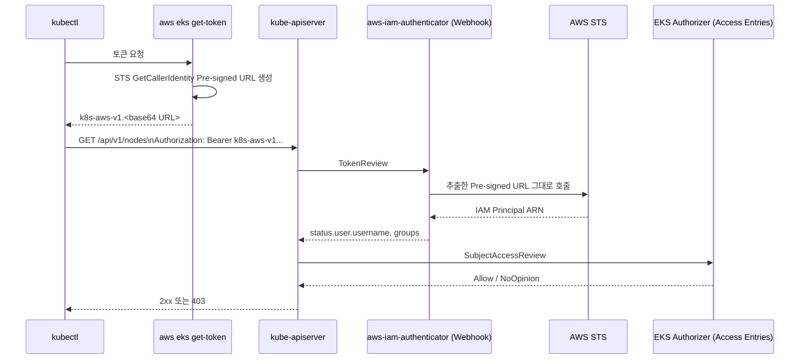

# Operator Authentication

Week 1의 [Authentication](../week1/4_authentication.md)에서는 `aws eks get-token`이 `k8s-aws-v1.xxx` 토큰을 반환하고 kubectl이 이 토큰을 Bearer 헤더에 담아 API 서버를 호출하면 200 OK가 반환되는 흐름까지 정리했습니다. 여기서는 그 토큰이 어떤 데이터로 구성되어 있고, API 서버가 그 토큰만으로 IAM principal을 어떻게 검증하는지를 다룹니다. 토큰 생성부터 인가까지를 다섯 단계로 나누어 정리합니다.



---

## Token Generation on the Client

`aws eks get-token`이 만드는 것은 인증 토큰이 아니라 AWS STS `GetCallerIdentity` API에 대한 Pre-signed URL입니다. 토큰 문자열은 `k8s-aws-v1.` 접두사 뒤에 base64 URL 인코딩된 페이로드가 붙은 형태이며, 디코딩하면 다음과 같은 STS 호출 URL이 됩니다.

```text
https://sts.ap-northeast-2.amazonaws.com/?Action=GetCallerIdentity
  &Version=2011-06-15
  &X-Amz-Algorithm=AWS4-HMAC-SHA256
  &X-Amz-Credential=AKIA.../20260401/ap-northeast-2/sts/aws4_request
  &X-Amz-Date=20260401T085620Z
  &X-Amz-Expires=60
  &X-Amz-SignedHeaders=host;x-k8s-aws-id
  &X-Amz-Signature=<HMAC-SHA256>
```

이 URL의 의미는 다음과 같습니다.

- **`X-Amz-SignedHeaders=host;x-k8s-aws-id`** — `x-k8s-aws-id` 헤더가 SigV4 서명에 포함됩니다. 이 헤더의 값은 클러스터 이름이며, 서명에 포함되어 있기 때문에 같은 IAM identity로 발급한 토큰을 다른 클러스터로 가져가 재사용할 수 없습니다.
- **`X-Amz-Credential`** — IAM 사용자의 access key id와 함께 날짜, 리전, 서비스 스코프가 들어가 있습니다. 어떤 IAM principal이 어떤 리전의 STS에 호출하는지가 명시됩니다.
- **`X-Amz-Expires=60`** — Pre-signed URL 자체의 유효 시간은 60초입니다. 다만 aws-iam-authenticator 서버는 토큰을 받은 시점부터 **15분(AWS가 허용하는 최단값)** 동안 유효한 것으로 간주하므로, 클라이언트는 토큰을 한 번 발급받아 15분 안에 여러 번 재사용할 수 있습니다.[^iam-auth-token]

[^iam-auth-token]: [aws-iam-authenticator README — Set up kubectl](https://github.com/kubernetes-sigs/aws-iam-authenticator#6-set-up-kubectl-to-use-authentication-tokens-provided-by-aws-iam-authenticator-for-kubernetes) — "The token is valid for 15 minutes (the shortest value AWS permits) and can be reused multiple times."

서명 자체는 `X-Amz-Signature` 필드에 들어 있고, AWS 서버는 이 값을 검증합니다. SigV4 키 유도가 Secret Access Key를 네트워크에 노출하지 않으면서도 동일한 서명을 재현할 수 있는 이유는 [Background — AWS Request Signing at a Glance](0_background.md#aws-request-signing-at-a-glance)에서 다뤘습니다.

---

## Bearer Token Submission

kubectl은 토큰을 `Authorization: Bearer k8s-aws-v1.xxx` 헤더에 담아 K8s API 서버로 보냅니다.

```bash
kubectl get nodes -v=10
# I0401 ... round_trippers.go:560] "Request" curlCommand=<
#         curl -v -XGET ... 'https://<id>.gr7.<region>.eks.amazonaws.com/api/v1/nodes?limit=500'
```

`kubectl -v=10`은 보안상 Authorization 헤더를 마스킹합니다. 직접 토큰을 들고 호출을 재현하려면 `aws eks get-token`으로 토큰을 받아 curl로 호출할 수 있습니다.

```bash
TOKEN_DATA=$(aws eks get-token --cluster-name myeks | jq -r '.status.token')
curl -k -s -XGET \
  -H "Authorization: Bearer $TOKEN_DATA" \
  -H "Accept: application/json" \
  "https://<id>.gr7.<region>.eks.amazonaws.com/api/v1/nodes?limit=500" | jq
```

토큰은 발급 시점부터 15분 동안 유효하므로, 직접 호출 실험은 그 안에 마쳐야 합니다.

---

## TokenReview Webhook

K8s가 토큰 검증을 Webhook에 위임하는 일반 메커니즘은 [Background — Kubernetes Extension via Webhook](0_background.md#kubernetes-extension-via-webhook)에서 다뤘습니다. EKS 환경에서는 이 인증 Webhook을 `aws-iam-authenticator`가 구현하며, kube-apiserver가 전달한 `TokenReview` 객체의 토큰에서 AWS STS Pre-signed URL을 추출해 그대로 STS에 제출합니다.

kube-apiserver는 인증 Webhook 호출 결과를 기본 2분간 캐싱합니다.[^webhook-cache-ttl] 같은 토큰으로 짧은 시간에 여러 요청이 들어오면 STS 호출이 매번 발생하지 않고 캐시된 결과가 재사용됩니다. 이 캐싱과 토큰 15분 유효성이 결합되어 STS 호출 빈도가 줄어듭니다.

[^webhook-cache-ttl]: [Kubernetes — Webhook Token Authentication](https://kubernetes.io/docs/reference/access-authn-authz/authentication/#webhook-token-authentication) — "`--authentication-token-webhook-cache-ttl` how long to cache authentication decisions. Defaults to two minutes."

직접 `TokenReview` 객체를 만들어 응답을 관찰할 수 있습니다.

```yaml
apiVersion: authentication.k8s.io/v1
kind: TokenReview
metadata:
  name: mytoken
spec:
  token: ${TOKEN_DATA}
```

```bash
kubectl create -f token-review.yaml
```

응답의 주요 필드는 다음과 같습니다.

| Field | Meaning |
|---|---|
| `status.authenticated` | 인증 성공 여부 (`true` / `false`) |
| `status.user.username` | K8s subject의 username (예: `arn:aws:iam::911283464785:user/admin`) |
| `status.user.groups` | K8s group 목록 (예: `[system:authenticated]`) |
| `status.user.extra.arn` | 매핑된 AWS IAM principal ARN |
| `status.audiences` | 토큰의 사용 대상 (예: `[https://kubernetes.default.svc]`) |

`audiences` 필드는 토큰이 어느 서비스를 대상으로 발급되었는지를 나타냅니다. 운영자 인증 토큰의 audience는 `https://kubernetes.default.svc`이며 K8s API 서버 전용입니다. [IRSA](4_pod-workload-identity.md#iam-roles-for-service-accounts) 토큰은 같은 위치에 `sts.amazonaws.com`을, [Pod Identity](4_pod-workload-identity.md#eks-pod-identity) 토큰은 `pods.eks.amazonaws.com`을 사용합니다. 각 서비스는 자신의 audience와 일치하지 않는 토큰을 거부하므로, 한 토큰을 다른 서비스로 가져가도 사용할 수 없습니다.

---

## STS Verification by aws-iam-authenticator

Webhook은 토큰에서 Pre-signed URL을 추출해 그대로 AWS STS에 제출합니다. STS가 서명을 검증하면 IAM Principal ARN이 반환되고, Webhook은 이 ARN을 K8s subject(username, groups)로 매핑해 응답합니다. 이 과정은 두 곳에서 관찰할 수 있습니다.

- **AWS CloudTrail** — `eventSource: sts.amazonaws.com`, `eventName: GetCallerIdentity`로 검색하면 EKS Webhook의 호출이 별도 이벤트로 기록됩니다. 사용자가 직접 호출한 `GetCallerIdentity`와 구분하려면 `eventTime`과 `sourceIPAddress`를 함께 봅니다.
- **EKS CloudWatch Logs** — 클러스터의 컨트롤 플레인 로깅이 활성화되어 있다면 `authenticator` 로그 스트림에서 `msg=access granted` 라인을 직접 확인할 수 있습니다.

`authenticator` 로그 스트림에서 STS 호출 패턴을 추적하는 Logs Insights 쿼리는 다음과 같습니다.

```text
fields @timestamp, @message, @logStream
| filter @logStream like /authenticator/
| filter @message like /stsendpoint/
| sort @timestamp desc
| limit 100
```

---

## EKS Authorizer - Webhook Mode

kube-apiserver는 `--authorization-mode=Node,RBAC,Webhook`로 구동됩니다. EKS 컨트롤 플레인 로그에서 `authentication-token-webhook`과 `authorization-webhook` 플래그를 직접 확인할 수 있습니다. K8s는 이 모드 목록에 나열된 순서대로 authorizer를 평가합니다. 즉 Node가 가장 먼저, 다음 RBAC, 마지막으로 Webhook(EKS Authorizer) 순서입니다. 어느 단계에서든 Allow가 나오면 즉시 종료되고, no opinion이면 다음 단계로 넘어갑니다. Webhook이 반환할 수 있는 세 가지 응답(Allow / no opinion / immediate deny)의 정의는 [Background — Webhook Authorizer Response Shape](0_background.md#kubernetes-extension-via-webhook)에서 다뤘습니다.

EKS Authorizer는 이 중 Allow와 no opinion만 사용합니다. AWS deep-dive 블로그가 명시한 동작을 인용하면 다음과 같습니다.[^eks-authz-order]

[^eks-authz-order]: [A deep dive into simplified Amazon EKS access management controls — Kubernetes authorizers](https://aws.amazon.com/blogs/containers/a-deep-dive-into-simplified-amazon-eks-access-management-controls/) — "the upstream RBAC evaluates and immediately returns a AuthZ decision upon an allow outcome. If the RBAC authorizer can't determine the outcome, then it passes the decision to the Amazon EKS authorizer. If both authorizers pass, then a deny decision is returned."

> RBAC이 먼저 평가되어 allow 결과가 나오면 즉시 반환합니다. RBAC이 결정하지 못하면 Amazon EKS Authorizer로 넘어갑니다. 두 authorizer 모두 결정하지 못하면 deny가 반환됩니다.

이 순서가 EKS의 Access Policy와 사용자 작성 RBAC이 한 클러스터에서 공존할 수 있는 이유입니다. 사용자가 직접 작성한 ClusterRole/ClusterRoleBinding이 RBAC 단계에서 먼저 평가되어 allow가 나오면 EKS Authorizer는 호출되지도 않고, RBAC에 매칭되는 규칙이 없으면 EKS Authorizer가 fallback으로 동작해 Access Policy 기반 권한을 평가합니다.

---

## Authorization Mapping - Access Entries vs aws-auth ConfigMap

인증을 통과한 IAM principal을 K8s subject로 매핑하는 방식은 두 가지입니다. EKS는 두 방식을 모두 지원하지만, 새 클러스터는 Access Entries만 사용하도록 구성하는 것을 권장합니다.

| Aspect | Access Entries (EKS API, recommended) | aws-auth ConfigMap (deprecated) |
|---|---|---|
| Data store | EKS 관리형 데이터 (AWS API) | `kube-system/aws-auth` ConfigMap (etcd) |
| Managed by | AWS API, eksctl, 콘솔, IaC 도구 | `kubectl edit cm` 직접 수정 |
| Permission grant | Access Policy 직접 연결 또는 K8s group 매핑 후 RBAC | K8s group 매핑 후 RBAC |
| Recovery from mistake | EKS API로 즉시 수정 가능 | 클러스터 락아웃 위험 |
| EKS Auto Mode | 필수 | 사용 불가 |

EKS의 인증 모드는 `CONFIG_MAP`, `API_AND_CONFIG_MAP`, `API` 셋이 있고, EKS Auto Mode는 `API` 모드(Access Entries 단독)를 요구합니다. `API_AND_CONFIG_MAP` 모드에서 같은 IAM principal에 양쪽 매핑이 모두 존재하면 Access Entry가 우선합니다.


*[Source: A deep dive into simplified Amazon EKS access management controls](https://aws.amazon.com/blogs/containers/a-deep-dive-into-simplified-amazon-eks-access-management-controls/)*

!!! warning "ConfigMap is deprecated"
    aws-auth ConfigMap은 공식적으로 deprecated 상태입니다. 새 클러스터는 `API` 모드로 생성하고, 기존 클러스터는 [Migrating existing aws-auth ConfigMap entries to access entries](https://docs.aws.amazon.com/eks/latest/userguide/migrating-access-entries.html) 절차에 따라 Access Entries로 전환합니다.

---

## Managed Access Policies and Custom RBAC

EKS는 20여 종의 관리형 Access Policy를 제공합니다.[^access-policies] 그중 운영자가 직접 사용하는 4종은 K8s의 user-facing ClusterRole(`cluster-admin`, `admin`, `edit`, `view`)에 대응됩니다. `AmazonEKSAdminViewPolicy`는 admin 권한에서 Secret 읽기를 제외한 정책으로, 운영 감사용으로 사용됩니다.

[^access-policies]: [Review access policy permissions](https://docs.aws.amazon.com/eks/latest/userguide/access-policy-permissions.html) — `aws eks list-access-policies`로 전체 목록을 확인할 수 있습니다.

| Access Policy | Permission Scope | Mapped ClusterRole | Target Audience |
|---|---|---|---|
| `AmazonEKSClusterAdminPolicy` | 클러스터 전체 모든 권한 (`*`) | `cluster-admin` | 클러스터 관리자 |
| `AmazonEKSAdminPolicy` | 대부분의 리소스 권한 (네임스페이스 단위) | `admin` | 네임스페이스 관리자 |
| `AmazonEKSEditPolicy` | 리소스 생성, 수정, 삭제 가능 (네임스페이스 단위) | `edit` | 개발자 |
| `AmazonEKSViewPolicy` | 읽기 전용 (네임스페이스 단위) | `view` | 모니터링, 감사 |
| `AmazonEKSAdminViewPolicy` | Admin 권한 + Secret 읽기 제외 | — | 운영 감사 |

위 5종 외의 `AmazonEKSAutoNodePolicy`, `AmazonEKSBlockStoragePolicy`, `AmazonEKSLoadBalancingPolicy`, `AmazonEKSNetworkingPolicy` 등은 EKS Auto Mode와 add-on이 자동으로 연결하므로 사용자가 직접 다루지 않습니다.

관리형 정책으로 표현할 수 없는 권한이 필요할 때(예: 특정 네임스페이스의 Pod만 list/get할 수 있는 그룹)는 Access Entry에 K8s group만 지정하고 ClusterRole/ClusterRoleBinding을 직접 작성합니다. RBAC 단계에서 사용자가 만든 ClusterRoleBinding이 평가되어 allow가 반환되면 EKS Webhook은 호출되지 않으며, RBAC에 매칭되는 규칙이 없으면 EKS Webhook이 fallback으로 평가됩니다. 이 평가 순서에 따라 RBAC과 EKS Access Policy를 한 클러스터 안에서 함께 사용할 수 있습니다.

---

## Worker Node as a Client

워커 노드의 kubelet도 같은 흐름으로 K8s API를 호출합니다. 운영자의 호출과 다른 점은 자격 증명의 원천이 EC2 Instance Profile에서 AssumeRole로 받은 임시 키라는 것입니다. EKS Managed Node Group을 만들면 노드의 IAM Role이 자동으로 Access Entry에 등록됩니다.

```bash
aws eks describe-access-entry \
  --cluster-name myeks \
  --principal-arn arn:aws:iam::911283464785:role/myeks-ng-1
```

```json
{
  "accessEntry": {
    "kubernetesGroups": ["system:nodes"],
    "username": "system:node:{{EC2PrivateDNSName}}",
    "type": "EC2_LINUX"
  }
}
```

`type: EC2_LINUX` Access Entry는 노드를 `system:nodes` 그룹에 자동으로 매핑합니다. 이 그룹은 `eks:node-bootstrapper` ClusterRole 외의 RBAC 권한을 가지지 않습니다. 그럼에도 노드가 자신의 노드 오브젝트와 Pod 상태를 갱신할 수 있는 것은 RBAC이 아니라 [`Node Restriction`](https://kubernetes.io/docs/reference/access-authn-authz/admission-controllers/#noderestriction) admission plugin이 권한을 부여하기 때문입니다. 이 admission 동작은 [Kubernetes RBAC](3_rbac.md#admission-control)에서 다룹니다.
