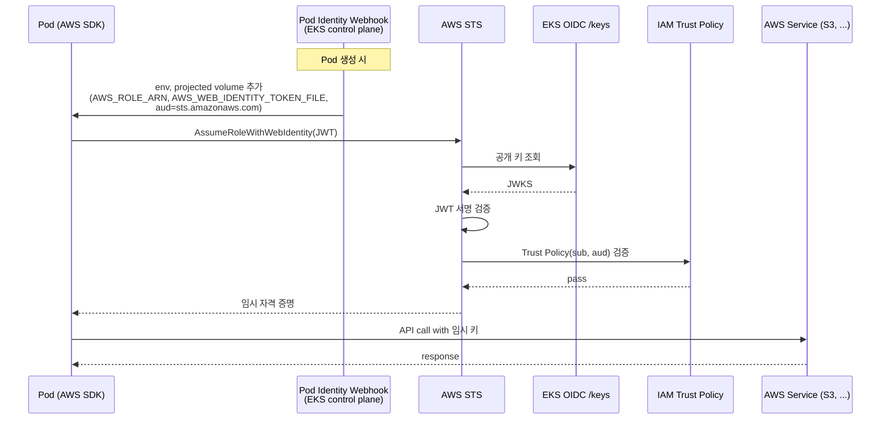
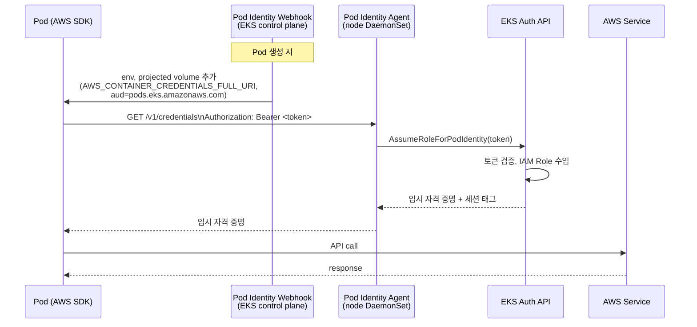

# Pod Workload Identity

앞 장의 RBAC은 Pod이 Kubernetes API를 호출할 때 적용되는 권한 모델이었습니다. Pod이 S3, DynamoDB, KMS 등 AWS API를 호출하려면 IAM 자격 증명이 필요합니다. 워커 노드의 EC2 Instance Profile에 권한을 추가해도 동작은 하지만, 같은 노드에 스케줄된 모든 Pod이 그 권한을 공유하므로 최소 권한 원칙에 어긋납니다.

EKS는 이 문제를 두 가지 방식으로 해결합니다. 2019년에 도입된 [IRSA](https://docs.aws.amazon.com/eks/latest/userguide/iam-roles-for-service-accounts.html)는 OIDC Federation을 사용해 Kubernetes ServiceAccount Token을 STS의 `AssumeRoleWithWebIdentity`로 교환합니다. 2023년 re:Invent에 발표된 [EKS Pod Identity](https://docs.aws.amazon.com/eks/latest/userguide/pod-identities.html)는 OIDC Federation 경로 없이 EKS Auth API로 동일한 결과를 얻으며, 설정 단계가 더 적습니다. Pod Identity도 내부적으로 ServiceAccount Token을 사용하지만, 토큰의 제출 대상이 STS가 아니라 EKS Auth API라는 점이 두 방식의 차이입니다. 다음 절에서 IRSA와 Pod Identity를 차례로 정리하고 마지막에 비교합니다.

---

## Why Not Node Instance Profile

Pod이 별도 자격 증명 설정 없이 AWS API를 호출할 때, AWS SDK는 EC2 IMDS(`169.254.169.254`)를 통해 노드의 임시 자격 증명을 가져옵니다. 이 방식은 추가 설정이 필요 없지만, 같은 노드에 있는 어떤 Pod이든 IMDS를 호출해 동일한 권한을 얻을 수 있습니다. 노드의 IAM Role 권한이 그 노드에 스케줄된 모든 워크로드의 상한이 됩니다.

컨테이너 이미지 취약점이나 사이드카 컨테이너를 통해 공격자가 IMDS로 노드 권한을 가로채는 시나리오는 EKS 보안 점검 항목에 자주 포함됩니다. EC2 IMDSv2의 hop limit 설정으로 일부 완화할 수 있으나, 근본적으로는 Pod 단위로 자격 증명을 분리해야 합니다.

---

## AWS SDK Credential Resolution Chain

boto3, AWS SDK for Go, AWS SDK for Java 등 모든 AWS SDK는 자격 증명을 다음 순서로 찾습니다.

1. 함수 인자로 직접 전달된 자격 증명
2. Session 객체에 명시된 자격 증명
3. 환경 변수 (`AWS_ACCESS_KEY_ID` 등)
4. AssumeRole 프로파일
5. **AssumeRoleWithWebIdentity** (IRSA가 사용)
6. **Container credential provider** (Pod Identity가 사용)
7. AWS IAM Identity Center 프로파일
8. Shared credentials 파일 (`~/.aws/credentials`)
9. EC2 Instance Metadata Service

IRSA는 환경 변수와 5번 단계를, Pod Identity는 환경 변수와 6번 단계를 사용합니다. 두 메커니즘 모두 애플리케이션 코드 변경 없이 SDK가 자격 증명을 가져오는 구조이며, 컨테이너 안에서 access key를 직접 다룰 필요가 없습니다.

Pod에 더 앞 단계의 자격 증명(예: 환경 변수로 설정한 access key)이 존재하면 IRSA/Pod Identity 설정과 무관하게 그 자격 증명이 사용됩니다. 이 동작은 점진적 마이그레이션에 활용할 수 있습니다. Pod Identity association을 먼저 만들어두고 기존 환경 변수를 나중에 제거하면 다운타임 없이 이전할 수 있습니다.

---

## IAM Roles for Service Accounts

OAuth 2.0과 OpenID Connect의 일반 동작과 IRSA가 OIDC Federation을 차용하는 방식은 [Background — OAuth and OpenID Connect](0_background.md#oauth-and-openid-connect)에서 다뤘습니다. 요약하면, EKS가 클러스터마다 OIDC Provider를 호스팅하고 Kubernetes ServiceAccount Token을 그 Provider가 서명한 JWT로 발급하면 AWS STS가 `AssumeRoleWithWebIdentity`로 이 토큰을 받아 임시 자격 증명을 반환합니다. 여기서는 EKS가 추가하는 컴포넌트만 정리합니다.


*[Source: Diving into IAM Roles for Service Accounts](https://aws.amazon.com/blogs/containers/diving-into-iam-roles-for-service-accounts/)*

### Components

| Component | Description |
|---|---|
| **EKS OIDC Provider** | `https://oidc.eks.<region>.amazonaws.com/id/<id>`. EKS가 클러스터마다 자동으로 호스팅합니다. private key는 7일마다 회전하며 public key는 만료까지 보관됩니다. |
| **IAM OIDC Identity Provider** | IAM에 위 OIDC Provider URL을 한 번 등록합니다. `eksctl utils associate-iam-oidc-provider`로 생성할 수 있습니다. |
| **IAM Role with Trust Policy** | `Principal.Federated`가 OIDC Provider, `Action`이 `sts:AssumeRoleWithWebIdentity`, `Condition`에 `sub`(특정 SA)와 `aud`(`sts.amazonaws.com`) |
| **Kubernetes ServiceAccount** | `eks.amazonaws.com/role-arn` annotation으로 IAM Role ARN을 가리킵니다. |
| **Pod Identity Webhook** | IRSA SA를 사용하는 Pod이 생성되면 Pod spec에 환경 변수와 projected volume을 추가합니다. webhook 서버는 EKS가 컨트롤 플레인에서 관리합니다. |

!!! info
    `pod-identity-webhook`은 EKS Pod Identity보다 먼저 IRSA용으로 도입되었습니다. 이름과 달리 Pod Identity 전용이 아니며, 현재는 IRSA와 EKS Pod Identity를 모두 처리합니다.

### Setup and Runtime Flow

IRSA의 동작은 두 단계로 나뉩니다. 클러스터당 한 번만 수행하는 셋업 단계에서는 EKS 클러스터 생성 시 자동으로 호스팅되는 OIDC Provider URL(`https://oidc.eks.<region>.amazonaws.com/id/<id>`)을 IAM에 OIDC Identity Provider로 등록하고(`eksctl utils associate-iam-oidc-provider`), 이 Provider를 신뢰하는 IAM Role을 생성한 뒤, Kubernetes ServiceAccount에 `eks.amazonaws.com/role-arn` annotation으로 Role ARN을 연결합니다.

런타임 단계는 Pod이 생성되거나 AWS API를 호출할 때마다 다음과 같이 반복됩니다.



1. Pod 생성 시 EKS의 Pod Identity Webhook이 Pod spec을 mutate해 `AWS_ROLE_ARN`, `AWS_WEB_IDENTITY_TOKEN_FILE`, `AWS_STS_REGIONAL_ENDPOINTS` 환경 변수와 `audience: sts.amazonaws.com`을 가진 `aws-iam-token` projected volume을 추가합니다.
2. AWS SDK가 환경 변수를 감지해 토큰 파일을 읽고 `AssumeRoleWithWebIdentity`를 호출합니다. JWT가 그대로 STS에 전달됩니다.
3. STS는 JWT의 `iss` 필드(EKS OIDC Provider URL)에서 JWKS 엔드포인트를 찾아 공개 키를 받아옵니다. 그 공개 키로 JWT 서명을 검증합니다.
4. 서명이 유효하면 IAM이 Trust Policy의 `Condition` (`sub`, `aud`)을 검증합니다. SA 이름과 audience가 일치해야 합니다.
5. 모든 검증을 통과하면 STS가 임시 자격 증명(AccessKeyId, SecretAccessKey, SessionToken)을 반환합니다.
6. SDK는 받은 자격 증명으로 실제 AWS API를 호출합니다. 자격 증명이 만료되기 전에 같은 흐름으로 자동 갱신됩니다.

### Audience Boundary

JWT `aud` claim의 구조는 [Background — Bearer Tokens and JWT](0_background.md#bearer-tokens-and-jwt)에서 다뤘습니다. EKS 환경에서는 세 토큰이 서로 다른 audience를 사용하므로 사용처가 구분됩니다.

| Token Type | `audience` | Verified By |
|---|---|---|
| Default SA Token | `https://kubernetes.default.svc` | Kubernetes API 서버 |
| IRSA Token | `sts.amazonaws.com` | AWS STS |
| Pod Identity Token | `pods.eks.amazonaws.com` | EKS Auth API |

각 서비스는 자기 audience와 일치하지 않는 토큰을 거부하므로, 하나의 토큰이 의도하지 않은 서비스로 전달되어도 자동으로 차단됩니다.

### OIDC Discovery

EKS OIDC Provider는 OIDC 표준 discovery 엔드포인트를 노출합니다.

```bash
IDP=$(aws eks describe-cluster --name myeks \
        --query cluster.identity.oidc.issuer --output text)

curl -s $IDP/.well-known/openid-configuration | jq .
```

```json
{
  "issuer": "https://oidc.eks.ap-northeast-2.amazonaws.com/id/<id>",
  "jwks_uri": "https://oidc.eks.ap-northeast-2.amazonaws.com/id/<id>/keys",
  "response_types_supported": ["id_token"],
  "subject_types_supported": ["public"],
  "id_token_signing_alg_values_supported": ["RS256"]
}
```

`jwks_uri`로 한 번 더 호출하면 JWT 서명 검증에 사용되는 RSA 공개 키 집합이 반환됩니다. STS와 IAM은 이 엔드포인트를 호출해 토큰 서명을 검증합니다.

### Verifying with AWS Load Balancer Controller

AWS Load Balancer Controller는 IRSA가 적용된 대표적인 add-on입니다. `eksctl create iamserviceaccount` 한 번으로 IAM Role, Trust Policy, Kubernetes ServiceAccount, annotation을 한꺼번에 생성할 수 있습니다.

```bash
eksctl create iamserviceaccount \
  --cluster myeks \
  --namespace kube-system \
  --name aws-load-balancer-controller \
  --attach-policy-arn arn:aws:iam::$ACCOUNT_ID:policy/AWSLoadBalancerControllerIAMPolicy \
  --override-existing-serviceaccounts \
  --approve
```

이후 Helm으로 LBC를 설치하고 Pod spec을 보면 `AWS_ROLE_ARN`, `AWS_WEB_IDENTITY_TOKEN_FILE`, `aws-iam-token` projected volume이 추가된 것을 직접 확인할 수 있습니다. CloudTrail에서는 `eventSource: sts.amazonaws.com`, `eventName: AssumeRoleWithWebIdentity`로 LBC Pod의 ARN으로 호출이 기록됩니다.

### Cross-Account IRSA

Account A의 EKS 클러스터에서 실행되는 Pod이 Account B의 AWS 리소스에 접근해야 한다면 두 가지 방법이 있습니다.[^cross-account-irsa]

- **OIDC Provider 공유** — Account B가 Account A의 OIDC issuer URL로 자신의 계정에 IAM OIDC Provider를 생성하고, Account B의 IAM Role을 ServiceAccount annotation으로 직접 연결합니다. OIDC Provider 관리 책임이 Account B로 넘어가지만 STS 호출은 한 번으로 끝납니다.
- **Role chaining** — Account A의 IRSA Role이 STS `AssumeRole`로 Account B의 Role을 다시 수임합니다. OIDC Provider 관리는 Account A에 남지만 STS 호출이 두 번 발생합니다.

두 방식 모두 Trust Policy의 `Principal`은 account root(`arn:aws:iam::111122223333:root`)가 아니라 구체적인 Role ARN으로 지정합니다.

!!! warning
    AWS는 Role chaining 시 세션 유효 시간을 최대 1시간으로 제한합니다.[^role-chaining-limit] 일반 IRSA는 최대 12시간까지 설정 가능하지만, Role을 한 번 더 Assume하는 순간 이 제한이 적용됩니다. 장시간 실행되는 배치 워크로드에는 OIDC Provider 공유 방식이 적합합니다.

[^role-chaining-limit]: [IAM roles — Role chaining](https://docs.aws.amazon.com/IAM/latest/UserGuide/id_roles.html)

[^cross-account-irsa]: [Authenticate to another account with IRSA](https://docs.aws.amazon.com/eks/latest/userguide/cross-account-access.html)

### Considerations

<div class="grid cards" markdown>

- :material-package-variant: **SDK minimum version**

    ---
    SDK가 `AssumeRoleWithWebIdentity`를 지원해야 합니다. 대표 버전은 boto3 ≥ 1.9.220, AWS SDK for Java v2 ≥ 2.10.11, AWS SDK for Go v1 ≥ 1.23.13입니다. 전체 표는 [공식 문서](https://docs.aws.amazon.com/eks/latest/userguide/iam-roles-for-service-accounts-minimum-sdk.html)를 참조합니다.

- :material-network-outline: **hostNetwork Pod의 IMDS 노출**

    ---
    호스트 네트워크를 사용하는 Pod은 노드의 IMDS에 항상 접근할 수 있습니다. SDK는 IRSA 자격 증명을 우선 사용하지만, IMDS 자체를 막지는 못합니다.

- :material-earth: **Supported environments**

    ---
    IRSA는 EKS, EKS Anywhere, ROSA, EC2 자체 관리형 Kubernetes에서 사용할 수 있습니다. EKS on Outposts local cluster에서는 사용 불가입니다.

- :material-lock-open-outline: **OIDC Provider URL is public**

    ---
    클러스터의 OIDC Provider URL과 JWKS 엔드포인트는 인증 없이 접근할 수 있습니다. EKS 외부 시스템에서도 Kubernetes ServiceAccount Token의 서명을 검증할 수 있어 외부 워크로드 페더레이션에 활용할 수 있습니다.

</div>

---

## EKS Pod Identity

IRSA는 OIDC 표준을 따르지만 운영 부담이 큽니다. 클러스터를 새로 만들 때마다 IAM OIDC Provider를 등록해야 하고, Trust Policy의 `sub` 조건에 SA 이름이 하드코딩되며, `Principal.Federated`에 OIDC Provider URL이 들어가 있어 클러스터 간 Role 재사용이 어렵습니다. IAM Trust Policy 크기 한도 때문에 하나의 Role을 여러 SA에 매핑하는 데에도 제한이 있습니다. EKS Pod Identity는 OIDC Federation 경로 대신 `eks-auth:AssumeRoleForPodIdentity` API를 사용해 이 제약을 제거합니다.


*[Source: Amazon EKS Pod Identity: a new way for applications on EKS to obtain IAM credentials](https://aws.amazon.com/blogs/containers/amazon-eks-pod-identity-a-new-way-for-applications-on-eks-to-obtain-iam-credentials/)*

### Architecture

`eks-pod-identity-agent`는 DaemonSet으로 모든 노드에서 실행되며 노드의 `hostNetwork`를 사용해 link-local 주소에 바인딩됩니다. AWS 공식 문서가 명시하는 주소와 포트는 다음과 같습니다.[^pod-id-agent]

- IPv4: `169.254.170.23`, port `80`(자격 증명 응답)과 `2703`(헬스 프로브)
- IPv6: `[fd00:ec2::23]`, 동일 포트

[^pod-id-agent]: [Learn how EKS Pod Identity grants pods access to AWS services — Considerations](https://docs.aws.amazon.com/eks/latest/userguide/pod-identities.html#pod-id-considerations)

이 IPv4 주소는 IANA link-local 범위(RFC 3927, `169.254.0.0/16`)에 속하므로 VPC CIDR이나 Pod CIDR과 충돌하지 않으며 라우팅 테이블에도 전파되지 않습니다. 이 특성은 [Week 2의 link-local 주소](../week2/4_pod-networking.md) 설명과 동일한 맥락입니다.

EKS Auto Mode 클러스터는 Agent가 사전 설치되어 있고, 그 외 클러스터에서는 EKS add-on(`eks-pod-identity-agent`)으로 설치합니다.[^pod-id-agent-setup] 노드의 IAM Role은 Agent가 EKS Auth API를 호출할 수 있도록 `eks-auth:AssumeRoleForPodIdentity` 권한이 필요하며, 이 권한은 AWS 관리형 정책 `AmazonEKSWorkerNodePolicy`에 이미 포함되어 있습니다.

[^pod-id-agent-setup]: [Set up the Amazon EKS Pod Identity Agent](https://docs.aws.amazon.com/eks/latest/userguide/pod-id-agent-setup.html)

### Pod Identity Association

IRSA는 ServiceAccount에 annotation을 다는 방식으로 IAM Role과 매핑하지만, Pod Identity는 EKS API의 `CreatePodIdentityAssociation`으로 매핑을 등록합니다.

```bash
aws eks create-pod-identity-association \
  --cluster-name myeks \
  --namespace default \
  --service-account s3-sa \
  --role-arn arn:aws:iam::$ACCOUNT_ID:role/s3-eks-pod-identity-role
```

association은 EKS 관리형 데이터에 저장되므로 클러스터 내부 리소스를 건드리지 않습니다. 클러스터별로 최대 5,000개의 association을 등록할 수 있습니다.

### Credential Flow



각 단계의 의미는 다음과 같습니다.

1. Pod 생성 시 Pod Identity Webhook이 Pod spec을 mutate해 환경 변수와 projected volume을 추가합니다. 환경 변수와 토큰 파일 경로는 다음과 같습니다. Projected token의 audience는 `pods.eks.amazonaws.com`이고 만료는 24시간입니다.

    ```text
    AWS_CONTAINER_AUTHORIZATION_TOKEN_FILE=/var/run/secrets/pods.eks.amazonaws.com/serviceaccount/eks-pod-identity-token
    AWS_CONTAINER_CREDENTIALS_FULL_URI=http://169.254.170.23/v1/credentials
    ```

2. SDK가 `AWS_CONTAINER_CREDENTIALS_FULL_URI`를 따라 노드의 Agent에 HTTP 요청을 보냅니다. 토큰은 Authorization 헤더에 담깁니다.
3. Agent는 받은 토큰으로 EKS Auth 서비스의 `AssumeRoleForPodIdentity` API를 호출합니다.
4. EKS Auth가 토큰을 검증하고 association에 등록된 IAM Role을 수임해 임시 자격 증명을 반환합니다. 이때 클러스터 ARN, 네임스페이스, ServiceAccount 이름, Pod 이름 등이 자동 세션 태그로 첨부됩니다.
5. SDK는 받은 자격 증명으로 실제 AWS API를 호출합니다.

직접 흐름을 재현하려면 컨테이너 안에서 다음을 실행합니다.

```bash
TOKEN=$(cat $AWS_CONTAINER_AUTHORIZATION_TOKEN_FILE)
curl -s 169.254.170.23/v1/credentials -H "Authorization: $TOKEN" | jq
```

응답으로 `AccessKeyId`, `SecretAccessKey`, `Token`, `Expiration`이 반환됩니다.

### Trust Policy

Pod Identity용 IAM Role의 Trust Policy는 IRSA와 다르게 OIDC Provider 대신 EKS 서비스 principal을 신뢰합니다.

```json
{
  "Version": "2012-10-17",
  "Statement": [{
    "Effect": "Allow",
    "Principal": { "Service": "pods.eks.amazonaws.com" },
    "Action": [
      "sts:AssumeRole",
      "sts:TagSession"
    ]
  }]
}
```

`sts:TagSession`은 Pod의 클러스터 ARN, 네임스페이스, SA 이름을 세션 태그로 전달하기 위해 추가되었습니다. 이 태그를 IAM 권한 정책의 `Condition`에서 참조하면 ABAC 패턴을 적용할 수 있습니다. 예를 들어 자기 네임스페이스의 Secret만 읽을 수 있는 정책을 단일 정책 문서로 작성할 수 있습니다.

---

## IRSA vs Pod Identity

| Aspect | IRSA | Pod Identity |
|---|---|---|
| Auth mechanism | OIDC Federation (`AssumeRoleWithWebIdentity`) | EKS Auth API (`AssumeRoleForPodIdentity`) |
| OIDC Provider registration | 필요 | 불필요 |
| Trust Policy principal | OIDC Provider URL | `pods.eks.amazonaws.com` Service |
| Cross-cluster Role reuse | Trust Policy 갱신 필요 | 그대로 재사용 |
| Session tags | 지원 안 함 | 자동 태깅 (cluster, namespace, SA, Pod) |
| STS API quota impact | 호출당 STS 호출 | EKS Auth 호출 (STS quota 부담 없음) |
| Supported environments | EKS, EKS Anywhere, ROSA, EC2 자체 관리 Kubernetes | EKS only |
| Minimum EKS version | 모든 지원 버전 | 1.24+ |
| Pod Identity association limit | 해당 없음 | 5,000 / cluster |
| Introduced | 2019 | 2023 re:Invent |

신규 EKS 클러스터이고 운영 환경이 EKS로 한정된다면 Pod Identity를 우선 검토합니다. 클러스터 간 Role 재사용, 세션 태그 기반 ABAC, 설정 단계 수에서 Pod Identity가 IRSA보다 적은 비용을 요구합니다. 기존 IRSA 리소스가 많거나 EKS Anywhere, self-managed K8s 같은 환경에 동일한 인증 메커니즘을 적용해야 하는 경우에는 IRSA를 유지합니다. 두 방식은 같은 클러스터 안에서 공존할 수 있으므로 점진적으로 마이그레이션할 수 있습니다.

---

## Considerations

<div class="grid cards" markdown>

- :material-shield-alert: **Containers are not a security boundary**

    ---
    IRSA와 Pod Identity는 Pod 단위로 자격 증명을 분리하지만, 같은 노드의 다른 Pod에서 권한을 탈취당할 가능성을 완전히 제거하지는 않습니다. IAM Role에는 항상 최소 권한 원칙을 적용합니다.

- :material-ip-network: **link-local address blocking**

    ---
    Pod Identity Agent는 `169.254.170.23`(IPv4) / `[fd00:ec2::23]`(IPv6)의 포트 `80`, `2703`에 바인딩됩니다. NetworkPolicy나 호스트 방화벽이 이 주소를 차단하면 자격 증명 발급이 실패합니다. IPv6를 사용하지 않는 환경이라면 [IPv6 비활성화 절차](https://docs.aws.amazon.com/eks/latest/userguide/pod-id-agent-config-ipv6.html)가 필요합니다.

- :material-file-search: **CloudTrail event source**

    ---
    IRSA는 `sts.amazonaws.com` / `AssumeRoleWithWebIdentity`, Pod Identity는 `eks-auth.amazonaws.com` / `AssumeRoleForPodIdentity`로 기록됩니다. 감사 쿼리에 두 소스를 모두 포함해야 합니다.

- :material-package-up: **SDK version**

    ---
    Pod Identity는 [별도의 SDK 최소 버전 표](https://docs.aws.amazon.com/eks/latest/userguide/pod-id-minimum-sdk.html)를 따릅니다. IRSA용 SDK와 호환되지 않을 수 있으므로 마이그레이션 전 SDK 업그레이드가 선행되어야 합니다.

</div>
