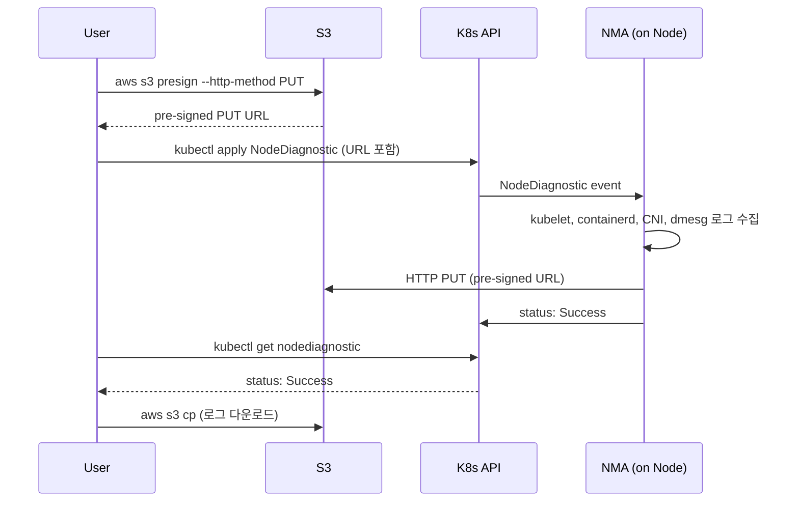

# Common Failures

EKS 장애 대응은 어디부터 살펴볼지 순서를 정하는 데서 시작합니다. 알림을 받은 직후 개별 Pod부터 들여다보면 영향 범위 파악이 늦어집니다. 이 문서는 장애 유형별로 먼저 확인해야 할 지점과 자주 만나는 패턴을 정리합니다.

## Scoping Before Diagnosis

개별 Pod을 바로 확인하기보다 스코프를 좁히는 세 가지 점검을 먼저 거칩니다.

-   **1. 클러스터 자체가 살아 있는가**

    `aws eks describe-cluster`가 `ACTIVE`가 아니거나 AWS Health Dashboard에 이벤트가 있으면 control plane 이슈입니다. 사용자가 복구할 수 없으므로 바로 AWS Support에 문의합니다.

-   **2. 영향 범위는 어디까지인가**

    `kubectl get events -A --sort-by='.lastTimestamp'`와 실패 Pod의 노드, 네임스페이스 분포를 확인합니다.

    특정 노드에 몰려 있으면 노드나 CNI 문제일 가능성이 높고, 특정 네임스페이스에 몰려 있으면 최근 배포로 원인 후보가 좁혀집니다.

-   **3. 대상의 이전 상태**

    `kubectl logs --previous`로 재시작 직전 로그를 확인합니다. 재시작 이후의 새 컨테이너 로그는 원인이 이미 덮여 있을 수 있기 때문입니다.

## Symptoms vs. Root Cause

증상이 드러나는 위치와 원인이 있는 위치는 다를 수 있습니다. `CrashLoopBackOff`는 Workload에서 관찰되는 증상이지만, 원인은 CoreDNS 응답 지연, PVC mount 실패, 노드 메모리 압박 어디에나 있을 수 있습니다. 증상이 난 지점이 아니라 원인이 있을 만한 영역부터 좁혀 들어가는 것이 빠릅니다.

EKS는 control plane과 data plane의 책임이 나뉜 공유 책임 모델이므로, 책임 경계 안팎을 먼저 판단해야 합니다[^reliability]. Observability 자체가 장애 원인이 되는 경우는 드물지만, 관측이 갖춰져 있어야 반복되는 패턴을 선제적으로 잡아낼 수 있습니다.

## Pod-level Failures

Pod 상태(`kubectl get pods`의 `STATUS` 컬럼)에서 가장 자주 만나는 에러 패턴들입니다. 증상은 Pod 층에서 나타나지만 원인은 컨테이너, 이미지, 레지스트리, 노드 자원 어디에나 있을 수 있습니다.

### CrashLoopBackOff and OOMKilled

`CrashLoopBackOff`에서 원인을 좁히는 단서는 `kubectl describe pod`의 `Last State: Terminated` 아래 Exit Code입니다. Exit Code 137은 SIGKILL로, `OOMKilled` 또는 liveness probe 실패에서 나옵니다.

OOMKilled는 발생 위치에 따라 대응이 달라집니다. 컨테이너 limit 초과(Pod 수준 OOM)는 해당 컨테이너만 죽지만, 노드 수준 OOM은 requests가 실제 사용량보다 작게 설정된 Pod들이 한 노드에 몰려 overcommit된 경우로, 무관한 Pod까지 evict됩니다. `kubectl top node`의 메모리 수치와 requests 합을 비교해 overcommit 비율을 점검합니다.

!!! warning
    limits만 올리고 requests를 그대로 두면 스케줄러 판단과 실제 사용량의 격차가 커져 노드 수준 OOM 위험이 오히려 증가합니다. requests도 실제 사용량에 맞춰 함께 조정해야 합니다.

AMS Accelerate의 EKS baseline alerts가 "Container OOM killed"를 독립 알림 항목으로 두는 것도 이 현상이 반복적이고 진단 경로가 다르기 때문입니다[^amsbaseline].

### ImagePullBackOff

이미지 pull 실패는 다음 네 가지 원인 중 하나인 경우가 많습니다.

=== "이미지 경로 오타"
    컨테이너 이미지의 레지스트리, 리포지토리, 태그가 정확한지 확인합니다.

=== "Private registry 인증"
    ECR 토큰은 12시간 주기로 갱신됩니다. `imagePullSecrets` 또는 노드 IAM 역할이 올바르게 설정되었는지 확인합니다.

=== "네트워크 경로 차단"
    VPC endpoint 또는 NAT Gateway 경로가 정상인지, 보안 그룹과 네트워크 ACL에서 차단되지 않았는지 확인합니다.

=== "IAM 권한 누락"
    노드 instance profile에 `AmazonEC2ContainerRegistryReadOnly`가 누락되면 노드 갱신이나 교체 이후에 문제가 드러나므로 미리 점검해 둡니다.

## Networking Failures

Pod이 살아 있어도 트래픽이 흐르지 않거나 IP 할당이 실패하는 경우는 네트워킹 스택에서 원인을 찾습니다.

### Running Pods Receiving No Traffic

Pod 상태가 `Running`인데 트래픽이 들어오지 않으면, Service selector가 지목하는 Ready 상태 Pod이 실제로 EndpointSlice에 들어갔는지가 첫 확인 대상입니다. readiness probe가 실패 중이면 Pod은 살아 있어도 트래픽을 받지 못합니다. Pod Readiness Gate를 쓰는 경우는 ALB target health까지 조건에 포함됩니다.

### DNS Timeouts from ENI Packet Limit

증상은 간헐적 DNS 타임아웃이지만, 원인이 ENI 레벨 패킷 제한인 경우가 많습니다. 노드에서 VPC resolver로 보내는 DNS 요청은 모두 primary ENI의 source IP를 사용하고, ENI는 link-local 트래픽에 초당 1024 패킷 한도를 가집니다[^dnsperf]. 한도 초과 시 `linklocal_allowance_exceeded` 메트릭이 증가합니다.

완화 방법은 다음 순서로 적용합니다.

1. **CoreDNS replica 증설 또는 autoscaling** — Query를 여러 Pod으로 분산해 노드 하나의 ENI에 몰리는 트래픽을 줄입니다.
2. **NodeLocal DNSCache 도입** — 각 노드에 로컬 캐시 DaemonSet을 두어 VPC resolver로 향하는 Query 자체를 줄이므로 link-local 트래픽 감소에 직접 기여합니다.
3. **Pod의 `/etc/resolv.conf`에서 `ndots` 값 하향** — Kubernetes 기본값이 `ndots:5`라서 점이 5개 미만인 호스트명은 search domain을 모두 순회한 뒤 FQDN으로 Query하기 때문에, 값을 낮추면 불필요한 Query 수가 줄어듭니다.

NMA가 설치되어 있으면 같은 이상을 `LinkLocalExceeded`, `PPSExceeded` 조건으로 선제 노출합니다.

!!! tip
    AWS는 DNS 진단을 자동화한 SSM Automation runbook을 제공합니다. VPC DNS 설정, CoreDNS Deployment와 ConfigMap 상태, 노드에서의 실제 DNS resolution을 한 번에 점검하고 로그를 S3로 모아주므로 수동 확인 대신 먼저 실행해 볼 수 있습니다. 단, 클러스터 인증 모드가 `API` 또는 `API_AND_CONFIG_MAP`이어야 Lambda proxy를 통한 Kubernetes API 호출이 가능합니다[^dnsrunbook].

### Subnet IP Exhaustion

Pod이 `failed to assign an IP address to container`로 멈추면 서브넷 또는 ENI당 할당 IP가 소진된 상태입니다. EKS가 권하는 세 전략은 서로 배타적이지 않고 조합할 수 있습니다[^ipopt].

- **Prefix Delegation** — ENI에 IP를 하나씩 붙이지 않고 `/28`(16개 IP) 단위로 묶어 할당합니다. 노드당 수용 가능한 Pod 수가 크게 늘어나 첫 번째 선택지로 적합합니다. 단, `/28`은 연속된 16개 IP 구간을 한 번에 확보해야 하므로 기존 노드들이 서브넷 IP를 띄엄띄엄 점유한 상태에서는 할당 실패가 잦습니다. 따라서 신규 노드 그룹부터 적용을 권장합니다.
- **Custom Networking** — VPC에 보조 CIDR(예: `100.64.0.0/10`, RFC 6598 대역)을 추가한 뒤 Pod IP는 이 보조 CIDR의 서브넷에서만 할당합니다. 노드의 primary ENI는 기존 주 CIDR을 그대로 쓰고, Pod IP 용도로는 쓰이지 않습니다. 대신 primary ENI의 slot을 Pod에 쓸 수 없어 노드당 Pod 수가 다소 줄어드는 trade-off가 있습니다.
- **IPv6** — VPC를 dual-stack으로 전환합니다. 주소 공간 제약은 사실상 사라지지만 IPv4 전용 온프렘이나 downstream 시스템과의 호환성 검증이 도입 전 주요 고려사항입니다.

## Storage Failures

### Volume Mount Failures

EBS 볼륨은 생성된 AZ에서만 attach할 수 있습니다. `Unable to attach or mount volumes`를 만나면 먼저 Pod이 PV와 같은 AZ로 스케줄됐는지를 `topology.ebs.csi.aws.com/zone` 라벨로 확인합니다. 그 다음 후보는 노드 교체 시의 detach 지연, CSI driver ServiceAccount의 `ec2:AttachVolume`과 `ec2:DetachVolume` 권한 누락, EFS의 경우 노드 SG의 NFS 2049 포트 egress 차단입니다.

Nitro 세대 인스턴스의 볼륨 attachment 한도는 인스턴스 타입별로 다르므로 사전에 확인해 둡니다[^nitrolimit]. 한도를 초과하면 attach 자체가 실패합니다.

## Node-level Failures

Pod 여러 개가 같은 노드에서 동시에 이상 증상을 보이면 노드 자체를 먼저 확인합니다.

### Reading Node Conditions

`kubectl describe node`의 `Conditions` 섹션은 노드 상태를 한 번에 보여줍니다. 각 조건의 의미는 다음과 같습니다.

- `MemoryPressure=True` — 노드 메모리 임계치 초과, Pod eviction 가능성
- `DiskPressure=True` — inode나 디스크 사용률 임계치 초과, 이미지 GC 개입
- `PIDPressure=True` — PID 한도 임박, 신규 프로세스 실패 위험
- `NetworkUnavailable=True` — 노드 라우팅 설정 문제
- `Ready=False` — kubelet heartbeat 단절 또는 컨테이너 런타임 실패

임시 복구가 어려우면 `kubectl cordon`으로 신규 스케줄을 막고 drain 후 노드를 교체합니다. NMA와 Auto Repair가 갖춰져 있으면 이 과정이 상당 부분 자동화됩니다.

### Collecting Node Logs

기존 `eks-log-collector`는 노드에 SSH나 SSM으로 접근해 스크립트를 실행하는 방식이었습니다. NMA가 설치되어 있으면 `NodeDiagnostic` CRD를 만들어 kubectl만으로 노드 로그를 S3에 수집할 수 있어 접근이 훨씬 간편합니다[^nodediag].

업로드 대상 S3 버킷에 대한 pre-signed PUT URL은 사용자가 AWS CLI로 미리 생성해 `NodeDiagnostic` 리소스의 `spec.logCapture.destination`에 넣어야 합니다. CRD가 자체적으로 URL을 만들지는 않습니다.

EKS Auto Mode는 NMA가 기본 포함되어 즉시 사용 가능하고, MNG는 add-on을 별도로 설치해야 합니다.

!!! info "Pre-signed URL expiration"
    pre-signed URL은 최대 7일(IAM 사용자 서명 기준)까지만 유효하므로 일회성 장애 진단에는 적합하지만, 반복 수집이나 자동화에는 만료 관리 부담이 있습니다. 이 때문에 NMA `v1.6.1-eksbuild.1` 이상에서는 `destination: node` 옵션을 제공합니다.

    `destination: node`를 지정하면 NMA가 수집한 로그를 S3로 업로드하는 대신 노드에 `.tar.gz`로 임시 저장합니다. 사용자는 이후 `kubectl ekslogs <node-name>` 플러그인으로 해당 로그를 로컬로 내려받으며, label selector(`kubectl ekslogs -l key=value`)를 통해 다수 노드 로그를 일괄 수집할 수도 있습니다.

[^reliability]: [AWS Docs — EKS Best Practices: Reliability](https://docs.aws.amazon.com/eks/latest/best-practices/reliability.html)
[^amsbaseline]: [AWS Docs — AMS Accelerate EKS baseline alerts](https://docs.aws.amazon.com/managedservices/latest/accelerate-guide/acc-baseline-eks-alerts.html)
[^dnsperf]: [AWS Docs — Monitoring EKS workloads for Network performance issues](https://docs.aws.amazon.com/eks/latest/best-practices/monitoring_eks_workloads_for_network_performance_issues.html)
[^dnsrunbook]: [AWS Docs — AWSSupport-TroubleshootEKSDNSFailure runbook](https://docs.aws.amazon.com/systems-manager-automation-runbooks/latest/userguide/automation-awssupport-troubleshooteksdnsfailure.html)
[^ipopt]: [AWS Docs — Optimizing IP Address Utilization](https://docs.aws.amazon.com/eks/latest/best-practices/ip-opt.html)
[^nitrolimit]: [AWS Docs — EKS known limits and service quotas](https://docs.aws.amazon.com/eks/latest/best-practices/known_limits_and_service_quotas.html)
