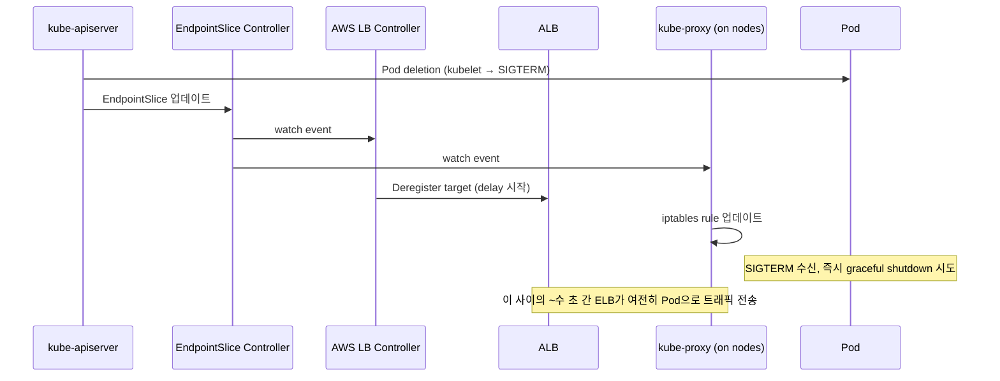

# Availability and Scale

앞 문서들이 장애 발생 시의 진단을 다뤘다면, 이 문서는 장애가 나지 않도록 어떻게 운영하는가에 해당합니다. EKS에서 가용성을 무너뜨리는 전형적 원인은 세 가지입니다 — (1) Pod이 종료될 때 트래픽을 받는 시간 창, (2) 설정 변경이 롤아웃되지 않는 현상, (3) 규모 확장에 따라 기존 패턴이 깨지는 상황. 각각에 대해 AWS 공식 문서가 권하는 해법을 정리하고, Pod Identity와 IRSA처럼 확장에 따라 선택이 달라지는 운영 주제를 함께 다룹니다.

Week 4의 [Pod Workload Identity](../week4/4_pod-workload-identity.md)에서 두 인증 방식의 구조적 차이를 설명했다면, 여기서는 **운영 규모가 커질 때 어느 쪽을 선택할지**에 대한 판단을 다룹니다.

---

## ALB Zero-downtime Rolling Update

Deployment를 롤링 업데이트할 때 5xx 에러가 간헐적으로 발생하는 현상은 흔합니다. 원인은 Kubernetes 계층과 AWS ELB 계층 사이의 **상태 동기화 지연**입니다. AWS 공식 best-practice 가이드[^eks-load-balancing]와 AWS Containers Blog의 전용 기술문서[^alb-rapid-scale]가 이 문제의 메커니즘과 처방을 구체적으로 설명합니다.

### 왜 요청이 떨어지는가

Pod이 종료될 때 일어나는 일을 순서대로 보면:



**종료 신호가 SIGTERM을 Pod에 보내는 시점**과 **ELB가 그 Pod을 target group에서 제외하는 시점**이 비동기입니다. Pod이 SIGTERM을 받자마자 connection을 닫으면, ELB가 deregister하기 전에 도착한 요청들이 connection refused로 떨어집니다[^lifecycle-hooks].

### 공식 권장 5가지

공식 load-balancing best-practice[^eks-load-balancing]가 제시하는 처방은 다음과 같습니다.

**1. IP target type 사용** — ALB가 Pod IP로 직접 트래픽을 보내도록 설정. Instance target type의 NodePort 경유 경로를 제거해 health check가 Pod 자체에 도달하며, AZ 간 불필요한 hop도 사라집니다.

**2. Readiness Probe 제대로 구성** — `Ready=True`인 Pod만 EndpointSlice에 들어갑니다. 초기 warm-up이 필요한 앱은 readiness probe의 `initialDelaySeconds`, `periodSeconds`를 실제 기동 시간에 맞춰 설정합니다.

**3. Pod Readiness Gate 활성화** — 신규 Pod이 `Ready`가 되어도 ALB target으로 "Healthy" 상태가 되기까지 시간 차가 있어, 이 시간 창에서 기존 Pod이 먼저 종료되면 트래픽 단절이 생깁니다. Readiness Gate는 AWS Load Balancer Controller가 **ALB의 target status가 Healthy가 되어야 Pod 조건을 Ready로 승격**하게 해, 롤링 업데이트 중 기존 Pod 종료를 지연시킵니다[^eks-load-balancing].

    ```yaml
    # 네임스페이스에 라벨만 붙이면 AWS LB Controller가 readiness gate를 자동으로 추가
    apiVersion: v1
    kind: Namespace
    metadata:
      name: prod
      labels:
        elbv2.k8s.aws/pod-readiness-gate-inject: enabled
    ```

**4. SIGTERM 처리 + terminationGracePeriodSeconds** — 애플리케이션이 SIGTERM을 받으면 in-flight request를 완료하고 데이터베이스 connection과 file descriptor를 닫은 뒤 종료합니다. `terminationGracePeriodSeconds`는 이 정리 시간보다 길어야 합니다. 기본값(30초)은 종종 부족합니다.

**5. preStop hook sleep** — SIGTERM을 애플리케이션이 받기 **전에** 먼저 수 초를 대기해 ELB deregister와 kube-proxy iptables rule 업데이트가 전파되도록 합니다[^lifecycle-hooks].

```yaml
lifecycle:
  preStop:
    exec:
      command: ["/bin/sh", "-c", "sleep 15"]
```

!!! tip "Why preStop sleep matters"
    preStop sleep 없이 SIGTERM 처리만 잘 해도 in-flight request는 완료되지만, **kube-proxy iptables rule이 전파되는 수 초 동안 새로 도착한 요청**은 여전히 이 Pod으로 라우팅됩니다. 이 요청들은 애플리케이션이 이미 server socket을 닫는 중이면 connection reset을 받습니다. preStop sleep은 이 비동기 전파 시간을 흡수하는 버퍼입니다.

### PDB를 잊지 말 것

모든 graceful shutdown 로직은 **한 번에 한 Pod씩** 종료될 때 유효합니다. 롤링 업데이트가 여러 Pod을 동시에 교체하면 개별 Pod의 preStop sleep 누적이 무의미해집니다. `PodDisruptionBudget`으로 동시 disruption 허용 수를 제한해야 합니다[^eks-load-balancing].

```yaml
apiVersion: policy/v1
kind: PodDisruptionBudget
metadata:
  name: api-pdb
spec:
  minAvailable: 80%
  selector:
    matchLabels:
      app: api
```

---

## Configuration Drift — Reloader

설정 변경(ConfigMap, Secret)은 Pod이 재시작되기 전까지 반영되지 않습니다. Deployment를 `rollout restart`로 수동 재시작하거나 env에 해시값을 추가하는 식으로 해결하지만, 수많은 서비스를 이 방식으로 관리하면 누락이 생깁니다.

**Reloader**[^reloader-repo]는 ConfigMap/Secret 변경을 감지해 해당 리소스를 사용하는 Deployment, StatefulSet, DaemonSet을 자동 rollout하는 오픈소스 컨트롤러입니다. 적용은 annotation 하나로 끝납니다.

```yaml
apiVersion: apps/v1
kind: Deployment
metadata:
  annotations:
    reloader.stakater.com/auto: "true"  # 이 Deployment가 참조하는
                                         # 모든 ConfigMap/Secret 감시
```

**범위 설계 원칙** — 모든 워크로드에 `auto: true`를 다는 대신, 자동 rollout이 **안전한 워크로드에만 제한적으로 적용**합니다. RollingUpdate 전략과 PDB, Readiness Gate가 잘 구성된 stateless API 서비스에는 적합하지만, stateful 워크로드나 재시작이 incident로 이어지는 서비스에는 `reloader.stakater.com/search: "true"` + 특정 ConfigMap 지정 방식이 안전합니다.

Reloader 자체는 EKS와 무관한 범용 컨트롤러이지만, 위의 ALB 가이드라인(readiness gate, PDB, preStop)이 갖춰진 클러스터에서야 **자동 rollout이 장애 없이** 동작합니다. 둘은 함께 구성해야 효과가 있습니다.

---

## Pod Identity vs IRSA — Scaling Trade-offs

Week 4에서 두 방식의 구조를 다뤘습니다. 운영 규모에서는 각자 다른 **한도**에 부딪힙니다.

### IRSA가 확장에서 부딪히는 두 한도

EKS 공식 비교표[^eks-sa-compare]는 IRSA의 확장 제약을 두 가지로 명시합니다.

**1. OIDC provider per account — 기본 100개, 최대 700개**

IRSA는 **EKS 클러스터마다 IAM에 OIDC provider를 등록**합니다. IAM 공식 quota[^iam-quota]에 따르면 계정당 기본 100개, 상한 700개까지 늘릴 수 있지만, 자체 한도가 있습니다. 클러스터가 수백 개로 늘어나는 환경에서는 이 한도가 실질 제약입니다.

**2. Trust policy length — 기본 2048자, 최대 4096자 — 약 4~8개 trust relationship**

IRSA role의 trust policy는 해당 role을 사용할 **각 클러스터의 OIDC issuer URL과 service account condition**을 포함합니다. 한 role을 여러 클러스터에서 쓰려면 이 trust policy에 클러스터마다 항목을 추가해야 합니다.

> "By default, the length of trust policy size is 2048. This means that you can typically define 4 trust relationships in a single trust policy. While you can get the trust policy length limit increased, you are typically limited to a max of 8 trust relationships within a single trust policy."[^eks-sa-compare]

**결과**: 한 role을 4-8개 클러스터 이상에서 재사용하려면 role을 복제해야 합니다. 플랫폼 팀 입장에서는 역할 폭증이 IAM 관리 부담으로 이어집니다.

### Pod Identity가 이 한도를 어떻게 푸는가

Pod Identity는 role trust policy를 **단일 EKS 서비스 principal** `pods.eks.amazonaws.com`에 대한 trust로 고정합니다[^eks-sa-compare]. 클러스터가 추가되어도 trust policy를 건드리지 않습니다. OIDC provider도 생성하지 않으므로 계정당 100개 한도와 무관합니다.

또한 Pod Identity는 credential을 세션 태그에 cluster ARN, namespace, service account, pod UID를 자동 부착하는데[^pod-id-abac], 이 태그를 ABAC 조건으로 활용하면 **하나의 role을 여러 namespace, cluster에서 공유**하면서 접근 범위를 세분할 수 있습니다.

### MSK(Kafka)에서 Pod Identity가 실패하는 이유

Pod Identity의 구조에는 MSK IAM auth와 충돌하는 지점이 있습니다. Pod Identity Agent는 **credential refresh 시마다 STS session name을 동적으로 생성**합니다 — 예: `eks-k8s-wl-dev-engine-boo-5af5e7ac-5754-49ea-b28f-2c2a2eb95fbb`.

Kafka client가 MSK에 IAM 기반으로 연결된 뒤 **re-authentication을 수행할 때 principal이 바뀌면 hard failure**가 납니다.

```
Cannot change principals during re-authentication from
IAM.arn:aws:sts::...:assumed-role/myRole/eks-k8s-...-session-A to
IAM.arn:aws:sts::...:assumed-role/myRole/eks-k8s-...-session-B
```

이는 AWS containers-roadmap에 **GitHub issue #2362**[^pod-id-msk-issue]로 open 상태이며, **Pod Identity Agent에 static session name 옵션을 추가**해 달라는 요청입니다. 현재 아직 해결되지 않아, MSK를 사용하는 워크로드는 **IRSA를 유지**하는 것이 안전합니다.

우회 방법으로는 `aws-msk-iam-auth` 클라이언트 설정에서 `awsRoleSessionName`을 명시적으로 고정값으로 지정해 re-auth 시 같은 principal이 되도록 하는 방식이 보고되고 있지만, 모든 MSK 클라이언트 라이브러리가 이 설정을 지원하지는 않습니다.

!!! warning "Beyond MSK — any session-name-sensitive service"
    같은 원리로, 클라이언트가 STS session name을 session identity의 일부로 삼는 다른 서비스에서도 같은 문제가 생길 수 있습니다. 장기 연결(long-lived connection) + IAM 기반 re-authentication 조합을 쓰는 워크로드는 Pod Identity 적용 전에 session name 재생성 동작과의 호환성을 반드시 확인해야 합니다.

### Decision Matrix

| Situation | Recommendation |
|---|---|
| 신규 클러스터, 일반적인 워크로드 | Pod Identity (AWS 공식 권장[^eks-sa-compare]) |
| MSK IAM auth를 쓰는 Kafka 클라이언트 | IRSA 유지 |
| OpenShift, EKS Anywhere, self-managed 환경 | IRSA (Pod Identity는 EKS 전용) |
| 단일 role을 여러 클러스터, namespace에서 공유 | Pod Identity + session tag ABAC |

---

## Ultra-scale Considerations

대부분의 클러스터는 수천 nodes 이하에서 운영되므로 이 섹션은 참고용이지만, 규모가 커질 때 무엇이 달라지는지 이해하면 설계 판단에 도움이 됩니다.

AWS는 2025년 re:Invent에서 EKS가 **클러스터당 100,000 노드**까지 지원한다고 발표하며[^eks-ultra], control plane 내부 구조를 크게 바꿨습니다.

| Area | Before | Ultra Scale Architecture |
|---|---|---|
| Consensus | etcd의 Raft 합의 프로토콜 | 내부 journal로 오프로드 |
| Storage | EBS (디스크 기반) | fully in-memory storage |
| Partitioning | 단일 etcd | hot resource 별 key-space partitioning |
| Scale 검증 | — | 10M+ Kubernetes objects, 32 GB 집계 etcd 크기 |

추가 enhancement로는 API server와 webhook 튜닝, cache 기반 consistent read, 대량 collection 효율적 읽기, custom resource binary encoding이 도입됐습니다. CoreDNS autoscaler는 **1.5M QPS 환경에서 replica 4000개로 자동 확장**되며 p99 query latency 1초 미만을 유지한 것으로 보고됩니다[^eks-ultra].

이 변경들은 대부분 **control plane 내부 구현**이라 일반 사용자 관점에서는 그대로 투명하지만, 다음 운영 판단에는 영향이 있습니다.

- **대규모 CRD/Custom Resource**: 지금까지 etcd 8 GiB 한도가 실질 상한이었으나[^eks-quotas], 분할된 구조로 인해 그 천장이 한 곳에 몰리지 않음
- **Kubernetes object 폭증 워크로드**: 10M+ objects가 공식 테스트에 포함됐다는 것은 JobBatch/대규모 CronJob 운영에서 새로운 가능성

대규모 운영 관련 트레이드오프는 [Observability and AIOps](5_observability-and-aiops.md)에서 관측, 비용 관점으로 이어집니다.

---

## Checklist

실제 배포 전에 점검할 사항을 한 번에 정리하면:

- [ ] AWS Load Balancer Controller 사용 (Service Controller는 legacy)
- [ ] Target type: IP (Instance 아님)
- [ ] Readiness Gate namespace 라벨 적용
- [ ] `terminationGracePeriodSeconds`를 실제 graceful shutdown 시간보다 크게
- [ ] preStop sleep (5-15초 범위에서 iptables 전파 시간 흡수)
- [ ] PodDisruptionBudget 정의 (rolling update 중 가용성 보장)
- [ ] ConfigMap/Secret 변경 시 자동 rollout 전략 정의 (Reloader 또는 수동)
- [ ] MSK 등 long-lived IAM re-auth 워크로드는 IRSA 유지 검토
- [ ] Pod Identity의 session tag ABAC로 role 재사용 설계 (해당 시)

[^eks-load-balancing]: [Amazon EKS Best Practices — Load Balancing (Availability and Pod Lifecycle)](https://docs.aws.amazon.com/eks/latest/best-practices/load-balancing.html)
[^alb-rapid-scale]: [AWS Containers Blog — How to rapidly scale your application with ALB on EKS (without losing traffic)](https://aws.amazon.com/blogs/containers/how-to-rapidly-scale-your-application-with-alb-on-eks-without-losing-traffic/)
[^lifecycle-hooks]: [AWS Prescriptive Guidance — Configure container lifecycle hooks](https://docs.aws.amazon.com/prescriptive-guidance/latest/ha-resiliency-amazon-eks-apps/lifecycle-hooks.html)
[^reloader-repo]: [GitHub — stakater/Reloader](https://github.com/stakater/Reloader)
[^eks-sa-compare]: [Amazon EKS — Grant Kubernetes workloads access to AWS using Kubernetes Service Accounts (Comparing EKS Pod Identity and IRSA)](https://docs.aws.amazon.com/eks/latest/userguide/service-accounts.html)
[^iam-quota]: [AWS IAM — IAM and AWS STS quotas](https://docs.aws.amazon.com/IAM/latest/UserGuide/reference_iam-quotas.html)
[^pod-id-abac]: [Amazon EKS — Grant Pods access to AWS resources based on tags (Pod Identity ABAC)](https://docs.aws.amazon.com/eks/latest/userguide/pod-id-abac.html)
[^pod-id-msk-issue]: [GitHub — aws/containers-roadmap Issue #2362: Setting the STS Session name in eks-pod-identity-agent](https://github.com/aws/containers-roadmap/issues/2362)
[^eks-ultra]: [AWS Containers Blog — Under the hood: Amazon EKS ultra scale clusters](https://aws.amazon.com/blogs/containers/under-the-hood-amazon-eks-ultra-scale-clusters/)
[^eks-quotas]: [Amazon EKS Best Practices — Known Limits and Service Quotas](https://docs.aws.amazon.com/eks/latest/best-practices/known_limits_and_service_quotas.html)
