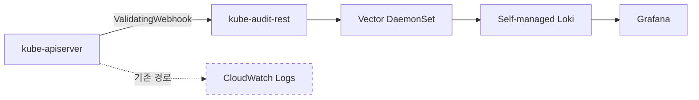

# Observability and AIOps

관측은 장애 전에는 가치가 잘 드러나지 않고, 장애 이후에 먼저 찾게 되는 자원입니다. 이 문서는 네 가지 주제를 순서대로 정리합니다. 무엇을 어떻게 수집할지, 로그 비용이 누적될 때의 우회 방법, 알림 피로도를 줄이는 설계, AI 기반 incident response가 요구하는 전제입니다.

## Container Insights

EKS는 AWS가 관리하는 control plane 메트릭을 기본 제공합니다. Kubernetes 1.28 이상 클러스터에서 kube-apiserver, kube-scheduler, kube-controller-manager 지표가 CloudWatch와 Prometheus 엔드포인트로 바로 노출됩니다[^cpmetrics].

그 위에 [CloudWatch Observability add-on](https://docs.aws.amazon.com/AmazonCloudWatch/latest/monitoring/deploy-container-insights-EKS.html)을 설치하면 Container Insights가 enhanced 모드로 동작합니다. add-on 하나가 세 컴포넌트를 배포합니다.

- **CloudWatch agent** — 노드/Pod/컨테이너 인프라 메트릭 (cAdvisor, kubelet)
- **Fluent Bit** — 컨테이너 stdout/stderr 로그
- **CloudWatch Application Signals** — APM 수준의 application performance telemetry

Enhanced 모드는 per-observation 과금 모델을 사용합니다. 기존 CloudWatch Logs의 GB 단위 수집 과금과 다르므로, 활성 Pod 수가 많고 메트릭 업데이트가 잦은 워크로드에서는 활성화 전에 비용 곡선을 먼저 확인해야 합니다.

OpenTelemetry 기반으로 수집하는 Container Insights (OTel) 경로도 add-on 옵션으로 있습니다. PromQL로 쿼리하고 메트릭당 최대 150개 label을 유지하며 원천 메트릭을 그대로 저장해 쿼리 시점에 집계합니다. Prometheus에 익숙한 팀에게 대안이 되지만 현재 public preview입니다.

## Control Plane Log Cost

EKS control plane 로그는 `api`, `audit`, `authenticator`, `controllerManager`, `scheduler` 다섯 타입을 선택적으로 활성화할 수 있고, 켜면 CloudWatch Logs로 전달됩니다[^cplogs]. 주요 특성은 다음과 같습니다.

- **best-effort 전달** — 몇 분 이내 도착하지만 지연 가능
- **verbosity level 2 고정** — 세부 튜닝 불가
- **CloudWatch Logs 표준 과금** — ingestion과 storage 비용 모두 사용자 부담

audit log는 이 중 볼륨이 크고 비용 부담이 큰 타입입니다. 모든 API request가 기록되므로 컨트롤러가 많이 돌거나 watch 주기가 짧은 클러스터에서 하루 수십 GB가 쉽게 나옵니다. 규모 있는 클러스터에서는 audit log만으로 월 수천 달러가 발생하는 사례가 보고됩니다.

### Webhook-based Audit Offload

[kube-audit-rest로 EKS Control Plane 로깅 비용 절감하기](https://nyyang.tistory.com/228)가 소개하는 우회 방법은 CloudWatch Logs 경로 대신 ValidatingAdmissionWebhook으로 audit를 가로채 self-managed 파이프라인으로 보내는 것입니다.

kube-audit-rest는 ValidatingWebhook endpoint로 등록되어 API request가 admission phase에 도달할 때 audit event와 동등한 정보를 webhook이 받습니다. 모든 요청에 `allowed: true`를 반환하므로 정책 영향은 없습니다. 받은 데이터는 디스크에 append되고 Vector가 수집해 Loki로 보냅니다. CloudWatch Logs의 GB 단위 ingestion 비용 대신 EC2/EBS 비용만 들어가므로 사례에서는 월 수천 달러 단위에서 수백 달러 수준으로 감소한 것으로 보고됩니다.

!!! warning "Trade-offs"
    - webhook은 모든 API request 경로에 끼어듭니다. `failurePolicy: Ignore`로 두지 않으면 webhook 장애가 cluster-wide API 지연으로 번집니다. Week 4의 [Webhook Extension](../week4/0_background.md#kubernetes-extension-via-webhook) 관점이 그대로 적용됩니다.
    - audit log 일부 필드(예: authenticator 결정 내역)는 webhook이 받지 못하므로 완전 동치가 아닙니다.
    - self-managed 파이프라인의 내구성과 보관 정책을 직접 설계해야 합니다.

이 선택은 비용 절감이라기보다 운영 부담을 AWS 관리에서 사내 플랫폼 팀으로 옮기는 결정입니다. 비용이 낮아지는 대신 운영 책임이 이동합니다.

## Alert Design at Scale

대형 Kubernetes 환경에서 Grafana 기본 알림은 모든 time series를 한 메시지로 묶고, 네임스페이스별 라우팅이 어려우며, 담당자 정보도 빠져 있습니다. 당근 SRE 팀이 이 한계를 자체 플랫폼으로 보완한 [AlertDelivery 발표](https://www.youtube.com/watch?v=poPZvLi0O08)에서 도출되는 설계 원칙은 어느 조직에도 적용됩니다.

- :material-account-group: **Scope to workload owners**

    ---

    알림 대응의 경계를 네임스페이스나 팀 기준으로 분리해, 다른 팀의 알림이 섞이지 않게 합니다.

- :material-tune-vertical: **Per-alert thresholds**

    ---

    임계치, reminder, 멘션 정책을 알림 단위로 설정합니다. 통일된 정책은 큰 조직에서 한계에 도달합니다.

- :material-account-arrow-right: **Attach ownership**

    ---

    담당자 정보를 알림에 실어 SRE를 거치는 라우팅 병목을 제거합니다.

## Detection as Code

카카오는 7,000개가 넘는 EKS 클러스터를 운영하면서 온콜 이슈 대부분이 반복되는 쿠버네티스 디테일(`hostPath` 남용, graceful shutdown 미고려, `latest` 태그, TLS 인증서 만료 임박, requests/limits 미설정 등)에서 나온다는 것을 확인하고, 검사 룰을 코드로 관리하는 도구 [detek](https://github.com/kakao/detek)을 공개했습니다[^kakao]. 핵심 원칙은 반복 이슈를 담당자 기억에 맡기지 않고 룰로 남겨 자동 감지 범위에 편입하는 것입니다.

detek 자체는 카카오 환경(OpenStack Nova 기반 collector 등)에 맞춰 설계된 도구라 EKS에 그대로 옮기기 어렵습니다. 같은 원칙을 EKS에서 구현할 때는 검사 영역을 나눠 OSS를 조합합니다. 

- requests/limits, readiness probe, 이미지 태그 같은 워크로드 안티패턴은 [polaris](https://github.com/FairwindsOps/polaris)
- CIS와 NSA 보안 벤치마크는 [kubescape](https://github.com/kubescape/kubescape)
- 노드와 kubelet 기준 CIS Kubernetes Benchmark는 [kube-bench](https://github.com/aquasecurity/kube-bench)
- 이미지 CVE와 매니페스트 misconfig는 [trivy k8s](https://github.com/aquasecurity/trivy)가 각 영역을 담당합니다.

## Topology-aware Investigation

AWS는 2026년에 [AWS DevOps Agent](https://aws.amazon.com/blogs/aws/aws-devops-agent-helps-you-accelerate-incident-response-and-improve-system-reliability-preview/)를 preview로 출시해 incident response 과정에 AI를 도입했습니다. EKS 환경에서 이 agent가 하는 일은 topology 지식 그래프 구축입니다[^kg].

K8sGPT 같은 전통적 AI 보조 도구는 단일 리소스 상태를 LLM에 전달해 해석하는 방식이었습니다. DevOps Agent는 한 단계 위에서 출발합니다. 장애 시작점이 된 리소스에서 그래프를 따라가며 관계 속에서 원인을 찾는 접근입니다.

그래프는 네 단계로 구성됩니다.

1. Resource discovery — CloudFormation stack과 Resource Explorer를 스캔해 AWS 리소스 인벤토리 구성
2. Relationship detection — Pod ↔ Service ↔ Deployment ↔ Node ↔ Instance의 정적 관계를 파싱하고, 배포 기록까지 엣지로 연결
3. 관측 행동 매핑 — OpenTelemetry 분산 트레이스로 런타임 호출 관계를 추론. 스펙에 없는 실제 의존성을 관측으로 보완
4. 지식 그래프 저장 — 이후 모든 incident investigation의 출발점

결과적으로 특정 Pod의 5xx 증상에서 시작해 Deployment history, node condition, downstream service까지 그래프를 따라 자동 교차 분석이 가능해집니다.

### Prerequisites

DevOps Agent가 실제로 유용하려면 관측 데이터가 이미 쌓여 있어야 합니다.

- EKS 클러스터
- OpenTelemetry Operator + ADOT Collector
- Amazon Managed Service for Prometheus workspace
- Container Insights

이 문서의 앞 섹션들(Container Insights, 알림 재설계, Detection as Code)이 사실상 AI agent 도입의 전제조건입니다. alerting이 노이즈면 agent도 같은 노이즈에 묻히고, topology가 구성되지 않으면 그래프가 비어 있으며, 배포 이력이 추적되지 않으면 root-cause correlation이 동작하지 않습니다.

[^cpmetrics]: [AWS Blog — Amazon EKS enhances Kubernetes control plane observability](https://aws.amazon.com/blogs/containers/amazon-eks-enhances-kubernetes-control-plane-observability/)
[^cplogs]: [AWS Docs — Send control plane logs to CloudWatch Logs](https://docs.aws.amazon.com/eks/latest/userguide/control-plane-logs.html)
[^kakao]: [카카오 — 7천개가 넘어가는 클러스터에서 쏟아지는 온콜 이슈 처리하기](https://www.youtube.com/watch?v=uPFyanT8vKA) ([GitHub — kakao/detek](https://github.com/kakao/detek))
[^kg]: [AWS Blog — Building intelligent knowledge graphs for Amazon EKS operations using AWS DevOps Agent](https://aws.amazon.com/blogs/containers/building-intelligent-knowledge-graphs-for-amazon-eks-operations-using-aws-devops-agent/)
