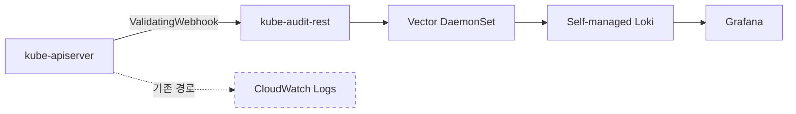
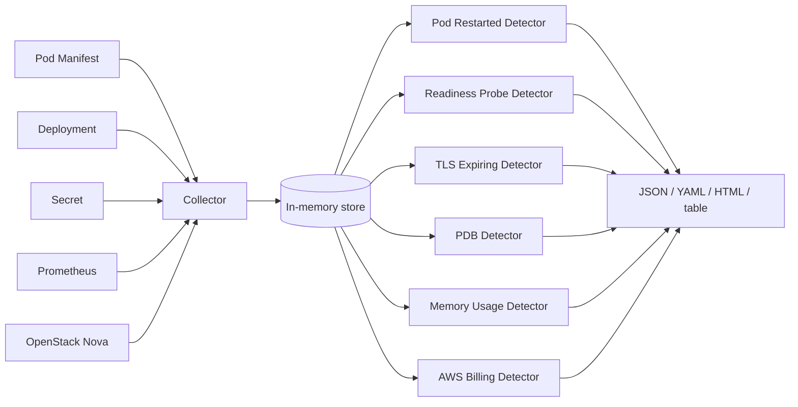

# Observability and AIOps

관측은 장애 전에는 가치가 잘 드러나지 않고, 장애 후에 먼저 찾게 되는 자원입니다. 이 문서는 세션에서 공유된 네 가지 주제를 순서대로 정리합니다. **무엇을 어떻게 수집할지**, **로그 비용이 누적될 때의 우회 방법**, **알림 피로도를 줄이는 설계**, 그리고 **AI 기반 incident response가 전제로 요구하는 것**입니다.

## Container Insights

EKS는 AWS가 관리하는 **control plane 메트릭**을 기본 제공합니다. Kubernetes 1.28 이상 클러스터에서 API server request rate, scheduler pending pods, etcd storage size 같은 지표가 CloudWatch에서 바로 확인됩니다.

그 위에 [**CloudWatch Observability add-on**](https://docs.aws.amazon.com/AmazonCloudWatch/latest/monitoring/deploy-container-insights-EKS.html)을 설치하면 Container Insights가 enhanced 모드로 동작합니다. add-on 하나가 세 컴포넌트를 배포합니다.

- **CloudWatch agent** — 노드/Pod/컨테이너 인프라 메트릭 (cAdvisor, kubelet)
- **Fluent Bit** — 컨테이너 stdout/stderr 로그
- **CloudWatch Application Signals** — APM 수준의 application performance telemetry

Enhanced 모드는 **per-observation 과금**입니다. 기존 CloudWatch Logs의 GB 단위 수집 과금과 다른 모델이어서, 활성 Pod 수가 많고 메트릭 업데이트가 잦은 워크로드에서는 활성화 전에 비용 곡선을 먼저 확인해야 합니다.

OpenTelemetry 기반으로 수집하는 Container Insights (OTel) 경로도 add-on 옵션으로 있습니다. PromQL로 쿼리하고 메트릭당 최대 150개 label을 유지하며 원천 메트릭을 그대로 저장해 쿼리 시점에 집계합니다. Prometheus에 익숙한 팀에게 대안이 되지만 현재 public preview입니다.

## Control Plane Log Cost

EKS control plane 로그는 `api`, `audit`, `authenticator`, `controllerManager`, `scheduler` 다섯 타입을 선택적으로 활성화할 수 있고, 켜면 CloudWatch Logs로 전달됩니다[^cplogs]. 세션에서 언급된 특성은 다음과 같습니다.

- **best-effort 전달** — 몇 분 이내 도착하지만 지연 가능
- **verbosity level 2 고정** — 세부 튜닝 불가
- **CloudWatch Logs 표준 과금** — ingestion과 storage 비용 모두 사용자 부담

audit log는 이 중 볼륨이 크고 비용 부담이 큰 타입입니다. 모든 API request가 기록되므로 컨트롤러가 많이 돌거나 watch 주기가 짧은 클러스터에서 하루 수십 GB가 쉽게 나옵니다. 규모 있는 클러스터에서 audit log만으로 월 수천 달러가 찍히는 사례가 보고됩니다.

### Webhook-based Audit Offload

[kube-audit-rest로 EKS Control Plane 로깅 비용 절감하기](https://nyyang.tistory.com/228)가 소개하는 우회 방법은 CloudWatch Logs 경로 대신 **ValidatingAdmissionWebhook으로 audit를 가로채** self-managed 파이프라인으로 보내는 것입니다.

kube-audit-rest는 ValidatingWebhook endpoint로 등록되어 API request가 admission phase에 도달할 때 audit event와 동등한 정보를 webhook이 받습니다. 모든 요청에 `allowed: true`를 반환하므로 정책 영향은 없습니다. 받은 데이터는 디스크에 append되고 Vector가 수집해 Loki로 보냅니다. CloudWatch Logs의 GB 단위 ingestion 비용 대신 EC2/EBS 비용만 들어가므로 사례에서는 월 수천 달러 단위에서 수백 달러 수준으로 감소한 것으로 보고됩니다.

!!! warning "우회의 트레이드오프"
    - webhook은 모든 API request 경로에 끼어듭니다. `failurePolicy: Ignore`로 두지 않으면 webhook 장애가 cluster-wide API 지연으로 번집니다. Week 4의 [Webhook Extension](../week4/0_background.md#kubernetes-extension-via-webhook) 관점이 그대로 적용됩니다.
    - audit log 일부 필드(예: authenticator 결정 내역)는 webhook이 받지 못하므로 **완전 동치는 아닙니다**.
    - self-managed 파이프라인의 내구성과 보관 정책을 직접 설계해야 합니다.

이 선택은 비용 절감이라기보다 **운영 부담을 AWS 관리에서 사내 플랫폼 팀으로 옮기는 결정**입니다. 비용이 낮아지는 대신 운영 책임이 이동합니다.

## Alert Design at Scale

알림이 울리는 것만으로는 대응으로 이어지지 않습니다. 당근 SRE 팀의 [AlertDelivery 발표](https://www.youtube.com/watch?v=poPZvLi0O08)는 프로젝트 200개가 넘는 환경에서 Grafana 기본 알림이 왜 실패하고 어떻게 재설계했는지를 공유합니다.

### Grafana Alerting Hits a Wall

발표에서 정리된 다섯 가지 한계는 대형 K8s 환경에서 공통적으로 마주치는 문제입니다.

1. **평가된 모든 time series가 하나의 메시지로 전송** — 네임스페이스 A, B, C에서 동시에 에러율이 튀면 한 알림에 섞여 옵니다. B만 정상화되어도 A가 여전히 alerting이면 전체 패널이 OK가 되지 않습니다.
2. **네임스페이스별 알림 대응 불가** — Grafana 메시지 단위가 네임스페이스 경계와 일치하지 않습니다.
3. **메시지 가독성 한계** — 여러 label이 한 줄에 늘어져 무엇이 무엇인지 파싱하기 어렵습니다.
4. **알림 종류별 reminder 시간 조정 불가** — 알림 성격이 달라도 reminder 주기가 통일됩니다.
5. **담당자 정보 부재** — 알림 수신 후 네임스페이스에서 담당팀을 찾아가는 수동 경로가 필요합니다.

### Namespace-scoped Redesign

당근이 구축한 AlertDelivery는 다섯 한계에 일대일로 대응합니다.

- 알림을 **네임스페이스 단위로 분리**해 한 메시지에 한 네임스페이스의 알림만 담습니다.
- 제목과 본문에 namespace, 알림 타입, metric label, 관련 대시보드 링크를 정돈해 가독성을 높입니다.
- **개별 알림 제어**를 지원합니다. 임계치, reminder, 조건별 멘션 여부를 알림마다 설정할 수 있고, Slack 메시지에서 바로 알림 끄기(snooze)가 가능합니다.
- 사내 `katalog` API와 연계해 **담당자 정보를 알림에 자동 첨부**하고, 필요 시 멘션합니다. 담당자가 직접 대응할 수 있어 SRE를 라우터로 거치는 병목이 줄어듭니다.
- 전체 알림 상황을 한 번에 볼 수 있는 web UI를 제공합니다.

발표에서는 세부 제어 예시로 ingress 5xx 알림 중 503 코드는 팀 멘션을 생략하되 responseFlag가 UC이거나 값이 1,000을 초과하면 멘션하고, 1,200을 초과하면 SRE 팀 전체를 멘션하는 규칙이 공유됐습니다. 이 정도의 세분화가 가능해야 개발자 self-service가 실제로 동작합니다.

### Transferable Principles

AlertDelivery 자체는 당근 사내 도구지만, 설계 원칙은 어느 조직에도 적용됩니다.

- **알림 대응의 경계를 워크로드 소유자에 맞춥니다** — 네임스페이스, 팀 기준으로 분리
- **임계 조건을 알림마다 개별 제어합니다** — 통일된 reminder, 멘션 정책은 큰 조직에서 한계에 도달합니다
- **담당자 정보를 알림에 싣습니다** — SRE를 거치는 라우팅 구조는 병목입니다

[온콜, 알림만 보다가 죽겠어요](https://www.youtube.com/watch?v=4XpZpplWJBw) 발표는 같은 문제를 알림 자체를 줄이는 관점에서 다루며, AlertDelivery와 상호보완적으로 참고할 수 있습니다.

## Detection as Code

카카오는 사내 플랫폼 DKOS에서 **웹 UI로 클러스터 이름과 프로비저닝 zone만 고르면 새 K8s 클러스터가 생성**되도록 만들었습니다. 개발자 편의는 좋아졌지만 그 결과 7,000개가 넘는 클러스터가 돌아가게 됐고, 하루 평균 10건이 넘는 온콜 문의가 발생했다고 합니다[^kakao].

### Three On-call Patterns

발표에서 공유된 핵심은 다음과 같습니다.

- **쓰이지 않는 클러스터가 많다** — 테스트용으로 만들었다 삭제하지 않은 것, 리소스를 실제 필요보다 많이 할당한 것, 담당자 이동 후 방치된 것이 누적됩니다. 사용 여부를 Pod 수나 CPU 사용률만으로 판단하기 어려운 상황이 발표에서 구체적으로 공유됐습니다. 배치 Pod이 하루 한 번만 도는 프로덕션일 수도 있고, 유휴 상태의 Pod이 CPU를 점유하는 경우도 있어 단일 지표 판단이 어렵습니다.
- **온콜 이슈 대부분이 쿠버네티스 디테일을 모르는 데서 나옵니다** — `hostPath` 남용, graceful shutdown 미고려, `latest` 태그 사용, 설정한 taint 방치, TLS 인증서 만료 임박, requests/limits 미설정으로 인한 Node OOM, ingress manifest의 사소한 오타. 거의 모든 항목이 **누가 한 번 짚어 주면 해결되는 문제**입니다.
- **알려진 이슈가 시간이 지나면 잊혀집니다** — 지금 알고 있는 문제도 몇 년이 지나면 운영팀의 기억에서 사라집니다.

### detek Architecture

여기서 나온 결론이 **Detection as Code**입니다. 발표에서 공개된 도구 [detek](https://github.com/kakao/detek)은 오픈소스이며, 구조는 단순합니다.

- **Collector**가 Kubernetes API, Prometheus, OpenStack Nova 같은 소스에서 데이터를 수집해 메모리에 저장합니다.
- **Detector**가 메모리 데이터에 룰을 평가해 문제를 발견합니다 — TLS 만료, Pod 재시작 과다, Readiness Probe 부재, Deployment PDB 부재, 미사용 Container Image Registry 등.
- 결과를 JSON, YAML, HTML, table 형식으로 출력합니다.

Collector와 Detector가 확장 가능한 컴포넌트이므로, 새 문제 유형이 확인될 때마다 Detector를 추가해 **반복 이슈를 자동 감지 범위로 편입**하는 것이 설계 원칙입니다.

### Equivalent OSS on EKS

detek이 주는 교훈은 특정 도구가 아니라 원칙입니다. 같은 접근은 EKS 클러스터에서 기존 OSS로도 상당 부분 가능합니다.

- [polaris](https://github.com/FairwindsOps/polaris) — requests/limits, readiness probe, 이미지 태그 같은 워크로드 안티패턴
- [kubescape](https://github.com/kubescape/kubescape) — CIS/NSA 보안 벤치마크
- [kube-bench](https://github.com/aquasecurity/kube-bench) — CIS Kubernetes Benchmark
- [trivy k8s](https://github.com/aquasecurity/trivy) — 이미지 CVE, misconfig

수작업으로 스케일을 감당하기 어려운 영역은 검사 자체를 코드로 작성하고, 새 문제가 확인될 때마다 Detector를 추가하는 방식이 효과적입니다.

## Topology-aware Investigation

AWS는 2026년에 [AWS DevOps Agent](https://aws.amazon.com/blogs/aws/aws-devops-agent-helps-you-accelerate-incident-response-and-improve-system-reliability-preview/)를 preview로 출시해 incident response 과정에 AI를 도입했습니다. EKS 환경에서 이 agent가 하는 일의 핵심은 **topology 지식 그래프 구축**입니다[^kg].

전통적 AI 보조 도구(예: K8sGPT)는 단일 리소스 상태를 LLM에 보내 문제를 해석하는 방식이었습니다. DevOps Agent는 한 단계 위에서 출발합니다.

1. **Resource discovery** — CloudFormation stacks, Resource Explorer에서 AWS 리소스를 발견
2. **Relationship detection** — Pod ↔ Service ↔ Deployment ↔ Node ↔ Instance, deployment 기록까지 연결
3. **관측 행동 매핑** — 실제 트래픽/메트릭/로그 흐름을 관측해 어떤 리소스가 어떤 리소스에 영향을 주는지 학습
4. **지식 그래프로 저장** — 이 그래프가 향후 incident investigation의 출발점

특정 Pod의 5xx 증상에서 시작해 자동으로 topology를 따라 내려가 **Deployment history, node condition, dependent service까지 교차 분석**하는 것이 가능해집니다.

### Prerequisites

DevOps Agent가 실제로 유용하려면 관측 데이터가 이미 쌓여 있어야 합니다.

- EKS 클러스터
- OpenTelemetry Operator + ADOT Collector
- Amazon Managed Service for Prometheus workspace
- Container Insights

이 문서의 앞 섹션들(Container Insights, 알림 재설계, Detection as Code)이 사실상 **AI agent 도입의 전제조건**입니다. alerting이 노이즈면 agent도 같은 노이즈에 묻히고, topology가 구성되지 않으면 그래프가 비어 있으며, 배포 이력이 추적되지 않으면 root-cause correlation이 동작하지 않습니다.

### What AI Replaces

- **대체 가능**: 알려진 패턴의 자동 triage, topology 따라가는 반복 쿼리, deployment-correlation 기반 root cause 가설 생성
- **여전히 사람**: 비즈니스 임팩트 판단, 이해관계자 소통, 장애 대응의 go/no-go 결정, 드문 edge case

## Related Concepts

- **관측 → 알림 → 자동화 순서** — 새 도구를 도입할 때는 관측이 비어 있는 상태에서 자동화부터 얹지 않습니다. 데이터가 없는 그래프, 담당자 없는 알림은 각자 단계에서 이미 흔들립니다.
- **AWS DevOps Agent + K8s Operator** — [AWS Tech 블로그의 MTTR 단축 사례](https://aws.amazon.com/ko/blogs/tech/aws-devops-agent-k8s-operator/)가 agent 출력을 K8s operator로 받아 자동 반영하는 패턴을 소개합니다. AI의 제안을 사람 리뷰 없이 바로 적용하는 것은 risk가 있어, operator 단계의 policy gate 설계가 실제 운영에서 중요합니다.
- **알림 피로도 측정 지표** — "알림이 많다"는 체감에 의존하지 말고, firing/acknowledged/false positive 비율을 추적하면 alert 재설계의 우선순위가 데이터로 드러납니다. AlertDelivery 같은 시스템이 이런 메타 지표를 함께 수집하는 것도 참고할 부분입니다.

[^cplogs]: [AWS Docs — Send control plane logs to CloudWatch Logs](https://docs.aws.amazon.com/eks/latest/userguide/control-plane-logs.html)
[^kakao]: [카카오 — 7천개가 넘어가는 클러스터에서 쏟아지는 온콜 이슈 처리하기](https://www.youtube.com/watch?v=uPFyanT8vKA) ([GitHub — kakao/detek](https://github.com/kakao/detek))
[^kg]: [AWS Blog — Building intelligent knowledge graphs for Amazon EKS operations using AWS DevOps Agent](https://aws.amazon.com/blogs/containers/building-intelligent-knowledge-graphs-for-amazon-eks-operations-using-aws-devops-agent/)
