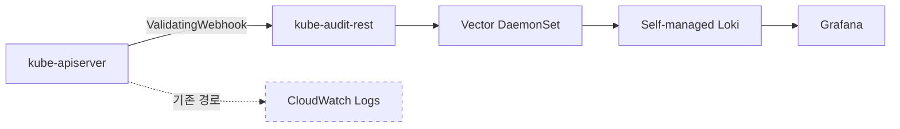
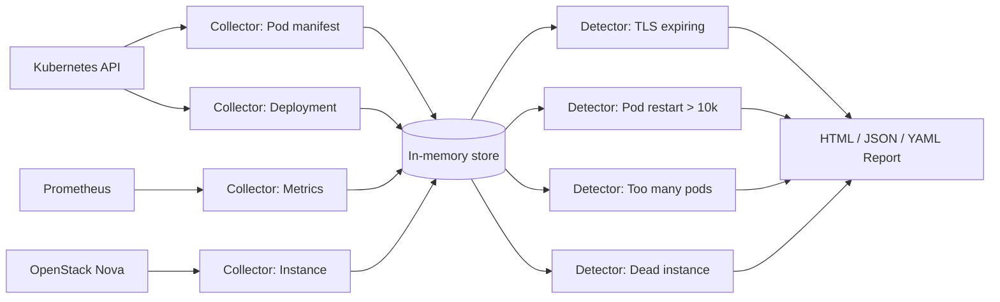

# Observability and AIOps

관측은 장애가 나기 전에는 가치가 잘 안 보이고, 장애가 난 뒤에는 가장 먼저 찾게 되는 자원입니다. 이 문서는 EKS에서 AWS가 공식적으로 제공하는 **관측 경로**, 규모가 커질 때 마주치는 **로깅 비용 문제와 우회 방법**, 알림이 쌓여 운영자가 지칠 때 적용할 수 있는 **알림 설계 원칙**, 그리고 최근 등장한 **AI 기반 incident response**를 하나의 서사로 엮습니다.

구체적으로 다룰 주제:

- Container Insights와 CloudWatch Observability Operator
- Control plane 로깅 비용의 본질과 우회(kube-audit-rest 접근)
- 당근 AlertDelivery: 심각도 기반 알림 설계와 slack thread grouping
- 카카오모빌리티 7천+ 클러스터 운영: Detection as Code
- AWS DevOps Agent: EKS topology 지식 그래프 기반 자동 진단

---

## Container Insights — Enhanced Observability

EKS는 AWS가 관리하는 **control plane 메트릭**을 기본 제공합니다. Kubernetes 1.28 이상 클러스터에서는 API server request rate, scheduler pending pods, etcd storage size 같은 수십 개 지표가 CloudWatch에서 바로 확인 가능합니다[^eks-cloudwatch].

그 위에 **CloudWatch Observability Operator** add-on을 설치하면 enhanced observability가 켜집니다[^cwo-quick-start].

```bash
aws eks create-addon \
  --cluster-name <cluster> \
  --addon-name amazon-cloudwatch-observability
```

이 add-on은 세 컴포넌트를 한 번에 배포합니다.

| Component | Collected Data |
|---|---|
| CloudWatch agent | 노드, Pod, 컨테이너 인프라 메트릭 (cAdvisor, kubelet) |
| Fluent Bit | 컨테이너 stdout/stderr 로그 |
| CloudWatch Application Signals | APM 수준의 application performance telemetry |

Enhanced 모드는 **per-observation 과금**입니다[^container-insights-setup]. 기존 CloudWatch Logs의 GB 단위 수집 과금과 다른 모델이어서, 활성 Pod 수가 많고 메트릭 업데이트가 잦은 워크로드에서 비용 곡선을 먼저 확인해야 합니다.

!!! tip "OTel as an Alternative"
    OpenTelemetry Protocol 기반으로 수집하는 **Container Insights (OTel)** 도 add-on 옵션으로 제공됩니다[^container-insights-otel]. PromQL로 쿼리하고, 메트릭당 최대 150개 label을 유지하며, 원천 메트릭을 그대로 저장해 쿼리 시점에 집계합니다. Prometheus에 익숙한 팀은 enhanced 대신 OTel 경로를 선택할 수 있습니다. 다만 2026년 현재 public preview입니다.

---

## Control Plane Logging — Cost Reality

EKS control plane log는 API server / audit / authenticator / controller manager / scheduler 다섯 가지 타입을 선택적으로 켤 수 있고, 활성화 시 CloudWatch Logs로 전달됩니다[^eks-cp-logs]. 세부 동작은 다음과 같습니다.

- **best-effort 전달** — 몇 분 이내 도착하지만 지연 가능
- **verbosity level 2** 고정, 세부 tuning 불가
- **CloudWatch Logs 표준 과금** — 데이터 ingestion + storage 비용 모두 사용자 부담

audit log는 이 중에서도 **가장 볼륨이 크고 가장 비싼** 타입입니다. 모든 API request가 기록되므로 컨트롤러가 많이 돌거나 watch 주기가 짧은 클러스터에서는 하루 수십 GB까지 생성됩니다. 규모가 있는 클러스터에서 audit log만으로 월 수천 달러 CloudWatch Logs 비용이 찍히는 사례가 보고됩니다.

### kube-audit-rest 우회 접근

CloudWatch Logs로 보내는 audit 경로 대신, **ValidatingAdmissionWebhook으로 audit를 가로채** self-managed 로그 파이프라인으로 보내는 우회 방법이 커뮤니티에서 쓰입니다[^kube-audit-rest]. 구조는 다음과 같습니다.



- **kube-audit-rest**가 ValidatingWebhook endpoint로 등록되어, API request가 admission phase에 도달할 때 audit event와 동등한 정보를 webhook이 받습니다.
- Webhook은 모든 요청에 대해 `allowed: true`를 반환하므로 실질 정책 영향이 없습니다.
- webhook이 받은 데이터를 디스크에 append → Vector가 수집 → Loki로 전송합니다.

**비용 절감 구조**: CloudWatch Logs의 GB 당 ingestion 비용 대신 EC2, EBS 정도의 비용만 든다. 보고된 사례에서는 월 수천 달러 → 수백 달러 수준 절감이 언급됩니다.

!!! warning "Trade-offs of This Approach"
    - **webhook은 모든 API request 경로에 끼어듭니다**. `failurePolicy: Ignore`로 두지 않으면 webhook 장애가 cluster-wide API 지연으로 이어짐. Week 4의 [Webhook Extension 모델](../week4/0_background.md#kubernetes-extension-via-webhook) 지식이 그대로 적용됩니다.
    - audit log의 일부 필드(예: authenticator 결정 내역)는 webhook이 받지 못합니다 — **완전 동치는 아님**
    - self-managed pipeline의 내구성, 보관 정책을 직접 설계해야 합니다. 비용은 낮아지지만 운영 책임은 사내 플랫폼 팀으로 이동합니다.

kube-audit-rest가 해결하는 문제 자체는 실제이지만, **운영 부담이 AWS 관리에서 사내 플랫폼 팀으로 이동**합니다. 이는 비용 절감 이전에 **운영 투자처를 어디에 둘 것인가에 대한 의사결정**입니다.

---

## Alerting Design — 증상에서 심각도로

관측이 갖춰져도 알림 설계가 미흡하면 운영자는 노이즈에 묻힙니다. 당근 SRE 팀의 사례[^karrot-alert-delivery] [^karrot-oncall]는 **대규모 Kubernetes 환경에서 Grafana 기본 알림이 왜 실패하고, 어떻게 재설계했는지**를 구체적으로 보여줍니다.

### Grafana 기본 알림의 구조적 한계

당근은 단일 클러스터에 350+ 네임스페이스를 운영하면서 다음 문제를 겪었습니다.

1. **Grafana 알림은 여러 타임시리즈 결과를 한 메시지로 묶어 전송한다** — 네임스페이스 A, B, C에서 동시에 에러율이 튀면 한 알림에 섞여 온다. 그 중 B만 정상화되어도 A가 alerting이면 전체 패널이 `OK`가 되지 않아 B의 회복을 놓치게 된다
2. **메시지 가독성** — label 여러 개가 한 줄에 `/` 구분으로 늘어져 무엇이 무엇인지 파싱하기 어렵다
3. **담당자 매칭 부재** — SRE가 알림을 먼저 보고, 네임스페이스를 파악하고, 배포 이력을 뒤져 담당자를 찾아가는 수동 작업이 필요하다

### 재설계의 세 축

당근이 구축한 AlertDelivery 프로젝트의 핵심 설계 원칙은 셋입니다.

**1. Severity Leveling**

단순 alerting 대신 메트릭의 추세(예: 5% 포인트 증감)와 절대값을 조합해 Low/Medium/High/Critical 4단계로 분리합니다. 3회째 반복 알림의 레벨을 기준으로 담당자, 온콜 mention 여부를 결정하고, 추세가 악화될 때만 mention을 올려 피로도를 낮춥니다.

**2. Slack Thread Grouping**

같은 알림의 firing/OK를 동일 thread로 묶어, 채널을 훑어보면 **진행 중 이슈만 thread 상단**에 남습니다. 과거에는 firing 1건에 OK 1건이 별도 메시지로 쌓여 실제 진행 중인 건수를 파악하기 어려웠던 문제를 해결합니다.

**3. Project Metadata 연계**

각 알림 메시지에 네임스페이스, 담당팀, 슬랙 채널, 배포 이력, 알림 끄기 버튼을 포함합니다. 담당자가 SRE 개입 없이 직접 대응할 수 있어(**self-service**), 하루 70+ mention이 현저히 감소했다고 보고합니다.

### 일반화 가능한 원칙

AlertDelivery 자체는 당근의 사내 프로젝트이지만, 설계 원칙은 어느 조직에도 적용 가능합니다.

- **alerting은 결정이 아니라 입력**: 알림이 울렸다는 사실이 아니라 **심각도와 추세**가 판단의 기준입니다.
- **Thread는 state를 표현**: Slack 채널을 로그가 아닌 **현재 상태 뷰**로 쓰려면 thread grouping이 필수입니다.
- **담당자가 직접 볼 수 있게**: SRE를 라우터로 두면 병목이 생깁니다. 메타데이터 연계로 알림이 담당자에게 직접 전달되어야 합니다.

---

## Detection as Code — 7000+ 클러스터 운영

카카오모빌리티의 사례[^kakao-7k]는 또 다른 스케일 문제를 보여줍니다. **Self-service로 클러스터를 쉽게 만들 수 있게 하면 클러스터가 기하급수적으로 늘어나고, 운영 편차도 같이 커진다**는 것입니다.

### 배경

카카오모빌리티는 사내 플랫폼 `DKOS`로 개발자가 **웹 UI에서 클러스터 이름과 리전만 고르면 새 Kubernetes 클러스터가 생성**되도록 만들었습니다. 그 결과 7000+ 클러스터가 운영 중입니다. 이 접근의 부작용 3가지:

1. 클러스터를 쉽게 만들 수 있다는 것 자체
2. 엣지 케이스 이슈가 온콜로 쏟아짐 (하루 10건+ 문의)
3. 운영 비용이 스케일과 비례해 증가

### DPEK의 접근

매일 문의되는 문제를 분석해 보니 대부분 **같은 안티패턴**이었습니다 — `latest` 태그 컨테이너 이미지, `requests`/`limits` 미설정, TLS 인증서 만료 임박, 재시작 과다 등. 문제 자체는 단순하지만 7000 클러스터에서 수동 점검은 불가능합니다.

그래서 **Detection as Code** 접근을 도입 — 커스텀 검사 도구 `DPEK`을 개발해 오픈소스로 공개했습니다. 구조는 다음과 같습니다.



- **Collector**는 여러 소스(K8s API, Prometheus, OpenStack Nova)에서 데이터를 긁어 메모리에 저장합니다.
- **Detector**는 메모리 데이터를 기반으로 룰을 평가해 문제를 발견합니다.
- 발견된 결과는 웹 UI에서 오류 원인과 정상 항목 수를 한 번에 노출합니다.

### EKS 환경에서의 유사 접근

EKS 사용자가 같은 접근을 하고 싶다면 기존 OSS로도 상당 부분 커버 가능합니다.

| Tool | Coverage |
|---|---|
| [polaris](https://github.com/FairwindsOps/polaris) | resource request/limit, readiness probe, image tag 같은 workload 안티패턴 |
| [kubescape](https://github.com/kubescape/kubescape) | CIS/NSA 보안 벤치마크, NSA/CISA 같은 Kubernetes 보안 규정 |
| [kube-bench](https://github.com/aquasecurity/kube-bench) | CIS Kubernetes Benchmark 준수 검사 |
| [trivy k8s](https://github.com/aquasecurity/trivy) | 이미지, CVE, misconfig 통합 검사 |

DPEK이 주는 교훈은 도구 자체가 아니라 원칙입니다 — **수작업이 스케일로 풀리지 않는다면 검사를 코드로 작성**하고, 새 문제가 확인될 때마다 Detector를 추가해 재발을 제로에 수렴시킨다는 접근.

---

## AI-assisted Incident Response

AWS는 2026년에 **AWS DevOps Agent**(preview)를 출시해 incident response 과정에 AI를 도입했습니다[^devops-agent-preview]. EKS 환경에서 이 agent가 하는 일의 핵심은 **topology 지식 그래프 구축**입니다[^devops-agent-topology].

### Topology-first Investigation

전통적 AI 보조 도구(K8sGPT 등)는 단일 리소스의 상태를 LLM에 보내 문제를 해석하는 방식이었습니다. DevOps Agent는 한 단계 위에서 출발합니다.

1. **Resource discovery**: CloudFormation stacks, Resource Explorer에서 AWS 리소스를 발견합니다.
2. **Relationship detection**: Pod ↔ Service ↔ Deployment ↔ Node ↔ Instance, 그리고 deployment 기록까지 연결합니다.
3. **Observability 행동 매핑**: 실제 트래픽, 메트릭, 로그 흐름을 관측해 어떤 리소스가 어떤 리소스에 영향을 주는지 학습합니다.
4. **기반 지식 그래프로 저장**: 이 그래프가 향후 incident investigation의 출발점이 됩니다.

이 구조의 장점은 특정 Pod의 5xx 증상에서 시작해 자동으로 topology를 따라 내려가 **Deployment history, node condition, dependent service까지 교차 분석**할 수 있다는 점입니다[^devops-agent-eks-kg].

### 적용 전제

DevOps Agent가 의미 있게 동작하려면 관측 데이터가 이미 쌓여 있어야 합니다[^devops-agent-ai-response].

- EKS 클러스터
- OpenTelemetry Operator + ADOT Collector
- Amazon Managed Service for Prometheus workspace
- Container Insights

**즉 이 문서의 앞 섹션이 전제**입니다. 관측이 비어 있는 상태에서는 AI agent가 그래프를 그릴 재료가 없어 효용이 낮습니다.

### 대체할 수 있는 것 / 아닌 것

- **대체 가능**: 알려진 패턴의 자동 triage, topology 따라가는 반복 쿼리, Deployment-correlation 기반 root cause 가설 생성
- **여전히 사람**: 비즈니스 임팩트 판단, 이해관계자 소통, 장애 대응의 최종 go/no-go 결정, 드문 edge case

!!! tip "Prerequisites Before DevOps Agent"
    AI agent 도입 전에 점검해야 할 것들이 있습니다. alerting이 노이즈면 agent도 같은 노이즈에 묻히고, topology가 구성돼 있지 않으면 graph가 비어 있고, 배포 이력이 추적되지 않으면 root-cause correlation이 동작하지 않습니다. **이 문서 앞부분의 관측, 알림 설계가 AI 도입의 전제조건**입니다.

---

## Summary

이 문서가 제시하는 관측/AIOps 단계는 다음 순서로 구축하는 것이 자연스럽습니다.

1. **Container Insights** (또는 OTel)으로 기본 infra + app telemetry 확보
2. **Control plane logging** 필요 범위 결정, 비용이 부담되면 kube-audit-rest 같은 우회 접근 검토
3. **Alerting 재설계**: severity leveling + thread grouping + 담당자 직결
4. **Detection as Code**: 반복되는 온콜 패턴을 코드로 자동 감지
5. **AWS DevOps Agent**: 위 1-4가 준비된 상태에서 AI 기반 MTTR 단축

각 단계는 앞 단계를 전제로 하며, 도구 자체가 아니라 **관측이 왜 필요한지, 알림이 왜 시끄러운지, 패턴이 왜 반복되는지**에 대한 운영팀의 이해가 누적될수록 각 단계의 투자 대비 효과가 커집니다.

[^eks-cloudwatch]: [Amazon EKS — Monitor cluster data with Amazon CloudWatch](https://docs.aws.amazon.com/eks/latest/userguide/cloudwatch.html)
[^cwo-quick-start]: [Amazon CloudWatch — Quick start with the Amazon CloudWatch Observability EKS add-on](https://docs.aws.amazon.com/AmazonCloudWatch/latest/monitoring/Container-Insights-setup-EKS-addon.html)
[^container-insights-setup]: [Amazon CloudWatch — Setting up Container Insights on Amazon EKS and Kubernetes](https://docs.aws.amazon.com/AmazonCloudWatch/latest/monitoring/deploy-container-insights-EKS.html)
[^container-insights-otel]: [Amazon CloudWatch — Container Insights with OpenTelemetry metrics for Amazon EKS](https://docs.aws.amazon.com/AmazonCloudWatch/latest/monitoring/container-insights-otel-metrics.html)
[^eks-cp-logs]: [Amazon EKS — Send control plane logs to CloudWatch Logs](https://docs.aws.amazon.com/eks/latest/userguide/control-plane-logs.html)
[^kube-audit-rest]: [nyyang — kube-audit-rest로 EKS Control Plane 로깅 비용 절감하기](https://nyyang.tistory.com/228)
[^karrot-alert-delivery]: [당근 SRE 밋업 3회 — AlertDelivery: Grafana 기반 효율적 알림 시스템](https://www.youtube.com/watch?v=poPZvLi0O08)
[^karrot-oncall]: [당근 테크 밋업 2024 — 온콜, 알림만 보다가 죽겠어요](https://www.youtube.com/watch?v=4XpZpplWJBw)
[^kakao-7k]: [카카오 컨퍼런스 — 7천 개 넘는 Kubernetes 클러스터 온콜 처리하기](https://www.youtube.com/watch?v=uPFyanT8vKA)
[^devops-agent-preview]: [AWS News Blog — AWS DevOps Agent helps you accelerate incident response (preview)](https://aws.amazon.com/blogs/aws/aws-devops-agent-helps-you-accelerate-incident-response-and-improve-system-reliability-preview/)
[^devops-agent-topology]: [AWS DevOps Agent — What is a DevOps Agent Topology](https://docs.aws.amazon.com/devopsagent/latest/userguide/about-aws-devops-agent-what-is-a-devops-agent-topology.html)
[^devops-agent-eks-kg]: [AWS Containers Blog — Building intelligent knowledge graphs for Amazon EKS operations using AWS DevOps Agent](https://aws.amazon.com/blogs/containers/building-intelligent-knowledge-graphs-for-amazon-eks-operations-using-aws-devops-agent/)
[^devops-agent-ai-response]: [AWS Architecture Blog — AI-powered event response for Amazon EKS](https://aws.amazon.com/blogs/architecture/ai-powered-event-response-for-amazon-eks/)
