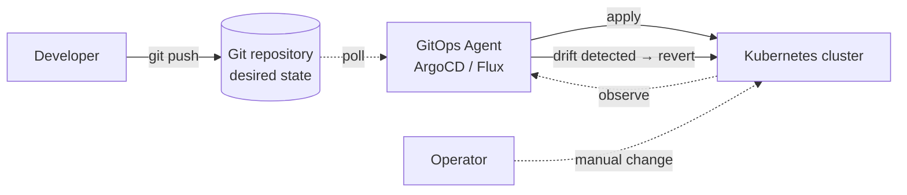

# GitOps Principles and Platform Engineering

SaaS 서비스에서는 새 테넌트가 들어올 때마다 전용 SQS 큐, DynamoDB 테이블, IAM 역할이 필요합니다. 개발자가 티켓으로 요청하고 인프라팀이 수동 프로비저닝하는 구조는, 테넌트 수가 늘수록 티켓이 쌓이고 인프라팀이 병목이 됩니다. 플랫폼 엔지니어링과 GitOps는 이 수동 흐름을 셀프 서비스 추상화와 선언적 파이프라인으로 대체하려는 접근입니다. 이 문서는 두 개념의 관계와 EKS에서의 구현 도구를 정리합니다.

## Why Platform Engineering

플랫폼 엔지니어링은 개발팀이 인프라 관리 부담 없이 애플리케이션 개발에 집중할 수 있도록 공통 구성 요소를 표준 단위로 추상화하는 실무 영역입니다[^cncf-maturity]. VPC, IAM, 큐, 데이터베이스를 플랫폼팀이 사전에 조합해 제공하면, 개발자는 서비스 코드와 필요한 메타데이터만 선언해도 배포가 가능해집니다.

플랫폼팀이 제공하는 결과물은 셀프 서비스 API, 도구, 문서, 지원 체계가 결합된 내부 개발자 플랫폼(Internal Developer Platform, IDP)입니다. IDP는 단순한 도구 모음이 아니라 내부 고객을 대상으로 하는 제품으로 취급되므로, 일반 SaaS 제품처럼 UX, 온보딩, 피드백 루프를 갖춰야 합니다.

IDP 도입이 조직에 제공하는 이점은 세 가지로 정리할 수 있습니다.

- :material-rocket-launch-outline: **Velocity**

    ---
    셀프 서비스 배포로 아이디어에서 프로덕션까지의 시간이 단축됩니다. 개발자가 인프라 티켓을 기다리지 않고 표준 템플릿으로 즉시 환경을 생성합니다.

- :material-shield-check-outline: **Governance**

    ---
    보안, 신뢰성, 확장성 요구 사항이 플랫폼 차원에서 자동 적용됩니다. 개발자가 규칙을 의식하지 않아도 기본값으로 규정을 준수하는 리소스가 생성됩니다.

- :material-chart-line: **Efficiency**

    ---
    멀티테넌시 구성으로 인프라 비용을 절감하고, 전문 지식을 플랫폼팀에 집중해 조직 전반의 운영 비용을 낮춥니다.

### Maturity Model

이점을 실제로 실현하려면 조직의 플랫폼 운영 방식이 일정 수준 이상으로 성숙해야 합니다. CNCF Platform Engineering Maturity Model은 성숙도를 다섯 개 측면(Aspect)과 네 개 단계(Level)로 평가할 수 있는 자가 진단 매트릭스를 제시합니다[^cncf-maturity].

표의 각 측면은 다음 질문에 답합니다.

`Investment`
:   플랫폼에 사람과 예산이 어떻게 배정되는가. 개인의 자발성에서 시작해 전담팀을 거쳐 플랫폼을 제품으로 운영하는 조직 구조로 이동합니다.

`Adoption`
:   사용자가 플랫폼을 어떻게 발견하고 채택하는가. 하향식 지시에서 개발자가 스스로 찾아 쓰는 내재적 수요로 전환됩니다.

`Interfaces`
:   사용자가 플랫폼 기능을 어떤 방식으로 소비하는가. 티켓과 수작업에서 표준 도구, 셀프 서비스 포털로 이동합니다.

`Operations`
:   플랫폼 기능을 어떻게 기획, 개발, 유지하는가. 개별 요청 대응에서 중앙 집중적 관리, 관리형 서비스 제공으로 이동합니다.

`Measurement`
:   피드백과 학습을 어떻게 수집하고 반영하는가. 임시적 수집에서 정량, 정성 지표를 결합한 지속 개선 구조로 이동합니다.

| Aspect | Provisional | Operational | Scalable | Optimizing |
|---|---|---|---|---|
| Investment | Voluntary or temporary | Dedicated team | As product | Enabled ecosystem |
| Adoption | Erratic | Extrinsic push | Intrinsic pull | Participatory |
| Interfaces | Custom processes | Standard tooling | Self-service solutions | Integrated services |
| Operations | By request | Centrally tracked | Centrally enabled | Managed services |
| Measurement | Ad hoc | Consistent collection | Insights | Quantitative and qualitative |

단계는 왼쪽에서 오른쪽으로 갈수록 성숙합니다. Provisional은 전담 자원 없이 임시로 플랫폼 업무를 유지하는 상태이고, Operational은 전담팀과 표준 도구가 자리잡은 단계입니다. Scalable에서 Interfaces 축이 Self-service solutions에 도달하면 앞 단락에서 정의한 IDP의 모습과 일치합니다. Optimizing은 사용자가 기여자로 참여하는 전사 에코시스템까지 확장된 상태입니다.

앞서 정리한 Velocity, Governance, Efficiency 이점은 대개 Scalable 단계부터 본격적으로 나타납니다. IDP가 도입되었다고 말할 수 있는 지점이 이 단계이기 때문입니다.

### Tenancy Models

플랫폼 엔지니어링은 하나의 정답이 있지 않습니다. 조직의 규제 요구, 격리 수준, 운영 역량에 따라 제공 단위가 달라집니다. 기본 구도는 플랫폼팀이 클러스터와 공통 기능을 제공하고, 개발팀이 워크로드와 AWS 리소스를 선언적으로 요청하는 형태로 책임이 나뉘는 것입니다.

*[Source: Announcing Amazon EKS Capabilities for workload orchestration and cloud resource management](https://aws.amazon.com/blogs/aws/announcing-amazon-eks-capabilities-for-workload-orchestration-and-cloud-resource-management/)*

이 역할 분리 위에서, 플랫폼팀이 개발팀에게 어떤 단위로 격리와 자원을 제공할지는 조직 맥락에 따라 달라집니다. Kubernetes 공식 블로그는 멀티테넌시 제공 방식을 세 가지 모델로 정리합니다[^k8s-tenancy].

| Model | Isolation unit | Characteristic | When to apply |
|---|---|---|---|
| Namespaces as a Service | 공유 클러스터 내 namespace | RBAC, ResourceQuota, NetworkPolicy로 분리 | 비용 효율, 다수의 내부 팀/테넌트 |
| Clusters as a Service | 테넌트별 전용 클러스터 | control plane 완전 격리, CRD/버전 독립 | 규제 환경, 강한 격리 요구 |
| Control Planes as a Service | 테넌트별 가상 control plane | 공유 워커 노드 + 테넌트별 API server (vCluster 등) | 두 모델의 절충 |

AWS Organizations 수준에서 테넌트별로 계정을 분리하는 접근은 위 모델의 상위 레이어로, blast radius를 계정 단위로 고정하고 비용과 IAM 경계를 명확히 하려는 조직이 주로 선택합니다.

국내 IDP 사례로는 [당근](https://speakerdeck.com/outsider/danggeun-gaebalja-peulraespomeun-eoddeon-munjereul-haegyeolhago-issneunga)과 [무신사](https://youtu.be/9FKbQRu6lVs)가 내부 플랫폼 구축 경험을 공개한 바 있습니다.

SaaS 영역에서는 한국 B2B SaaS인 [Blux가 EKS 기반 플랫폼으로 테넌트 온보딩을 자동화한 사례](https://aws.amazon.com/blogs/apn/aws-saas-architecture-patterns-implementation-on-amazon-eks-blux-a-korean-startup/)가 AWS 블로그에 정리되어 있습니다. 전체 구조는 SaaS에서 자주 쓰이는 control plane과 application plane 분리를 따릅니다.

*[Source: AWS SaaS architecture patterns implementation on Amazon EKS — Blux](https://aws.amazon.com/blogs/apn/aws-saas-architecture-patterns-implementation-on-amazon-eks-blux-a-korean-startup/)*

Control plane은 테넌트 온보딩, 과금, 관리 기능을 담당하고 application plane은 실제 비즈니스 로직을 실행합니다. 플랫폼팀이 제공하는 IDP는 control plane에 해당하고, 개발자가 배포하는 서비스는 application plane에 배치됩니다.

## OpenGitOps Principles

플랫폼 엔지니어링이 어떤 단위로 추상화할지를 결정한다면, GitOps는 그 추상화를 어떤 방식으로 운영할지를 규정합니다. CNCF [OpenGitOps 프로젝트](https://opengitops.dev/)는 네 가지 원칙으로 GitOps를 정의합니다.

- :material-file-document-outline: **Declarative**

    ---
    시스템의 목표 상태를 절차가 아니라 최종 상태로 기술합니다. Kubernetes 매니페스트 YAML이 대표 예입니다.

- :material-source-branch: **Versioned and Immutable**

    ---
    선언된 상태는 버전 관리 시스템에 불변으로 저장되며 전체 이력이 보존됩니다. 과거 시점으로의 롤백과 변경 추적이 가능합니다.

- :material-cloud-download-outline: **Pulled Automatically**

    ---
    소프트웨어 에이전트가 소스에서 목표 상태를 자동으로 가져옵니다. 사용자가 직접 명령어로 배포하지 않고 에이전트가 Git 변경을 감지해 반영합니다.

- :material-sync: **Continuously Reconciled**

    ---
    에이전트가 실제 시스템 상태를 지속 관찰하면서 목표 상태와의 차이(drift)를 감지하면 자동으로 수정합니다.

네 번째 원칙인 Continuous Reconciliation이 GitOps 에이전트의 실제 동작을 결정합니다. 운영자가 `kubectl`로 클러스터 상태를 직접 바꿔도 에이전트가 이를 drift로 판단해 Git의 정의로 되돌리므로, 클러스터 상태 변경은 Git 커밋을 거쳐야만 지속성을 가집니다.

## Why GitOps for SaaS

SaaS 애플리케이션은 다수 테넌트를 동일한 프로세스로 관리해야 하고 고객에게는 지속적인 기능 공급을 약속합니다. 이 특성이 DevOps의 일반 요구와 맞물려 GitOps의 선언적 파이프라인이 유리해집니다.

`Frequent releases`
:   빠른 피드백과 기능 공급을 위해 릴리스 주기를 짧게 가져가야 합니다.

`Operational consistency`
:   같은 프로세스로 모든 테넌트를 다뤄야 개별 테넌트의 예외를 줄일 수 있습니다.

`Automated onboarding`
:   신규 테넌트 생성이 빠르고 일관되어야 테넌트 수 확장에 대응할 수 있습니다.

### Deployment Models

SaaS 환경에서는 배포 모델에 따라 테넌트 온보딩 시 필요한 리소스 구성이 달라집니다. [AWS Well-Architected](https://docs.aws.amazon.com/wellarchitected/latest/saas-lens/silo-pool-and-bridge-models.html)는 테넌트 격리 모델을 세 가지로 정의합니다.

| Model | Isolation | Cost | When to apply |
|---|---|---|---|
| Silo | High | High | 테넌트마다 전용 인프라 스택 제공. 컴플라이언스 요구 고객, premium tier |
| Pool | Low | Low | 모든 테넌트가 공용 리소스 공유. basic tier, 대량 고객 |
| Bridge | Mixed | Mixed | 일부 계층은 pool, 일부 계층은 silo로 혼합. 예: 웹 계층 공용, 스토리지 전용 |

Blux는 Standard 테넌트에 공유 리소스를 제공하고 Premium 테넌트에는 전용 리소스, Enterprise 테넌트에는 전용 고성능 리소스를 배정하는 bridge 모델을 채택했습니다. 티어별로 다른 격리 수준을 제공하면서 단일 클러스터에서 운영 비용을 제어하는 방식입니다.

*[Source: AWS SaaS architecture patterns implementation on Amazon EKS — Blux](https://aws.amazon.com/blogs/apn/aws-saas-architecture-patterns-implementation-on-amazon-eks-blux-a-korean-startup/)*

Standard 티어는 공유 Recommender API와 Recommender Workload를 사용하고, Premium과 Enterprise 티어는 온보딩 시점에 전용 API와 Workload를 프로비저닝합니다.

단일 클러스터에서 티어별로 다른 배포 모델을 적용하려면 파이프라인이 테넌트마다 다른 매니페스트를 일관되게 생성하고 반영해야 합니다. GitOps가 이 요구에 부합합니다. 테넌트 구성은 Git 저장소의 파일로 표현되고, 테넌트 추가는 파일 생성과 커밋으로, 삭제는 파일 제거와 커밋으로 대체됩니다. 모든 변경이 이력에 남으므로 롤백과 감사가 자연스럽게 가능합니다.

## EKS GitOps Tools Landscape

EKS에서 GitOps를 구현할 수 있는 도구는 다양합니다. [AWS prescriptive guidance](https://docs.aws.amazon.com/prescriptive-guidance/latest/eks-gitops-tools/introduction.html)는 아래 아홉 가지 도구를 비교 대상으로 제시합니다.

| Tool | Category | Characteristic |
|---|---|---|
| Argo CD | Kubernetes-native GitOps | 웹 UI 중심, App-of-Apps, 멀티 클러스터 관리 |
| Flux v2 | Kubernetes-native GitOps | CRD 조합형, Image Automation, Terraform 통합 |
| Weave GitOps | Kubernetes-native GitOps | Flux 기반 엔터프라이즈 UI |
| Rancher Fleet | Kubernetes-native GitOps | 수천 클러스터 대규모 관리 특화 |
| Jenkins X | CI/CD platform | Jenkins 기반 풀 파이프라인 |
| GitLab CI/CD | CI/CD platform | GitLab 플랫폼 통합 |
| Codefresh | CI/CD platform | Argo CD 기반 엔터프라이즈 SaaS |
| Spinnaker | Deployment orchestrator | 멀티 클라우드, 복잡한 배포 전략 |
| Pulumi | General-purpose IaC | 범용 프로그래밍 언어로 IaC 정의 |

이 중 Argo CD와 Flux가 CNCF 졸업 프로젝트이자 실질적 표준입니다. [문서](https://docs.aws.amazon.com/prescriptive-guidance/latest/eks-gitops-tools/use-cases.html)에서도 둘을 별도 문서로 상세 비교하고 있으며, 2025년 re:Invent에서는 [EKS Capability for Argo CD](https://docs.aws.amazon.com/eks/latest/userguide/argocd.html)가 공개되어 관리형 선택지가 하나 더 생겼습니다.

[^cncf-maturity]: [CNCF TAG App Delivery — Platform Engineering Maturity Model](https://tag-app-delivery.cncf.io/whitepapers/platform-eng-maturity-model/)
[^k8s-tenancy]: [Kubernetes Blog — Three Tenancy Models for Kubernetes](https://kubernetes.io/blog/2021/04/15/three-tenancy-models-for-kubernetes/)
