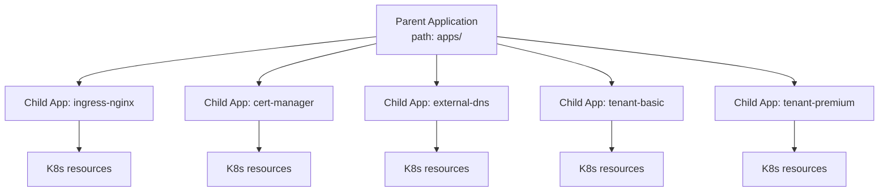

# Argo CD: Architecture and Patterns

GitOps 에이전트 없이 GitOps 원칙을 실현하려면 운영자가 변경을 감지하고 매니페스트를 적용하는 작업을 직접 반복해야 합니다. [Argo CD](https://argo-cd.readthedocs.io/)는 이 역할을 Kubernetes 컨트롤러로 구현해 Git 상태와 클러스터 상태의 차이를 지속적으로 감지하고 적용하는 전용 에이전트입니다. 이 문서는 Argo CD의 구성 요소, 리소스 계층, Sync 동작, App-of-Apps와 ApplicationSet 패턴, Flux와의 비교, EKS Managed 모드를 정리합니다.

## Components

Argo CD는 Kubernetes 클러스터에 설치된 여러 컴포넌트가 협업해 동작합니다. 공식 문서는 컴포넌트를 UI, Application, Core, Infra 네 개 논리 계층으로 분류합니다.


*[Source: Argo CD Component Architecture](https://argo-cd.readthedocs.io/en/stable/developer-guide/architecture/components/)*

각 컴포넌트의 책임이 분리되어 있어 필요한 부분만 수평 확장할 수 있습니다.

| Component | Layer | Responsibility |
|---|---|---|
| `api-server` | Application | Web UI, CLI, CI/CD 시스템이 호출하는 gRPC/REST API를 제공합니다. Application 관리와 Sync/Rollback 작업을 실행하고, 자격 증명을 저장하며, 인증/인가 정책을 적용하고 Git webhook 이벤트를 처리합니다. |
| `repo-server` | Core | Git 저장소의 캐시 복제본을 유지합니다. URL, 리비전, 경로를 입력받아 Kubernetes 매니페스트를 생성해 반환하며, 이 과정에서 Helm 템플릿 렌더링과 Kustomize 빌드를 수행합니다. |
| `application-controller` | Core | 배포된 Application의 목표 상태와 실제 상태를 지속적으로 비교합니다. Out of Sync를 감지하면 수정 작업을 실행하고, Sync 과정의 lifecycle hook도 함께 실행합니다. |
| `applicationset-controller` | Core | ApplicationSet CR을 감시하며, generator 기반으로 여러 Application을 동적으로 생성, 업데이트, 제거합니다. 멀티 클러스터와 멀티 환경 확장에 사용됩니다. |
| `notifications-controller` | Core | Sync 성공, 실패, Degraded 같은 이벤트를 Slack, 이메일, Webhook으로 전달합니다. trigger와 template은 ConfigMap으로 정의합니다. |
| `redis` | Infra | 매니페스트 렌더링 결과와 UI 조회 응답을 캐시합니다. Git 제공자와 Kubernetes API 호출 빈도를 낮춰 전체 응답 속도를 유지합니다. |
| `dex` | Infra | 선택 컴포넌트입니다. 외부 OIDC, SAML, LDAP identity provider와 연동할 때 사용하는 인증 게이트웨이이며, EKS Managed Argo CD에서는 AWS IAM Identity Center로 대체됩니다. |

컴포넌트 간 실제 상호작용은 아래의 아키텍처 다이어그램에서 확인할 수 있습니다.


*[Source: Argo CD Architectural Overview](https://argo-cd.readthedocs.io/en/stable/operator-manual/architecture/)*

사용자가 Web UI나 CLI로 Application을 생성하면 api-server가 이를 Kubernetes CR로 저장합니다. application-controller는 Git 변경을 polling 또는 webhook으로 감지하고, repo-server에 매니페스트 렌더링을 요청합니다. repo-server는 Git에서 가져온 템플릿(Helm, Kustomize, plain YAML)을 Kubernetes 매니페스트로 변환해 돌려주고, application-controller가 실제 클러스터 상태와 비교해 차이를 적용합니다. 렌더링 결과와 조회 응답은 redis 캐시에 저장되어 반복 호출을 줄입니다.

## Custom Resources

사용자는 Argo CD를 Kubernetes CRD 세 개로 조작합니다. 하나는 배포의 기본 단위이고, 하나는 배포를 대량 생성하는 템플릿이며, 하나는 이들을 묶는 테넌시 경계입니다[^argocd-concepts].

[^argocd-concepts]: [Argo CD — Core Concepts](https://argo-cd.readthedocs.io/en/stable/core_concepts/)

| Resource | Role |
|---|---|
| `Application` | 특정 Git 경로를 대상 클러스터, 네임스페이스로 배포하는 단위 |
| `ApplicationSet` | 템플릿과 generator로 여러 Application을 동적으로 생성 |
| `AppProject` | Application 그룹화와 접근 제어. 소스 저장소, 대상 클러스터, 네임스페이스, 허용 리소스 유형을 제한 |

`AppProject`는 멀티테넌시 경계를 그리는 데 사용됩니다. [Default project](https://argo-cd.readthedocs.io/en/stable/user-guide/projects/)는 모든 저장소와 클러스터, 네임스페이스를 허용하므로, 운영 환경에서는 환경별, 팀별로 전용 project를 생성해 권한을 명시적으로 제한하는 편이 권장됩니다.

## Sync Model

Application의 Sync는 Git에 정의된 목표 상태를 클러스터에 적용하는 작업입니다. Argo CD는 sync의 세 가지 측면을 각각 다른 방식으로 제어합니다. 트리거 시점과 sync 세부 동작은 Application CR의 `syncPolicy` 필드에서 설정하고, 리소스 간 적용 순서는 각 리소스에 붙이는 annotation으로 지정합니다.

```yaml
spec:
  syncPolicy:
    automated:                    # 트리거 시점 제어
      prune: true
      selfHeal: true
    syncOptions:                  # sync 세부 동작 제어
      - CreateNamespace=true
```

### Automated Policy

`automated` 블록이 없으면 Manual 모드로 동작해 사용자가 UI나 CLI로 직접 sync를 트리거해야 합니다. 블록이 있으면 Git 변경을 감지할 때마다 자동 sync가 실행되고, 두 하위 옵션으로 자동 sync의 강도를 조정합니다.

| Option | Default | Behavior | When to use |
|---|---|---|---|
| `prune` | false | Git에 더 이상 없는 리소스를 자동으로 제거 | 의도하지 않은 leftover를 정리하고 Git과 정확히 일치시키고 싶을 때 |
| `selfHeal` | false | 클러스터에서 직접 변경된 리소스를 Git 상태로 되돌림 | Continuous Reconciliation을 강제하고 drift를 방지할 때 |

`prune`과 `selfHeal`은 각각 독립적으로 켜고 끌 수 있지만, `automated` 블록이 없으면 둘 다 효력이 없습니다.

### Sync Options

`syncOptions`는 `key=value` 형태의 문자열 리스트로 sync 과정의 세부 동작을 조정합니다. 실무에서 자주 쓰이는 항목은 다음과 같습니다.

| Option | Purpose |
|---|---|
| `CreateNamespace=true` | `destination.namespace`가 없으면 자동 생성 |
| `ApplyOutOfSyncOnly=true` | 전체 매니페스트를 다시 적용하지 않고 out-of-sync 리소스만 적용. 대규모 Application에서 sync 시간 단축 |
| `PrunePropagationPolicy=background` | prune 시 Kubernetes 삭제 전파 정책 지정 (`foreground`, `background`, `orphan`) |
| `PruneLast=true` | prune을 sync의 마지막 단계에서 실행해 의존성 충돌 방지 |
| `Validate=false` | `kubectl apply`의 스키마 검증 비활성화 |
| `RespectIgnoreDifferences=true` | `ignoreDifferences`에 지정된 필드를 sync 시에도 건드리지 않음 |

### Phases and Waves

sync가 트리거된 뒤 리소스를 적용하는 순서는 두 단계로 제어됩니다. 먼저 sync 작업 전체가 **PreSync → Sync → PostSync** 세 phase로 나뉘고, 각 phase 안에서 리소스는 다시 **wave** 번호 순서로 적용됩니다[^sync-waves].

[^sync-waves]: [Argo CD — Sync Phases and Waves](https://argo-cd.readthedocs.io/en/stable/user-guide/sync-waves/)


*[Source: Argo CD Sync Phases and Waves](https://argo-cd.readthedocs.io/en/stable/user-guide/sync-waves/)*

**Phase는 sync의 생명주기 단계를 나눕니다.** 앞 phase의 모든 리소스가 Healthy가 되어야 다음 phase가 시작됩니다. PreSync와 PostSync에는 [hook 리소스](https://argo-cd.readthedocs.io/en/stable/user-guide/resource_hooks/)만 들어갈 수 있고, Sync phase에는 실제 워크로드 리소스가 배치됩니다. hook 리소스는 일반 Kubernetes 매니페스트(주로 `Job`)에 `argocd.argoproj.io/hook: PreSync` 같은 annotation을 붙여 sync 특정 시점에 실행되도록 표시한 것입니다.

| Phase | 포함 가능한 리소스 | 사용 예 |
|---|---|---|
| PreSync | hook 리소스 (`Job` 등) | DB 마이그레이션, 사전 점검 |
| Sync | 본 Application 리소스 | Deployment, Service, ConfigMap 등 실제 워크로드 |
| PostSync | hook 리소스 (`Job` 등) | 헬스 체크, 알림 발송, 통합 테스트 |

예를 들어 배포 전 DB 마이그레이션을 실행하려면 `Job`에 hook annotation을 붙여 Git 저장소에 함께 포함시킵니다.

```yaml
apiVersion: batch/v1
kind: Job
metadata:
  name: db-migrate
  annotations:
    argocd.argoproj.io/hook: PreSync
    argocd.argoproj.io/hook-delete-policy: HookSucceeded
```

`hook-delete-policy`는 hook 실행 이후 리소스 정리 방식을 지정합니다. `HookSucceeded`는 성공 시 삭제, `HookFailed`는 실패 시 삭제, `BeforeHookCreation`은 다음 실행 전에 삭제하는 옵션입니다.

**Wave는 한 phase 안에서 리소스를 적용하는 순서입니다.** 각 리소스에 `argocd.argoproj.io/sync-wave` annotation으로 정수 값을 붙이면 작은 값부터 적용됩니다. 기본값은 0이고 음수도 가능합니다. Sync phase 안에서 Namespace(`-1`) → ConfigMap(`0`) → Deployment(`1`) 순으로 배포하려면 각 리소스에 다음처럼 선언합니다.

```yaml
metadata:
  annotations:
    argocd.argoproj.io/sync-wave: "-1"
```

같은 wave 번호를 가진 리소스는 병렬로 적용되고, 다음 wave는 이전 wave의 모든 리소스가 Healthy가 된 뒤에 시작됩니다. Argo CD는 현재 phase에서 out-of-sync나 unhealthy 상태인 리소스 중 가장 작은 wave 번호를 찾아 적용하고, Healthy가 될 때까지 기다린 뒤 `ARGOCD_SYNC_WAVE_DELAY`(기본 2초) 대기 후 다음 wave로 넘어가는 동작을 반복합니다.

!!! warning "App-of-Apps wave pitfall"
    App-of-Apps 패턴에서는 부모 Application이 자식 Application 리소스를 생성하는 순간 부모가 Healthy로 판정되어, 자식이 실제로 Sync되기 전에 다음 wave가 진행되는 현상이 발생합니다. 이 경우 자식 Application에 custom health check를 추가하거나 의존성 순서를 phase 단위로 분리합니다.

## App-of-Apps Pattern

클러스터 부트스트랩 단계에서는 여러 Application을 순서대로 배포해야 합니다. ingress controller, cert-manager, external-dns 같은 플랫폼 컴포넌트를 먼저 설치하고 그 위에 테넌트 애플리케이션을 올리는 흐름입니다. Argo CD는 [App-of-Apps 패턴](https://argo-cd.readthedocs.io/en/stable/operator-manual/cluster-bootstrapping/)으로 이 순서를 표현합니다.

부모 Application은 Git 저장소에 있는 자식 Application 매니페스트 디렉터리를 가리킵니다. 부모를 Sync하면 자식 Application 리소스가 클러스터에 생성되고, 각 자식이 자신의 Sync 정책에 따라 리소스를 배포합니다.



### Cascading Deletion

부모 Application을 삭제할 때의 동작은 finalizer 유무로 결정됩니다.

- `resources-finalizer.argocd.argoproj.io` finalizer가 있으면 부모 삭제 시 자식 Application과 그 리소스까지 연쇄 삭제됩니다(cascading deletion).
- finalizer가 없으면 부모만 삭제되고 자식 Application과 실제 리소스는 유지됩니다(non-cascading). 점진적 마이그레이션 중 일시적으로 관리 주체만 분리할 때 사용합니다.

## ApplicationSet

App-of-Apps가 정적 목록을 기반으로 자식 Application을 선언한다면, ApplicationSet은 템플릿과 [generator](https://argo-cd.readthedocs.io/en/stable/operator-manual/applicationset/Generators/)를 조합해 자식을 동적으로 생성합니다. 환경별, 클러스터별, 파일별 파라미터를 템플릿에 채워 하나의 ApplicationSet이 수십에서 수백 개 Application을 관리합니다.

ApplicationSet이 제공하는 주요 generator는 다음과 같습니다.

| Generator | Input | Example scenario |
|---|---|---|
| List | 정적 key/value 배열 | 고정된 환경 목록에 배포 |
| Cluster | Argo CD에 등록된 클러스터 목록 | 멀티 클러스터 확장 |
| Git | Git 저장소의 파일 또는 디렉터리 | 파일 추가만으로 Application 자동 생성 |
| Matrix | 두 generator의 조합 | 환경과 클러스터의 cross product |
| Merge | 여러 generator의 병합과 override | 환경별 예외 처리 |
| SCM Provider | GitHub, GitLab 조직의 저장소 자동 탐지 | 마이크로서비스 팀 단위 배포 |
| Pull Request | 열린 PR 감지 | PR별 preview 환경 생성 |

List와 Cluster generator가 입문자에게 적합하며, SaaS 테넌트 자동 배포에는 Git generator가 맞습니다. 테넌트 파일이 Git에 추가되면 ApplicationSet이 해당 테넌트의 Application을 자동 생성하므로, Week 6 Lab에서 다룰 테넌트 티어 배포 시나리오도 Git generator 위에서 구성할 예정입니다.

## Argo CD vs Flux

App-of-Apps와 ApplicationSet까지 살펴보면 Argo CD 내부 패턴은 어느 정도 파악됩니다. 남은 질문은 "GitOps 도구로 왜 Argo CD를 선택하는가, Flux와는 무엇이 다른가"입니다. [AWS prescriptive guidance](https://docs.aws.amazon.com/prescriptive-guidance/latest/eks-gitops-tools/use-cases.html)는 두 도구를 16개 항목으로 비교한 공식 표를 제공하며, 아래는 운영자 판단에 영향을 주는 항목만 추린 요약입니다.

| Aspect | Argo CD | Flux |
|---|---|---|
| Architecture | End-to-end 애플리케이션 | Kubernetes CRD와 컨트롤러 집합 |
| Setup | 간편 | 복잡 |
| Integrated GUI | 완전한 Web UI | 선택적 경량 UI |
| RBAC | 세분화된 자체 제어 | Kubernetes 네이티브 RBAC |
| Multi-tenancy vs Multi-cluster | 멀티 클러스터 탁월 | 멀티테넌시 탁월 |
| Partial sync | 지원 | 미지원 |
| Extensibility | 커스텀 플러그인(제한적) | 커스텀 컨트롤러(광범위) |
| Community | 크고 활발 | 성장 중 |

선택 기준은 두 도구의 아키텍처 지향점 차이에서 출발합니다. Argo CD는 UI 중심 애플리케이션으로 설계되어 배포 시각화, 수동 개입, 멀티 클러스터 중앙 관리에 강점을 보입니다. Application의 일부 리소스만 선택해 Sync하는 partial sync도 Argo CD만의 특징으로, 특정 리소스만 롤백하거나 실패한 hook만 재실행하는 운영 시나리오에 유용합니다. Flux는 조합형 CRD 세트로 설계되어 이미지 자동화, Terraform 통합, 멀티테넌시 RBAC에 강점을 가집니다.

<div class="grid cards" markdown>

- :material-monitor-dashboard: **Argo CD가 적합한 경우**

    ---
    - 배포 상태의 시각적 관리가 필요한 팀
    - 멀티 클러스터를 단일 UI로 운영하는 구조
    - 엔터프라이즈 SSO, RBAC이 기본 요건인 환경
    - Argo 생태계(Argo Workflows, Argo Rollouts)와 조합하는 경우

- :material-cog-outline: **Flux가 적합한 경우**

    ---
    - 이미지 자동화와 잦은 재배포가 전제된 파이프라인
    - 공유 클러스터에서 멀티테넌시 RBAC이 필요한 환경
    - Terraform과 IaC를 Flux 컨트롤러로 통합 관리하는 운영
    - CLI 중심 워크플로우가 정착된 팀

</div>

## EKS Capability for Argo CD

Argo CD를 선택했다면 다음 질문은 self-managed로 운영할지, AWS가 제공하는 관리형 옵션을 쓸지입니다. 2025년 re:Invent에서 AWS는 Argo CD, ACK, kro 세 기능을 묶은 [EKS Capabilities](https://docs.aws.amazon.com/eks/latest/userguide/capabilities.html)를 공개했고, 이 중 Argo CD는 GitOps 영역을 담당합니다. ACK는 AWS 리소스를 Kubernetes API로 관리하고, kro는 여러 리소스를 조합해 상위 추상화를 만들며, 셋은 GitOps 워크플로우 안에서 결합하도록 설계되었습니다.

Argo CD를 직접 운영하려면 설치, 스케일링, HA, 패치, 토큰 갱신, OIDC 연동을 모두 담당해야 합니다. [EKS Capability for Argo CD](https://aws.amazon.com/blogs/containers/deep-dive-streamlining-gitops-with-amazon-eks-capability-for-argo-cd/)는 Argo CD 컨트롤러를 AWS 관리 영역에서 실행해 이 부담을 제거하고, 사용자는 Application과 Git 저장소 설정에만 집중하게 합니다. 아래 hub-and-spoke 구성은 Managed Argo CD가 여러 EKS spoke 클러스터를 관리하는 전형적인 형태입니다.


*[Source: Deep dive — Streamlining GitOps with Amazon EKS capability for Argo CD](https://aws.amazon.com/blogs/containers/deep-dive-streamlining-gitops-with-amazon-eks-capability-for-argo-cd/)*

### When Self-managed Fits Better

Managed Argo CD는 운영 부담을 크게 낮추지만, 다음 제약이 실무 환경에 맞지 않을 수 있습니다.

`Non-EKS clusters`
:   EKS 전용이라 온프레미스, EKS Anywhere, GKE/AKS, self-managed Kubernetes를 동시에 관리할 수 없습니다. 하이브리드나 멀티 클라우드 운영에서는 self-managed를 선택해야 합니다.

`Identity provider flexibility`
:   인증이 AWS Identity Center에 종속됩니다. 조직의 기존 IdP(Okta, Azure AD 직접 연결, LDAP 등)를 Dex 또는 Argo CD 네이티브 SSO로 붙여온 환경은 이 경로를 그대로 유지할 수 없습니다.

`Predefined RBAC`
:   ADMIN, EDITOR, VIEWER 세 역할로 고정되며, capability 하나당 최대 1,000개 identity(user 또는 group)까지 매핑할 수 있습니다. 세분화된 역할과 팀 단위 RBAC이 필요한 환경에서는 부적합합니다.

`Single-namespace CR scope`
:   Application, ApplicationSet, AppProject CR이 모두 지정된 단일 네임스페이스에 존재해야 합니다. 네임스페이스 기반 테넌시를 쓰는 조직에는 제약입니다.

`Fixed sync timeout`
:   Sync timeout이 120초로 고정되어 변경할 수 없습니다. 장시간 실행되는 hook이 있는 파이프라인은 self-managed에서 직접 조정해야 합니다.

`Unsupported customizations`
:   Config Management Plugins, custom Lua health checks, notifications controller, custom SSO, UI extensions, `argocd-cm` 같은 ConfigMap 직접 수정은 Managed 모드에서 사용할 수 없습니다.

`Controller log access`
:   AWS 관리 영역에서 컨트롤러가 실행되므로 Pod log에 직접 접근할 수 없습니다. 장애 진단은 Kubernetes events, Application status, CloudTrail 이벤트로 대체해야 합니다.

### Comparison Summary

Self-managed와 Managed의 차이를 한 번에 보는 경우를 위해 주요 항목만 추립니다.

| Area | Self-managed | EKS Managed |
|---|---|---|
| Install, upgrade, HA | 사용자 | AWS |
| Authentication | Dex, 외부 OIDC 자유 구성 | AWS IAM Identity Center 고정 |
| RBAC | Custom role 자유 설계 | ADMIN, EDITOR, VIEWER 3종 고정. capability 당 최대 1,000 identity (user 또는 group) |
| Supported cluster | 모든 Kubernetes 클러스터 | EKS 전용 |
| CR namespace scope | 여러 네임스페이스 | 단일 네임스페이스 고정 |
| Sync timeout | 조정 가능 | 120초 고정 |
| Custom extensions | CMP, Lua health, notifications, UI ext | 미지원 |
| Controller log access | 가능 | 불가 |
| Cross-account cluster | IAM role chaining, Trust Policy 직접 관리 | EKS Access Entries 기반 |
| ECR authentication | 별도 credential helper 구성 필요 | Capability Role 기반 native 인증 |

Managed 선택이 적합한 경우는 EKS 전용 환경이고 위 제약을 모두 수용할 수 있을 때로 한정됩니다. 이 문서의 이후 내용과 Lab은 온프레미스, 멀티 클라우드, 팀 단위 RBAC 등 일반적인 실무 요구를 가정해 self-managed Argo CD를 기준으로 합니다. Argo CD로 ACK와 kro가 관리하는 AWS 리소스까지 함께 선언적으로 배포하면 애플리케이션과 인프라가 단일 Git 저장소로 수렴하는데, 이 결합과 Argo Rollouts, Image Updater, GitOps Bridge 같은 주변 도구는 이어지는 [Argo CD Ecosystem Extensions](3_argocd-extensions.md)에서 다룹니다.
