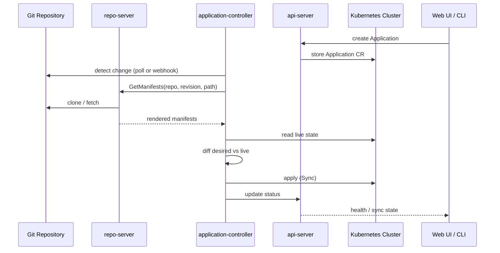
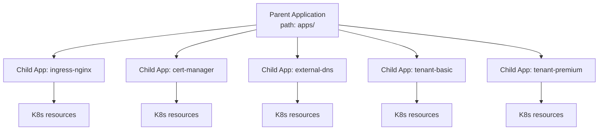

# ArgoCD: Architecture and Patterns

GitOps 에이전트 없이 GitOps 원칙을 실현하려면 운영자가 변경을 감지하고 매니페스트를 적용하는 작업을 직접 반복해야 합니다. Argo CD는 이 역할을 Kubernetes 컨트롤러로 구현해 Git 상태와 클러스터 상태의 차이를 지속적으로 감지하고 적용하는 전용 에이전트입니다[^argocd-aws]. 이 문서는 ArgoCD의 구성 요소, 리소스 계층, Sync 동작, App-of-Apps와 ApplicationSet 패턴, Flux와의 비교, EKS Managed 모드를 정리합니다.

## Core Components

ArgoCD는 Kubernetes 클러스터에 설치된 여러 컴포넌트가 협업해 동작합니다[^argocd-arch]. 각 컴포넌트의 책임이 분리되어 있어 필요한 부분만 수평 확장할 수 있습니다.

`api-server`
:   Web UI, CLI, CI/CD 시스템이 호출하는 gRPC/REST API 서버입니다. Application 관리, Sync/Rollback 같은 작업 실행, 자격 증명 저장, 인증/인가 정책 적용, Git webhook 이벤트 처리까지 담당합니다.

`repo-server`
:   Git 저장소의 캐시 복제본을 유지하면서 지정된 URL, 리비전, 경로, 설정을 받아 Kubernetes 매니페스트를 생성해 반환하는 내부 서비스입니다. Helm 템플릿 렌더링과 Kustomize 빌드도 이 컴포넌트가 담당합니다.

`application-controller`
:   배포된 Application을 지속 관찰하면서 실제 상태와 목표 상태를 비교합니다. Out of Sync 상태를 감지하면 필요한 수정 작업을 수행하고 Sync 관련 lifecycle hook도 실행합니다.

`applicationset-controller`
:   ApplicationSet CR을 감시해 generator 기반으로 여러 Application을 동적으로 생성, 업데이트, 제거합니다. 멀티 클러스터, 멀티 환경 확장에 사용됩니다.

`notifications-controller`
:   Sync 성공, 실패, Degraded 같은 이벤트를 Slack, 이메일, Webhook으로 전달합니다. trigger와 template을 ConfigMap으로 정의합니다.

`redis`
:   매니페스트 렌더링과 UI 조회를 가속하는 캐시 계층입니다. Git 제공자 호출 빈도를 낮추고 UI 응답 속도를 보장합니다.

`dex`
:   선택 컴포넌트입니다. OIDC, SAML, LDAP 같은 외부 identity provider와 연동할 때 사용하는 게이트웨이이며, EKS Managed ArgoCD에서는 AWS IAM Identity Center로 대체됩니다.



## Resource Hierarchy

EKS Capability for Argo CD 문서는 ArgoCD가 세 가지 주요 리소스 타입을 제공한다고 정리합니다[^argocd-aws] [^argocd-k8s-resources].

| Resource | Responsibility |
|---|---|
| `Application` | 특정 Git 경로를 대상 클러스터, 네임스페이스로 배포하는 단위 |
| `ApplicationSet` | 템플릿과 generator로 여러 Application을 동적으로 생성 |
| `AppProject` | Application 그룹화와 접근 제어. 소스 저장소, 대상 클러스터, 네임스페이스, 허용 리소스 유형을 제한 |

`AppProject`는 멀티테넌시 경계를 그리는 데 사용됩니다. Default project는 모든 저장소와 클러스터, 네임스페이스를 허용하므로, 운영 환경에서는 환경별, 팀별로 전용 project를 생성해 권한을 명시적으로 제한하는 편이 권장됩니다[^argocd-projects].

## Sync Model

Application의 Sync는 Git에 정의된 목표 상태를 클러스터에 적용하는 작업입니다. Sync가 언제, 어떻게 일어날지는 `syncPolicy` 아래 세 가지 옵션으로 제어합니다.

`automated`
:   설정하면 Git 변경을 감지할 때마다 자동 Sync가 실행됩니다. 생략하면 Manual 모드로 동작해 사용자가 명시적으로 Sync를 트리거해야 합니다.

`prune`
:   자동 Sync에서 Git에 없는 리소스를 클러스터에서 제거할지 여부를 결정합니다. 기본값은 off이고, on으로 설정하면 의도하지 않은 leftover가 정리됩니다.

`selfHeal`
:   클러스터에서 직접 변경된 리소스를 다시 Git 상태로 복구합니다. Auto Reconciliation 원칙을 강제하려면 활성화합니다.

### Sync Phases and Waves

대규모 Application은 리소스 간 의존성이 있어 동시에 적용하면 문제가 됩니다. ArgoCD는 두 계층으로 순서를 보장합니다[^sync-waves]. 바깥 단위가 sync phase, 안쪽 단위가 sync wave입니다.

`Sync phase`
:   PreSync, Sync, PostSync 순으로 진행합니다. PreSync와 PostSync는 hook 리소스만 포함할 수 있고, Sync 단계가 본 Application 리소스를 다룹니다.

`Sync wave`
:   각 phase 안에서 `argocd.argoproj.io/sync-wave` annotation의 정수 값 순서대로 적용됩니다. 기본값은 0이며 음수도 지정 가능합니다.

```yaml
metadata:
  annotations:
    argocd.argoproj.io/sync-wave: "5"
```

Wave 진행 순서는 다음과 같습니다.

1. 현재 phase에서 out-of-sync 또는 unhealthy 상태인 리소스가 속한 최저 wave 번호를 찾습니다.
2. 해당 wave 리소스를 적용하고 Healthy 상태가 될 때까지 기다립니다.
3. wave 사이에는 `ARGOCD_SYNC_WAVE_DELAY`(기본 2초) 대기를 둡니다.
4. 다음 wave로 이동해 같은 절차를 반복합니다.

App-of-Apps 패턴에서는 Healthy 판정이 조기 종료되어 wave 순서가 깨질 수 있으니 주의합니다. 부모 Application이 자식 Application 리소스를 생성하는 순간 부모는 Healthy로 판정되므로, 자식이 실제로 Sync되기 전에 다음 wave가 진행되는 현상이 발생합니다. 이 경우 자식 Application에 custom health check를 추가하거나 의존성 순서를 phase 단위로 분리합니다.

### Partial Sync

ArgoCD는 Application의 일부 리소스만 선택해 Sync할 수 있습니다. AWS prescriptive guidance의 비교 표에서 Flux 대비 ArgoCD의 차별점으로 부분 동기화를 언급합니다[^argocd-vs-flux]. 특정 리소스만 롤백하거나, 실패한 hook만 재실행하는 시나리오에서 유용합니다.

## App-of-Apps Pattern

클러스터 부트스트랩 단계에서는 여러 Application을 순서대로 배포해야 합니다. ingress controller, cert-manager, external-dns 같은 플랫폼 컴포넌트를 먼저 설치하고 그 위에 테넌트 애플리케이션을 올리는 흐름입니다. ArgoCD는 App-of-Apps 패턴으로 이 순서를 표현합니다[^app-of-apps].

부모 Application은 Git 저장소에 있는 자식 Application 매니페스트 디렉터리를 가리킵니다. 부모를 Sync하면 자식 Application 리소스가 클러스터에 생성되고, 각 자식이 자신의 Sync 정책에 따라 리소스를 배포합니다.



### Cascading Deletion

부모 Application을 삭제할 때의 동작은 finalizer 유무로 결정됩니다.

- `resources-finalizer.argocd.argoproj.io` finalizer가 있으면 부모 삭제 시 자식 Application과 그 리소스까지 연쇄 삭제됩니다(cascading deletion).
- finalizer가 없으면 부모만 삭제되고 자식 Application과 실제 리소스는 유지됩니다(non-cascading). 점진적 마이그레이션 중 일시적으로 관리 주체만 분리할 때 사용합니다.

## ApplicationSet

App-of-Apps가 정적 목록을 기반으로 자식 Application을 선언한다면, ApplicationSet은 템플릿과 generator를 조합해 자식을 동적으로 생성합니다[^applicationset-generators]. 환경별, 클러스터별, 파일별 파라미터를 템플릿에 채워 하나의 ApplicationSet이 수십에서 수백 개 Application을 관리합니다.

ApplicationSet이 제공하는 주요 generator는 다음과 같습니다.

| Generator | Input | Example scenario |
|---|---|---|
| List | 정적 key/value 배열 | 고정된 환경 목록에 배포 |
| Cluster | ArgoCD에 등록된 클러스터 목록 | 멀티 클러스터 확장 |
| Git | Git 저장소의 파일 또는 디렉터리 | 파일 추가만으로 Application 자동 생성 |
| Matrix | 두 generator의 조합 | 환경과 클러스터의 cross product |
| Merge | 여러 generator의 병합과 override | 환경별 예외 처리 |
| SCM Provider | GitHub, GitLab 조직의 저장소 자동 탐지 | 마이크로서비스 팀 단위 배포 |
| Pull Request | 열린 PR 감지 | PR별 preview 환경 생성 |

List와 Cluster generator가 입문자에게 적합하며, SaaS 테넌트 자동 배포에는 Git generator가 맞습니다. 테넌트 파일이 Git에 추가되면 ApplicationSet이 해당 테넌트의 Application을 자동 생성하므로, Week 6 Lab의 테넌트 티어 배포 시나리오도 Git generator 위에서 구성합니다.

## ArgoCD vs Flux

AWS prescriptive guidance는 두 도구를 16개 항목으로 비교한 공식 표를 제공합니다[^argocd-vs-flux]. 아래는 운영자 판단에 영향을 주는 항목만 추린 요약입니다.

| Aspect | Argo CD | Flux |
|---|---|---|
| Architecture | End-to-end 애플리케이션 | Kubernetes CRD와 컨트롤러 집합 |
| Setup | 간편 | 복잡 |
| Integrated GUI | 완전한 Web UI | 선택적 경량 UI |
| RBAC | 세분화된 자체 제어 | Kubernetes 네이티브 RBAC |
| Multi-tenancy vs Multi-cluster | 멀티 클러스터 탁월 | 멀티테넌시 탁월 |
| Partial sync | 지원 | 미지원 |
| Extensibility | 커스텀 플러그인(제한적) | 커스텀 컨트롤러(광범위) |
| Community | 크고 활발 | 성장 중 |

선택 기준은 두 도구의 아키텍처 지향점 차이에서 출발합니다. ArgoCD는 UI 중심 애플리케이션으로 설계되어 배포 시각화, 수동 개입, 멀티 클러스터 중앙 관리에 강점을 보입니다. Flux는 조합형 CRD 세트로 설계되어 이미지 자동화, Terraform 통합, 멀티테넌시 RBAC에 강점을 가집니다.

<div class="grid cards" markdown>

- :material-monitor-dashboard: **ArgoCD가 적합한 경우**

    ---
    - 배포 상태의 시각적 관리가 필요한 팀
    - 멀티 클러스터를 단일 UI로 운영하는 구조
    - 엔터프라이즈 SSO, RBAC이 기본 요건인 환경
    - Argo 생태계(Workflows, Rollouts)와 조합하는 경우

- :material-cog-outline: **Flux가 적합한 경우**

    ---
    - 이미지 자동화와 잦은 재배포가 전제된 파이프라인
    - 공유 클러스터에서 멀티테넌시 RBAC이 필요한 환경
    - Terraform과 IaC를 Flux 컨트롤러로 통합 관리하는 운영
    - CLI 중심 워크플로우가 정착된 팀

</div>

## EKS Capability for Argo CD

Argo CD를 직접 운영하려면 설치, 스케일링, HA, 패치, 토큰 갱신, OIDC 연동을 모두 담당해야 합니다. 2025년 re:Invent에서 AWS는 이 부담을 덜어주는 [EKS Capability for Argo CD](https://aws.amazon.com/blogs/containers/deep-dive-streamlining-gitops-with-amazon-eks-capability-for-argo-cd/)를 공개했습니다[^argocd-aws] [^argocd-comparison]. Argo CD 컨트롤러가 AWS 관리 영역에서 실행되고, 사용자는 Application과 Git 저장소 설정에 집중하면 됩니다. 아래 hub-and-spoke 구성은 Managed ArgoCD가 여러 EKS spoke 클러스터를 관리하는 전형적인 형태입니다.


*[Source: Deep dive — Streamlining GitOps with Amazon EKS capability for Argo CD](https://aws.amazon.com/blogs/containers/deep-dive-streamlining-gitops-with-amazon-eks-capability-for-argo-cd/)*

### When Self-managed Fits Better

Managed ArgoCD는 운영 부담을 크게 낮추지만, 다음 제약이 실무 환경에 맞지 않을 수 있습니다.

`Non-EKS clusters`
:   EKS 전용이라 온프레미스, EKS Anywhere, GKE/AKS, self-managed Kubernetes를 동시에 관리할 수 없습니다. 하이브리드나 멀티 클라우드 운영에서는 self-managed를 선택해야 합니다.

`Identity provider flexibility`
:   인증이 AWS Identity Center에 종속됩니다. 조직의 기존 IdP(Okta, Azure AD 직접 연결, LDAP 등)를 Dex 또는 ArgoCD 네이티브 SSO로 붙여온 환경은 이 경로를 그대로 유지할 수 없습니다.

`Predefined RBAC`
:   ADMIN, EDITOR, VIEWER 세 역할로 고정되고 capability 당 identity가 1,000개로 제한됩니다. 세분화된 역할과 팀 단위 RBAC이 필요한 환경에서는 부적합합니다.

`Single-namespace CR scope`
:   Application, ApplicationSet, AppProject CR이 모두 지정된 단일 네임스페이스에 존재해야 합니다. 네임스페이스 기반 테넌시를 쓰는 조직에는 제약입니다.

`Fixed sync timeout and polling`
:   Sync timeout이 120초로 고정되고 기본 polling은 6분입니다. 장시간 실행되는 hook이 있거나 빠른 반응이 필요한 파이프라인은 self-managed에서 직접 조정하거나 webhook을 세밀하게 설정해야 합니다.

`Unsupported customizations`
:   Config Management Plugins, custom Lua health checks, notifications controller, custom SSO, UI extensions, `argocd-cm` 같은 ConfigMap 직접 수정은 Managed 모드에서 사용할 수 없습니다.

`Controller log access`
:   AWS 관리 영역에서 컨트롤러가 실행되므로 Pod log에 직접 접근할 수 없습니다. 장애 진단은 Kubernetes events, Application status, CloudTrail 이벤트로 대체해야 합니다.

### Comparison Summary

Self-managed와 Managed의 차이를 한 번에 보는 경우를 위해 주요 항목만 추립니다.

| Area | Self-managed | EKS Managed |
|---|---|---|
| Install, upgrade, HA | 사용자 | AWS |
| Authentication | Dex, 외부 OIDC 자유 구성 | AWS IAM Identity Center 고정 |
| RBAC | Custom role 자유 설계 | ADMIN, EDITOR, VIEWER 3종, 1,000 identity |
| Supported cluster | 모든 Kubernetes 클러스터 | EKS 전용 |
| CR namespace scope | 여러 네임스페이스 | 단일 네임스페이스 고정 |
| Sync timeout | 조정 가능 | 120초 고정 |
| Custom extensions | CMP, Lua health, notifications, UI ext | 미지원 |
| Controller log access | 가능 | 불가 |
| Cross-account cluster | IAM role chaining, Trust Policy 직접 관리 | EKS Access Entries 기반 |
| ECR token refresh | 12시간 주기 수동 처리 | 자동 갱신 |

Managed 선택이 적합한 경우는 EKS 전용 환경이고 위 제약을 모두 수용할 수 있을 때로 한정됩니다. 이 문서의 이후 내용과 Lab은 온프레미스, 멀티 클라우드, 팀 단위 RBAC 등 일반적인 실무 요구를 가정해 self-managed ArgoCD를 기준으로 합니다.

## EKS Capabilities as a Set

EKS Capability는 Argo CD 단독이 아니라 세 개 기능이 함께 설계된 묶음입니다[^eks-capabilities].

`Argo CD`
:   애플리케이션 CD를 담당합니다.

`ACK` (AWS Controllers for Kubernetes)
:   AWS 리소스를 Kubernetes API로 관리합니다.

`kro` (Kube Resource Orchestrator)
:   여러 리소스를 조합해 상위 추상화를 만듭니다.

세 기능은 독립 리소스로 선택적 활성화가 가능하지만, GitOps 워크플로우 안에서 결합하도록 설계되었습니다. Argo CD로 ACK와 kro가 관리하는 AWS 리소스까지 함께 선언적으로 배포하면 애플리케이션과 인프라가 단일 Git 저장소로 수렴합니다. ACK, kro와 Argo Rollouts, Image Updater, GitOps Bridge는 이어지는 [ArgoCD Ecosystem Extensions](3_argocd-extensions.md)에서 다룹니다.

[^argocd-aws]: [Amazon EKS — Continuous Deployment with Argo CD](https://docs.aws.amazon.com/eks/latest/userguide/argocd.html)
[^argocd-arch]: [Argo CD — Architectural Overview](https://argo-cd.readthedocs.io/en/stable/operator-manual/architecture/)
[^argocd-projects]: [Amazon EKS — Working with Argo CD Projects](https://docs.aws.amazon.com/eks/latest/userguide/argocd-projects.html)
[^argocd-k8s-resources]: [Amazon EKS — Capability Kubernetes resources](https://docs.aws.amazon.com/eks/latest/userguide/capability-kubernetes-resources.html)
[^sync-waves]: [Argo CD — Sync Phases and Waves](https://argo-cd.readthedocs.io/en/stable/user-guide/sync-waves/)
[^app-of-apps]: [Argo CD — Cluster Bootstrapping (App of Apps)](https://argo-cd.readthedocs.io/en/stable/operator-manual/cluster-bootstrapping/)
[^applicationset-generators]: [Argo CD — ApplicationSet Generators](https://argo-cd.readthedocs.io/en/stable/operator-manual/applicationset/Generators/)
[^argocd-vs-flux]: [AWS Prescriptive Guidance — Choosing the right GitOps tool: ArgoCD and Flux](https://docs.aws.amazon.com/prescriptive-guidance/latest/eks-gitops-tools/use-cases.html)
[^eks-capabilities]: [Amazon EKS — EKS Capabilities](https://docs.aws.amazon.com/eks/latest/userguide/capabilities.html)
[^argocd-comparison]: [Amazon EKS — Comparing EKS Capability for Argo CD to self-managed Argo CD](https://docs.aws.amazon.com/eks/latest/userguide/argocd-comparison.html)
