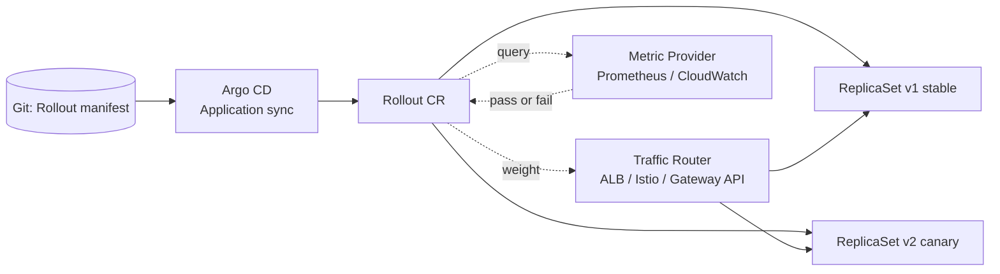
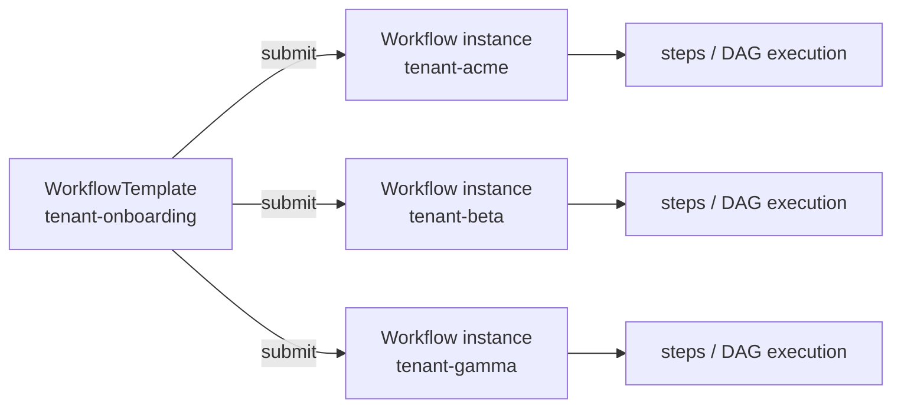
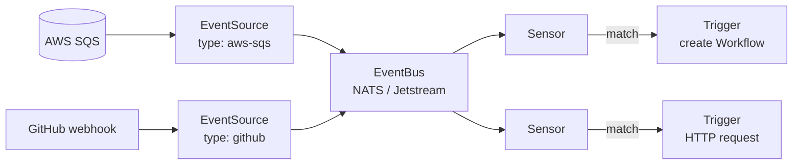
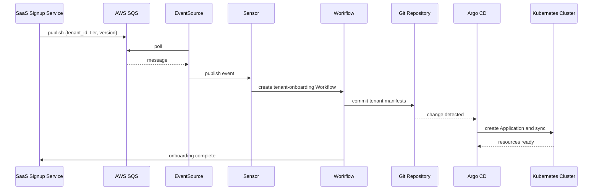

# Argo Ecosystem

Argo 프로젝트는 Argo CD 하나만 있는 것이 아닙니다. 컨테이너 이미지 태그를 자동으로 반영하는 **Argo CD Image Updater**, canary와 blue-green 같은 점진적 전환 전략을 제공하는 **Argo Rollouts**, DAG 기반 parallel job을 실행하는 **Argo Workflows**, 외부 이벤트를 수신해 Workflow를 트리거하는 **Argo Events**가 함께 CNCF 프로젝트로 관리됩니다. 이 문서는 각 도구의 구조와 역할을 정리하고, 마지막에 네 도구를 결합한 SaaS 테넌트 온보딩 자동화 사례를 다룹니다.

## Argo CD Image Updater

GitOps 흐름에서 컨테이너 이미지 태그를 바꾸려면 매번 PR을 열어 매니페스트의 태그를 수정해야 합니다. 이 수동 작업을 해소하는 도구가 [Argo CD Image Updater](https://argocd-image-updater.readthedocs.io/en/stable/)입니다. 이미지 레지스트리를 폴링하면서 업데이트 정책에 맞는 새 태그를 발견하면 Application 파라미터를 직접 변경하거나 Git 저장소에 커밋합니다.

### Update Strategies

대상 이미지를 선정하는 [네 가지 전략](https://argocd-image-updater.readthedocs.io/en/stable/basics/update-strategies/)을 제공합니다.

| Strategy | Selection criteria | Typical tag format |
|---|---|---|
| `semver` | semantic version constraint에 맞는 최신 버전 | `1.2.5`, `v1.3.0`, `2.0.0-rc1` |
| `newest-build` | registry에 기록된 build time이 가장 최근인 태그 | commit SHA(`f33bacd`), 임의 문자열 |
| `alphabetical` | 태그를 내림차순으로 정렬해 가장 높은 값 선택 | CalVer(`2026-04-13`) |
| `digest` | 고정된 mutable 태그의 최신 digest | `latest`, `stable`, `prod` |

### Write-back Modes

감지된 이미지 변경을 반영하는 방식은 두 가지입니다.

| Method | Target | Audit trail |
|---|---|---|
| `argocd` | Kubernetes API로 Application 리소스의 `helm.parameters` 또는 `kustomize.images`를 직접 수정 | Argo CD 이벤트에만 남음 |
| `git` | Git 매니페스트 파일의 이미지 태그를 커밋 | Git 이력에 남아 감사 가능, GitOps 원칙 부합 |

### Example

Argo CD Application에 annotation을 추가해 Image Updater 동작을 선언합니다. `git` write-back과 `semver` 전략을 결합한 예시는 다음과 같습니다.

```yaml
apiVersion: argoproj.io/v1alpha1
kind: Application
metadata:
  name: myapp
  annotations:
    argocd-image-updater.argoproj.io/image-list: myimage=some/image  # (1)
    argocd-image-updater.argoproj.io/myimage.update-strategy: semver  # (2)
    argocd-image-updater.argoproj.io/write-back-method: git  # (3)
    argocd-image-updater.argoproj.io/git-branch: main  # (4)
```

1. 감시 대상 이미지를 `alias=repository` 형식으로 등록합니다. 뒤에 붙는 `myimage` alias는 이후 annotation에서 이미지별 설정을 분리할 때 사용됩니다.
2. 해당 alias가 사용하는 update strategy를 지정합니다. 값을 생략하면 `semver`가 기본값입니다.
3. 변경 반영 방식을 선택합니다. `git`은 Git 저장소에 커밋하고, `argocd`는 Application 리소스만 수정합니다.
4. write-back branch를 지정합니다. 생략하면 Application의 `targetRevision`이 사용되고, `git-branch:write-branch` 형식으로 별도 write 브랜치를 분리할 수도 있습니다.

!!! warning
    ECR 인증 토큰 수명은 12시간이므로 갱신 없이는 Image Updater가 이후 registry 조회에 실패합니다. self-managed Argo CD에서는 토큰을 주기적으로 갱신하는 sidecar나 CronJob을 함께 배포해야 합니다. EKS Capability for Argo CD는 Capability Role 기반 native 인증으로 갱신 부담이 없습니다.

## Argo Rollouts

Kubernetes Deployment의 rolling update는 무중단 교체를 제공하지만 트래픽 비율 제어, 외부 메트릭 검증, 자동 롤백은 지원하지 않습니다. 이 공백을 채우는 컨트롤러가 [Argo Rollouts](https://argoproj.github.io/argo-rollouts/)입니다. `Rollout`이라는 별도 CRD로 Deployment를 대체하고, 더 정교한 배포 전략을 선언적으로 표현합니다.

### Custom Resources

Argo Rollouts는 배포 워크로드와 메트릭 검증을 분리하기 위해 다섯 개의 CRD를 제공합니다.

| Resource | Role |
|---|---|
| `Rollout` | Deployment를 대체하는 워크로드 리소스. canary, blue-green 전략과 단계별 동작을 선언 |
| `AnalysisTemplate` | 네임스페이스 범위의 메트릭 검증 템플릿. Prometheus, CloudWatch 등 provider 질의를 정의 |
| `ClusterAnalysisTemplate` | 클러스터 전역에서 재사용하는 `AnalysisTemplate` |
| `AnalysisRun` | template의 실행 인스턴스. pass, fail, inconclusive 상태를 추적 |
| `Experiment` | 임시 ReplicaSet을 띄워 두 버전의 메트릭을 병렬 비교하는 실험 리소스 |

### Deployment Strategies

Argo Rollouts는 두 가지 전략을 제공합니다.

| Aspect | Blue-Green | Canary |
|---|---|---|
| Traffic shift | 검증 후 한 번에 전환 | 설정된 단계별로 비율 증가 |
| Traffic manager | 불필요 | 비율 전환 시 필요, 미사용 시 replica 비율로 근사 |
| Blast radius on failure | 전환 직후 전체 영향 | 현재 weight 범위 내로 한정 |
| Resource usage | 구 버전과 신 버전 동시 운영으로 2배 | 단계별 replica 증분, 비용 완만 |

Blue-Green은 기존 버전과 새 버전을 동시에 실행하면서 프로덕션 트래픽(active service)은 기존 버전으로 유지하고, 새 버전은 별도의 preview service로만 검증합니다. 검증이 끝나면 active service를 새 버전으로 한 번에 전환합니다. 반면 Canary는 stable ReplicaSet을 유지한 채 canary ReplicaSet에 소수 트래픽부터 보내고, 메트릭 검증에 따라 비율을 점진적으로 확대합니다.

### Example

Deployment 대신 `Rollout` CRD를 사용하며, 20% → 50% → 100%로 단계 전환하는 canary 예시는 다음과 같습니다.

```yaml
apiVersion: argoproj.io/v1alpha1
kind: Rollout
metadata:
  name: myapp
spec:
  replicas: 5
  selector:
    matchLabels:
      app: myapp
  template:  # (1)
    metadata:
      labels:
        app: myapp
    spec:
      containers:
        - name: myapp
          image: myapp:v2
  strategy:
    canary:
      steps:
        - setWeight: 20  # (2)
        - pause: { duration: 5m }  # (3)
        - setWeight: 50
        - pause: {}  # (4)
        - setWeight: 100
```

1. `template` 스펙은 Deployment와 동일합니다. Rollout은 이 정의로 ReplicaSet을 만들고, canary 진행 중에는 stable ReplicaSet과 canary ReplicaSet을 동시에 실행합니다.
2. 새 버전으로 보낼 트래픽 비율을 백분율로 지정합니다. Traffic Manager가 없으면 replica 비율로 근사됩니다.
3. 지정한 시간만큼 대기합니다. `AnalysisRun`을 붙이면 이 구간에 메트릭 검증을 실행합니다.
4. duration 없이 비워두면 사용자가 `kubectl argo rollouts promote`를 실행할 때까지 무한 대기합니다.

### Traffic Management

Canary 전략을 제대로 사용하려면 트래픽 비율을 서비스 메시, ALB, Gateway API 같은 Layer 7 계층에서 제어해야 합니다. Argo Rollouts는 세 가지 provider와 통합됩니다.

`AWS ALB`
:   AWS Load Balancer Controller의 weighted target group 기능을 활용합니다.

`Istio`
:   VirtualService의 weight 필드를 조정해 트래픽을 분할합니다.

`Gateway API`
:   HTTPRoute의 backendRef weight를 조정합니다. Argo Rollouts traffic router plugin으로 제공됩니다.

Gateway API 경로는 CRD 기반 선언이라 이전 ingress annotation 방식보다 리뷰와 변경 추적이 쉽고, Week 5 Lab Scenario 1의 [Gateway API 전환 사례](../week5/5_lab.md#scenario-1)와 자연스럽게 이어집니다.

### Integration with Argo CD

Argo Rollouts와 Argo CD는 각자의 CRD로 분리되어 있어 혼합 사용이 가능합니다. `ApplicationSet`이 tier별 `Application`을 생성하고, 각 `Application` 안에 `Rollout` 리소스를 포함시키면 Argo CD는 동기화만 담당하고 배포 전략은 Argo Rollouts가 담당하는 구조가 됩니다.


*[Source: Argo Rollouts Architecture](https://argoproj.github.io/argo-rollouts/architecture/)*

Argo CD가 Git의 `Rollout` 매니페스트를 클러스터에 적용하면, Argo Rollouts 컨트롤러가 `trafficRouting` 필드와 `AnalysisRun` 리소스를 Argo CD sync 로직과 분리해 자체적으로 관리합니다.



Metric Provider의 판단으로 canary가 실패하면 `Rollout`은 자동으로 stable ReplicaSet으로 돌아갑니다. Argo CD가 Git의 목표 상태를 다시 Sync하려 해도 `Rollout`이 내부 상태(canary progression)를 관리하므로 충돌하지 않습니다.

## Argo Workflows

Argo CD는 선언적 GitOps continuous delivery 도구로, desired state와 live state를 지속적으로 비교해 동기화합니다. 반대로 CI/CD 파이프라인, ML 학습 워크플로우, 테넌트 온보딩처럼 **여러 단계를 순서대로 실행해야 하는 작업**은 별도의 실행 엔진이 필요합니다. [Argo Workflows](https://argo-workflows.readthedocs.io/en/latest/)는 Kubernetes 위에서 parallel job을 DAG로 실행하는 container-native workflow engine입니다. 중심 리소스는 `Workflow`이고, 정적 정의이면서 동시에 실행 상태를 추적하는 live 객체로 다뤄집니다.

### Custom Resources

Argo Workflows는 실행 단위와 재사용 정의, 스케줄링을 분리한 네 개의 CRD를 제공합니다.

| Resource | Role |
|---|---|
| `Workflow` | 실행 단위. template 조합을 선언하고 동시에 실행 상태(pending, running, succeeded, failed)를 추적 |
| `WorkflowTemplate` | 네임스페이스 범위의 재사용 가능한 Workflow 정의. 반복 작업을 템플릿화 |
| `ClusterWorkflowTemplate` | 클러스터 전역에서 재사용하는 `WorkflowTemplate` |
| `CronWorkflow` | cron 스케줄로 주기적으로 Workflow를 실행 |

### Template Types

[공식 분류](https://argo-workflows.readthedocs.io/en/latest/workflow-concepts/#template-types)는 실제 작업을 정의하는 **Definition** 일곱 가지와 다른 template을 호출하는 **Invocator** 두 가지로 나뉩니다.

| Category | Type | Role |
|---|---|---|
| Definition | `container` | Kubernetes Pod 스펙으로 컨테이너를 실행합니다. 가장 흔한 기본 유형입니다. |
| Definition | `script` | 컨테이너를 감싸 인라인 스크립트를 실행합니다. 간단한 bash, Python 로직에 적합합니다. |
| Definition | `resource` | Kubernetes 리소스를 직접 생성, 삭제, 패치합니다. Workflow 안에서 `kubectl apply`를 선언적으로 실행하는 구조입니다. |
| Definition | `suspend` | 실행을 일시 정지합니다. 수동 승인 단계 구현에 활용됩니다. |
| Definition | `http` | HTTP 요청을 수행합니다. 외부 API 호출, webhook 전송에 사용됩니다. |
| Definition | `containerSet` | 단일 Pod 안에서 여러 컨테이너를 함께 실행합니다. sidecar 스타일 작업에 활용됩니다. |
| Definition | `plugin` | Argo Workflows에 설치된 executor plugin을 호출합니다. |
| Invocator | `steps` | 여러 template을 순차 리스트로 실행합니다. 같은 step 안의 항목은 병렬 실행됩니다. |
| Invocator | `dag` | Task 간 의존성을 그래프로 정의해 병렬과 순차를 혼합합니다. 복잡한 파이프라인에 적합합니다. |

### Template Reuse

반복 작업은 `WorkflowTemplate`으로 선언하고, 이벤트마다 이 template을 참조하는 새 `Workflow` 인스턴스를 생성합니다. 예를 들어 테넌트 온보딩처럼 동일한 절차를 고객마다 반복해야 하는 경우, 하나의 template에서 테넌트별 `Workflow`가 파생됩니다.



### Example

테넌트 온보딩을 `WorkflowTemplate`으로 선언한 예시입니다. 아래 [Applying to Tenant Onboarding](#applying-to-tenant-onboarding)의 3-5단계(Sensor가 Workflow를 생성 → Workflow가 매니페스트를 Git에 커밋 → 완료 알림)가 이 template의 DAG 구조에 대응합니다. step 순서만 있으면 `steps` invocator가 더 간단하지만, 나중에 병렬 분기나 조건부 실행을 추가하기 쉽도록 여기서는 `dag`를 선택했습니다.

```yaml
apiVersion: argoproj.io/v1alpha1
kind: WorkflowTemplate
metadata:
  name: tenant-onboarding
spec:
  entrypoint: main  # (1)
  arguments:
    parameters:
      - name: tenant_id
      - name: tier
  templates:
    # --- DAG template (Invocator): task 간 의존성을 선언 ---
    - name: main
      dag:  # (2)
        tasks:
          - name: generate-manifest
            template: render
            arguments:
              parameters:
                - name: tenant_id
                  value: "{{workflow.parameters.tenant_id}}"
                - name: tier
                  value: "{{workflow.parameters.tier}}"
          - name: commit-to-git  # (3)
            dependencies: [generate-manifest]
            template: git-commit
          - name: notify
            dependencies: [commit-to-git]
            template: http-notify

    # --- Container templates (Definition): 실제 컨테이너 실행 ---
    - name: render  # (4)
      inputs:
        parameters:
          - name: tenant_id
          - name: tier
      container:
        image: myorg/tenant-renderer:v1
        args: ["--id={{inputs.parameters.tenant_id}}", "--tier={{inputs.parameters.tier}}"]
    - name: git-commit
      container:
        image: alpine/git
        command: [sh, -c]
        args: ["git commit -am 'onboard tenant' && git push"]

    # --- HTTP template (Definition): 컨테이너 없이 HTTP 요청 ---
    - name: http-notify
      http:
        url: https://saas-control-plane/onboard-complete
        method: POST
```

1. Workflow가 여러 template을 포함할 때 Argo Workflows는 어느 template을 시작점으로 실행할지 알아야 하므로 `entrypoint`로 진입점 template을 지정합니다. 여기서는 DAG를 정의한 `main`이 진입점입니다. `entrypoint`가 없으면 실행이 실패합니다.
2. `dag` invocator는 task 간 의존성을 그래프로 선언해 선형 순서(`steps`)보다 표현력이 큽니다. 이 예시는 지금 선형이지만, 나중에 `notify`와 병렬로 `audit-log` task를 추가하려면 `dag` 구조가 그대로 수용합니다. 의존성이 없는 task는 기본적으로 병렬 실행됩니다.
3. `dependencies: [generate-manifest]`는 해당 task가 `Succeeded`가 되어야 실행된다는 의미입니다. Git 커밋 전에 매니페스트 렌더링이 끝나야 하는 순서적 제약을 여기서 표현합니다. 실패 시 `commit-to-git` 이후 단계는 실행되지 않고 전체 Workflow가 `Failed` 상태로 종료됩니다.
4. DAG 아래에는 실제 작업을 수행하는 Definition template들을 평평하게 나열합니다. `render`는 `container`, `http-notify`는 `http` 유형으로, 컨테이너 실행과 HTTP 호출을 같은 파이프라인 안에서 혼합해 쓸 수 있습니다. `inputs.parameters`로 DAG에서 전달받은 값을 참조합니다.

이 template은 한 번만 클러스터에 등록하면 되고, 테넌트마다 다음과 같이 참조해 `Workflow` 인스턴스를 생성합니다. Sensor가 SQS 메시지를 받으면 payload의 `tenant_id`, `tier`를 parameter로 채워 이 매니페스트를 submit합니다.

```yaml
apiVersion: argoproj.io/v1alpha1
kind: Workflow
metadata:
  generateName: onboard-acme-  # (1)
spec:
  workflowTemplateRef:  # (2)
    name: tenant-onboarding
  arguments:
    parameters:
      - name: tenant_id
        value: acme
      - name: tier
        value: premium
```

1. `name` 대신 `generateName`을 쓰면 Kubernetes가 suffix를 붙여 고유한 이름을 생성합니다(`onboard-acme-xk29b` 등). 같은 테넌트를 여러 번 온보딩하거나 재시도할 때 이름 충돌을 피할 수 있고, 과거 실행 이력이 클러스터에 그대로 남아 감사 용도로도 활용됩니다.
2. `workflowTemplateRef`는 동일 네임스페이스의 `WorkflowTemplate`을 참조합니다. 클러스터 전역 template을 참조하려면 `clusterScope: true`와 함께 `ClusterWorkflowTemplate`을 가리킵니다.

## Argo Events

외부 시스템의 이벤트로 Workflow를 기동하려면 Argo Events가 필요합니다[^argo-events]. 이벤트 캡처와 Workflow 실행을 중간 전달 계층으로 분리해, source와 consumer가 서로 직접 참조하지 않고 독립적으로 동작하게 만듭니다.


*[Source: Argo Events Architecture](https://argoproj.github.io/argo-events/concepts/architecture/)*

### Custom Resources

Argo Events는 이벤트 수집, 라우팅, 평가, 실행을 각각의 CRD로 분리합니다.

| Resource | Role |
|---|---|
| `EventSource` | 외부 시스템에서 이벤트를 수집. AWS SQS, SNS, GitHub webhook, Kafka, NATS, Redis, Calendar, File system 등 [다양한 이벤트 소스](https://argoproj.github.io/argo-events/concepts/event_source/)를 지원 |
| `EventBus` | 이벤트 라우팅과 분산을 담당하는 중앙 메시징 계층. `EventSource`와 `Sensor`를 분리 |
| `Sensor` | `EventBus`를 구독하면서 이벤트 조건을 평가. 조건이 맞으면 `Trigger`를 활성화 |
| `Trigger` | `Sensor` 조건 충족 시 실행되는 작업. Workflow 생성, HTTP 호출, Kubernetes 리소스 생성 등 |

예를 들어 AWS SQS 메시지와 GitHub webhook을 동시에 수신하는 구성에서는 EventBus가 두 EventSource를 하나의 파이프라인으로 묶고, Sensor가 이벤트 조건에 따라 서로 다른 Trigger로 분기합니다.



### Integration with AWS SQS

AWS SQS를 이벤트 소스로 사용하는 경우, EventSource는 지정한 큐를 polling하다가 메시지가 도착하면 CloudEvents 형식으로 변환해 EventBus에 publish합니다[^sqs-eventsource]. 이벤트 payload는 `messageId`, `messageAttributes`, `body` 세 필드로 구성되고, Sensor는 `body`의 내용을 파싱해 조건을 평가하거나 Workflow parameter로 전달합니다.

SQS 큐에 대한 권한은 EventSource Pod에 부여합니다. EKS 외 환경에서는 access key를 Secret으로 전달해야 하지만, EKS에서는 [Week 4의 IRSA나 Pod Identity](../week4/4_pod-workload-identity.md)로 액세스 키 없이 역할 기반 권한을 부여하는 편이 안전합니다.

## Applying to Tenant Onboarding

앞서 소개한 Argo Workflows, Argo Events, Argo CD를 결합하면 SaaS 테넌트 온보딩 자동화를 선언적으로 구현할 수 있습니다. 구체적인 흐름은 다음과 같습니다.



각 단계의 역할은 다음과 같습니다.

1. SaaS 플랫폼의 회원가입 서비스가 `tenant_id`, `tier`, `version` 같은 필드를 담은 SQS 메시지를 publish합니다.
2. EventSource가 큐를 polling해 메시지를 EventBus로 전달합니다.
3. Sensor가 이벤트 payload를 확인해 조건을 평가하고 `WorkflowTemplate`을 참조해 새 `Workflow`를 생성합니다.
4. Workflow는 `tier` 값에 맞춰 Helm values와 매니페스트를 렌더링한 뒤, Git 저장소의 해당 테넌트 경로에 커밋합니다.
5. Argo CD의 `ApplicationSet` Git generator가 새 파일을 감지하고 해당 테넌트의 `Application`을 생성합니다.
6. Argo CD는 `Application`의 매니페스트를 클러스터에 동기화해 네임스페이스, Deployment, Service를 만들고, ACK나 kro로 선언된 AWS 리소스도 함께 프로비저닝합니다.

이 구조의 이점은 책임 분리에 있습니다. Workflow는 템플릿 렌더링과 Git 커밋까지만 담당하고, 실제 클러스터 상태 관리는 Argo CD가 맡습니다. Git의 파일이 테넌트의 source of truth가 되므로 롤백, 감사, 재배포가 모두 Git 이력을 통해 처리됩니다.

오프보딩은 같은 흐름의 역방향입니다. 별도 SQS 큐(또는 같은 큐의 다른 이벤트 타입)가 Sensor를 트리거하면 Workflow가 해당 테넌트 파일을 Git에서 제거하고 커밋합니다. Argo CD는 prune 정책에 따라 해당 Application과 리소스를 클러스터에서 제거합니다.

[^argo-events]: [Argo Events — Architecture](https://argoproj.github.io/argo-events/concepts/architecture/)
[^sqs-eventsource]: [Argo Events — AWS SQS EventSource](https://argoproj.github.io/argo-events/eventsources/setup/aws-sqs/)
