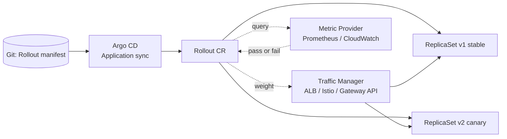
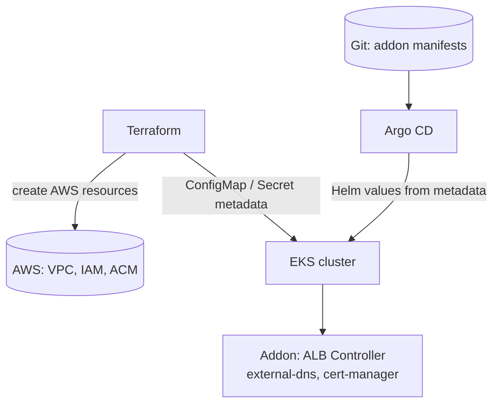

# ArgoCD Ecosystem Extensions

ArgoCD는 Git 상태와 클러스터 상태를 동기화하는 역할에 집중되어 있습니다. 그러나 실제 운영에서는 컨테이너 이미지 태그 업데이트, 점진적 배포, 클러스터 부트스트랩, 애플리케이션과 AWS 리소스의 결합 같은 요구가 뒤따릅니다. 이 문서는 ArgoCD 생태계에서 각 요구를 담당하는 확장 도구(Image Updater, Rollouts, GitOps Bridge, kro, ACK)와 이들을 조합했을 때 얻는 효과를 정리합니다.

## Argo CD Image Updater

순수 GitOps 흐름에서 컨테이너 이미지 태그를 바꾸려면 매번 PR을 열어 매니페스트의 태그를 수정해야 합니다. 이 수동 작업을 해소하는 도구가 [Argo CD Image Updater](https://argocd-image-updater.readthedocs.io/en/stable/)입니다. 이미지 레지스트리를 폴링하면서 업데이트 정책에 맞는 새 태그를 발견하면 Application 파라미터를 자동으로 변경하거나 Git 저장소에 직접 커밋합니다.

### Update Strategies

대상 이미지를 선정하는 네 가지 전략이 있습니다.

`semver`
:   Semantic Version 조건에 맞는 최신 버전으로 업데이트합니다. `~1.2` 같은 constraint을 지정해 범위를 제한합니다.

`newest-build`
:   최근 푸시된 태그를 선택합니다. 빌드 시간 기반이라 `v1.0.0`과 `v2.0.0`의 구분은 하지 않습니다.

`alphabetical`
:   태그를 알파벳 순으로 정렬해 마지막 값을 선택합니다. 날짜 형식 태그(`2026-04-13T18-32-35Z`)와 잘 맞습니다.

`digest`
:   mutable 태그(예: `latest`, `stable`)의 최신 digest로 업데이트합니다. 태그 이름은 유지하고 참조 digest만 갱신합니다.

### Write-back Modes

감지된 이미지 변경을 반영하는 방식은 두 가지입니다.

`ArgoCD API write-back`
:   Application의 `helm.parameters` 또는 `kustomize.images`를 직접 수정합니다. Git 저장소는 건드리지 않으므로 변경 이력이 ArgoCD에만 남습니다.

`Git write-back`
:   실제 Git 매니페스트 파일의 이미지 태그를 커밋합니다. 변경이 Git 이력에 남아 감사가 가능하고, Git을 단일 source of truth로 유지하는 GitOps 원칙에도 부합합니다.

ECR을 사용할 때는 토큰 수명이 12시간이라는 점을 고려해야 합니다. self-managed ArgoCD에서는 토큰을 주기적으로 갱신하는 sidecar나 CronJob이 필요합니다.

## Argo Rollouts

Kubernetes Deployment의 rolling update는 무중단 교체를 제공하지만 트래픽 비율 제어, 외부 메트릭 검증, 자동 롤백은 지원하지 않습니다. 이 공백을 채우는 컨트롤러가 [Argo Rollouts](https://argoproj.github.io/argo-rollouts/)입니다. `Rollout`이라는 별도 CRD로 Deployment를 대체하고, 더 정교한 배포 전략을 선언적으로 표현합니다.

### Deployment Strategies

Argo Rollouts는 두 가지 전략을 제공합니다.

| Aspect | Blue-Green | Canary |
|---|---|---|
| Complexity | Low | Medium to High |
| Flexibility | Low | High |
| Traffic manager | Not required | Optional, 트래픽 분할 시 권장 |
| Queue worker | Compatible | Partially compatible |
| Blast radius on failure | Large, 한 번에 전환 | Small, 단계별 노출 |

Blue-Green은 구 버전과 신 버전을 동시에 실행하면서 프로덕션 트래픽을 구 버전에 고정합니다. 검증이 끝나면 트래픽을 신 버전으로 한 번에 전환합니다. 반면 Canary는 신 버전에 소수 트래픽부터 보내고 메트릭 기반 판단에 따라 비율을 점진적으로 확대합니다.

### Traffic Management

Canary 전략을 제대로 사용하려면 트래픽 비율을 서비스 메시, ALB, Gateway API 같은 Layer 7 계층에서 제어해야 합니다. Argo Rollouts는 세 가지 provider와 통합됩니다.

`AWS ALB`
:   AWS Load Balancer Controller의 weighted target group 기능을 활용합니다.

`Istio`
:   VirtualService의 weight 필드를 조정해 트래픽을 분할합니다.

`Gateway API`
:   HTTPRoute의 backendRef weight를 조정합니다. Argo Rollouts 1.8에서 GA되었습니다.

Gateway API 경로는 CRD 기반 선언이라 이전 ingress annotation 방식보다 리뷰와 변경 추적이 쉽고, Week 5 Lab Scenario 1의 [Gateway API 전환 사례](../week5/5_lab.md)와 자연스럽게 이어집니다.

### Integration with ArgoCD

Argo Rollouts와 Argo CD는 각자의 CRD로 분리되어 있어 혼합 사용이 가능합니다. ApplicationSet이 tier별 Application을 생성하고, 각 Application 안에 Rollout 리소스를 넣으면 ArgoCD가 동기화만 담당하고 배포 전략은 Rollouts가 담당하는 구조가 됩니다.

메트릭 공급자의 판단으로 canary가 실패하면 Rollout은 자동으로 stable ReplicaSet으로 돌아갑니다. ArgoCD가 Git의 목표 상태를 다시 Sync하려 해도 Rollout이 내부 상태(canary progression)를 관리하므로 충돌하지 않습니다.

## GitOps Bridge

Terraform으로 EKS 클러스터를 만들면 클러스터 외부의 AWS 리소스(VPC 서브넷 ID, IAM Role ARN, ACM 인증서 ARN)가 먼저 생성되고, 클러스터 안에서 동작할 애드온(AWS Load Balancer Controller, external-dns, cert-manager 등)은 이 값을 Helm values로 받아야 합니다. Terraform provider로 Kubernetes 리소스까지 관리하려 하면, Terraform state 밖에서 발생한 변경이 state와 충돌하는 익숙한 문제가 나타납니다. [GitOps Bridge](https://github.com/gitops-bridge-dev/gitops-bridge)는 이 메타데이터 전달 문제를 IaC와 GitOps의 책임 경계를 명확히 나누는 방식으로 해결합니다.

동작 원리는 단순한 두 단계로 나뉩니다.

1. Terraform은 AWS 리소스만 생성하고, 결과 메타데이터를 ConfigMap이나 Secret 형태로 클러스터에 저장합니다.
2. ArgoCD(또는 Flux)가 애드온 Helm 차트를 배포할 때 이 메타데이터를 Helm values로 읽어 구성합니다.

이 분리로 Terraform은 AWS 인프라 경계에만 집중하고, ArgoCD는 클러스터 안의 모든 상태를 Git과 동기화하는 책임을 유지합니다. GitOps Bridge 프로젝트는 `terraform-aws-eks-blueprints`와 결합할 수 있도록 Terraform 모듈, ArgoCD 매니페스트, 애드온 ApplicationSet 템플릿을 한 묶음으로 제공합니다. [Hub-and-Spoke 멀티 클러스터 패턴](https://aws-ia.github.io/terraform-aws-eks-blueprints/patterns/gitops/gitops-multi-cluster-hub-spoke-argocd/)은 이 묶음을 확장해 단일 hub 클러스터의 ArgoCD가 여러 spoke 클러스터의 애드온과 워크로드를 관리하도록 구성합니다.

## kro

앱 하나를 실제 운영에 올리려면 Deployment, Service, Ingress 같은 Kubernetes 리소스와 IAM Role, DynamoDB 테이블, S3 버킷 같은 AWS 리소스가 함께 필요합니다. 개별 매니페스트를 따로 관리하면 버전 일관성이 깨지기 쉽습니다. [kro](https://docs.aws.amazon.com/eks/latest/userguide/kro.html)(Kube Resource Orchestrator)는 여러 리소스를 하나의 추상화로 묶어 새로운 Kubernetes API로 노출하는 프로젝트로, 이 문제를 플랫폼팀 관점에서 해결합니다[^kro-eks].

*[Source: Deep dive — Simplifying resource orchestration with Amazon EKS Capabilities](https://aws.amazon.com/blogs/containers/deep-dive-simplifying-resource-orchestration-with-amazon-eks-capabilities/)*

kro의 중심 개념은 `ResourceGraphDefinition`(RGD) CRD입니다. RGD 하나가 여러 리소스의 조합과 리소스 간 의존성을 선언하고, kro 컨트롤러가 이 정의로부터 새로운 CRD를 만들어 클러스터에 등록합니다. 사용자는 생성된 상위 CRD에 값만 채워 인스턴스를 만들면 kro가 하위 리소스를 자동으로 순서대로 프로비저닝합니다.

kro는 AWS 단독 프로젝트에서 시작해 현재는 AWS, Microsoft Azure, Google Cloud가 공동으로 개발하는 커뮤니티 프로젝트로 전환되었습니다. CNCF governance 가이드라인을 따르도록 이관 중이며, vendor-agnostic 설계로 어떤 Kubernetes CRD와도 결합할 수 있습니다.

### ACK와의 결합

kro RGD에 Kubernetes 리소스만 포함할 수도 있지만, AWS 리소스를 함께 다루려면 ACK(AWS Controllers for Kubernetes)와 결합합니다. AWS Containers Blog의 [DogsvsCats voting 애플리케이션 사례](https://aws.amazon.com/blogs/containers/deep-dive-simplifying-resource-orchestration-with-amazon-eks-capabilities/)는 이 결합을 보여줍니다.

*[Source: Deep dive — Simplifying resource orchestration with Amazon EKS Capabilities](https://aws.amazon.com/blogs/containers/deep-dive-simplifying-resource-orchestration-with-amazon-eks-capabilities/)*

RGD 하나가 다음 리소스를 한 번에 구성합니다.

- ACK로 생성되는 RDS PostgreSQL, ElastiCache Serverless Redis 인스턴스
- Vote, Result, Worker에 해당하는 Deployment, Service
- ALB Ingress

ArgoCD가 이 RGD 매니페스트를 동기화하면 애플리케이션 코드와 AWS 인프라가 단일 Git 저장소로 수렴합니다. [EKS Capabilities](2_argocd.md#eks-capabilities-as-a-set)가 ArgoCD, ACK, kro 세 기능을 묶어 제공하는 이유가 이 결합에 있습니다.

## ACK

kro가 리소스 조합을 추상화한다면, ACK는 개별 AWS 리소스 자체를 Kubernetes API로 다루는 컨트롤러 묶음입니다[^eks-ack]. AWS 서비스마다 전용 컨트롤러가 있어 S3 버킷, RDS 인스턴스, IAM Role 같은 리소스를 Kubernetes manifest로 선언하면 컨트롤러가 실제 AWS API를 호출해 프로비저닝합니다.

### IAM Configuration Patterns

ACK 사용 시 IAM 권한을 구성하는 두 패턴이 있습니다.

`Single Capability Role`
:   하나의 Role에 필요한 AWS 권한을 모두 부여합니다. 개발, 테스트 환경에 적합합니다.

`IAM Role Selectors`
:   네임스페이스 레이블에 맞춰 최소 권한 Role을 선택적으로 할당합니다. 멀티팀 클러스터와 멀티 계정 리소스 관리에 적합합니다.

ACK Capability가 사용하는 인증 경로는 Pod Identity 기반으로, 이는 [Week 4의 Pod Workload Identity](../week4/4_pod-workload-identity.md)에서 다룬 구조 위에서 동작합니다.

### Adopting Existing Resources

ACK의 특징은 이미 존재하는 AWS 리소스를 "adopt"할 수 있다는 점입니다. CloudFormation이나 Terraform으로 만든 리소스를 제로 다운타임으로 Kubernetes 리소스로 감싸 관리 주체를 이전합니다. 기존 IaC 도구에서 점진적 마이그레이션이 필요할 때 유용한 특징입니다.

### Deletion Policies

AWS 리소스와 Kubernetes 리소스의 수명을 분리하기 위한 두 가지 정책이 있습니다.

`Delete`
:   Kubernetes 리소스를 삭제하면 AWS 리소스도 함께 삭제됩니다.

`Retain`
:   Kubernetes 리소스를 삭제해도 AWS 리소스는 유지됩니다. 데이터베이스 같은 stateful 리소스에 안전한 선택입니다.

## Choosing the Right IaC Tool

AWS 리소스를 Kubernetes 안에서 다루는 도구가 여러 가지여서 선택이 헷갈릴 수 있습니다. 네 가지 대표 도구를 비교하면 다음과 같습니다.

| Tool | Scope | Language | Kubernetes integration | When to apply |
|---|---|---|---|---|
| Terraform | 범용 IaC | HCL | 외부 도구, Tofu Controller 경유 | 기존 IaC 표준 유지, 비 Kubernetes 리소스 비중이 큼 |
| ACK | AWS 리소스 | YAML (Kubernetes) | Native | AWS 리소스를 GitOps로 통합 관리 |
| kro | 리소스 조합 | YAML (Kubernetes) | Native | 플랫폼팀이 상위 추상화를 제공 |
| Crossplane | 멀티 클라우드 리소스 | YAML (Kubernetes) | Native | 여러 클라우드에 걸친 리소스 관리 |

선택의 출발점은 기존 IaC 자산과 팀 워크플로우입니다. Terraform이 이미 조직 표준이면 GitOps Bridge로 연동하는 편이 전환 비용이 낮고, 새로 시작하면서 EKS 중심이라면 ACK + kro 조합이 간단합니다. Crossplane은 멀티 클라우드 요구가 있을 때 검토합니다.

## Combining Extensions

개별 도구는 각자의 책임이 있지만, 실제 플랫폼에서는 이들을 결합해 사용합니다. 대표적인 조합은 다음과 같습니다.

- :material-rocket-launch: **Progressive Delivery Stack**

    ---
    Argo CD + Argo Rollouts + Image Updater.
    이미지 변경이 Git에 커밋되면 ArgoCD가 배포하고 Rollouts가 canary로 전환합니다.

- :material-hub-outline: **Multi-cluster Bootstrap**

    ---
    Terraform + GitOps Bridge + Argo CD.
    Terraform이 AWS 리소스만 생성하고 ArgoCD가 클러스터 내부를 책임집니다.

- :material-puzzle-outline: **Infra + App in One Git**

    ---
    Argo CD + kro + ACK.
    RGD 하나로 AWS 인프라와 Kubernetes 워크로드를 함께 배포합니다.

- :material-transit-connection-variant: **Event-driven Onboarding**

    ---
    Argo CD + Argo Workflows + Argo Events.
    SQS 메시지 하나로 테넌트 온보딩 전체가 자동 실행됩니다.

Event-driven Onboarding 조합은 [Event-Driven Workflows for SaaS Automation](4_argo-workflows.md) 문서에서 상세히 다룹니다.

[^kro-eks]: [Amazon EKS — Resource Composition with kro](https://docs.aws.amazon.com/eks/latest/userguide/kro.html)
[^eks-ack]: [Amazon EKS — ACK considerations](https://docs.aws.amazon.com/eks/latest/userguide/ack-considerations.html)
