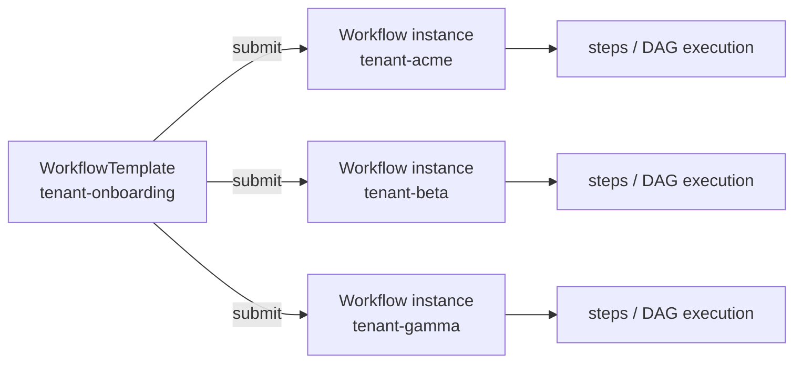
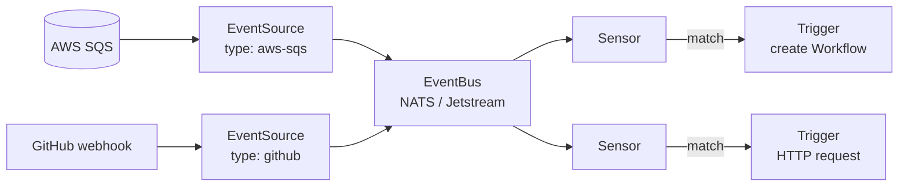
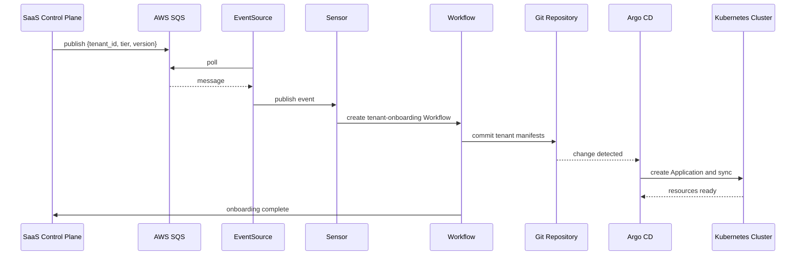

# Event-Driven Workflows for SaaS Automation

SaaS 테넌트 온보딩은 단일 변경이 아닙니다. 고객이 가입하면 네임스페이스 생성, AWS 리소스 프로비저닝, Git 커밋, 모니터링 설정 같은 여러 단계가 순서대로 실행되어야 하고, 고객이 떠나면 역순으로 정리되어야 합니다. ArgoCD는 지속 동기화 엔진이지 일회성 Job 실행기가 아니므로 단계적 작업을 위한 별도 도구가 필요합니다. Argo Workflows가 DAG 기반 Job 실행을, Argo Events가 외부 이벤트(SQS 메시지, GitHub webhook 등) 수신과 Workflow 트리거를 담당합니다. 이 문서는 두 도구의 구조와 SaaS 온보딩 자동화 흐름을 정리합니다.

## Argo Workflows vs Argo CD

두 도구 모두 Argo 프로젝트에 속하지만 해결하는 문제가 다릅니다.

| Aspect | Argo CD | Argo Workflows |
|---|---|---|
| Execution model | State convergence (지속 동기화) | Job DAG (일회성 실행) |
| Trigger | Git 변경, 주기적 reconciliation | 이벤트, 수동, 크론, API |
| State | Application health, sync | Workflow pending, running, succeeded, failed |
| Typical use | 선언적 애플리케이션 배포 | 테넌트 온보딩, CI 파이프라인, ML 파이프라인 |

ArgoCD는 클러스터 상태를 Git 정의와 일치하도록 지속적으로 수렴시키고, Argo Workflows는 요청된 단계적 작업을 일회성으로 실행합니다. 두 도구는 SaaS 테넌트 온보딩에서 결합해 동작합니다. Workflow가 테넌트 파일을 Git에 커밋하면, ArgoCD가 이 변경을 감지해 클러스터 상태를 실제로 반영합니다.

## Argo Workflows

[Argo Workflows](https://argo-workflows.readthedocs.io/en/latest/workflow-concepts/)의 중심 리소스는 `Workflow`입니다. 정적 정의이면서 동시에 실행 상태를 추적하는 live 객체로 다뤄집니다. Workflow는 여러 template의 조합이며, `entrypoint` 필드가 시작 template을 지정합니다.

### Template Types

Template은 실제 작업을 정의하는 definition과 다른 template을 호출하는 invocator로 나뉩니다.

`container`
:   Kubernetes Pod 스펙으로 정의된 컨테이너를 실행합니다. 기본 template 유형입니다.

`script`
:   컨테이너를 감싸 인라인 스크립트를 실행합니다. 간단한 bash, Python 로직에 적합합니다.

`resource`
:   Kubernetes 리소스를 직접 생성, 삭제, 패치합니다. Workflow 안에서 `kubectl apply`를 선언적으로 실행하는 구조입니다.

`suspend`
:   실행을 일시 정지합니다. 수동 승인 단계 구현에 활용됩니다.

`http`
:   HTTP 요청을 수행하는 가벼운 유형입니다. 외부 API 호출, webhook 전송에 사용됩니다.

`containerSet`
:   단일 Pod 안에서 여러 컨테이너를 함께 실행합니다. sidecar 스타일 작업에 활용됩니다.

`plugin`
:   Argo Workflows에 설치된 executor plugin을 호출합니다.

`steps`
:   여러 template을 순차 리스트로 실행합니다. 같은 step 안의 항목은 병렬 실행됩니다.

`dag`
:   Task 간 의존성을 그래프로 정의해 병렬과 순차를 혼합합니다. 복잡한 파이프라인에 적합합니다.

### WorkflowTemplate

Workflow를 매번 동일하게 실행하려면 `WorkflowTemplate`으로 재사용 가능한 정의를 만들어둡니다. 온보딩과 오프보딩 같은 반복 작업은 WorkflowTemplate으로 선언하고, 실제 실행은 이벤트마다 새 Workflow 인스턴스로 생성합니다.

## Argo Events

외부 시스템의 이벤트로 Workflow를 기동하려면 Argo Events가 필요합니다[^argo-events]. 이벤트 캡처와 Workflow 실행을 분리하고, 중간 전달 계층을 두어 소스와 소비자를 느슨하게 결합합니다.

### Four Layers

Argo Events는 네 계층으로 구성됩니다.

`EventSource`
:   외부 시스템에서 이벤트를 캡처합니다. AWS SQS, SNS, GitHub webhook, Kafka, NATS, Redis, Calendar, File system 등 25종 이상의 타입을 지원합니다.

`EventBus`
:   이벤트 라우팅과 분산을 담당하는 중앙 메시징 계층입니다. EventSource와 Sensor를 디커플링합니다.

`Sensor`
:   EventBus를 구독하면서 이벤트 조건을 평가합니다. 조건이 맞으면 Trigger를 활성화합니다.

`Trigger`
:   Sensor 조건 충족 시 실행되는 작업입니다. Workflow 생성, HTTP 호출, Kubernetes 리소스 생성 등이 가능합니다.

### SQS EventSource

AWS SQS를 이벤트 소스로 사용하는 경우, EventSource는 지정한 큐를 polling하다가 메시지가 도착하면 CloudEvents 형식으로 변환해 EventBus에 publish합니다[^sqs-eventsource]. 이벤트 payload는 `messageId`, `messageAttributes`, `body` 세 필드로 구성되고, Sensor는 `body`의 내용을 파싱해 조건을 평가하거나 Workflow parameter로 전달합니다.

SQS 큐에 대한 권한은 EventSource Pod에 부여합니다. Self-managed Kubernetes라면 access key를 Secret으로 전달하지만, EKS라면 [Week 4의 IRSA나 Pod Identity](../week4/4_pod-workload-identity.md)로 액세스 키 없이 역할 기반 권한을 부여하는 편이 안전합니다.

## Applying to Tenant Onboarding

지금까지 나온 개념을 SaaS 테넌트 온보딩 자동화에 결합하면 다음 흐름이 됩니다.

각 단계의 역할은 다음과 같습니다.

1. SaaS 제어 평면이 테넌트 메타데이터를 SQS 메시지로 발행합니다. `tenant_id`, `tenant_tier`, `release_version` 같은 필드가 포함됩니다.
2. EventSource가 큐를 polling해 메시지를 EventBus로 전달합니다.
3. Sensor가 이벤트 필드를 읽어 조건을 평가하고 WorkflowTemplate을 기반으로 새 Workflow를 생성합니다.
4. Workflow는 티어별 템플릿(Basic / Advanced / Premium)을 렌더링해 Git 저장소의 해당 경로에 파일을 커밋합니다.
5. ArgoCD의 ApplicationSet Git generator가 새 파일을 감지하고 해당 테넌트의 Application을 생성합니다.
6. ArgoCD는 Application의 매니페스트를 클러스터에 동기화해 네임스페이스, Deployment, Service, 필요한 AWS 리소스(ACK 또는 kro 경유)를 생성합니다.

이 구조의 이점은 책임 분리에 있습니다. Workflow는 템플릿 렌더링과 Git 커밋까지만 담당하고, 실제 클러스터 상태 관리는 ArgoCD가 맡습니다. Git의 파일이 테넌트의 source of truth가 되므로 롤백, 감사, 재배포가 모두 Git 이력을 통해 처리됩니다.

오프보딩은 같은 흐름의 역방향입니다. 별도 SQS 큐(또는 같은 큐의 다른 action 타입)가 Sensor를 트리거하면 Workflow가 해당 테넌트 파일을 Git에서 제거하고 커밋합니다. ArgoCD는 prune 정책에 따라 해당 Application과 리소스를 클러스터에서 제거합니다.

## Decision Guide

Week 6 문서 2에서 4까지 소개한 도구들은 각자 다른 책임을 가지며, 실제 플랫폼은 이들을 결합해 구성합니다. 어떤 요구에 어떤 도구를 쓸지 정리하면 다음과 같습니다.

| Need | Tool |
|---|---|
| 지속 동기화와 drift 복구 | Argo CD |
| 일회성 Job DAG 실행 | Argo Workflows |
| 외부 이벤트 수신과 트리거 | Argo Events |
| 컨테이너 이미지 태그 자동 반영 | Argo CD Image Updater |
| 점진적 배포와 자동 롤백 | Argo Rollouts |
| AWS 리소스 선언적 관리 | ACK 또는 Crossplane |
| 여러 리소스를 상위 추상화로 묶기 | kro |
| Terraform과 ArgoCD 부트스트랩 연결 | GitOps Bridge |

이 조합을 실제 Lab에서 구성해보는 단계는 별도 문서로 준비 중입니다. App-of-Apps로 애드온을 부트스트랩하고, ApplicationSet으로 3 tier 테넌트를 배포하며, Argo Workflows와 Argo Events로 이벤트 드리븐 온보딩을 재현하는 시나리오를 계획하고 있습니다.

[^argo-events]: [Argo Events — Architecture](https://argoproj.github.io/argo-events/concepts/architecture/)
[^sqs-eventsource]: [Argo Events — AWS SQS EventSource](https://argoproj.github.io/argo-events/eventsources/setup/aws-sqs/)
