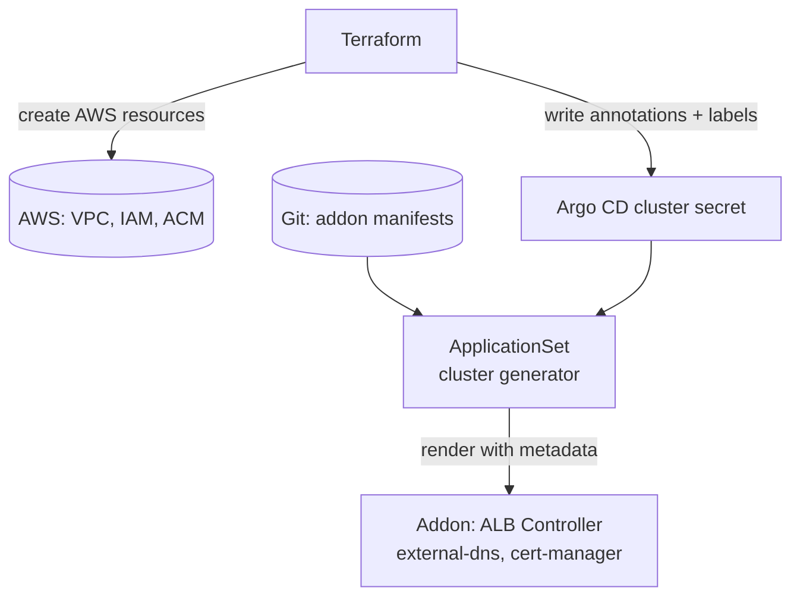

# AWS Integration Patterns

Argo CD로 EKS를 관리하면 곧바로 마주치는 문제는 "AWS 리소스를 어떻게 함께 다룰 것인가"입니다. Terraform이 만든 AWS 리소스의 메타데이터를 애드온 Helm values로 전달하는 **GitOps Bridge**, AWS 리소스 자체를 Kubernetes CRD로 노출하는 **ACK**, 여러 리소스를 상위 추상화로 묶는 **kro**가 이 문제를 각기 다른 방식으로 해결합니다. 이 문서는 세 가지 패턴을 정리하고, 네 가지 IaC 도구를 비교해 선택 기준을 제시합니다.

## GitOps Bridge

Terraform으로 EKS 클러스터를 만들면 클러스터 외부의 AWS 리소스(VPC 서브넷 ID, IAM Role ARN, ACM 인증서 ARN)가 먼저 생성되고, 클러스터 안에서 동작할 애드온(AWS Load Balancer Controller, external-dns, cert-manager 등)은 이 값을 Helm values로 받아야 합니다. Terraform provider로 Kubernetes 리소스까지 관리하려 하면, Terraform state 밖에서 발생한 변경이 state와 충돌하는 익숙한 문제가 나타납니다.

[GitOps Bridge](https://github.com/gitops-bridge-dev/gitops-bridge)는 이 메타데이터 전달 문제를 IaC와 GitOps의 책임 경계를 나누는 방식으로 정리한 커뮤니티 프로젝트입니다. AWS 공식 프로젝트는 아니며, AWS EKS Blueprints의 [ArgoCD Getting Started](https://aws-ia.github.io/terraform-aws-eks-blueprints/patterns/gitops/gitops-getting-started-argocd/)와 [Multi-Cluster Hub-Spoke](https://aws-ia.github.io/terraform-aws-eks-blueprints/patterns/gitops/gitops-multi-cluster-hub-spoke-argocd/) 튜토리얼에서 이 패턴을 적용한 예시로 소개합니다.

!!! quote "AWS EKS Blueprints — ArgoCD Getting Started"
    The GitOps Bridge Pattern enables Kubernetes administrators to utilize IaC and GitOps tools for deploying Kubernetes Addons and Workloads. ... The IaC tool stores this metadata either within GitOps resources in the cluster or in a Git repository. The GitOps tool then extracts these metadata values and passes them to the Helm chart during the Addon installation process. This mechanism forms the bridge between IaC and GitOps, hence the term "GitOps Bridge."

*[Source: GitOps Bridge Project](https://github.com/gitops-bridge-dev/gitops-bridge)*

동작 원리는 두 단계로 나뉩니다.

1. Terraform은 AWS 리소스를 생성한 뒤, 그 결과 메타데이터를 Argo CD의 cluster secret에 annotation과 label로 기록합니다. annotation은 Helm values로 전달할 값, label은 애드온 활성화 여부 플래그로 사용됩니다.
2. Argo CD `ApplicationSet`의 cluster generator가 이 annotation을 변수로 참조해 각 애드온 Helm 차트를 렌더링합니다.

이 분리로 Terraform은 AWS 인프라 경계에만 집중하고, Argo CD는 클러스터 안의 모든 상태를 Git과 동기화하는 책임을 유지합니다. GitOps Bridge 프로젝트는 `terraform-aws-eks-blueprints`와 결합할 수 있도록 Terraform 모듈, Argo CD 매니페스트, 애드온 ApplicationSet 템플릿을 한 묶음으로 제공합니다. [Hub-and-Spoke 멀티 클러스터 패턴](https://aws-ia.github.io/terraform-aws-eks-blueprints/patterns/gitops/gitops-multi-cluster-hub-spoke-argocd/)은 이 묶음을 확장해 단일 hub 클러스터의 Argo CD가 여러 spoke 클러스터의 애드온과 워크로드를 관리하도록 구성합니다.

GitOps Bridge가 유일한 선택은 아닙니다. EKS Blueprints 생태계 밖에서는 다음과 같은 전통적 방식이 여전히 흔합니다.

- Terraform의 `helm_release`로 애드온을 직접 설치하고, `values` 인자에 Terraform output을 주입합니다. 최초 부트스트랩은 단순하지만 이후 변경이 Argo CD 관리 경계 밖에 남습니다.
- Argo CD를 Terraform으로 최초 한 번만 설치하고 이후 App-of-Apps로 self-manage합니다. 애드온의 Helm values에 필요한 메타데이터는 CI 파이프라인이나 Secret 수동 정의로 주입합니다.

Terraform 자산이 많고 멀티 클러스터를 표준화해야 하는 조직은 GitOps Bridge 패턴이 적합하고, 단일 클러스터 중심 운영이라면 전통적 방식이 더 간단할 수 있습니다.

## kro

앱 하나를 실제 운영에 올리려면 Deployment, Service, Ingress 같은 Kubernetes 리소스와 IAM Role, DynamoDB 테이블, S3 버킷 같은 AWS 리소스가 함께 필요합니다. 개별 매니페스트를 따로 관리하면 버전 일관성이 깨지기 쉽습니다. [kro](https://docs.aws.amazon.com/eks/latest/userguide/kro.html)(Kube Resource Orchestrator)는 여러 리소스를 하나의 추상화로 묶어 새로운 Kubernetes API로 노출하는 프로젝트로, 이 문제를 플랫폼팀 관점에서 해결합니다[^kro-eks].

*[Source: Deep dive — Simplifying resource orchestration with Amazon EKS Capabilities](https://aws.amazon.com/blogs/containers/deep-dive-simplifying-resource-orchestration-with-amazon-eks-capabilities/)*

kro의 중심 개념은 `ResourceGraphDefinition`(RGD) CRD입니다. RGD 하나가 여러 리소스의 조합과 리소스 간 의존성을 선언하고, kro 컨트롤러가 이 정의로부터 새로운 CRD를 만들어 클러스터에 등록합니다. 사용자는 생성된 상위 CRD에 값만 채워 인스턴스를 만들면 kro가 하위 리소스를 자동으로 순서대로 프로비저닝합니다.

kro는 AWS 단독 프로젝트에서 시작해 현재는 AWS, Microsoft Azure, Google Cloud가 공동으로 개발하는 커뮤니티 프로젝트로 전환되었습니다. CNCF governance 가이드라인을 따르도록 이관 중이며, vendor-agnostic 설계로 어떤 Kubernetes CRD와도 결합할 수 있습니다.

### Integration with ACK

kro RGD에 Kubernetes 리소스만 포함할 수도 있지만, AWS 리소스를 함께 다루려면 ACK(AWS Controllers for Kubernetes)와 결합합니다.

*[Source: Deep dive — Simplifying resource orchestration with Amazon EKS Capabilities](https://aws.amazon.com/blogs/containers/deep-dive-simplifying-resource-orchestration-with-amazon-eks-capabilities/)*

RGD 하나가 다음 리소스를 한 번에 구성합니다.

- ACK로 생성되는 RDS PostgreSQL, ElastiCache Serverless Redis 인스턴스
- Vote, Result, Worker에 해당하는 Deployment, Service
- ALB Ingress

Argo CD가 이 RGD 매니페스트를 동기화하면 애플리케이션 코드와 AWS 인프라가 단일 Git 저장소로 수렴합니다. [EKS Capability for Argo CD](2_argocd.md#eks-capability-for-argo-cd)가 Argo CD, ACK, kro 세 기능을 묶어 제공하는 이유가 이 결합에 있습니다.

## ACK

kro가 리소스 조합을 추상화한다면, ACK는 개별 AWS 리소스 자체를 Kubernetes API로 다루는 컨트롤러 묶음입니다[^eks-ack]. AWS 서비스마다 전용 컨트롤러가 있어 S3 버킷, RDS 인스턴스, IAM Role 같은 리소스를 Kubernetes manifest로 선언하면 컨트롤러가 실제 AWS API를 호출해 프로비저닝합니다.

### IAM Configuration Patterns

ACK 사용 시 IAM 권한을 구성하는 두 패턴이 있습니다.

`Single Capability Role`
:   하나의 Role에 필요한 AWS 권한을 모두 부여합니다. 개발, 테스트 환경에 적합합니다.

`IAM Role Selectors`
:   네임스페이스 레이블에 맞춰 최소 권한 Role을 선택적으로 할당합니다. 멀티팀 클러스터와 멀티 계정 리소스 관리에 적합합니다.

EKS Capability for ACK은 Capability Role이라는 전용 IAM Role을 사용하고, 이 Role은 `capabilities.eks.amazonaws.com` 서비스 주체가 assume하는 trust policy를 가집니다. self-managed ACK가 사용하는 IRSA나 Pod Identity 기반 경로와는 별개이며, 인증 원리는 [Week 4의 Pod Workload Identity](../week4/4_pod-workload-identity.md)에서 다룬 assume-role 구조와 같은 맥락에 있습니다.

### Adopting Existing Resources

ACK의 특징은 이미 존재하는 AWS 리소스를 "adopt"할 수 있다는 점입니다. CloudFormation이나 Terraform으로 만든 리소스를 제로 다운타임으로 Kubernetes 리소스로 감싸 관리 주체를 이전합니다. 기존 IaC 도구에서 점진적 마이그레이션이 필요할 때 유용한 특징입니다.

### Deletion Policies

AWS 리소스와 Kubernetes 리소스의 수명을 분리하기 위한 두 가지 정책이 있습니다.

`Delete`
:   Kubernetes 리소스를 삭제하면 AWS 리소스도 함께 삭제됩니다.

`Retain`
:   Kubernetes 리소스를 삭제해도 AWS 리소스는 유지됩니다. 데이터베이스 같은 stateful 리소스에 안전한 선택입니다.

## Choosing the Right IaC Tool

AWS 리소스를 Kubernetes 안에서 다루는 도구가 여러 가지여서 선택이 헷갈릴 수 있습니다. 네 가지 대표 도구를 비교하면 다음과 같습니다.

| Tool | Scope | Language | Kubernetes integration | When to apply |
|---|---|---|---|---|
| Terraform | 범용 IaC | HCL | 클러스터 외부, GitOps Bridge로 메타데이터 전달 | 기존 IaC 표준 유지, Kubernetes 외부 리소스 비중이 큼 |
| ACK | AWS 리소스 | YAML (Kubernetes) | Native | AWS 리소스를 GitOps로 통합 관리 |
| kro | 리소스 조합 | YAML (Kubernetes) | Native | 플랫폼팀이 상위 추상화를 제공 |
| Crossplane | 멀티 클라우드 리소스 | YAML (Kubernetes) | Native | 여러 클라우드에 걸친 리소스 관리 |

선택의 출발점은 기존 IaC 자산과 팀 워크플로우입니다. Terraform이 이미 조직 표준이면 [GitOps Bridge](#gitops-bridge)로 연동하는 편이 전환 비용이 낮고, 새로 시작하면서 EKS 중심이라면 ACK와 kro 조합이 간단합니다. Crossplane은 멀티 클라우드 요구가 있을 때 검토합니다.

## Reference

AWS가 공개한 [sample-platform-engineering-on-eks](https://github.com/aws-samples/sample-platform-engineering-on-eks) 저장소는 EKS Auto Mode, 관리형 Argo CD, Argo Rollouts, ACK, ApplicationSet을 조합해 namespace 기반 멀티테넌시와 AWS 리소스 셀프 프로비저닝을 구현한 reference 구성을 코드로 보여줍니다. 프로덕션용은 아니지만, 위 조합이 실제 매니페스트 수준에서 어떻게 연결되는지 확인할 때 참고할 수 있습니다.

[^kro-eks]: [Amazon EKS — Resource Composition with kro](https://docs.aws.amazon.com/eks/latest/userguide/kro.html)
[^eks-ack]: [Amazon EKS — ACK considerations](https://docs.aws.amazon.com/eks/latest/userguide/ack-considerations.html)
