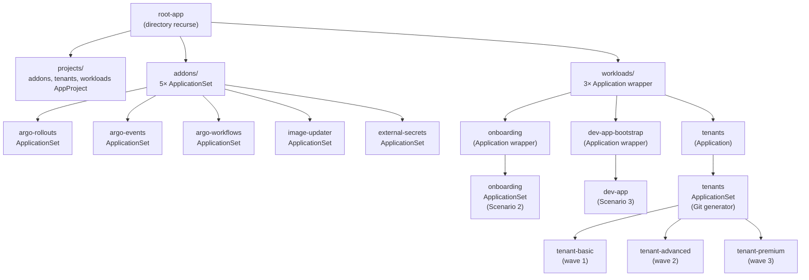
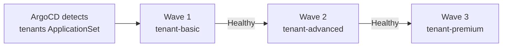
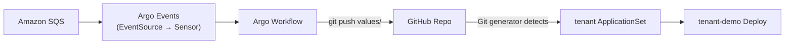
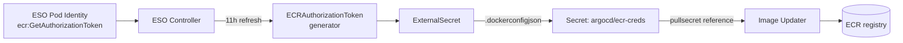

# Lab

실습 스크립트와 매니페스트는 [:octicons-mark-github-16: labs/week6/](https://github.com/pyy0715/eks-pratice/tree/main/labs/week6) 디렉터리를 참고하세요.

ArgoCD 로 EKS 클러스터를 GitOps 방식으로 운영합니다. self-managed ArgoCD 를 쓰고 Terraform 이 만든 정보를 [GitOps Bridge](https://github.com/gitops-bridge-dev/gitops-bridge) 패턴으로 ArgoCD 에 넘깁니다.

## Environment Setup

### How GitOps Bridge Works

[GitOps Bridge](https://github.com/gitops-bridge-dev/gitops-bridge) 는 Terraform 이 만든 AWS 리소스 정보(계정 ID, 리전, IRSA ARN, SQS URL 등)를 ArgoCD 가 GitOps 로 받아가는 패턴입니다. Terraform 이 cluster Secret 의 annotation 에 정보를 적어두면 ArgoCD 의 ApplicationSet cluster generator 가 이를 읽어 addon 과 워크로드를 배포합니다.


[공식 예제](https://github.com/gitops-bridge-dev/gitops-bridge/tree/main/argocd/iac/terraform/examples/eks/getting-started)는 `eks` + `eks_blueprints_addons` + `gitops_bridge_bootstrap` 세 모듈로 구성되고 Addons / Workloads repo 두 개를 분리합니다. 학습 목적상 다음과 같이 단순화했습니다.

| Component | Official Example | This Lab |
|-----------|------------------|----------|
| addon IRSA | `eks_blueprints_addons` 모듈이 일괄 생성 | `iam.tf` 에서 argo-rollouts, argo-events, image-updater 만 직접 작성 |
| ArgoCD 설치 + cluster Secret | `gitops_bridge_bootstrap` 모듈 | `gitops-bridge.tf` 한 파일에 `helm_release` + `kubernetes_secret` 직접 작성 |
| Git 저장소 | Addons repo + Workloads repo 분리 | 단일 repo 의 `01_bootstrap`, `02_tenants` 디렉터리 |

### Initialize GitOps Repository

ArgoCD 가 추적할 GitOps 저장소를 먼저 만들어야 합니다. cluster Secret 의 `addons_repo_url` annotation 이 이 저장소 URL 을 가리키므로 Terraform 보다 선행되어야 합니다.

```bash
cd labs/week6
gh repo create gitops-lab --public --clone
cp -r manifests gitops-lab/
cd gitops-lab
GH_USER=$(gh api user -q .login)
sed -i '' "s#CHANGE-ME/gitops-lab.git#${GH_USER}/gitops-lab.git#g" \
  manifests/01_bootstrap/root-app.yaml \
  manifests/01_bootstrap/workloads/tenants.yaml \
  manifests/01_bootstrap/workloads/onboarding.yaml \
  manifests/01_bootstrap/workloads/dev-app.yaml \
  manifests/02_tenants/appset-tenants.yaml \
  manifests/03_onboarding/appset-onboarding.yaml \
  manifests/03_onboarding/workflowtemplate-tenant-onboarding.yaml \
  manifests/04_image-updater/dev-app.yaml
git add manifests && git commit -m "bootstrap"
git branch -m main
git push --set-upstream origin main
cd ..
```

### Terraform Deploy

`terraform apply` 한 번으로 VPC 부터 ArgoCD, cluster Secret 까지 모두 생성됩니다. `TF_VAR_MyDomain` 과 `TF_VAR_GitOpsRepoURL` 은 `mise.toml` 에 정의되어 있어 별도 export 는 필요 없습니다.

```bash
terraform init
terraform apply
source 00_env.sh
```

### Configure kubectl

```bash
eval $(terraform output -raw configure_kubectl)
kubectl get nodes
kubectl -n argocd get pods
```

!!! info

    초기 admin 암호는 `argocd-initial-admin-secret` Secret 에 들어 있습니다. terraform output 으로 조회 명령을 받아 실행합니다.

    ```bash
    eval $(terraform output -raw argocd_initial_admin_secret)
    ```

### Inspect Cluster Secret

`terraform apply` 가 만들어 둔 in-cluster Secret 을 직접 확인합니다. 이 Secret 한 장에 GitOps Bridge 가 동작하는 정보가 모두 들어 있습니다.

```bash
kubectl -n argocd get secret in-cluster -o yaml
```

출력에서 영역별로 봐야 할 부분이 다릅니다.

=== "Identification"

    ArgoCD 가 이 Secret 을 등록된 클러스터로 인식하게 만드는 부분입니다.

    ```yaml
    metadata:
      name: in-cluster
      namespace: argocd
      labels:
        argocd.argoproj.io/secret-type: cluster   # (1)
    data:
      name: in-cluster                            # (2)
      server: https://kubernetes.default.svc      # (3)
    ```

    1. 이 라벨이 붙은 Secret 만 ArgoCD 가 클러스터로 취급합니다([공식 문서](https://argo-cd.readthedocs.io/en/stable/operator-manual/declarative-setup/#external-cluster-configuration)).
    2. Application 의 `destination.name` 에서 참조하는 식별자입니다.
    3. 자기 자신의 in-cluster endpoint 입니다. 외부 클러스터 등록이라면 원격 API URL 이 들어갑니다.

=== "Addon Selector (labels)"

    ApplicationSet cluster generator 의 `selector.matchLabels` 가 읽는 라벨입니다. 매칭된 클러스터에만 해당 addon Application 이 생성됩니다. 값이 `"true"` 또는 `"false"` 로 단순한 이유는 라벨 값에 `:` `/` 같은 문자를 못 쓰기 때문이고, URL 이나 ARN 같은 메타데이터는 다음 탭의 annotation 으로 분리됩니다.

    ```yaml
    metadata:
      labels:
        enable_argo_rollouts: "true"                 # (1)
        enable_argo_events: "true"                   # (2)
        enable_argo_workflows: "true"                # (3)
        enable_argocd_image_updater: "true"          # (4)
        enable_external_secrets: "true"              # (5)
        enable_aws_load_balancer_controller: "true"  # (6)
    ```

    1. `01_bootstrap/addons/argo-rollouts.yaml` 의 `selector.matchLabels` 가 매칭됩니다.
    2. `argo-events.yaml` 이 매칭됩니다.
    3. `argo-workflows.yaml` 이 매칭됩니다. Scenario 2 에서 Argo Events 와 함께 사용하므로 보통 같이 켜지만 라벨은 분리되어 있어 독립적으로 끌 수 있습니다.
    4. `argocd-image-updater.yaml` 이 매칭됩니다.
    5. `external-secrets.yaml` 이 매칭됩니다. Scenario 3 에서 ECR 토큰을 자동 갱신하기 위해 사용합니다.
    6. ArgoCD 로 LBC 를 관리할 경우의 스위치입니다. Scenario 4 에서 ALB 가 즉시 필요하므로 Terraform 의 `helm_release.aws_lbc` 로 미리 설치합니다.

=== "AWS Metadata (annotations)"

    Terraform 이 만든 동적 값을 ArgoCD 가 읽어 쓰는 영역입니다. ApplicationSet template 에서 `{{ metadata.annotations.<key> }}` 로 참조합니다.

    ```yaml
    metadata:
      annotations:
        aws_cluster_name: week6-argocd                              # (1)
        aws_region: ap-northeast-2                                  # (2)
        aws_account_id: "123456789012"                              # (3)
        aws_vpc_id: vpc-0abc...                                     # (4)
        tenant_onboarding_sqs: https://sqs.../tenant-onboarding     # (5)
        ecr_sample_app_repo: 123456789012.dkr.ecr.../sample-app     # (6)
        addons_repo_url: https://github.com/<user>/gitops-lab.git   # (7)
        addons_repo_revision: main                                  # (8)
    ```

    1. `module.eks.cluster_name`. addon Helm values 의 `clusterName` 으로 사용됩니다.
    2. `var.TargetRegion`. IRSA, ECR registry URL 조합에 사용됩니다.
    3. `data.aws_caller_identity.current.account_id`. ECR registry URL 조합에 사용됩니다.
    4. `module.vpc.vpc_id`. 일부 addon 이 VPC 식별에 사용합니다.
    5. `aws_sqs_queue.tenant_onboarding.url`. Scenario 2 EventSource 가 polling 합니다.
    6. `aws_ecr_repository.sample_app.repository_url`. Scenario 3 Image Updater 의 watch 대상입니다.
    7. `var.GitOpsRepoURL`. ApplicationSet 의 `repoURL` 로 사용됩니다.
    8. `var.GitOpsRepoRevision`. ApplicationSet 의 `targetRevision` 으로 사용됩니다.

여기까지 ArgoCD 가 빈 상태로 떠 있고 cluster Secret 에 GitOps Bridge 메타데이터가 채워진 상태입니다. 실제 Git 추적은 다음 Scenario 1 에서 root Application 을 적용하며 시작합니다.

---

## Scenario 1

[App-of-Apps 패턴](https://argo-cd.readthedocs.io/en/stable/operator-manual/cluster-bootstrapping/) 으로 클러스터 부트스트랩을 구성합니다. `root-app` Application 이 `projects/`, `addons/`, `tenants` 까지 선언하고 ArgoCD 가 자식 리소스를 재귀적으로 sync 하면 클러스터 상태 전체가 Git 단일 소스로 수렴합니다.

ApplicationSet 두 종류가 함께 등장합니다. addon 은 cluster generator 가 cluster Secret 의 label 을 보고 어느 클러스터에 배포할지 결정하고, tenant 는 Git generator 가 `values/*.yaml` 파일을 스캔해 파일당 Application 한 개를 만듭니다. tenant 쪽에는 sync-wave annotation 이 더해져 위험이 큰 premium tier 를 마지막 wave 로 미룹니다.

### Architecture



`root-app` 은 `manifests/01_bootstrap` 디렉터리를 재귀 스캔합니다. `directory.recurse: true` 설정으로 하위의 AppProject, ApplicationSet, Application 이 모두 자동 감지됩니다.

### Addon ApplicationSet

addon 은 cluster Secret 의 label 을 selector 로 사용합니다. 예를 들어 argo-rollouts ApplicationSet(`manifests/01_bootstrap/addons/argo-rollouts.yaml`) 은 다음과 같이 작동합니다.

```yaml hl_lines="7-9"
spec:
  generators:
    - clusters:
        selector:
          matchLabels:
            enable_argo_rollouts: "true"   # (1)
  template:
    metadata:
      name: argo-rollouts-{{name}}
      annotations:
        argocd.argoproj.io/sync-wave: "-10"  # (2)
```

1. Environment Setup 에서 Terraform 이 만든 `in-cluster` Secret 에 `enable_argo_rollouts: "true"` label 이 있어야 이 ApplicationSet 이 매치됩니다. label 이 없는 클러스터에서는 Application 이 생성되지 않습니다.
2. sync-wave `-10` 은 addon 이 tenant 워크로드보다 먼저 배포되도록 보장합니다. AppProject 는 wave `-20`, addon 은 `-10`, tenants 는 `0` 으로 설정해 세 단계로 나눕니다.

### Tenant ApplicationSet

`helm-tenant-chart` 는 Deployment와 Service 만 가진 chart 입니다. replica 수, resources, wave 는 tier 별 values 파일에서만 다르고, ApplicationSet 의 `git` generator 가 `values/*.yaml` 파일 하나당 Application 하나를 만듭니다.

```yaml hl_lines="5-8 13"
spec:
  goTemplate: true
  generators:
    - git:
        repoURL: https://github.com/...
        files:
          - path: manifests/02_tenants/values/*.yaml  # (1)
  template:
    metadata:
      name: 'tenant-{{ .tenant }}'
      annotations:
        argocd.argoproj.io/sync-wave: '{{ .wave }}'   # (2)
```

1. 이 경로의 모든 YAML 파일을 읽습니다. 각 파일의 최상위 키(`tenant`, `tier`, `wave`, `replicaCount` 등)가 template 에서 변수로 사용됩니다.
2. values 파일의 `wave` 값이 sync-wave annotation 으로 반영됩니다. ArgoCD 는 wave 번호가 낮은 Application 부터 동기화하므로, `wave: "1"` 인 basic 이 먼저, `wave: "3"` 인 premium 이 나중에 배포됩니다.

세 tier 의 values 파일이 가지는 차이는 다음과 같습니다.

`values/basic.yaml`
:   `replicaCount: 1`, `resources.requests.cpu: 50m`, `wave: "1"`

`values/advanced.yaml`
:   `replicaCount: 2`, `resources.requests.cpu: 100m`, `wave: "2"`

`values/premium.yaml`
:   `replicaCount: 3`, `resources.requests.cpu: 200m`, `wave: "3"`

staggered rollout 의 흐름을 그림으로 정리하면 다음과 같습니다.



각 wave 는 직전 wave 의 Application 이 `Healthy` 가 되어야 시작합니다. 어느 단계든 `Degraded` 로 멈추면 뒤따르는 wave 는 보류되어 premium 까지 도달하지 않습니다.

### Manifests

| Path | Role |
|------|------|
| `manifests/01_bootstrap/root-app.yaml` | **App-of-Apps 의 루트.** `01_bootstrap` 전체를 재귀 스캔하고 `exclude: root-app.yaml` 로 자기 자신 무한 루프를 피합니다. |
| `manifests/01_bootstrap/projects/addons.yaml` | **addon 용 AppProject.** cluster-wide 권한 전부 허용. CRD, ClusterRole 을 설치하는 argo-rollouts, argo-events 등이 들어갑니다. |
| `manifests/01_bootstrap/projects/tenants.yaml` | **tenant 용 AppProject.** destination 을 `tenant-*` namespace 로 제한하고 cluster-scoped 는 `Namespace` 만 허용. tenant 간 격리. |
| `manifests/01_bootstrap/projects/workloads.yaml` | **workload wrapper 용 AppProject.** wrapper Application 들이 argocd namespace 에 자식 Application/ApplicationSet 을 만들 수 있도록 cluster-wide 권한 허용. |
| `manifests/01_bootstrap/addons/` | **addon ApplicationSet 5개.** argo-rollouts, argo-events, argo-workflows, argocd-image-updater, external-secrets. 각 Helm chart source 와 version 이 명시되어 있습니다. |
| `manifests/01_bootstrap/workloads/` | **workload wrapper 3개.** tenants, onboarding, dev-app. 각각 `02_tenants`, `03_onboarding`, `04_image-updater` 디렉터리를 추적하는 Application 입니다. |
| `manifests/02_tenants/appset-tenants.yaml` | **tenant ApplicationSet.** Git generator 로 `values/*.yaml` 을 스캔해 tier 별 Application 을 생성합니다. |
| `manifests/02_tenants/values/{basic,advanced,premium}.yaml` | tier 별 values. `replicaCount`, `resources`, `wave` 가 여기서 결정됩니다. |

### Apply root Application

root Application 을 적용하면 ArgoCD 가 Git 추적을 시작하고 위 다이어그램의 자식 리소스가 차례로 생성됩니다.

```bash
kubectl apply -f gitops-lab/manifests/01_bootstrap/root-app.yaml
```

이후 ArgoCD 가 자동으로 다음을 수행합니다.

1. root Application 이 GitOps repo 의 `manifests/01_bootstrap` 디렉터리를 동기화합니다.
2. 하위의 AppProject (`projects/addons.yaml`, `projects/tenants.yaml`) 와 ApplicationSet (`addons/argo-rollouts.yaml` 등) 을 클러스터에 생성합니다.
3. 각 ApplicationSet 의 generator 가 자기 입력(cluster Secret label 또는 Git values 파일)을 읽어 매칭되는 만큼 Application 을 만듭니다.
4. 각 Application 이 자기 source(Helm chart, Git path) 를 sync 해 addon Pod 과 tenant Deployment 를 띄웁니다.

### Verification

전체 Application 이 `Synced / Healthy` 인지 확인합니다.

```bash
kubectl -n argocd get applications
```

addon Deployment 가 떠 있는지 확인합니다.

```bash
kubectl -n argo-rollouts get deploy argo-rollouts
kubectl -n argo-events get deploy argo-events-controller-manager
kubectl -n argo-workflows get deploy
kubectl -n argocd get deploy argocd-image-updater
```

tier 별 tenant 가 values 파일대로 배포됐는지 확인합니다.

```bash
# 세 tenant namespace 와 Deployment
kubectl get ns | grep tenant-
kubectl -n tenant-basic get deploy -o jsonpath='{.items[0].spec.template.spec.containers[0].resources}'
kubectl -n tenant-premium get deploy -o jsonpath='{.items[0].spec.template.spec.containers[0].resources}'

# 각 tenant Application 에 wave annotation 이 붙었는지, 동기화 시각이 wave 순서대로 차이가 나는지 확인
kubectl -n argocd get applications -l tier \
  -o custom-columns='NAME:.metadata.name,WAVE:.metadata.annotations.argocd\.argoproj\.io/sync-wave,SYNCED_AT:.status.operationState.finishedAt,HEALTH:.status.health.status'
```

??? bug "Troubleshooting"

    초기 적용에서 4개 addon Application 의 Sync 가 모두 `Unknown` 으로 멈췄습니다. application-controller 로그는 아래와 같이 나타났습니다.

    ```
    ComparisonError: Failed to compare desired state to live state: failed to calculate diff:
    error calculating structured merge diff: error building typed value from live resource:
    .status.terminatingReplicas: field not declared in schema
    ```

    원인은 두 가지였습니다.

    **(1) Schema mismatch**

    ArgoCD 는 빌드 시점에 박힌 K8s OpenAPI schema 로 desired/live 를 비교하는데, EKS 1.35 가 도입한 `Deployment.status.terminatingReplicas` 필드를 chart 7.7.7(app v2.13.x, K8s client `v0.31`) 이 몰라서 발생한 schema 버전 불일치였습니다. 가장 먼저 `argocd-helm-charts` 를 9.5.4 (app v3.3.8, K8s client `v0.34`) 로 업그레이드해 봤지만 client 가 1.34 까지만 지원하므로 같은 에러가 반복됐습니다. 1.35 지원은 [issue #25767](https://github.com/argoproj/argo-cd/issues/25767) 의 v3.5 milestone 으로 미출시입니다.

    [공식 FAQ](https://argo-cd.readthedocs.io/en/stable/faq/) 는 필요한 필드를 포함한 schema 가 들어간 ArgoCD 버전으로 업그레이드하라고 안내하지만 1.35 schema 가 아직 release 되지 않아 적용할 수 없습니다. 이를 우회하기 위해 `ServerSideApply=true` 가 schema 검증을 트리거하므로 이 옵션을 빼는 쪽을 선택했습니다.

    **(2) CRD `preserveUnknownFields` drift**

    ServerSideApply 를 끄자 4개 addon 중 3개는 정상화됐지만 argo-rollouts 만 `OutOfSync` 가 반복됐습니다. DIFF 탭에서 5개 CRD 모두 같은 한 줄 차이였습니다.

    ```diff
    - preserveUnknownFields: false
    ```

    `spec.preserveUnknownFields` 는 `apiextensions.k8s.io/v1` 에서 deprecated 되었고, schema 안의 `x-kubernetes-preserve-unknown-fields: true` 로 대체됐습니다. v1 CRD 에서 `true` 는 거부되고 `false` 는 기본값이라 K8s API server 가 응답에서 자동 생략하지만, argo-rollouts helm chart 는 desired manifest 에 여전히 `false` 를 명시해 둡니다.

    결과적으로 ArgoCD 가 매 reconcile 마다 같은 차이를 발견해 `OutOfSync` 가 반복되고, `Replace=true` 로 덮어써도 server 가 다음 응답에서 또 빼버려 무한 루프에 빠집니다. 근본적 해결은 chart 에서 필드를 제거하는 것이지만 upstream chart 를 수정 없이 사용하므로 `ignoreDifferences` 로 `/spec/preserveUnknownFields` 만 무시하는 [공식 권장 패턴](https://argo-cd.readthedocs.io/en/stable/user-guide/diffing/) 을 적용했습니다.

    **적용한 수정**

    | File | Change | Reason |
    |---|---|---|
    | `labs/week6/variables.tf` | `ArgoCDChartVersion`를 9.5.4로 지정 | 최신 fix 흡수 |
    | `manifests/01_bootstrap/addons/*.yaml` (4개) | `syncOptions` 에서 `ServerSideApply=true` 제거 | schema mismatch 회피 |
    | `manifests/01_bootstrap/addons/argo-rollouts.yaml` | `ignoreDifferences: /spec/preserveUnknownFields` 추가 | CRD 기본값 drift 회피 |

---

## Scenario 2

SQS 메시지로 새 tenant 를 자동 온보딩합니다. Argo Events 가 SQS 를 polling 해 Argo Workflow 를 실행하고, Workflow 가 values 파일을 Git 에 커밋하면 Scenario 1 의 tenant ApplicationSet Git generator 가 나머지를 처리합니다.

Workflow 는 Kubernetes 리소스를 직접 만들지 않고 Git 에 values 파일만 커밋합니다. ArgoCD reconciliation 루프 안에서 온보딩이 끝나고 Git history 가 그대로 audit log 역할을 합니다.

### Event-Driven Onboarding Architecture

Argo Events 자체는 EventSource → EventBus → Sensor 구조로 Workflow 와 Git 커밋 단계를 더해 SQS 메시지가 ArgoCD Application 까지 이어집니다.



### Manifests

| Path | Role |
|------|------|
| `manifests/01_bootstrap/workloads/onboarding.yaml` | **wrapper Application.** `03_onboarding` 의 ApplicationSet 만 추적해서 GitOps 부트스트랩 흐름에 합류시킵니다. |
| `manifests/03_onboarding/appset-onboarding.yaml` | **ApplicationSet (cluster generator).** `enable_argo_events: "true"` 라벨이 붙은 클러스터에 03_onboarding 디렉터리 전체를 sync 합니다 (자기 자신은 exclude). |
| `manifests/03_onboarding/rbac.yaml` | `argo-events-sa` ServiceAccount 와 Workflow 생성에 필요한 Role/RoleBinding. Pod Identity 는 이 SA 에 SQS 권한을 매핑합니다. |
| `manifests/03_onboarding/eventbus.yaml` | JetStream 기반 EventBus. EventSource → Sensor 메시지 전달 통로입니다. |
| `manifests/03_onboarding/eventsource-sqs.yaml` | Pod Identity(`iam.tf` 의 `argo_events_pod_identity`) 로 SQS 를 polling 합니다. `waitTimeSeconds: 20` 은 long polling 으로 API 호출 수를 줄입니다. |
| `manifests/03_onboarding/sensor-tenant-onboarding.yaml` | 메시지 body 의 `tenant_id`, `tier` 필드를 WorkflowTemplate 파라미터로 매핑합니다. |
| `manifests/03_onboarding/workflowtemplate-tenant-onboarding.yaml` | `alpine/git` 컨테이너로 Git clone → values YAML 생성 → commit → push 를 단일 step 으로 수행합니다. tier 값에 따라 wave 를 자동 할당합니다. |

### Deploy

EventBus, EventSource, Sensor, WorkflowTemplate, RBAC 은 모두 `01_bootstrap/workloads/onboarding.yaml` Application 으로 ArgoCD 가 자동 sync 합니다. 사용자가 수동으로 처리할 단계는 `github-push-token` Secret 등록과 SQS 메시지 발행입니다.

```bash
# 1) GitHub push 권한 토큰을 Secret 으로 등록
export GITHUB_TOKEN=$(gh auth token)
kubectl -n argo-events create secret generic github-push-token \
  --from-literal=token="$GITHUB_TOKEN"

# 2) ArgoCD 가 onboarding Application 을 sync 했는지 확인
kubectl -n argocd get application onboarding
kubectl -n argo-events get eventsource,sensor,workflowtemplate

# 3) SQS 에 온보딩 메시지 발행
aws sqs send-message --queue-url "$TENANT_SQS_URL" \
  --message-body '{"tenant_id":"demo","tier":"basic"}'

# 4) Workflow 실행 관찰
kubectl -n argo-events get workflows -w
```

!!! info "What happens next"

    Workflow 가 `Succeeded` 로 끝나면 GitOps 저장소에 `manifests/02_tenants/values/demo.yaml` 이 새로 커밋됩니다. Scenario 1 의 tenants ApplicationSet 이 Git generator 로 이 디렉터리를 스캔하므로 잠시 뒤 `tenant-demo` Application 과 Deployment 가 자동 생성됩니다.

### Verification

```bash
# Workflow 완료 확인
kubectl -n argo-events get workflows
WF=$(kubectl -n argo-events get wf -o jsonpath='{.items[0].metadata.name}')
kubectl -n argo-events logs "$WF" --all-containers

# Git 저장소에 새 values 파일이 생겼는지 확인
gh api "repos/$GH_USER/gitops-lab/contents/manifests/02_tenants/values/demo.yaml" | jq .name

# ApplicationSet 이 tenant-demo Application 을 생성했는지 확인
kubectl -n argocd get application tenant-demo
kubectl -n tenant-demo get deploy
```

---

## Scenario 3

컨테이너 이미지가 새로 빌드될 때마다 매니페스트를 수정해 커밋하는 일은 번거롭습니다. [Argo CD Image Updater](https://argocd-image-updater.readthedocs.io/en/stable/) 는 이미지 레지스트리를 watch 하다가 새 태그를 발견하면 매니페스트를 자동 갱신합니다.

write-back 모드는 두 가지입니다. 

- `argocd` 모드는 ArgoCD Application 의 parameter override 만 바꿔서 즉시 반영되지만 Git 에는 흔적이 남지 않습니다. 
- `git` 모드는 매니페스트 파일에 커밋을 남기므로 변경 이력이 Git history 로 추적되어 GitOps 원칙에 부합합니다.

여기서는 `git` 모드를 사용합니다.

### ECR Authentication

ECR 토큰은 12시간마다 만료되고 Image Updater 컨테이너에는 `aws` CLI 가 들어 있지 않으므로 자체적으로 토큰을 갱신할 수 없습니다. [공식 issue #112](https://github.com/argoproj-labs/argocd-image-updater/issues/112) 와 [#1367](https://github.com/argoproj-labs/argocd-image-updater/issues/1367) 에서 권장되는 패턴은 [External Secrets Operator (ESO)](https://external-secrets.io/) 가 Pod Identity 로 ECR 토큰을 받아 docker-registry Secret 으로 변환해 두고, Image Updater 가 그 Secret 을 참조하는 방식입니다.



`refreshInterval: 8h` 로 설정해 12시간 만료 전에 두 번 갱신하므로 만료 직전에 실패하지 않습니다. ECR 매니페스트는 `manifests/04_image-updater/ecr-auth.yaml` 에 정의돼 있습니다.

### Application Annotations

Image Updater 는 Application 의 annotation 에서 watch 대상과 정책을 읽습니다.

```yaml
metadata:
  name: dev-app
  annotations:
    # (1)!
    argocd-image-updater.argoproj.io/image-list: app=ACCOUNT_ID.dkr.ecr.REGION.amazonaws.com/week6-argocd/sample-app
    argocd-image-updater.argoproj.io/app.update-strategy: latest # (2)!
    argocd-image-updater.argoproj.io/write-back-method: git # (3)!
    argocd-image-updater.argoproj.io/git-branch: main # (4)!
```

1. `app=` 뒤의 별칭이 Deployment 의 container 이름과 매칭됩니다. `ACCOUNT_ID` 와 `REGION` 은 setup 시 치환해야 합니다.
2. `latest` 전략은 가장 최근 생성된 태그를 선택합니다. `semver`, `name`, `digest` 도 가능합니다.
3. `git` write-back 은 새 태그를 Git 에 커밋합니다. 커밋 메시지에 이전/새 태그가 포함됩니다.
4. write-back 커밋이 푸시될 브랜치입니다. 별도 브랜치로 분리해 PR 검토를 강제하는 운영 패턴도 가능합니다.

### Deploy

`04_image-updater` 매니페스트의 ECR registry URL 은 `ACCOUNT_ID` 와 `REGION` placeholder 로 비워져 있습니다. 환경 변수로 치환한 뒤 커밋해 GitOps 저장소에 반영하고, ECR 에는 nginx 샘플 이미지를 v1 태그로 올립니다.

**1) GitOps 저장소: placeholder 치환 후 push**

```bash
cd gitops-lab
git pull

sed -i '' "s#ACCOUNT_ID#${ACCOUNT_ID}#g; s#REGION#${AWS_REGION}#g" \
  manifests/04_image-updater/dev-app.yaml \
  manifests/04_image-updater/dev-app/deployment.yaml \
  manifests/04_image-updater/dev-app/kustomization.yaml \
  manifests/04_image-updater/ecr-auth.yaml

git add manifests/04_image-updater
git commit -m "image updater" && git push
```

**2) ECR: public nginx 이미지를 v1 태그로 복사**

```bash
cd ..
aws ecr get-login-password --region "$AWS_REGION" \
  | docker login --username AWS --password-stdin "$SAMPLE_APP_ECR"

# EKS 노드는 amd64 이므로 platform 을 명시해 ARM Mac 에서 받아도 amd64 layer 가 push 됩니다.
docker pull --platform=linux/amd64 public.ecr.aws/nginx/nginx:1.27
docker tag public.ecr.aws/nginx/nginx:1.27 "${SAMPLE_APP_ECR}:v1"
docker push "${SAMPLE_APP_ECR}:v1"
```

**3) ArgoCD: GitOps 저장소 write 자격증명 등록**

Image Updater 가 새 태그를 감지하면 GitOps 저장소에 직접 commit 합니다. ArgoCD 가 사용할 GitHub PAT 를 Repository Secret 으로 등록합니다 ([공식 문서](https://argo-cd.readthedocs.io/en/stable/operator-manual/declarative-setup/#repositories)).

```bash
GH_USER=$(gh api user -q .login)
kubectl -n argocd create secret generic gitops-lab-creds \
  --from-literal=type=git \
  --from-literal=url="${GitOpsRepoURL}" \
  --from-literal=username="${GH_USER}" \
  --from-literal=password="$(gh auth token)"

kubectl -n argocd label secret gitops-lab-creds \
  argocd.argoproj.io/secret-type=repository
```

!!! info "Why Kustomize"

    Image Updater 의 `git` write-back 모드는 source 가 Helm 또는 Kustomize 일 때만 동작합니다. plain Directory 타입은 이미지 태그를 어디에 어떻게 써야 할지 추론할 수 없어 `skipping ... not of supported source type` 경고로 건너뜁니다. dev-app 은 `kustomization.yaml` 의 `images:` 항목으로 태그를 노출해 Image Updater 가 이 값을 갱신하도록 합니다.

### Verification

v2 태그를 push 한 뒤 Image Updater 가 이를 감지해 Git 에 커밋하는지 확인합니다.

```bash
# 새 태그 v2 로 동일 이미지를 한 번 더 푸시 (Image Updater 가 변화로 인식)
docker tag public.ecr.aws/nginx/nginx:1.27 "${SAMPLE_APP_ECR}:v2"
docker push "${SAMPLE_APP_ECR}:v2"

# Image Updater 로그에서 반영 확인
kubectl -n argocd logs deploy/argocd-image-updater --tail=100 | grep -i "dev-app"

# Git 에 자동 커밋이 생성되었는지 확인
git -C gitops-lab log --oneline manifests/04_image-updater | head -5

# Deployment 의 image 태그가 v2 로 변경되었는지 확인
kubectl -n dev-app get deploy dev-app \
  -o jsonpath='{.spec.template.spec.containers[0].image}'
```

---

## Scenario 4

Deployment rolling update 는 트래픽 비율 제어와 자동 롤백이 없습니다. [Argo Rollouts](https://argoproj.github.io/argo-rollouts/) 는 traffic routing(ALB / Gateway API), Analysis, 자동 rollback 세 가지를 더해 줍니다.

여기서는 ALB trafficRouting + Job provider AnalysisTemplate 으로 합니다. [Analysis 문서](https://argoproj.github.io/argo-rollouts/features/analysis/) 가 Prometheus, Datadog, Web, Job 등 다양한 provider 를 지원하는데, Prometheus 를 띄우지 않고 `curl -fsS` 만으로 자동 롤백을 보이려고 Job 을 골랐습니다.

### Rollout Canary Steps

```yaml hl_lines="3-12 13-17"
spec:
  strategy:
    canary:
      canaryService: canary-demo-canary       # (1)
      stableService: canary-demo-stable
      trafficRouting:
        alb:
          ingress: canary-demo                # (2)
          servicePort: 80
      steps:
        - setWeight: 20                       # (3)
        - pause: {duration: 30s}
        - analysis:                           # (4)
            templates:
              - templateName: healthz-web
        - setWeight: 50
        - pause: {duration: 30s}
        - setWeight: 100
```

1. Rollout 이 관리하는 두 Service. ALB 가 이 Service 들을 target group 으로 사용해 트래픽 비율을 조정합니다.
2. ALB Ingress 이름. Rollout 이 이 Ingress 의 annotation 을 수정해 canary 가중치를 반영합니다.
3. `setWeight: 20` 은 ALB 의 canary target group 으로 20% 트래픽을 보냅니다.
4. AnalysisTemplate 이 지정되면 canary Service 의 healthz 를 검증합니다. 실패 시 Rollout 이 abort 되고 stable 로 복귀합니다.

### AnalysisTemplate (Job Provider)

```yaml hl_lines="5-7 11-12"
spec:
  args:
    - name: canary-service
  metrics:
    - name: canary-healthz
      interval: 10s         # (1)
      count: 5              # (2)
      successCondition: result == "ok"
      failureLimit: 2       # (3)
      provider:
        job:
          spec:
            containers:
              - name: probe
                image: curlimages/curl:8.10.1
                command: [sh, -c]
                args:
                  - >
                    curl --max-time 5 -fsS                   # (4)
                    "http://{{args.canary-service}}.rollouts-demo.svc/"
                    >/dev/null && echo ok
```

1. 10초 간격으로 검증 Job 을 반복 실행합니다.
2. 총 5 회 실행합니다. 5 회 모두 완료되어야 AnalysisRun 이 종료됩니다.
3. 2 회 실패까지는 허용합니다. 3 회 실패하면 AnalysisRun 이 `Failed` 로 종료되고 Rollout 이 abort 됩니다.
4. `curl -fsS` 는 HTTP 4xx/5xx 시 non-zero exit code 를 반환합니다. `>/dev/null` 로 body 를 버리고 성공 시에만 `echo ok` 를 출력합니다.

### Deploy

```bash
# 1) namespace 와 모든 리소스 배포
kubectl apply -f manifests/05_rollouts/namespace.yaml
kubectl apply -f manifests/05_rollouts/

# 2) Rollout 상태 관찰
kubectl argo rollouts get rollout canary-demo -n rollouts-demo --watch

# 3) 새 이미지로 카나리 트리거
kubectl argo rollouts set image canary-demo -n rollouts-demo \
  app=argoproj/rollouts-demo:yellow
```

**성공 케이스.** `yellow` 이미지는 정상 응답하므로 Analysis 가 통과하고 20% → 50% → 100% 로 자동 promote 됩니다.

**실패 케이스.** 존재하지 않는 이미지로 교체하면 Pod 이 CrashLoopBackOff 에 빠지고, healthz Job 이 연속 실패해 AnalysisRun 이 `Failed` 로 종료됩니다. Rollout 이 자동으로 stable(blue) 이미지로 복귀합니다.

```bash
# 실패 유도
kubectl argo rollouts set image canary-demo -n rollouts-demo \
  app=argoproj/rollouts-demo:bad

# 롤백 관찰
kubectl argo rollouts get rollout canary-demo -n rollouts-demo
```

### Verification

```bash
# Rollout 전체 상태
kubectl argo rollouts get rollout canary-demo -n rollouts-demo

# AnalysisRun 결과
kubectl -n rollouts-demo get analysisrun
kubectl -n rollouts-demo logs job/canary-demo-canary-healthz-*

# ALB target group 가중치 확인
aws elbv2 describe-target-groups --query \
  "TargetGroups[?contains(TargetGroupName, 'canary')].{Name:TargetGroupName, Port:Port}"
```

---

## Notes

- self-managed ArgoCD 를 쓴 건 controller 로그, `argocd admin/login` 같은 디버깅 수단이 다 열려 있어야 학습이 편해서입니다. EKS Capability 는 이런 게 막혀 있고 GitOps Bridge / Autopilot 과 안 맞습니다.
- GitOps Bridge 의 2단계 흐름(Terraform → cluster Secret metadata → ArgoCD 가 읽어감)만 남기고 helm 수동 설치 같은 두 번째 경로는 뺐습니다.
- argo-rollouts, argo-events, image-updater 도 Application 으로 선언했습니다. addon 까지 GitOps 로 관리해야 [App-of-Apps 문서](https://argo-cd.readthedocs.io/en/stable/operator-manual/cluster-bootstrapping/) 에서 말하는 cluster bootstrapping 이 됩니다.
- Analysis 는 Prometheus stack 띄우기 부담스러워서 Job provider 로 갔습니다. 운영에서는 Prometheus 나 CloudWatch 가 더 적합합니다.
- Hub & Spoke([예제](https://github.com/aws-ia/terraform-aws-eks-blueprints/tree/main/patterns/gitops/multi-cluster-hub-spoke-argocd)) 도 cluster Secret metadata 메커니즘은 동일합니다. 다음 단계로 살펴볼 만합니다.
- ApplicationSet 의 `ServerSideApply=true` 제거와 argo-rollouts 의 `ignoreDifferences: /spec/preserveUnknownFields` 는 EKS 1.35 와 ArgoCD 9.5.4 의 schema 격차에서 비롯된 우회입니다. 추적 과정은 Scenario 1 의 Troubleshooting 토글을 참고하세요.

---

## Teardown

```bash
./scripts/99_teardown.sh
```

ApplicationSet / Application / Ingress / Rollout 부터 지워 ALB 를 떨어뜨린 뒤 ArgoCD, LBC 를 helm uninstall 하고 `terraform destroy` 까지 가는 순서입니다. 온보딩으로 생긴 values 파일(`manifests/02_tenants/values/*.yaml`)은 흔적 보존을 위해 그대로 둡니다.

---
