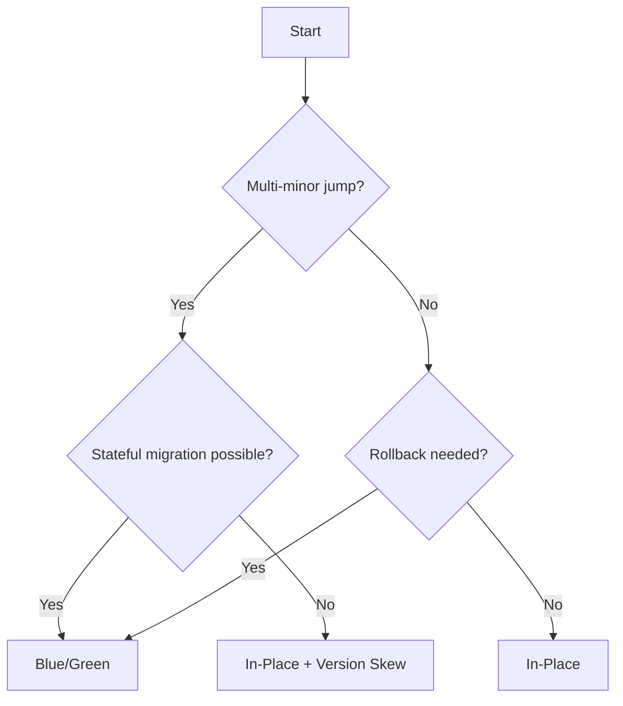

# Upgrade Strategies

EKS 클러스터 업그레이드 전략은 크게 In-Place와 Blue/Green으로 나뉩니다. 이 문서에서는 두 전략의 장단점을 비교하고, Version Skew를 활용한 점진적 업그레이드 방법, 그리고 Data Plane 업그레이드 중 워크로드 가용성을 보장하는 PDB 구성을 다룹니다.

---

## In-Place vs Blue/Green

**In-Place** — 기존 클러스터 내에서 Control Plane → Add-on → Data Plane을 순차적으로 업그레이드합니다. 기존 리소스와 API endpoint를 유지하므로 외부 통합 변경이 적고, Stateful 워크로드의 데이터 마이그레이션이 불필요합니다. 다만 한 번에 1 minor 버전만 올릴 수 있고, Control Plane 업그레이드 후에는 롤백할 수 없습니다.

**Blue/Green** — 새 클러스터(green)를 생성하고 워크로드를 이관한 뒤, 트래픽을 전환하고 구 클러스터(blue)를 폐기합니다. 여러 minor 버전을 한 번에 점프할 수 있고, 구 클러스터로 즉시 롤백이 가능합니다. 다만 API endpoint, OIDC provider가 변경되어 소비자 업데이트가 필요하고, 병행 운영 비용이 발생합니다.

| Factor | In-Place | Blue/Green |
|--------|----------|------------|
| Version gap | 1 minor씩 순차 | 여러 minor 한 번에 가능 |
| Rollback | CP 롤백 불가 | 트래픽 전환으로 즉시 롤백 |
| Cost | 추가 비용 없음 | 병행 클러스터 운영 비용 |
| Stateful workloads | 마이그레이션 불필요 | 데이터 동기화 필요 |
| API endpoint | 변경 없음 | 변경됨 (소비자 업데이트 필요) |
| Downtime risk | 세밀한 계획 필요 | green 검증 후 전환 |
| Team expertise | 단일 클러스터 운영 | 다중 클러스터 + 트래픽 관리 |

---

## Incremental Upgrade with Version Skew

여러 버전 뒤처진 클러스터를 운영하는 경우, Kubernetes의 version skew 정책을 활용할 수 있습니다. Control Plane만 먼저 순차적으로 올리고, worker node 업그레이드는 skew 한도에 도달할 때까지 지연시키는 방식입니다.

Kubernetes 1.28 이전에는 Control Plane이 worker node보다 최대 **n-2**까지 앞설 수 있었으나, Kubernetes 1.28부터 kubelet과 API server 간 지원 skew가 **n-3**으로 확장되었습니다[^1][^2].

| Phase | Step | Control Plane | Node | Skew |
|-------|------|---------------|------|------|
| Control Plane 업그레이드 | 1 | 1.30 → 1.31 | 1.30 | 1 |
| | 2 | 1.31 → 1.32 | 1.30 | 2 |
| | 3 | 1.32 → 1.33 | 1.30 | 3 (한도) |
| Node 업그레이드 | 4 | 1.33 | 1.30 → 1.31 | 2 |
| | 5 | 1.33 | 1.31 → 1.32 | 1 |
| | 6 | 1.33 | 1.32 → 1.33 | 0 |
| 반복 | 7 | 1.33 → 1.34 | 1.33 | 1 |

1. Control Plane을 다음 minor 버전으로 업그레이드합니다 (node은 유지).
2. skew 한도(Kubernetes 1.28+ 기준 3 minor) 내에서 Control Plane을 계속 업그레이드합니다.
3. skew 한도에 도달하면 worker node을 skew 범위 내 버전으로 업그레이드합니다.
4. 목표 버전까지 1~3을 반복합니다.

여러 버전 뒤처진 클러스터를 점진적으로 따라잡거나, 복잡한 stateful 워크로드로 인해 node 업그레이드 빈도를 줄여야 할 때 적합합니다.

!!! warning "Version Skew Limitations"

    일부 Kubernetes 기능과 성능 개선은 worker node이 업그레이드되기 전까지 완전히 사용할 수 없습니다. 또한 여러 버전을 한 번에 건너뛴 node 업그레이드는 호환성 테스트를 철저히 수행해야 합니다.

---

## PodDisruptionBudget for Upgrade Availability

Data Plane 업그레이드 중 node이 drain될 때, PodDisruptionBudget(PDB)은 최소 가용 Pod 수를 보장하여 워크로드 중단을 방지합니다. `minAvailable` 또는 `maxUnavailable`을 지정하면 voluntary disruption(node drain, 업그레이드 등) 시 한 번에 종료할 수 있는 Pod 수가 제한됩니다. TopologySpreadConstraints와 함께 사용하면 여러 AZ에 걸친 워크로드 분산도 유지할 수 있습니다.

orders 서비스에 `minAvailable: 1` PDB를 적용해 봅니다. replica 1개와 `minAvailable: 1`을 조합하면, drain 시 최소 1개 Pod는 유지해야 하므로 사실상 eviction이 차단됩니다. 이 동작을 직접 확인합니다.

```yaml
apiVersion: policy/v1
kind: PodDisruptionBudget
metadata:
  name: orders-pdb
  namespace: orders
spec:
  minAvailable: 1
  selector:
    matchLabels:
      app.kubernetes.io/component: service
      app.kubernetes.io/instance: orders
      app.kubernetes.io/name: orders
```

위 매니페스트를 `apps/orders/pdb.yaml`로 저장하고 kustomization에 등록한 뒤, GitOps repo에 push하면 Argo CD가 자동으로 sync합니다.

### Verification

node을 drain하여 PDB가 eviction을 차단하는지 확인합니다.

```bash
nodeName=$(kubectl get pods \
  -l app.kubernetes.io/instance=orders \
  -n orders -o jsonpath="{.items[0].spec.nodeName}")

kubectl drain "$nodeName" --ignore-daemonsets --force --delete-emptydir-data
```

replica가 1이고 `minAvailable: 1`이면 eviction이 거부됩니다.

```
Cannot evict pod as it would violate the pod's disruption budget.
```

검증 후 node을 복원합니다.

```bash
kubectl uncordon "$nodeName"
```

!!! tip "PDB and Blue/Green MNG"

    Blue/Green 방식으로 MNG를 교체할 때, PDB `minAvailable` 값 이상의 replica가 실행 중이어야 구 node group을 삭제할 수 있습니다. 예를 들어 `minAvailable: 1`이고 replica가 1이면 drain이 차단됩니다. 이 경우 replica를 2 이상으로 먼저 늘려야 합니다.

---

## Strategy Decision Guide



[^1]: [Kubernetes Version Skew Policy](https://kubernetes.io/releases/version-skew-policy/)
[^2]: [Amazon EKS Best Practices — Confirm version compatibility](https://docs.aws.amazon.com/eks/latest/best-practices/cluster-upgrades.html)
