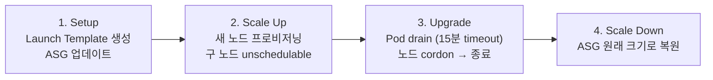

# In-Place Upgrade

이 문서에서는 v1.30 → v1.31 In-Place 업그레이드의 전체 과정을 다룹니다. Control Plane 업그레이드부터 시작하여 Add-on, Managed Node Group, Karpenter, Self-managed, Fargate까지 모든 data plane 유형의 업그레이드 절차를 실습 기반으로 정리합니다.

---

## Control Plane Upgrade

EKS Control Plane 업그레이드는 AWS가 내부적으로 blue/green 방식으로 수행합니다.

1. 새 버전의 control plane 컴포넌트를 프로비저닝합니다.
2. 정상 동작이 확인되면 API server endpoint를 새 컴포넌트로 전환합니다.
3. 구 컴포넌트를 종료합니다.

업그레이드 중에도 API server endpoint는 유지되므로 워크로드 가용성에 영향이 없습니다. 문제가 발생하면 자동으로 롤백됩니다. 한 번에 1 minor 버전만 올릴 수 있으며, 업그레이드된 Control Plane은 이전 버전으로 되돌릴 수 없습니다[^1].

### Methods

=== "Terraform (Workshop)"

    ```bash
    # variables.tf에서 cluster_version을 "1.30" → "1.31"로 변경
    cd ~/environment/terraform
    terraform plan
    terraform apply -auto-approve
    ```

    10~15분 소요됩니다. MNG에 별도 AMI/version을 지정하지 않았다면 `terraform plan` 결과에 MNG 업그레이드도 함께 나타납니다. 이 워크샵에서는 CP만 먼저 올린 뒤 add-on → data plane 순서로 진행합니다.

=== "AWS CLI"

    ```bash
    aws eks update-cluster-version \
      --region ${AWS_REGION} \
      --name $CLUSTER_NAME \
      --kubernetes-version 1.31
    ```

    상태를 확인합니다.

    ```bash
    aws eks describe-update \
      --region ${AWS_REGION} \
      --name $CLUSTER_NAME \
      --update-id <update-id>
    ```

=== "eksctl"

    ```bash
    eksctl upgrade cluster \
      --name $CLUSTER_NAME \
      --approve
    ```

---

## Add-on Upgrade

Control Plane 업그레이드 후, data plane을 올리기 전에 EKS managed add-on을 먼저 업그레이드합니다. add-on의 기본 개념은 [Week 1 — Add-ons and Capabilities](../week1/3_addons.md)를 참고하세요.

업그레이드 순서에 제약은 없지만, CoreDNS → kube-proxy → VPC CNI 순으로 진행하는 것이 일반적입니다. CoreDNS는 클러스터 내 DNS resolution을 담당하므로 먼저 안정화하고, kube-proxy와 VPC CNI는 노드 수준 네트워킹에 영향을 주므로 data plane 업그레이드 직전에 맞춰 올립니다. 호환 버전 조회 방법은 [Upgrade Preparation — Add-on Compatibility](2_upgrade-preparation.md#add-on-compatibility)를 참고하세요.

`addons.tf`에서 각 add-on 버전을 최신 호환 버전으로 변경하고 적용합니다.

```bash
cd ~/environment/terraform
terraform plan
terraform apply -auto-approve
```

업그레이드 후 `kubectl get pods -n kube-system`으로 add-on Pod가 정상 Running 상태인지 확인합니다.

---

## Managed Node Group Upgrade

MNG 업그레이드는 두 가지 방식을 사용할 수 있습니다. In-Place rolling update와 Blue/Green node group 교체입니다.

### In-Place Rolling Update Mechanism

MNG in-place 업그레이드는 자동화된 4단계 프로세스로 진행됩니다[^2].



???+ info "Phase Details"

    **1. Setup** — 대상 AMI를 반영한 새 EC2 Launch Template 버전을 생성하고 ASG를 업데이트합니다. `updateConfig.max_unavailable_percentage`로 병렬 업그레이드 노드 수를 제어합니다 (최대 100).

    **2. Scale Up** — ASG의 max/desired를 증가시키고(AZ 수의 2배 또는 max_unavailable 중 큰 값), 새 노드가 Ready 상태가 될 때까지 대기합니다. 기존 노드는 unschedulable로 표시되고 `node.kubernetes.io/exclude-from-external-load-balancers=true` 레이블이 추가됩니다.

    **3. Upgrade** — max_unavailable까지 노드를 랜덤으로 선택하여 Pod를 drain합니다 (15분 타임아웃, 초과 시 `PodEvictionFailure` — force 옵션으로 우회 가능). cordon 후 60초 대기한 뒤 ASG에 종료를 요청합니다. 모든 구 버전 노드가 교체될 때까지 반복됩니다.

    **4. Scale Down** — ASG의 max/desired를 원래 값으로 복원합니다.

### Default AMI vs Custom AMI

Terraform에서 MNG를 관리할 때, AMI 지정 방식에 따라 업그레이드 동작이 달라집니다.

| AMI Type | Upgrade Trigger | Action Required |
|----------|----------------|-----------------|
| Default (AMI 미지정) | `eks_managed_node_group_defaults.cluster_version` 변경 | 변수 하나만 변경 |
| Custom (AMI ID 지정) | `cluster_version` 변경만으로는 업그레이드되지 않음 | AMI ID도 함께 변경 필요 |

Custom AMI의 경우 SSM Parameter로 최신 AMI ID를 조회합니다.

```bash
aws ssm get-parameter \
  --name /aws/service/eks/optimized-ami/1.31/amazon-linux-2023/x86_64/standard/recommended/image_id \
  --region $AWS_REGION \
  --query "Parameter.Value" --output text
```

### Workshop: In-Place MNG Upgrade

1. `variables.tf`에서 `mng_cluster_version`을 `"1.30"` → `"1.31"`로 변경합니다.
2. Custom AMI MNG가 있으면 `ami_id` 변수도 v1.31 AMI로 업데이트합니다.
3. `terraform plan && terraform apply -auto-approve`를 실행합니다.
4. 12~20분 후 모든 MNG 노드가 v1.31로 업그레이드된 것을 확인합니다.

### Workshop: Blue/Green MNG Upgrade

Stateful 워크로드(orders + mysql)가 실행되는 `blue-mng`를 `green-mng`로 교체하는 시나리오입니다. `blue-mng`는 특정 AZ에 배치되고, taint(`dedicated=OrdersApp:NoSchedule`)와 label(`type=OrdersMNG`)이 적용되어 있습니다. Stateful 워크로드용 MNG는 AZ별로 분리하여 프로비저닝하는 것이 권장됩니다.

1. `base.tf`에 `green-mng`를 추가합니다. `blue-mng`와 동일한 labels, taints, subnet_ids를 사용하되, cluster_version은 default(1.31)를 따릅니다.

    ```hcl
    green-mng = {
      instance_types = ["m5.large", "m6a.large", "m6i.large"]
      subnet_ids     = [module.vpc.private_subnets[0]]
      min_size       = 1
      max_size       = 2
      desired_size   = 1
      update_config  = { max_unavailable_percentage = 35 }
      labels         = { type = "OrdersMNG" }
      taints = [{
        key    = "dedicated"
        value  = "OrdersApp"
        effect = "NO_SCHEDULE"
      }]
    }
    ```

2. `terraform apply`로 `green-mng`를 생성합니다.
3. 두 노드 그룹 모두 label과 taint가 동일한지 확인합니다.

    ```bash
    kubectl get nodes -l type=OrdersMNG
    kubectl get nodes -l type=OrdersMNG \
      -o jsonpath="{range .items[*]}{.metadata.name} {.spec.taints}{\"\n\"}{end}"
    ```

4. PDB가 설정되어 있으므로, orders replica를 2로 증가시킵니다 (minAvailable=1 위반 방지).

    ```bash
    sed -i 's/replicas: 1/replicas: 2/' apps/orders/deployment.yaml
    git add . && git commit -m "Increase orders replicas 2" && git push
    argocd app sync orders
    ```

5. `base.tf`에서 `blue-mng` 블록을 삭제하고 `terraform apply`를 실행합니다 (10~15분).
6. EKS가 자동으로 `blue-mng` 노드를 cordon, drain, delete합니다.
7. orders Pod가 `green-mng` 노드(v1.31)에서 실행되는 것을 확인합니다.

    ```bash
    kubectl get pods -n orders -o wide
    ```

---

## Karpenter Node Upgrade

Karpenter가 프로비저닝한 노드는 Drift 메커니즘을 통해 업그레이드합니다. Karpenter의 기본 개념은 [Week 3 — Karpenter](../week3/4_karpenter.md)를 참고하세요.

### Drift Mechanism

EC2NodeClass의 AMI 설정이 변경되면 Karpenter는 기존 노드의 drift를 감지합니다. 감지된 노드에 대해 Karpenter는 새 노드를 먼저 프로비저닝하고, 구 노드의 Pod를 evict한 뒤 구 노드를 종료합니다.

AMI를 지정하는 방식에 따라 drift 동작이 다릅니다.

`amiSelectorTerms` (명시적 AMI 지정)
:   AMI ID, name, tag로 지정합니다. AMI를 변경하면 drift가 발생합니다. 프로덕션 환경에서 AMI 승격을 제어할 때 적합합니다.

`alias` (EKS optimized AMI)
:   `family@version` 형식(e.g. `al2023@latest`)으로 지정합니다. `latest`를 사용하면 Karpenter가 SSM 파라미터를 모니터링하여 새 AMI 릴리스 시 자동으로 drift를 감지합니다. 프로덕션에서는 특정 버전을 핀하는 것을 권장합니다.

### Disruption Budgets

NodePool의 `spec.disruption.budgets`로 disruption 속도와 시간을 제어할 수 있습니다. 미정의 시 기본값은 `nodes: 10%`입니다. `reasons` 필드로 Drifted, Underutilized, Empty를 별도로 제어할 수 있습니다.

=== "Business Hours Block"

    업무시간에는 disruption을 금지하고, 그 외 시간에는 10개까지 허용합니다.

    ```yaml
    budgets:
      - schedule: "0 9 * * mon-fri"
        duration: 8h
        nodes: 0
      - nodes: 10
    ```

=== "Drift Rate Limit"

    Drift로 인한 교체는 1개씩만, Empty/Underutilized는 전체를 한 번에 교체합니다.

    ```yaml
    budgets:
      - nodes: "1"
        reasons:
          - Drifted
      - nodes: "100%"
        reasons:
          - Empty
          - Underutilized
    ```

=== "Full Block"

    모든 voluntary disruption을 차단합니다.

    ```yaml
    budgets:
      - nodes: 0
    ```

### Workshop: Karpenter Node Upgrade

checkout 앱은 Karpenter default NodePool로 프로비저닝된 노드에서 실행됩니다. taint `dedicated=CheckoutApp:NoSchedule`과 label `team=checkout`이 적용되어 있습니다.

1. checkout replica를 1 → 10으로 scale up합니다. Karpenter가 추가 노드를 프로비저닝합니다.

    ```bash
    # deployment.yaml에서 replicas: 10으로 변경
    git add . && git commit -m "scale checkout app" && git push
    argocd app sync checkout
    ```

2. v1.31 AMI ID를 조회합니다.

    ```bash
    aws ssm get-parameter \
      --name /aws/service/eks/optimized-ami/1.31/amazon-linux-2023/x86_64/standard/recommended/image_id \
      --region ${AWS_REGION} \
      --query "Parameter.Value" --output text
    ```

3. `default-ec2nc.yaml`의 `amiSelectorTerms`를 v1.31 AMI로 변경합니다.
4. `default-np.yaml`에 disruption budget을 추가합니다.

    ```yaml
    budgets:
      - nodes: "1"
        reasons:
          - Drifted
    ```

5. 변경사항을 commit/push하고 ArgoCD로 sync합니다.

    ```bash
    git add . && git commit -m "disruption changes" && git push
    argocd app sync karpenter
    ```

6. Karpenter controller 로그에서 drift 감지와 노드 교체 과정을 확인합니다.

    ```bash
    kubectl -n karpenter logs deployment/karpenter -c controller --tail=33
    ```

    `nodes: "1"` budget으로 인해 노드가 한 개씩 순차적으로 교체됩니다. 새 노드 생성 → 구 노드에 `karpenter.sh/disrupted:NoSchedule` taint → Pod eviction → 구 노드 삭제 순서로 진행됩니다.

7. 모든 checkout Pod가 v1.31 노드에서 실행되는 것을 확인합니다.

    ```bash
    kubectl get nodes -l team=checkout
    kubectl get pods -n checkout -o wide
    ```

---

## Self-managed Node Upgrade

Self-managed 노드는 `node.kubernetes.io/lifecycle=self-managed` 레이블로 식별됩니다. MNG와 달리 EKS가 rolling update를 자동으로 수행하지 않으므로, AMI를 교체한 뒤 ASG의 인스턴스를 직접 교체해야 합니다. Terraform을 사용하면 Launch Template 변경 시 ASG가 인스턴스를 교체합니다. 워크샵에서는 carts 앱이 self-managed 노드에서 실행됩니다.

1. v1.31 AMI ID를 조회합니다.

    ```bash
    aws ssm get-parameter \
      --name /aws/service/eks/optimized-ami/1.31/amazon-linux-2023/x86_64/standard/recommended/image_id \
      --region $AWS_REGION \
      --query "Parameter.Value" --output text
    ```

2. `base.tf`의 self-managed node group AMI를 새 ID로 변경합니다.
3. Terraform을 적용합니다.

    ```bash
    cd ~/environment/terraform
    terraform plan
    terraform apply -auto-approve
    ```

4. Terraform이 ASG의 Launch Template을 업데이트하고 인스턴스를 교체합니다. 새 노드가 v1.31인지 확인합니다.

    ```bash
    kubectl get nodes -l node.kubernetes.io/lifecycle=self-managed
    ```

---

## Fargate Node Upgrade

Fargate에서는 각 Pod가 전용 microVM에서 실행되며, AWS가 해당 VM의 kubelet 버전과 OS를 관리합니다. 기존 Pod의 Fargate 노드는 이미 실행 중인 버전을 유지하므로, Control Plane 업그레이드 후 Pod를 재시작해야 새 버전의 Fargate 노드에서 다시 스케줄링됩니다.

1. 기존 Fargate Pod의 버전을 확인합니다.

    ```bash
    kubectl get node $(kubectl get pods -n assets \
      -o jsonpath='{.items[0].spec.nodeName}') -o wide
    ```

2. Deployment를 재시작합니다.

    ```bash
    kubectl rollout restart deployment assets -n assets
    ```

3. 새 Pod가 Ready 상태가 될 때까지 대기합니다.

    ```bash
    kubectl wait --for=condition=Ready pods --all -n assets --timeout=180s
    ```

4. 새 Fargate 노드의 버전이 v1.31인지 확인합니다.

    ```bash
    kubectl get node $(kubectl get pods -n assets \
      -o jsonpath='{.items[0].spec.nodeName}') -o wide
    ```

[^1]: [Update existing cluster to new Kubernetes version](https://docs.aws.amazon.com/eks/latest/userguide/update-cluster.html)
[^2]: [Updating a managed node group](https://docs.aws.amazon.com/eks/latest/userguide/update-managed-node-group.html)
