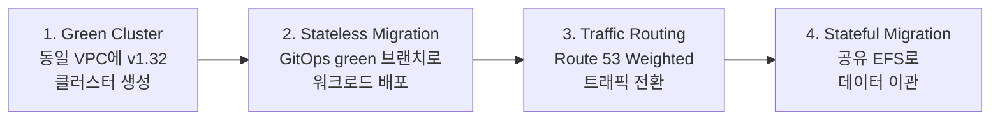
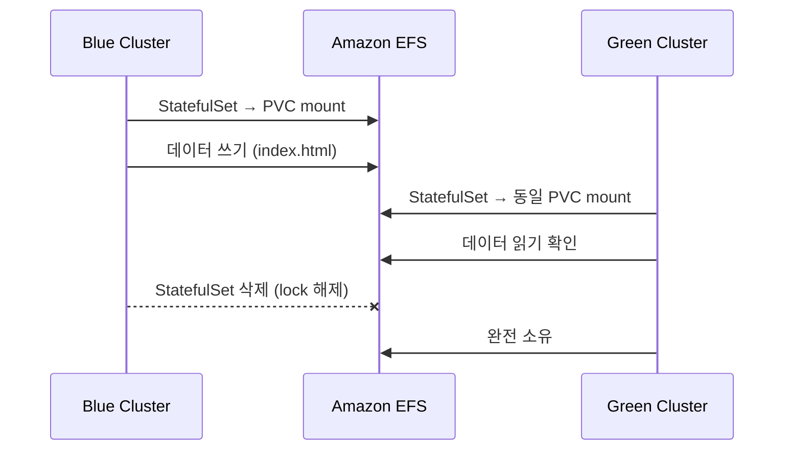

# Blue/Green Cluster Upgrade

이 문서에서는 Blue/Green 전략으로 v1.31 → v1.32 클러스터 업그레이드를 수행하는 전체 과정을 다룹니다. In-Place가 기존 클러스터를 직접 업그레이드하는 방식이라면, Blue/Green은 완전히 새 클러스터를 생성하고 워크로드를 이관한 뒤 트래픽을 전환하는 방식입니다. API endpoint가 변경되어도 문제없는 워크로드에 적합하며, 여러 minor 버전을 한 번에 점프할 수 있고 구 클러스터로 즉시 롤백이 가능합니다.

## Overview

Blue/Green 업그레이드는 다음 4단계로 진행됩니다.



1. **Green Cluster 생성** — 기존 VPC에 v1.32 클러스터를 프로비저닝합니다. In-Place 실습에서 미리 생성한 EFS를 공유 스토리지로 활용하기 위해 EFS ID를 먼저 확보합니다.
2. **Stateless 워크로드 이관** — GitOps repo의 `green` 브랜치를 생성하여 green 클러스터 전용 매니페스트를 관리합니다. ArgoCD가 이 브랜치를 바라보도록 설정하여 green 클러스터에 워크로드를 배포합니다.
3. **트래픽 전환** — Route 53 Weighted Records로 blue/green 클러스터 간 트래픽 비율을 점진적으로 조정합니다.
4. **Stateful 워크로드 이관** — EFS를 공유 스토리지로 사용하여 blue 클러스터의 데이터를 green에서 접근할 수 있도록 마이그레이션합니다.

---

## Green Cluster Creation

Blue/Green 전략에서는 새 클러스터(green)를 기존 VPC에 생성합니다. 동일 VPC를 사용하면 네트워크 연결, NAT Gateway, VPN, Security Group, DNS 설정을 재활용할 수 있어 복잡도와 비용이 줄어듭니다.

1. EFS File System ID를 확보합니다. In-Place 실습에서 Terraform으로 미리 생성한 EFS로, Stateful 워크로드 마이그레이션 시 blue/green 양쪽 클러스터가 동일한 데이터에 접근하는 데 사용합니다.

    ```bash
    export EFS_ID=$(aws efs describe-file-systems \
      --query "FileSystems[*].FileSystemId" --output text)
    echo $EFS_ID
    ```

2. `eksgreen-terraform/` 디렉터리에 v1.32 클러스터 Terraform 코드가 준비되어 있습니다.

    ```bash
    cd ~/environment/eksgreen-terraform
    terraform init
    terraform plan -var efs_id=$EFS_ID
    terraform apply -var efs_id=$EFS_ID -auto-approve
    ```

    20~30분 소요됩니다. 새 EKS 클러스터, 노드 그룹, add-on이 모두 프로비저닝됩니다.

3. kubectl context를 설정합니다. blue/green alias로 두 클러스터를 구분합니다.

    ```bash
    aws eks --region ${AWS_REGION} update-kubeconfig \
      --name ${EKS_CLUSTER_NAME} --alias blue
    aws eks --region ${AWS_REGION} update-kubeconfig \
      --name ${EKS_CLUSTER_NAME}-gr --alias green
    kubectl config use-context green
    ```

4. Green 클러스터 상태를 확인합니다.

    ```bash
    kubectl get nodes --context green
    helm list -A --kube-context green
    ```

    노드가 v1.32로 표시되고, ArgoCD, EFS CSI Driver, ALB Controller, Karpenter, Metrics Server가 설치되어 있어야 합니다.

---

## Stateless Workload Migration

Green 클러스터가 준비되면 워크로드를 배포합니다. Stateful 워크로드는 persistent storage를 동기화해야 하므로 별도 절차가 필요하지만, UI, Catalog, Cart 같은 Stateless 워크로드는 green 클러스터에 새로 배포하고 트래픽만 전환하면 됩니다. GitOps 기반이므로 git branch를 활용하여 blue/green 클러스터 간 매니페스트를 분리합니다. ArgoCD의 App-of-Apps 패턴에 대한 상세 설명은 [Week 6 — Argo CD](../week6/2_argocd.md)를 참고하세요.

### GitOps Branch Strategy

핵심 아이디어는 **main 브랜치는 blue 클러스터, green 브랜치는 green 클러스터**를 관리하는 것입니다. green 브랜치에서는 v1.32 호환 AMI, green 클러스터의 IAM role/Security Group, deprecated API 변환 등 green 클러스터에 맞는 설정을 적용합니다. ArgoCD의 `targetRevision`을 `green`으로 변경하면, green 클러스터의 ArgoCD가 green 브랜치의 매니페스트만 바라보게 되어 blue/green 배포가 완전히 분리됩니다.

1. `eks-gitops-repo`에서 `green` 브랜치를 생성합니다.

    ```bash
    cd ~/environment/eks-gitops-repo
    git switch -c green
    ```

2. green 브랜치에서 v1.32 호환 변경을 적용합니다.

    **Karpenter EC2NodeClass 업데이트** — green 클러스터의 리소스를 참조하도록 AMI(v1.32), IAM role, Security Group tag를 교체합니다. blue 클러스터의 Karpenter 리소스와 분리하기 위해 `karpenter.sh/discovery` tag 값을 green 클러스터 이름(`eksworkshop-eksctl-gr`)으로 변경합니다.

    ```bash
    export AL2023_132_AMI=$(aws ssm get-parameter \
      --name /aws/service/eks/optimized-ami/1.32/amazon-linux-2023/x86_64/standard/recommended/image_id \
      --region ${AWS_REGION} --query "Parameter.Value" --output text)
    ```

    ```yaml
    apiVersion: karpenter.k8s.aws/v1
    kind: EC2NodeClass
    metadata:
      name: default
    spec:
      amiFamily: AL2023
      amiSelectorTerms:
        - id: "${AL2023_132_AMI}"
      role: karpenter-eksworkshop-eksctl-gr
      securityGroupSelectorTerms:
        - tags:
            karpenter.sh/discovery: eksworkshop-eksctl-gr
      subnetSelectorTerms:
        - tags:
            karpenter.sh/discovery: eksworkshop-eksctl
    ```

3. deprecated API를 스캔합니다. pluto로 GitOps repo 전체를 대상으로 검사합니다.

    ```bash
    pluto detect-files -d ~/environment/eks-gitops-repo/
    ```

    `autoscaling/v2beta2`가 발견되면 `kubectl convert`로 변환합니다. 이 워크샵 환경에서는 이미 `autoscaling/v2`를 사용하고 있어 탐지되지 않을 수 있지만, 실제 환경에서는 자주 발견되는 이슈입니다.

    ```bash
    kubectl convert -f apps/ui/hpa.yaml \
      --output-version autoscaling/v2 -o yaml > apps/ui/tmp.yaml
    mv apps/ui/tmp.yaml apps/ui/hpa.yaml
    ```

4. ArgoCD `app-of-apps/values.yaml`에서 `targetRevision`을 `green`으로 변경합니다.

    ```bash
    sed -i 's/targetRevision: main/targetRevision: green/' app-of-apps/values.yaml
    ```

5. 변경사항을 commit하고 push합니다.

    ```bash
    git add . && git commit -m "1.32 changes"
    git push -u origin green
    ```

### ArgoCD Bootstrap on Green

Green 클러스터의 ArgoCD에 로그인하고, CodeCommit repo를 등록한 뒤, App of Apps 패턴으로 전체 앱을 배포합니다. 모든 앱이 Synced/Healthy 상태인지 `argocd app list`로 확인합니다.

??? info "Bootstrap Commands"

    ```bash
    # 1. ArgoCD 로그인
    export ARGOCD_SERVER_GR=$(kubectl get svc argo-cd-argocd-server \
        -n argocd -o json --context green \
        | jq --raw-output '.status.loadBalancer.ingress[0].hostname')
    export ARGOCD_PWD_GR=$(kubectl -n argocd get secret \
        argocd-initial-admin-secret \
        -o jsonpath="{.data.password}" --context green | base64 -d)
    argocd login --name green ${ARGOCD_SERVER_GR} \
        --username admin --password ${ARGOCD_PWD_GR} \
        --insecure --skip-test-tls --grpc-web

    # 2. CodeCommit repo 등록
    argo_creds=$(aws secretsmanager get-secret-value \
        --secret-id argocd-user-creds --query SecretString --output text)
    argocd repo add $(echo $argo_creds | jq -r .url) \
        --username $(echo $argo_creds | jq -r .username) \
        --password $(echo $argo_creds | jq -r .password) \
        --server ${ARGOCD_SERVER_GR}

    # 3. App of Apps 배포
    argocd app create apps \
        --repo $(echo $argo_creds | jq -r .url) \
        --path app-of-apps \
        --dest-server https://kubernetes.default.svc \
        --sync-policy automated \
        --revision green \
        --server ${ARGOCD_SERVER_GR}

    # 4. 상태 확인
    argocd app list --server ${ARGOCD_SERVER_GR}
    ```

---

## Traffic Routing

Stateless 워크로드가 green 클러스터에 배포되었으니 트래픽을 blue에서 green으로 전환합니다. 이 단계에서는 사용자가 어떤 클러스터로 접속하는지 DNS 수준에서 제어합니다.

Amazon Route 53 Weighted Records를 사용하면 동일 도메인에 대해 가중치 기반으로 트래픽을 분배할 수 있습니다. blue 클러스터의 ALB 엔드포인트와 green 클러스터의 ALB 엔드포인트를 각각 weighted record로 등록하여, 가중치 비율에 따라 사용자 요청이 분산됩니다.

| Blue Weight | Green Weight | Result |
|-------------|-------------|--------|
| 100 | 0 | 전량 blue |
| 50 | 50 | 균등 분배 |
| 0 | 100 | 전량 green |

중간값을 사용하면 canary 방식으로 점진적 전환이 가능합니다.


*Source: [Kubernetes cluster upgrade: the blue-green deployment strategy — AWS Containers Blog](https://aws.amazon.com/blogs/containers/kubernetes-cluster-upgrade-the-blue-green-deployment-strategy/)*

[external-dns](https://github.com/kubernetes-sigs/external-dns) add-on을 사용하면 Ingress 리소스의 annotation으로 Route 53 record를 자동 생성하고 관리할 수 있습니다. 두 클러스터 모두 동일한 도메인에 대해 각자의 weighted record를 생성하면, Route 53이 가중치에 따라 트래픽을 분배합니다.

`set-identifier`
:   클러스터를 식별하는 고유 값. external-dns의 `txtOwnerId`와 일치해야 합니다.

`aws-weight`
:   DNS record 가중치. Terraform에서 값을 주입하여 플랫폼 팀이 전환 시점을 제어합니다.

```yaml
annotations:
  external-dns.alpha.kubernetes.io/set-identifier: eksworkshop-eksctl-gr
  external-dns.alpha.kubernetes.io/aws-weight: "100"
```

---

## Stateful Workload Migration

Stateless 워크로드는 green에 새로 배포하면 끝이지만, Stateful 워크로드는 데이터 이관이 필요합니다. Blue/Green 전략에서 Stateful 마이그레이션이 가장 복잡한 단계인 이유입니다.

이 워크샵에서는 Amazon EFS를 공유 스토리지로 활용합니다. EFS는 네트워크 파일 시스템이므로 여러 클러스터에서 동시에 마운트할 수 있습니다. Blue 클러스터의 데이터가 EFS에 저장되어 있으면, green 클러스터에서 동일한 EFS 경로를 마운트하여 데이터를 그대로 읽을 수 있습니다. 실습에서는 nginx StatefulSet으로 이 과정을 시뮬레이션합니다.

!!! tip "Production Consideration"

    실제 환경에서는 워크로드의 스토리지 유형에 맞는 동기화 방법을 선택해야 합니다. EBS volume은 단일 AZ/단일 인스턴스에만 연결 가능하므로 스냅샷을 통한 복제가 필요하고, 데이터베이스는 복제 설정이나 논리적 백업/복원을 고려해야 합니다. Velero를 사용한 클러스터 단위 백업/복원도 널리 사용되는 방법입니다.

두 클러스터의 Terraform 코드는 모두 동일한 EFS File System을 참조하는 StorageClass를 구성합니다. `ensureUniqueDirectory: "false"`로 설정하여 양쪽 클러스터가 같은 경로에 접근할 수 있습니다.

??? info "EFS StorageClass"

    ```yaml
    apiVersion: storage.k8s.io/v1
    kind: StorageClass
    metadata:
      name: efs
    provisioner: efs.csi.aws.com
    parameters:
      provisioningMode: efs-ap # (1)
      fileSystemId: fs-01696090a8900da00
      directoryPerms: "755"
      subPathPattern: ${.PVC.namespace}/${.PVC.name} # (2)
      ensureUniqueDirectory: "false" # (3)
      basePath: /dynamic_provisioning
    reclaimPolicy: Delete
    volumeBindingMode: Immediate
    ```

    1. Access Point를 자동으로 생성합니다.
    2. namespace/PVC 이름 기반으로 하위 디렉터리 경로를 결정합니다.
    3. 동일 경로 재사용을 허용하여 양쪽 클러스터에서 같은 데이터에 접근할 수 있습니다.



1. **Blue 클러스터에 StatefulSet 생성** — nginx Pod가 EFS를 마운트합니다.

    ```bash
    kubectl config use-context blue
    ```

    ```yaml
    apiVersion: apps/v1
    kind: StatefulSet
    metadata:
      name: efs-example
      namespace: default
    spec:
      serviceName: "efs-example"
      replicas: 1
      selector:
        matchLabels:
          app: efs-example
      template:
        metadata:
          labels:
            app: efs-example
        spec:
          containers:
            - name: app
              image: nginx:latest
              volumeMounts:
                - name: efs-storage
                  mountPath: /usr/share/nginx/html
      volumeClaimTemplates:
        - metadata:
            name: efs-storage
          spec:
            accessModes: ["ReadWriteMany"]
            storageClassName: efs
            resources:
              requests:
                storage: 1Gi
    ```

2. **Blue에서 데이터 생성** — EFS에 파일을 씁니다.

    ```bash
    kubectl exec $(kubectl get pods -o jsonpath='{.items[0].metadata.name}' \
      -l app=efs-example) -- bash -c 'touch /usr/share/nginx/html/index.html'
    ```

3. **Green 클러스터에 동일 StatefulSet 배포** — 동일한 EFS에 마운트됩니다.

    ```bash
    kubectl config use-context green
    # 위와 동일한 StatefulSet manifest를 apply
    ```

4. **Green에서 데이터 접근 확인** — blue에서 생성한 파일이 보이는지 확인합니다.

    ```bash
    kubectl exec $(kubectl get pods -o jsonpath='{.items[0].metadata.name}' \
      -l app=efs-example) -- bash -c 'ls -lh /usr/share/nginx/html/index.html'
    ```

5. **Blue StatefulSet 삭제** — 검증이 완료되면 blue의 StatefulSet을 삭제하여 파일 lock을 해제합니다.

    ```bash
    kubectl delete statefulset efs-example --context blue
    ```

!!! warning "EFS File Lock"

    Blue 클러스터의 Pod가 EFS 디렉터리에 대해 file lock(FLOCK)을 보유하고 있으면, green 클러스터에서 해당 경로에 쓰기 작업이 실패할 수 있습니다. 트래픽 전환 전에 blue의 StatefulSet을 먼저 삭제하여 lock을 해제해야 합니다.

실제 운영 환경에서는 데이터 동기화 → 앱 기능 테스트 → 트래픽 전환 → blue 클러스터 폐기 순서로 진행합니다.

[^1]: [Best Practices for Cluster Upgrades — Blue/Green](https://docs.aws.amazon.com/eks/latest/best-practices/cluster-upgrades.html)
