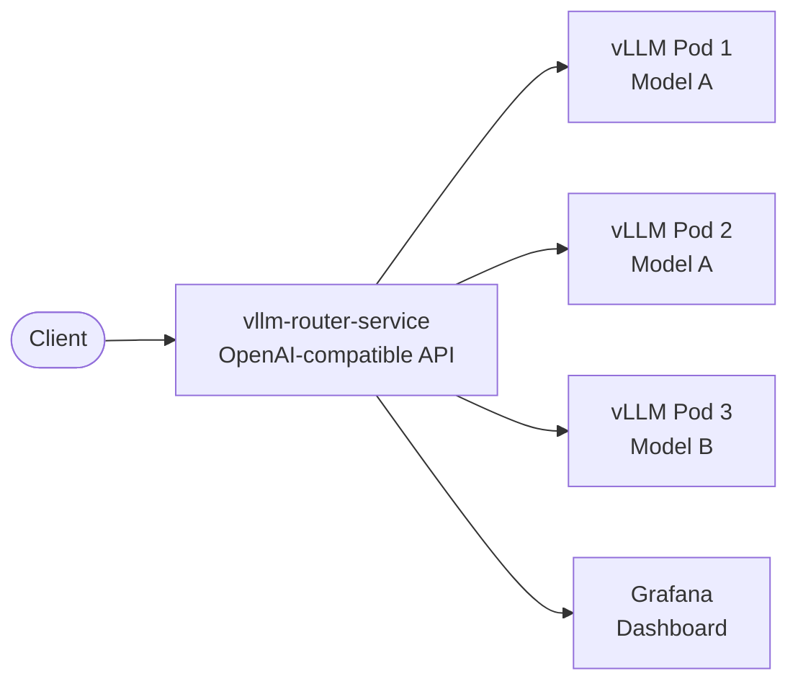
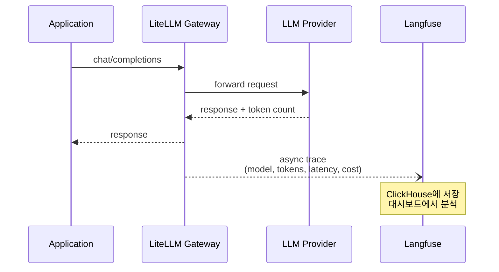

# GenAI Platform Components

EKS에서 LLM 추론 워크로드를 운영하려면 모델 서빙 엔진 하나만으로는 부족합니다. 여러 Provider의 모델을 단일 인터페이스로 묶는 AI Gateway, 요청 단위로 비용과 지연을 추적하는 Observability, 외부 지식을 검색해 응답 품질을 높이는 RAG 파이프라인, 그리고 도구를 호출하며 자율적으로 작업을 수행하는 Agent 프레임워크가 함께 필요합니다. 이 문서는 GenAI on EKS 워크샵에서 사용하는 핵심 컴포넌트의 배경과 설계를 정리합니다.

---

## AI Gateway

### Problem

LLM을 프로덕션에 도입하면 Provider마다 API 스펙, 인증 방식, 과금 체계가 다른 파편화 문제에 직면합니다. 팀별로 개별 API 키를 관리하면 비용 추적이 불가능하고, 한 Provider에 장애가 발생했을 때 수동으로 fallback해야 합니다. [AWS Prescriptive Guidance](https://docs.aws.amazon.com/prescriptive-guidance/latest/gen-ai-lifecycle-operational-excellence/preprod-architecting.html)는 이 문제를 해결하기 위해 **AI Gateway**를 GenAI 프로덕션 아키텍처의 핵심 컴포넌트로 권장합니다.

AI Gateway는 전통적인 API Gateway 개념을 LLM 워크로드에 확장한 것으로, Model Abstraction Layer 역할을 합니다. 애플리케이션은 Provider를 직접 호출하는 대신 Gateway의 단일 엔드포인트로 요청을 보내고, Gateway가 라우팅, 인증, 비용 추적, fallback을 처리합니다.

### LiteLLM

LiteLLM은 140개 이상의 LLM Provider를 OpenAI-compatible API로 통합하는 오픈소스 AI Gateway입니다. Python 기반의 FastAPI 서버로 동작하며, 애플리케이션 코드에서 모델 이름만 변경하면 Provider를 전환할 수 있습니다.

`model_list`
:   Gateway에 등록된 모델 목록. 같은 모델명에 여러 deployment를 연결하면 로드밸런싱됩니다.

`router_settings`
:   fallback, retry, timeout 등 라우팅 정책. Provider 장애 시 자동으로 대체 모델로 전환합니다.

`general_settings`
:   PostgreSQL(spend log, API key 저장)과 Redis(rate limit counter, 캐시) 연결 설정.

AWS는 LiteLLM을 기반으로 [Multi-Provider Generative AI Gateway](https://aws.amazon.com/blogs/machine-learning/streamline-ai-operations-with-the-multi-provider-generative-ai-gateway-reference-architecture/) 레퍼런스 아키텍처를 제공합니다. 이 아키텍처는 ECS 또는 EKS에 배포할 수 있으며, Amazon Bedrock, SageMaker AI, OpenAI 등 여러 Provider를 단일 Gateway 뒤에 통합합니다. 네트워크 구성은 CloudFront 글로벌 배포부터 Private VPC 전용 접근까지 네 가지 옵션을 제공합니다.

 *Source: [Guidance for Multi-Provider Generative AI Gateway on AWS](https://aws-solutions-library-samples.github.io/ai-ml/guidance-for-multi-provider-generative-ai-gateway-on-aws.html)*

???+ info "Case Study"
    우아한형제들은 LLM 도입 과정에서 Provider 파편화, 프롬프트 버전 추적 불가, 비용 가시성 부족, PII 필터링 부재 등 8가지 문제를 경험했습니다. 이를 해결하기 위해 GenAI SDK(LiteLLM 기반), GenAI API Gateway, GenAI Studio(Langfuse 기반), GenAI Labs를 유기적으로 연결한 [LLMOps 플랫폼](https://techblog.woowahan.com/22839/)을 구축했습니다.

    SDK는 단일 인터페이스로 여러 LLM을 모델 이름만 바꿔 호출할 수 있도록 추상화하며, 라우팅, 로드밸런싱, fallback, PII 필터링을 자동 처리합니다. API Gateway는 동일한 기능을 REST API로 노출하여 Python 이외 환경에서도 활용 가능하게 합니다.

---

## LLM Serving Engine

### vLLM

vLLM은 LLM 추론에 특화된 고성능 서빙 엔진입니다. V1 아키텍처에서는 API Server, Engine Core, GPU Worker가 분리된 프로세스로 동작하며, Tensor Parallelism으로 여러 GPU에 걸쳐 모델을 분할합니다.

 *Source: [vLLM Architecture Overview](https://docs.vllm.ai/en/latest/design/arch_overview.html)*

핵심 기술인 **PagedAttention**은 KV cache를 OS의 가상 메모리처럼 고정 크기 블록으로 분할하여 관리합니다. 기존 방식에서는 요청마다 최대 시퀀스 길이만큼 GPU 메모리를 미리 할당해야 했기 때문에, 짧은 요청에서도 할당된 메모리 대부분이 낭비되었습니다. PagedAttention은 실제 사용량에 따라 블록을 동적 할당하므로 메모리 낭비를 줄이고 동시 처리 가능한 요청 수를 늘립니다. PagedAttention의 동작 원리에 대한 자세한 설명은 [Sparse Computation & Memory Management on LLM Inference — PagedAttention](https://pyy0715.github.io/sparse-computation-memory-management-on-llm-inference/#pagedattention-borrowing-from-operating-systems)를 참고합니다.

| Feature | Description |
|---|---|
| Continuous Batching | 요청이 완료되는 즉시 새 요청을 배치에 삽입. 정적 batching 대비 처리량 향상 |
| Prefix Caching | 반복되는 system prompt의 KV cache를 재사용하여 TTFT 단축 |
| Chunked Prefill | 긴 프롬프트의 prefill 연산을 chunk 단위로 분할하여 기존 요청의 decode가 블로킹되지 않도록 함. V1에서 기본 활성화 |
| Quantization | FP8, GPTQ, AWQ 등 양자화로 메모리 사용량 감소. 정확도와 처리량 간 트레이드오프 |
| Multi-GPU | Tensor Parallelism(단일 노드 NVLink), Pipeline Parallelism(다중 노드 PCIe/EFA) 지원 |

### Kubernetes Deployment

vLLM을 Kubernetes에 배포할 때 핵심 설정은 다음과 같습니다.

```yaml
containers:
  - name: vllm
    image: vllm/vllm-openai:latest
    command: ["vllm", "serve", "meta-llama/Llama-3.1-8B-Instruct",
              "--max-model-len", "4096",
              "--gpu-memory-utilization", "0.92"] # (1)
    resources:
      limits:
        nvidia.com/gpu: "1" # (2)
      requests:
        cpu: "2"
        memory: "6Gi"
    volumeMounts:
      - name: shm
        mountPath: /dev/shm # (3)
volumes:
  - name: shm
    emptyDir:
      medium: Memory
      sizeLimit: "2Gi"
```

1. `gpu-memory-utilization`은 KV cache에 할당할 GPU 메모리 비율. 0.92가 기본값이며, OOM 발생 시 낮춥니다. vLLM V1에서 chunked prefill은 기본 활성화되므로 별도 플래그가 필요 없습니다.
2. GPU는 `requests`와 `limits`를 동일하게 설정해야 합니다. Kubernetes는 GPU 분할을 지원하지 않으므로 정수 단위로만 요청 가능합니다.
3. Tensor Parallelism 사용 시 GPU 간 공유 메모리가 필요합니다. 기본 `/dev/shm` 크기(64MB)로는 부족하므로 emptyDir을 마운트합니다.

Health check 설정에서 `startupProbe`는 모델 로딩 시간을 고려하여 충분한 `failureThreshold`를 부여해야 합니다. 대형 모델은 S3에서 가중치를 다운로드하는 데 수 분이 걸릴 수 있습니다.

```yaml
startupProbe:
  httpGet:
    path: /health
    port: 8000
  failureThreshold: 120
  periodSeconds: 10
readinessProbe:
  httpGet:
    path: /health
    port: 8000
  periodSeconds: 5
```

### vLLM Production Stack

단일 vLLM 인스턴스를 넘어 클러스터 규모로 운영할 때는 [vLLM Production Stack](https://docs.vllm.ai/en/latest/deployment/integrations/production-stack/)을 사용합니다. Helm chart로 배포되며, 핵심 컴포넌트는 Router와 Model Replica입니다.



Router는 prefix-aware routing으로 동일한 system prompt를 가진 요청을 같은 Pod으로 라우팅하여 KV cache 재사용률을 높입니다. 이를 통해 TTFT를 단축하고 GPU 메모리 효율을 개선합니다.

KEDA를 사용하면 Prometheus에서 수집한 vLLM 메트릭(queue depth, KV cache utilization)을 기반으로 Pod을 자동 스케일링할 수 있습니다. 새 Pod이 모델 가중치를 다시 다운로드하지 않도록 ReadWriteMany(RWX) PersistentVolume을 공유하는 것이 스케일링 속도에 중요합니다.

---

## LLM Observability

### Langfuse

LLM 애플리케이션에서는 기존 APM(Application Performance Monitoring)만으로 충분하지 않습니다. HTTP 상태 코드가 200이어도 모델 응답의 품질이 낮거나, 불필요하게 긴 토큰을 생성하여 비용이 발생하거나, 특정 프롬프트 버전에서 성능이 저하될 수 있습니다. Langfuse는 이러한 LLM 특화 문제를 해결하는 오픈소스 Observability 플랫폼입니다.

| Concept | Description |
|---|---|
| Trace | 하나의 사용자 요청에 대한 전체 실행 경로. LLM 호출, 도구 실행, retrieval 등 각 단계가 span으로 기록됩니다 |
| Generation | 개별 LLM 호출 단위. 입력 프롬프트, 출력 텍스트, 모델명, 토큰 수, 지연시간, 비용이 자동 수집됩니다 |
| Score | 응답 품질 평가값. 사용자 피드백(thumbs up/down), LLM-as-a-Judge 자동 평가, 수동 라벨링을 지원합니다 |
| Prompt Management | 프롬프트의 버전 관리와 배포. label로 production 버전을 지정하고, SDK에서 동적으로 로드합니다 |

 *Source: [Langfuse Tracing Documentation](https://langfuse.com/docs/tracing)*

Langfuse는 OpenTelemetry 기반으로 설계되어 vendor lock-in이 적으며, 자체 호스팅 시 무제한 trace를 무료로 수집할 수 있습니다. LiteLLM과 네이티브 통합되어 Gateway를 통과하는 모든 요청의 trace가 자동 기록됩니다.

???+ info
    2026년 1월 ClickHouse가 Langfuse를 인수했습니다. Langfuse는 분석 데이터 저장소로 ClickHouse를 사용해왔으며, 인수 후에도 오픈소스 라이선스와 자체 호스팅 옵션이 유지됩니다.



---

## RAG Pipeline

RAG(Retrieval-Augmented Generation)는 LLM의 학습 데이터에 포함되지 않은 외부 지식을 검색하여 응답에 활용하는 기법입니다. LLM 단독으로는 사내 문서, 최신 정보, 도메인 특화 지식에 대해 정확한 답변을 생성하기 어렵습니다. RAG는 이 한계를 모델 재학습 없이 해결합니다.


 *Source: [What is RAG?](https://aws.amazon.com/what-is/retrieval-augmented-generation/)*

### Embedding Model

[Text Embeddings Inference(TEI)](https://github.com/huggingface/text-embeddings-inference)는 Hugging Face가 제공하는 임베딩 모델 서빙 엔진입니다. 텍스트를 고차원 벡터로 변환하여 의미적 유사도를 계산할 수 있게 합니다. Rust로 작성되어 높은 처리량과 낮은 지연을 제공하며, 토큰 기반 동적 배칭을 지원합니다. 이후 워크샵에서도 Qwen3-Embedding-4B 모델을 TEI로 서빙합니다.

임베딩 서빙은 TEI 외에도 멀티모달을 지원하는 [Infinity](https://github.com/michaelfeil/infinity)나, vLLM 자체의 [`/v1/embeddings` 엔드포인트](https://docs.vllm.ai/en/latest/models/pooling_models/embed/)를 사용할 수 있습니다. vLLM의 임베딩 엔드포인트는 추론용으로 이미 배포된 vLLM 인스턴스에서 별도의 임베딩 서버 없이 임베딩도 함께 서빙할 수 있다는 의미입니다. 다만 LLM 추론과 임베딩이 같은 GPU를 공유하므로, 프로덕션에서는 워크로드를 분리하는 것이 일반적입니다.

### Vector Database

벡터 데이터베이스는 임베딩 벡터를 저장하고 유사도 검색을 수행하는 전용 데이터베이스입니다. 일반 RDBMS의 정확한 매칭(WHERE column = value)과 달리, 벡터 데이터베이스는 고차원 공간에서 가까운 벡터를 빠르게 찾는 ANN(Approximate Nearest Neighbor) 검색을 수행합니다.

<div class="grid cards" markdown>

- :material-database-search: **Qdrant**

    ---
    Rust 기반, Kubernetes-native. HNSW 인덱싱, 필터링과 벡터 검색 결합 지원. 워크샵에서 기본 벡터 DB로 사용

- :material-palette-swatch: **Chroma**

    ---
    Rust 코어 + Python 클라이언트. 개발/프로토타이핑에 적합. 임베딩 자동 생성 기능 내장. 소규모 컬렉션에서 빠른 시작

- :material-vector-combine: **Milvus**

    ---
    분산 아키텍처, 대규모 데이터셋에 적합. GPU 가속 인덱싱 지원. 수십억 건 이상의 벡터 처리

</div>

AWS는 벡터 검색을 위해 Amazon OpenSearch Service, Aurora PostgreSQL(pgvector), [Amazon S3 Vectors](https://docs.aws.amazon.com/prescriptive-guidance/latest/choosing-an-aws-vector-database-for-rag-use-cases/vector-databases.html) 등 관리형 서비스도 제공합니다. 자체 호스팅 벡터 DB는 데이터 통제가 필요하거나 EKS 클러스터 내에서 저지연 접근이 중요한 경우에 적합합니다.

---

## Agentic AI

### Model-Driven Agent

기존 LLM 애플리케이션은 사용자 질문에 대해 단일 응답을 생성하는 구조입니다. Agent는 여기서 한 단계 더 나아가, 모델이 스스로 계획을 세우고 도구를 호출하며 결과를 반영하여 작업을 완료하는 자율적 루프를 실행합니다.

/// figure-caption


*Source: [Introducing Strands Agents — AWS Open Source Blog](https://aws.amazon.com/blogs/opensource/introducing-strands-agents-an-open-source-ai-agents-sdk/)*
///

Agent 실행 흐름을 누가 결정하느냐에 따라 접근 방식이 나뉩니다.

**Workflow-driven**
:   개발자가 단계별 실행 흐름을 코드로 명시적으로 정의합니다. 각 분기와 조건을 직접 제어하므로 예측 가능성이 높지만, 새로운 시나리오에 대응하려면 코드 수정이 필요합니다. LangGraph가 대표적입니다.

**Model-driven**
:   모델이 주어진 도구와 프롬프트를 기반으로 다음 단계를 자율적으로 결정합니다. 개발이 단순하고 모델 성능이 향상되면 Agent 품질도 함께 개선되지만, 실행 경로의 예측이 어렵습니다.

[Strands Agents](https://aws.amazon.com/blogs/opensource/introducing-strands-agents-an-open-source-ai-agents-sdk/)는 model-driven 접근을 채택한 AWS의 오픈소스 Agent SDK입니다. AWS Glue, VPC Reachability Analyzer 등 AWS 내부 프로덕션에서 사용되고 있습니다. Agent 정의는 모델, 도구, 프롬프트 세 가지로 구성됩니다.

```python
from strands import Agent
from strands.models import BedrockModel
from strands.tools.mcp import MCPClient
from mcp.client.streamable_http import streamablehttp_client

model = BedrockModel(
    model_id="us.anthropic.claude-sonnet-4-20250514",
    streaming=True,
)

# MCP 서버를 도구로 연결
mcp = MCPClient(lambda: streamablehttp_client(
    "http://calculator-mcp:8080/mcp"
))

with mcp:
    agent = Agent(
        model=model,
        tools=mcp.list_tools_sync(),
        system_prompt="You are a helpful assistant with calculator tools."
    )
    result = agent("Calculate compound interest on $10,000 at 5% for 3 years")
```

### Model Context Protocol

MCP(Model Context Protocol)는 Agent가 외부 도구와 상호작용하는 표준 프로토콜입니다. 각 도구를 MCP Server로 구현하면 Agent 프레임워크에 관계없이 재사용할 수 있습니다. 워크샵에서는 Calculator MCP Server를 예제로 제공하며, Strands Agent가 이를 호출하여 연산을 수행합니다.

Strands는 MCP 외에도 Python 함수에 `@tool` 데코레이터를 붙여 간단히 도구로 등록할 수 있으며, 멀티 에이전트 패턴(Agents-as-Tools, Graph, Swarm, Workflow)과 A2A(Agent-to-Agent) 프로토콜을 지원합니다.

### EKS Deployment

Strands Agent는 EKS에 FastAPI 서버로 배포됩니다. Pod이 시작되면 MCP Server에 연결하고, Open WebUI에 자동 등록되어 사용자가 Agent와 대화할 수 있습니다. Langfuse와 통합하면 Agent의 각 도구 호출과 모델 추론이 trace로 기록되어, Agent 동작을 디버깅하고 비용을 추적할 수 있습니다.

---
