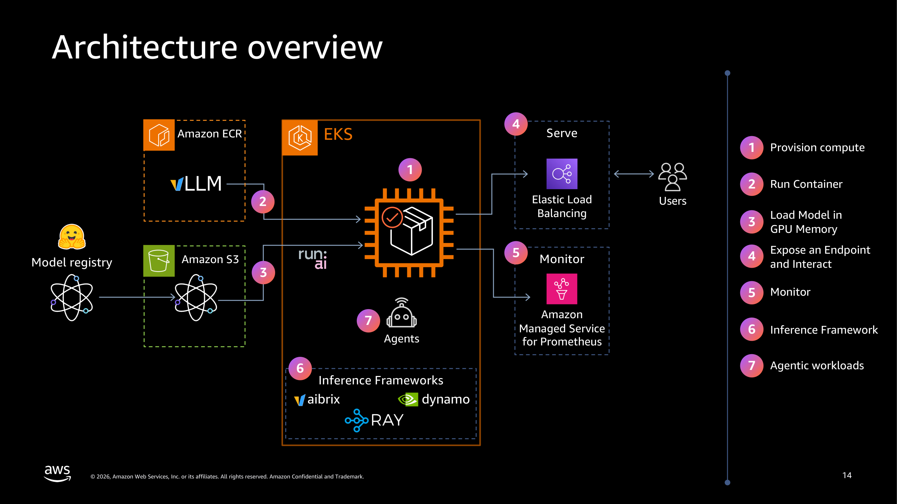
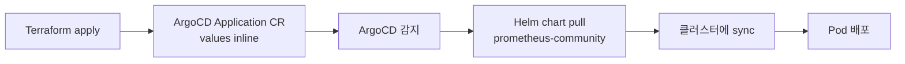
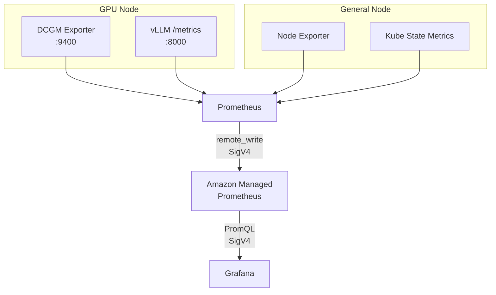
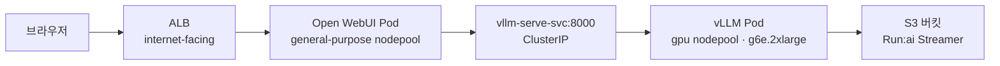

# Workshop - GenAI on EKS

[GenAI on EKS 워크샵](https://catalog.workshops.aws/genai-on-eks/ko-KR)은 EKS Auto Mode 클러스터에서 LLM 추론 워크로드를 배포하고 모니터링하는 과정을 다룹니다. 이 문서는 워크샵의 인프라 구성, vLLM 배포, 모니터링 스택을 정리합니다. 실습 코드는 [awslabs/ai-on-eks](https://github.com/awslabs/ai-on-eks) 레포를 기반으로 합니다.

 *Source: [GenAI on EKS Workshop Slides](https://ws-assets-prod-iad-r-pdx-f3b3f9f1a7d6a3d0.s3.us-west-2.amazonaws.com/029d6c4e-4775-41c9-85ff-9f5360f32a15/genai-eks-workshop-slides.pdf)*

---

## Repository Structure

| Directory | Description |
|---|---|
| `infra/base/terraform/` | VPC, EKS, Karpenter, ArgoCD 등 `.tf` 공통 모듈 |
| `infra/workshops/genai-on-eks/` | 워크샵 전용 Terraform 구성 (`blueprint.tfvars`, `install.sh`) |

워크샵의 `blueprint.tfvars`는 클러스터명 `genai-workshop`, 리전 `us-east-2`, EKS Auto Mode 활성화, Prometheus + Grafana 모니터링 스택, S3 모델 저장소를 설정합니다.

---

## Terraform Bootstrapping

### File Composition Pattern

워크샵의 `install.sh`는 base `.tf` 파일과 워크샵 전용 `.tf` 파일을 하나의 디렉토리(`_LOCAL`)에 복사한 뒤 base의 `install.sh`를 실행합니다. Terraform은 같은 디렉토리의 모든 `.tf`를 하나의 설정으로 합치므로, base 코드를 수정하지 않고 워크샵별 변형을 만들 수 있습니다.

```bash
# install.sh
mkdir -p ./terraform/_LOCAL
cp -r ../../base/terraform/* ./terraform/_LOCAL      # base .tf 복사
cp ./terraform/s3-workshop.tf ./terraform/_LOCAL/     # 워크샵 전용 tf 추가/덮어쓰기
cp ./terraform/pull.tf ./terraform/_LOCAL/
cp ./terraform/grafana.tf ./terraform/_LOCAL/
cp -r ./terraform/grafana-dashboards ./terraform/_LOCAL/
cp ./terraform/blueprint.tfvars ./terraform/_LOCAL/
cd terraform/_LOCAL
source ./install.sh
```

### Sequential Apply

`install.sh`는 Terraform `-target` 옵션으로 모듈을 순차 적용합니다.

```bash
targets=(
  "module.vpc"
  "module.eks"
  "module.karpenter"
  "module.argocd"
)
for target in "${targets[@]}"; do
  terraform apply -auto-approve -target="$target"
done
terraform apply -auto-approve  # 나머지 리소스
```

순차 apply가 필요한 이유는 Terraform provider 초기화 시점 문제입니다. `kubernetes`와 `helm` provider는 `module.eks.cluster_endpoint`에 의존하는데, EKS 클러스터가 존재하지 않는 상태에서 `terraform plan`을 실행하면 provider를 초기화할 수 없습니다. VPC → EKS → Karpenter → ArgoCD 순서로 인프라 레이어를 쌓아야 다음 단계의 provider가 초기화됩니다.

---

## ArgoCD Pipeline

이 워크샵은 [ArgoCD를 Helm으로 직접 설치](../week6/2_argocd.md)하는 self-hosted 방식을 사용합니다. Dex(SSO 컴포넌트)와 Notifications는 워크샵 환경에서 불필요하므로 비활성화합니다. 워크샵의 모니터링 스택(kube-prometheus-stack)은 ArgoCD Application으로 배포됩니다.



Terraform이 `templatefile`로 Helm values를 렌더링하여 ArgoCD Application CR에 inline으로 넣고, ArgoCD가 Helm 차트 레포에서 차트를 가져와 values를 적용한 뒤 클러스터에 sync합니다. `syncPolicy.automated.selfHeal: true` 설정으로, `kubectl`로 직접 수정해도 ArgoCD가 원래 상태로 되돌립니다.

---

## Cluster Configuration

EKS Auto Mode는 [Bottlerocket GPU AMI](0_background.md#gpu-ami)를 자동 선택하여 NVIDIA 드라이버와 Device Plugin DaemonSet 설치 없이 GPU를 관리합니다. 이 워크샵에서는 네 종류의 NodePool을 구성합니다.

| NodePool | NodeClass | Instance | Architecture | Taint | Use |
|---|---|---|---|---|---|
| `system` | `general` | c, m, r (5세대+) | amd64, arm64 | `CriticalAddonsOnly` | 시스템 컴포넌트 |
| `general-purpose` | `general` | c, m, r (5세대+) | amd64 | 없음 | 일반 워크로드 |
| `gpu` | `gpu` | g5, g6, g6e | amd64 | `nvidia.com/gpu` | GPU 추론 |
| `neuron` | `neuron` | inf2, trn1, trn2 | amd64 | `aws.amazon.com/neuron` | Inferentia/Trainium (이 워크샵에서는 미사용) |

`system`과 `general-purpose`를 분리하는 이유는 장애 격리입니다. `system` NodePool에는 `CriticalAddonsOnly` taint이 설정되어 있어 시스템 컴포넌트만 scheduling됩니다. 사용자 워크로드가 리소스를 과도하게 사용하거나 OOM이 발생해도 CoreDNS 같은 시스템 컴포넌트는 별도 노드에서 안전하게 동작합니다. `system`은 arm64(Graviton)도 허용하여 비용 효율을 높이고, `general-purpose`는 애플리케이션 이미지 호환성을 위해 amd64만 허용합니다.

!!! warning "Monitoring Stack Scheduling"
    워크샵 문서는 모니터링 스택이 system nodepool에 배치된다고 설명하지만, 실제 Helm values에는 `tolerations`과 `nodeSelector` 설정이 없습니다. 기본 상태에서는 모니터링 Pod가 general-purpose nodepool에 배치됩니다. system nodepool에 배치하려면 kube-prometheus-stack Helm values와 grafana-operator에 `tolerations`(`CriticalAddonsOnly`)과 `nodeSelector`(`karpenter.sh/nodepool: system`)를 추가해야 합니다.

---

## GPU Capacity

GPU 인스턴스는 기본 vCPU 한도가 0으로 설정되어 있습니다. Service Quotas 콘솔에서 `Running On-Demand G and VT instances` 항목의 할당량 증가를 요청해야 합니다. `g6e.2xlarge`는 vCPU 8개이므로 최소 8 이상으로 요청하며, 보통 30분 이내에 승인됩니다.

### On-Demand Capacity Reservation

할당량이 확보되어도 GPU 인스턴스(`g6e` 등)는 수요 대비 공급이 부족하여, provisioning 시 `InsufficientInstanceCapacity` 에러가 발생할 수 있습니다. ODCR(On-Demand Capacity Reservation)은 특정 가용 영역에 인스턴스 용량을 사전에 확보합니다. 예약 시점부터 사용 여부와 관계없이 과금됩니다.

NodeClass에 `capacityReservationSelectorTerms`를 설정하면 Auto Mode가 해당 ODCR의 인스턴스를 우선 사용합니다[^odcr].

[^odcr]: [Control deployment of workloads into Capacity Reservations with EKS Auto Mode](https://docs.aws.amazon.com/eks/latest/userguide/auto-odcr.html)

```yaml
apiVersion: eks.amazonaws.com/v1
kind: NodeClass
metadata:
  name: gpu
spec:
  capacityReservationSelectorTerms:
    - id: cr-xxxxx  # ODCR ID
```

!!! warning "ODCR Cluster-wide Side Effect"
    NodeClass에 `capacityReservationSelectorTerms`를 설정하면, 해당 클러스터의 모든 NodeClass에서 open ODCR 자동 사용이 비활성화됩니다. 명시적으로 선택된 ODCR만 사용됩니다.

ODCR과 NodePool의 `requirements`는 서로 다른 역할을 합니다. `requirements`는 허용할 인스턴스 범위를 필터링하고(g5, g6, g6e), ODCR은 해당 범위 안에서 예약된 용량을 우선 사용하도록 지정합니다. ODCR이 만료되거나 소진되면 `requirements` 범위 내에서 on-demand로 provisioning을 시도합니다.

---

## Addon Configuration

EKS Auto Mode는 핵심 네트워킹과 스토리지 컴포넌트를 자동으로 관리합니다. [Week 1에서 다룬 EKS Addon](../week1/3_addons.md)과 달리, Auto Mode에서는 다음 컴포넌트의 설치와 업그레이드가 불필요합니다[^auto-addons].

[^auto-addons]: [Manage kube-proxy in Amazon EKS clusters](https://docs.aws.amazon.com/eks/latest/userguide/managing-kube-proxy.html)

| Component | Management | Description |
|---|---|---|
| CoreDNS | Auto Mode 자동 관리 | 클러스터 내부 DNS |
| kube-proxy | Auto Mode 자동 관리 | Service 네트워킹 |
| VPC CNI | Auto Mode 자동 관리 | Pod 네트워킹 (VPC IP 할당) |
| EKS Pod Identity Agent | Auto Mode 자동 관리 | Pod에 IAM 자격 증명 제공 |
| EBS CSI Driver | Auto Mode 자동 관리 | 영구 볼륨 블록 스토리지 |
| NVIDIA Device Plugin | Auto Mode 자동 관리 | GPU 리소스 관리 (DaemonSet으로 노출되지 않음) |

워크샵의 `blueprint.tfvars`에서는 `metrics-server`와 `amazon-cloudwatch-observability`를 비활성화합니다. 자체 모니터링 스택(kube-prometheus-stack)으로 대체하기 때문입니다.

### S3 Model Storage

`blueprint.tfvars`에서 `s3_models_bucket_create = false`로 설정되어 Terraform은 S3 버킷을 생성하지 않고, 기존 버킷에 대한 IAM Role과 [Pod Identity](../week4/4_pod-workload-identity.md) Association만 구성합니다. Pod에서 [Run:ai Model Streamer](https://docs.vllm.ai/en/latest/models/extensions/runai_model_streamer)로 S3의 모델 가중치를 직접 스트리밍하여 GPU 메모리에 적재합니다. 로컬 스토리지에 전체 모델을 복사할 필요가 없어 스토리지 프로비저닝 없이 빠른 확장이 가능하고, 병렬 스트리밍(`concurrency: 16`)으로 로딩 속도를 높입니다.

---

## Monitoring Stack

클러스터 내 Prometheus가 메트릭을 수집하여 `remote_write`로 AMP에 전송하고, Grafana가 AMP에서 PromQL로 쿼리하여 대시보드에 표시합니다. Prometheus는 수집기 역할만 하고, 장기 저장과 쿼리는 AMP가 담당합니다.



Prometheus 자체 로컬 스토리지는 Pod 재시작이나 클러스터 삭제 시 메트릭이 사라지므로, AMP(Amazon Managed Prometheus)로 `remote_write`하여 장기 저장합니다. AMG(Amazon Managed Grafana) 대신 self-hosted Grafana를 사용하는 이유는 AMG가 IAM Identity Center 또는 SAML 2.0 IdP 연동을 요구하기 때문입니다. self-hosted Grafana는 admin/password 인증으로 바로 사용할 수 있어 워크샵 환경에 적합합니다.

Prometheus와 Grafana는 [EKS Pod Identity](../week4/4_pod-workload-identity.md)로 AMP에 인증합니다. Terraform이 두 개의 Pod Identity Association을 생성합니다.

| ServiceAccount | IAM Role | Access |
|---|---|---|
| `amp-iamproxy-ingest-service-account` | AMP 쓰기 권한 | Prometheus → AMP remote_write |
| `grafana-sa` | AMP 읽기 권한 | Grafana → AMP PromQL 쿼리 |

### Metric Collection

이 워크샵에서는 세 가지 메트릭 수집 경로를 사용합니다.

=== "ServiceMonitor (CRD)"

    Prometheus Operator가 관리하는 CRD입니다. DCGM Exporter와 vLLM이 이 방식을 사용합니다. `release: kube-prometheus-stack` 라벨이 있어야 Prometheus Operator가 발견합니다.

    ```yaml
    apiVersion: monitoring.coreos.com/v1
    kind: ServiceMonitor
    metadata:
      name: mistral-monitor
      namespace: monitoring
      labels:
        release: kube-prometheus-stack  # (1)
    spec:
      namespaceSelector:
        matchNames: [default]
      selector:
        matchLabels:
          model: mistral
      endpoints:
        - port: http
          interval: 30s
          path: /metrics
    ```

    1. Prometheus Operator가 이 라벨로 ServiceMonitor를 필터링합니다. 이 라벨이 없으면 Prometheus가 메트릭을 수집하지 않습니다.

=== "Annotation"

    Service나 Pod에 `prometheus.io/*` annotation을 설정하면 Prometheus가 자동으로 scraping합니다. vLLM Service가 이 방식을 추가로 사용합니다.

    ```yaml
    annotations:
      prometheus.io/scrape: "true"
      prometheus.io/port: "8000"
    ```

=== "additionalScrapeConfigs"

    Prometheus Helm values에 직접 scraping 설정을 정의합니다. Karpenter, EKS control plane 메트릭이 이 방식을 사용합니다.

    ```yaml
    additionalScrapeConfigs:
      - job_name: karpenter
        kubernetes_sd_configs:
          - role: endpoints
            namespaces:
              names: [kube-system]
    ```

### DCGM Exporter

DCGM Exporter는 GPU 하드웨어 메트릭을 Prometheus 형식으로 노출하는 DaemonSet입니다. `blueprint.tfvars`에서 `enable_nvidia_dcgm_exporter = false`로 설정되어 Terraform이 자동 설치하지 않으므로, 참가자가 직접 Helm으로 배포합니다.

```yaml
nodeSelector:
  karpenter.sh/nodepool: gpu
tolerations:
  - key: "nvidia.com/gpu"
    operator: "Exists"
    effect: "NoSchedule"
serviceMonitor:
  enabled: true
  additionalLabels:
    release: kube-prometheus-stack   # (1)
```

1. Prometheus Operator가 이 라벨로 ServiceMonitor를 발견합니다. 이 라벨이 없으면 DCGM 메트릭이 수집되지 않습니다.

!!! warning "DCGM Exporter extraEnv Duplicate Error"
    워크샵 가이드의 `values.yaml`에 `extraEnv`로 `DCGM_EXPORTER_LISTEN`과 `DCGM_EXPORTER_KUBERNETES`를 정의하지만, Helm 차트 기본값에 동일한 키가 이미 포함되어 있어 DaemonSet env 키 중복 에러가 발생합니다. `extraEnv` 섹션을 제거하면 해결됩니다.

### Grafana Operator

Grafana 대시보드를 웹 UI에서 수동으로 생성하면 Grafana Pod 재시작 시 유실됩니다. Grafana Operator는 ConfigMap → GrafanaDashboard CR → Grafana CR 세 리소스를 연결하여 대시보드를 선언적으로 관리합니다. `resyncPeriod`마다 대시보드 상태를 확인하여 drift를 자동 복구합니다. AMP datasource와 Helm 차트 기본 대시보드는 kube-prometheus-stack의 sidecar가 처리하고, 커스텀 대시보드(DCGM, vLLM)는 Grafana Operator가 CRD로 관리합니다.

!!! warning "vLLM Metric Name Mismatch"
    vLLM 버전 업데이트로 일부 메트릭 이름에 `request_` prefix가 추가되었습니다. 대시보드에서 `Time Per Output Token` 패널이 nodata로 표시되면 PromQL의 `vllm:time_per_output_token_seconds_bucket`을 `vllm:request_time_per_output_token_seconds_bucket`으로 수정합니다.

---

## vLLM Deployment

워크샵의 vLLM 배포 매니페스트(`vllm-s3-deployment.yml`)를 분석합니다. AWS DLC(Deep Learning Container) 이미지 `763104351884.dkr.ecr.us-east-1.amazonaws.com/vllm:0.15.1-gpu-py312-cu129-ubuntu22.04-ec2-v1.1-soci`를 사용하며, Mistral-8B 모델을 S3에서 Run:ai Streamer로 직접 로딩합니다.

### Scheduling

```yaml
serviceAccountName: model-storage-sa   # (1)
tolerations:
  - key: nvidia.com/gpu                # (2)
    operator: Exists
    effect: NoSchedule
nodeSelector:
  karpenter.sh/nodepool: gpu           # (3)
```

1. Terraform `s3.tf`에서 생성한 [Pod Identity](../week4/4_pod-workload-identity.md) Association과 연결되어 AWS 자격 증명 없이 S3에 접근합니다.
2. GPU NodePool의 `nvidia.com/gpu` taint을 tolerate합니다.
3. GPU NodePool 노드에만 스케줄링합니다.

GPU 리소스는 `requests = limits`로 설정하여 Guaranteed QoS를 부여합니다. GPU 리소스(`nvidia.com/gpu`)는 부분 할당이 불가능하므로 항상 동일하게 설정해야 합니다. 자세한 이유는 [GPU on Kubernetes — Requests = Limits](1_gpu-on-kubernetes.md#requests-limits)를 참고합니다. Deployment strategy는 `Recreate`를 사용합니다. RollingUpdate 기본 설정(`maxSurge: 25%`)은 신규 Pod와 기존 Pod가 동시에 GPU를 요구하여 스케줄링이 실패하기 때문입니다.

### Health Checks

워크샵 매니페스트는 `readinessProbe`와 `livenessProbe`만 설정하지만, 프로덕션에서는 `startupProbe`를 분리해야 합니다. `livenessProbe`의 기본 `failureThreshold`(3)로는 `initialDelaySeconds(120) + 3 × periodSeconds(30) = 210초` 안에 모델 로딩이 끝나지 않으면 무한 재시작 루프에 빠집니다.

| Probe | Endpoint | 역할 | 실패 시 |
|---|---|---|---|
| `startupProbe` | `/health` | 모델 로딩 완료 대기 | Pod 재시작 (최대 20분 허용) |
| `readinessProbe` | `/v1/models` | 추론 가능 상태 확인 | Service에서 제거 (트래픽 차단) |
| `livenessProbe` | `/health` | 프로세스 생존 확인 | Pod 재시작 |

`/health`는 vLLM 서버 프로세스가 시작되면 200을 반환하고, `/v1/models`는 모델이 실제로 로드되어 추론 가능한 상태일 때만 200을 반환합니다. readinessProbe에 `/v1/models`를 사용하면 모델 로딩 중 트래픽이 유입되는 것을 방지합니다.

### vLLM Configuration

배포 매니페스트의 `args`에 전달되는 vLLM 서버 설정입니다.

| Parameter | Value | Description |
|---|---|---|
| `--model` | `s3://...` | S3 모델 경로 |
| `--load-format` | `runai_streamer` | Run:ai Streamer로 S3 직접 로딩 |
| `--model-loader-extra-config` | `{"concurrency":16}` | 16개 병렬 스트림으로 모델 로딩 |
| `--gpu_memory_utilization` | `0.90` | GPU 메모리의 90%를 사용 (기본값 0.92) |
| `--max-model-len` | `2048` | 최대 입력 시퀀스 길이 |
| `--tensor-parallel-size` | `1` | 단일 GPU 사용. G6e(L40S)는 NVLink가 없으므로 TP 불가. [참고](1_gpu-on-kubernetes.md#multi-gpu-parallelism) |
| `--max-num-batched-tokens` | `8192` | 배치 당 최대 토큰 수 |
| `--max-num-seqs` | `256` | 동시 처리 최대 시퀀스 수 |
| `--block-size` | `16` | PagedAttention 블록 크기 (토큰 단위) |
| `--enforce-eager` | - | CUDA 그래프 대신 eager 실행 모드 사용 |
| `--swap-space` | `16` | KV 캐시 스왑용 CPU 메모리 (GB) |

### Inference Architecture

vLLM은 ClusterIP Service로 클러스터 내부에 노출되고, Open WebUI가 이 Service를 통해 모델과 통신합니다. 외부 접근은 ALB Ingress를 통해 이루어집니다.



vLLM은 OpenAI 호환 `/v1/completions` 엔드포인트를 제공하므로, `curl`이나 OpenAI SDK로 직접 요청을 보낼 수도 있습니다. Service에 설정된 `prometheus.io/scrape: "true"` annotation으로 Prometheus가 vLLM의 `/metrics` 엔드포인트에서 추론 메트릭을 자동 수집합니다.

---

## Cleanup

!!! warning "ArgoCD Finalizer Hang"
    `cleanup.sh`는 NodePool을 삭제하여 노드를 종료하고, 이후 `terraform destroy`가 ArgoCD Application을 삭제합니다. ArgoCD Application에는 `resources-finalizer.argocd.argoproj.io` finalizer가 설정되어 있어 하위 리소스 삭제 완료를 대기하는데, 노드가 이미 없으므로 Pod graceful 종료가 불가능하여 무한 대기합니다. 이 경우 `kubectl patch application <name> -n argocd --type json -p '[{"op":"remove","path":"/metadata/finalizers"}]'`로 finalizer를 강제 제거합니다.
