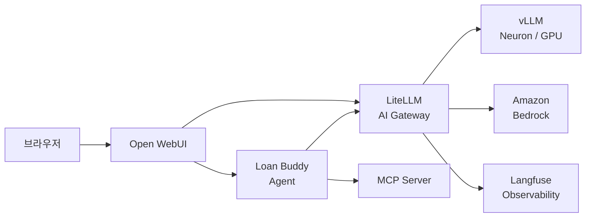
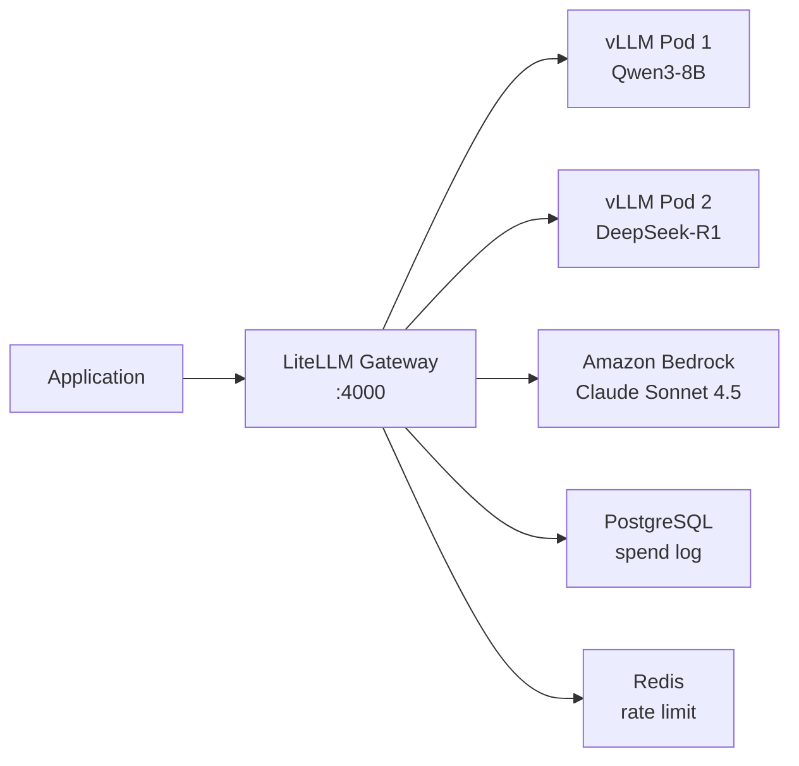
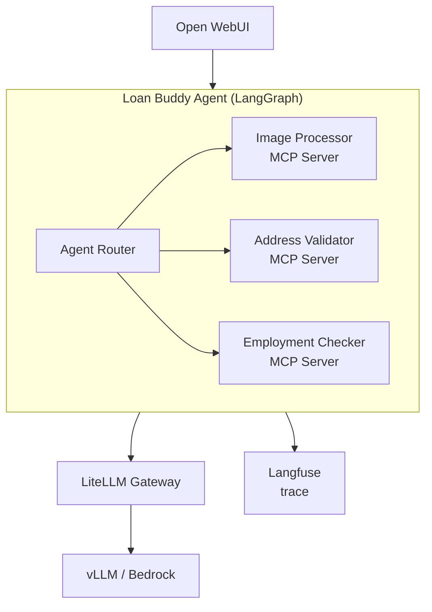

# Workshop - K8s Agentic Platform

[K8s Agentic Platform 워크샵](https://catalog.workshops.aws/k8sagenticplatform/ko-KR)은 EKS Auto Mode 클러스터에서 LLM 추론, AI Gateway, Observability, Agentic AI 애플리케이션을 구축하는 과정을 다룹니다. [GenAI on EKS 워크샵](3_genai-on-eks.md)이 GPU 기반 모델 서빙과 모니터링에 초점을 맞췄다면, 이 워크샵은 Neuron 기반 서빙, 통합 AI Gateway, LLM Observability, Agent 애플리케이션까지 전체 GenAI 플랫폼 스택을 다룹니다. 실습 코드는 [aws-samples/sample-genai-on-eks-starter-kit](https://github.com/aws-samples/sample-genai-on-eks-starter-kit)을 기반으로 합니다.



---

## Repository Structure

| Directory | Description |
|---|---|
| `terraform/` | VPC, EKS Auto Mode, EFS, NodePool IaC |
| `components/` | 배포 가능한 서비스 모듈 (ai-gateway, llm-model, o11y, vector-database, ai-agent) |
| `examples/` | Strands Agents, Agno 등 Agent 예제 |
| `cli` | Node.js 기반 대화형 배포 CLI |
| `config.json` | 컴포넌트 및 모델 기본 설정 |
| `.env` / `.env.local` | 리전, 클러스터명, HF_TOKEN 등 환경 변수 |

Starter Kit은 CLI 기반 배포 패턴을 사용합니다. `./cli demo-setup`은 `config.json`에 정의된 인프라와 컴포넌트를 순차적으로 프로비저닝합니다. 개별 컴포넌트는 `./cli <category> <component> install`로 독립 배포할 수 있습니다.

---

## Infrastructure

### Terraform Configuration

Starter Kit의 Terraform은 VPC, EKS Auto Mode 클러스터, EFS를 프로비저닝합니다. `terraform-aws-modules/eks/aws` v21 모듈을 사용하며, `compute_config.enabled = true`로 [Auto Mode](https://docs.aws.amazon.com/eks/latest/userguide/automode.html)를 활성화합니다.

```hcl
compute_config = {
  enabled    = true
  node_pools = ["general-purpose"]  # (1)
}
```

1. built-in `general-purpose` NodePool만 활성화합니다. GPU와 Neuron NodePool은 별도 Karpenter CRD로 생성합니다.

### NodePool Configuration

[GenAI on EKS 워크샵](3_genai-on-eks.md#cluster-configuration)과 동일한 NodePool 분리 패턴을 사용하되, Neuron NodePool이 추가됩니다.

| NodePool | Instance Family | Accelerator | Taint | Limit |
|---|---|---|---|---|
| `general-purpose` | c, m, r (5세대+) | — | 없음 | CPU 100 |
| `gpu` | g6e, g6, g5 | NVIDIA GPU | `nvidia.com/gpu` | GPU 50 |
| `neuron` | inf2, trn1, trn2 | AWS Inferentia / Trainium | `aws.amazon.com/neuron` | NeuronCore 50 |

Neuron NodePool은 `aws.amazon.com/neuroncore` 리소스를 기준으로 limit을 설정합니다. inf2.xlarge는 Inferentia2 칩 1개(NeuronCore 2개)를 제공하므로, limit 50은 최대 25개의 [inf2.xlarge](https://aws.amazon.com/ec2/instance-types/inf2/) 노드를 허용합니다.

!!! warning "Service Quotas"
    GPU와 Neuron 인스턴스의 기본 vCPU 할당량은 0입니다. Service Quotas 콘솔에서 `Running On-Demand Inf Instances`(inf2용)와 `Running On-Demand G and VT instances`(g6e용) 항목의 할당량 증가를 요청해야 합니다. inf2.xlarge는 vCPU 4개, g6e.2xlarge는 vCPU 8개이므로 해당 수량 이상으로 요청합니다.

### EFS Model Caching

[GenAI on EKS 워크샵](3_genai-on-eks.md#s3-model-storage)에서는 S3의 모델 가중치를 Run:ai Streamer로 GPU 메모리에 직접 스트리밍했습니다. 이 워크샵에서는 EFS를 모델 캐시 스토리지로 사용합니다.

| Aspect | S3 Streamer (GenAI on EKS) | EFS Cache (이 워크샵) |
|---|---|---|
| Storage | S3 버킷 | EFS 파일 시스템 |
| Loading | 매 시작마다 스트리밍 | 첫 로딩 후 EFS에 캐시 |
| Scale-out | 새 Pod도 S3에서 스트리밍 | 새 Pod는 EFS 캐시에서 즉시 로드 |
| Neuron 호환 | GPU 전용 | Neuron 컴파일 결과(NEFF)도 캐시 가능 |

EFS는 ReadWriteMany(RWX) 접근 모드를 지원하므로 여러 Pod가 동시에 같은 모델 가중치를 읽을 수 있습니다. Neuron 워크로드에서는 Neuron Compiler가 생성한 NEFF(Neuron Executable File Format) 파일도 EFS에 캐시되어, 후속 Pod 시작 시 재컴파일 없이 바로 로드됩니다.

---

## Model Serving

### vLLM on Neuron

이 워크샵에서는 vLLM을 Inferentia2(inf2) 인스턴스에 배포하여 Qwen3-8B 모델을 서빙합니다. [GPU 배포](3_genai-on-eks.md#vllm-deployment)와 비교하면 리소스 요청, 컨테이너 이미지, 모델 로딩 방식이 다릅니다.

| Aspect | GPU (GenAI on EKS) | Neuron (이 워크샵) |
|---|---|---|
| Instance | g6e.2xlarge (L40S) | inf2.xlarge (Inferentia2) |
| Resource request | `nvidia.com/gpu: 1` | `aws.amazon.com/neuroncore: 2` |
| Taint | `nvidia.com/gpu` | `aws.amazon.com/neuron` |
| Container image | vLLM GPU DLC | vLLM Neuron DLC |
| Model loading | S3 Run:ai Streamer → GPU 메모리 | EFS 캐시 → Neuron 메모리 |
| First start | 수 분 (다운로드) | 수십 분 (AOT 컴파일 + 다운로드) |
| Subsequent start | 수 분 (다운로드) | 수 분 (EFS 캐시된 NEFF 로드) |

Starter Kit의 vLLM Neuron 배포 매니페스트에서 주요 설정은 다음과 같습니다.

| Parameter | Value | Description |
|---|---|---|
| `aws.amazon.com/neuroncore` | `2` | inf2.xlarge의 NeuronCore 2개 전체 사용 |
| `NEURON_RT_NUM_CORES` | `2` | Neuron Runtime이 사용할 코어 수 |
| `--tensor-parallel-size` | `2` | 2개 NeuronCore에 걸쳐 모델 분할 |
| `--max-model-len` | `8192` | 최대 입력 시퀀스 길이 |
| `--max-num-seqs` | `2` | 동시 처리 최대 시퀀스 수 |
| `--gpu-memory-utilization` | `0.90` | 가속기 메모리 사용 비율 |
| `--enable-auto-tool-choice` | — | Qwen3 function calling 지원 |

Neuron 배포의 첫 시작이 오래 걸리는 이유는 AOT(Ahead-of-Time) 컴파일 때문입니다. Neuron Compiler가 PyTorch 모델을 Inferentia2 하드웨어에 최적화된 NEFF로 변환하며, 이 과정은 모델 크기에 따라 수십 분이 소요됩니다. 컴파일된 NEFF는 EFS에 캐시되므로 이후 Pod 재시작이나 스케일아웃 시에는 컴파일을 건너뜁니다. `startupProbe`의 `failureThreshold`를 충분히 높게 설정해야 첫 시작 시 Pod가 재시작 루프에 빠지지 않습니다. 자세한 내용은 [Background — AWS Accelerator Types](0_background.md#aws-accelerator-types)를 참고합니다.

### Bedrock Integration

Starter Kit은 자체 호스팅 모델(vLLM) 외에 Amazon Bedrock을 통해 Claude Sonnet 4.5 같은 관리형 모델도 지원합니다. Bedrock 모델은 인프라 프로비저닝 없이 API 호출만으로 사용할 수 있어, GPU/Neuron 인스턴스 확보가 어려운 경우 대안이 됩니다. LiteLLM이 자체 호스팅 모델과 Bedrock 모델을 단일 엔드포인트로 통합하므로, 애플리케이션 코드 변경 없이 모델을 전환할 수 있습니다.

### Open WebUI

Open WebUI는 ChatGPT와 유사한 웹 인터페이스로, Helm으로 general-purpose nodepool에 배포됩니다. LiteLLM 백엔드에 연결하여 등록된 모든 모델(vLLM, Bedrock)과 대화할 수 있습니다. Agent가 배포되면 Open WebUI에 자동 등록되어 사용자가 Agent와도 대화할 수 있습니다.

---

## AI Gateway

LiteLLM은 클러스터 내 vLLM 인스턴스와 외부 Bedrock 모델을 단일 OpenAI-compatible API로 통합합니다. 배경 개념은 [GenAI Platform Components — AI Gateway](2_genai-components.md#ai-gateway)를 참고합니다.



Starter Kit에서 LiteLLM은 Helm으로 배포되며, PostgreSQL(비용 로그, API 키 저장)과 Redis(rate limit, 캐시)를 backing store로 사용합니다. `config.json`의 `litellm` 섹션에서 가상 키, 팀별 예산, rate limit 정책을 설정합니다.

### Model Discovery

LiteLLM의 모델 등록은 런타임 자동 감지가 아니라 **배포 시점 발견** 방식입니다. CLI가 `kubectl get pod -l app=<model-name>`으로 실행 중인 vLLM Pod를 스캔하고, 발견된 모델을 Helm values 템플릿에 렌더링하여 LiteLLM에 배포합니다. 새 모델을 추가한 후에는 LiteLLM을 다시 설치해야 모델 목록에 반영됩니다.

```yaml
- model_name: vllm/qwen3-8b-neuron   # (1)
  litellm_params:
    model: openai/qwen3-8b-neuron
    api_key: fake-key
    api_base: http://qwen3-8b-neuron.vllm:8000/v1  # (2)
```

1. CLI가 발견한 vLLM 모델명으로 자동 생성됩니다.
2. Kubernetes Service DNS를 통해 vLLM Pod에 직접 라우팅합니다.

---

## Observability

Langfuse는 LiteLLM Gateway를 통과하는 모든 LLM 요청의 trace를 자동으로 기록합니다. 배경 개념은 [GenAI Platform Components — Langfuse](2_genai-components.md#langfuse)를 참고합니다.

Starter Kit에서 Langfuse는 Helm으로 배포되며, 다섯 가지 backing store를 사용합니다.

| Component | Version | Role | Resources |
|---|---|---|---|
| ClickHouse | 25.2 | Trace, generation, score 분석 저장소 | 1 CPU, 3Gi |
| PostgreSQL | 17.5 | 프로젝트, API 키, 사용자 메타데이터 | 125m CPU, 256Mi |
| ZooKeeper | 3.9 | ClickHouse 클러스터 coordination | 250m CPU, 384Mi |
| Redis (Valkey) | 8.0 | 캐시, 세션 관리 | 125m CPU, 256Mi |
| S3 | — | 이벤트, 미디어 파일 저장 | — |

S3 버킷은 Terraform으로 프로비저닝되며, Pod Identity를 통해 Langfuse Service Account에 접근 권한을 부여합니다.

LiteLLM과 Langfuse의 연동은 LiteLLM의 `success_callback`에 `langfuse`를 설정하면 활성화됩니다. Gateway를 통과하는 모든 요청에 대해 모델명, 토큰 수, 지연시간, 비용이 자동으로 trace에 기록됩니다. Langfuse 대시보드에서 프로젝트별 비용 추이, 모델별 지연시간 분포, 프롬프트 버전별 성능 비교를 확인할 수 있습니다.

---

## Agentic AI Application

### Loan Buddy

워크샵의 Agent 모듈은 "Loan Buddy"라는 AI 대출 심사 보조 에이전트를 구축합니다. 수동으로 2-3시간 걸리는 대출 신청 검토를 자동화하여 수 분으로 단축하는 시나리오입니다.

### Application Architecture

Loan Buddy는 LangGraph로 워크플로우를 정의하고, LangChain으로 LLM과 통신하며, 3개의 MCP Server를 도구로 사용합니다. Agent 아키텍처의 배경 개념은 [GenAI Platform Components — Agentic AI](2_genai-components.md#agentic-ai)를 참고합니다.



| MCP Server | Tools | Description |
|---|---|---|
| Image Processor | `extract_credit_application_data`, `validate_document_authenticity` | 대출 서류 이미지에서 텍스트를 추출하고 문서 진위를 검증합니다. Claude vision을 사용합니다 |
| Address Validator | `validate_address`, `perform_address_fraud_check`, `verify_address_ownership` | 주소 유효성 검증, 사기 가능성 점검, 거주 확인을 수행합니다 |
| Employment Checker | `validate_income_employment`, `check_employment_stability` | 고용 상태, 소득, 재직 안정성을 확인합니다. 신고 소득 대비 10% 이내 오차를 허용합니다 |

Loan Buddy는 LangGraph의 `create_react_agent`(ReAct 패턴)를 사용하며, `recursion_limit: 20`으로 설정되어 있습니다. LLM은 LiteLLM Gateway를 통해 `bedrock/claude-4.5-sonnet`을 호출합니다. ReAct 패턴에서는 모델이 다음에 호출할 도구를 자율적으로 결정하므로, [GenAI Platform Components](2_genai-components.md#model-driven-agent)에서 설명한 model-driven 접근에 해당합니다. Starter Kit의 Calculator Agent(Strands Agents 기반)도 동일한 model-driven 방식이지만, Loan Buddy는 LangGraph 프레임워크를 사용하여 `recursion_limit`, 상태 관리 등 워크플로우 수준의 제약을 추가로 적용합니다.

### Deployment

Agent와 3개의 MCP Server는 `workshop` namespace에 4개의 Deployment + 4개의 ClusterIP Service로 배포됩니다. Agent Pod는 1 CPU / 8Gi 메모리를 요청하고, MCP Server는 각각 500m CPU / 8Gi를 요청합니다. MCP Server는 FastMCP 프레임워크로 구현되어 SSE transport(port 8000)로 통신합니다.

배포 스크립트(`deploy-workshop-app.sh`)는 Terraform 출력에서 S3 버킷명을 가져오고, LiteLLM API 키와 Langfuse 자격 증명을 수집한 뒤, Pod Identity Association을 생성하여 Agent가 S3에 접근할 수 있도록 합니다. Langfuse와 통합되어 Agent의 각 도구 호출, LLM 추론, 전체 워크플로우가 trace로 기록됩니다.

---

## Cleanup

Starter Kit CLI로 전체 환경을 정리합니다.

```bash
./cli cleanup-everything
```

개별 컴포넌트를 먼저 제거하고 인프라를 나중에 정리하려면 `./cli <category> <component> uninstall` 후 `./cli cleanup-infra`를 실행합니다.

!!! warning "Cost"
    GPU(g6e)와 Neuron(inf2) 인스턴스는 사용 여부와 관계없이 실행 중이면 과금됩니다. 실습 완료 후 반드시 cleanup을 실행하여 인스턴스를 종료합니다. Karpenter의 `consolidationPolicy: WhenEmpty`가 설정되어 있더라도, 워크로드가 남아있으면 노드가 축소되지 않습니다.

---

